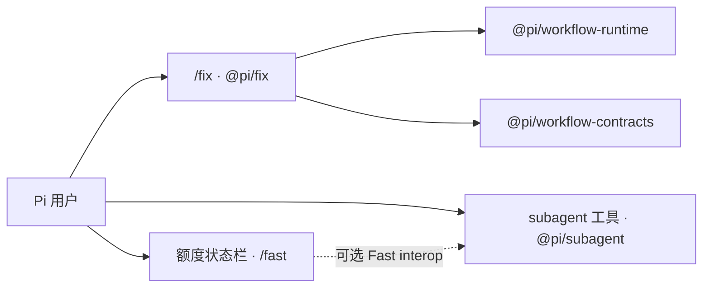

# my-pi-extension

个人 Pi 扩展集合，当前包含三类能力：问题处置 Workflow、通用子 Agent 委派，以及 Codex 额度与 Fast 控制。

## 结论先行

| 能力 | 入口 / package | 作用与当前状态 |
| --- | --- | --- |
| 问题处置 Workflow | `/fix` · `@pi/fix` | 调查、处置、评审、验证与人工验收；v2 主流程原型已实现。 |
| 通用子 Agent 委派 | `subagent` 工具 · `@pi/subagent` | 隔离委派任务，支持持久 child session、恢复、瞬态重试与模型 fallback；已实现。 |
| Codex 额度与 Fast 控制 | 状态栏、`/fast` · `@pi/codex-usage-status` | 展示 Codex 额度，并控制符合条件请求的 Fast 优先处理；已实现。 |

这三个扩展职责独立：

- `/fix` 管理问题处置流程和 Workflow 状态。
- `subagent` 管理通用 child session 的创建、执行、恢复与重试。
- `@pi/codex-usage-status` 管理 Codex 额度与 Fast 请求策略，并通过可选 interop 向 subagent 提供 Fast 信息。

`@pi/subagent` 不是 `/fix` 的另一个名字，也不是当前 `/fix` 的底层实现；它不创建 Workflow Run、Node、Artifact 或 Worker。`/feature` 是规划中的 Workflow 入口，当前尚未实现，也没有对应 package。

已实现不等于完整验证：真实 provider、真实 TUI、长时运行、retry/fallback 和 Fast child E2E 仍有待验证。完整差异见 [L2 当前实现与 drift](docs/02-产品实现/README.md)。

## 能力与边界



| 类别 | 当前能力 | 明确边界 |
| --- | --- | --- |
| `/fix` | 以 Workflow 状态、Policy、Artifact、Guard、评审、验证和验收组织问题处置 | 完整治理合同、真实 provider E2E 和长时 TUI 稳定性仍未完成 |
| `subagent` | 独立 child session、持久句柄、恢复、瞬态重试和模型 fallback | 不拥有 Workflow Run/Node/Artifact/Worker 语义；部分 retry/fallback/Fast child E2E 待验证 |
| Codex Usage + Fast | 额度读取与状态展示、`/fast` priority processing、parent-Fast interop | 真实 Pi TUI/provider E2E 与 local dispatcher live E2E 待验证 |
| `/feature` | 产品规划与 L1 规范 | 当前没有可执行 package 或 Workflow Definition |

## Package 目录

| Package | 类型 | 入口 / 职责 | 当前状态 |
| --- | --- | --- | --- |
| `@pi/fix` | Pi extension | `/fix`；Fix Workflow 策略、报告、trace 和 Pi UI 接线 | 原型已实现 |
| `@pi/subagent` | Pi extension | `subagent` 工具；通用 child-session dispatcher | 已实现 |
| `@pi/codex-usage-status` | Pi extension | 额度状态栏、`/fast` 与 Fast interop producer | 已实现，真实 provider/TUI E2E 待验证 |
| `@pi/workflow-runtime` | 共享 library | Workflow 状态机、Worker Session、Guard、重试、checkpoint 和恢复 | Pi SDK Runtime 原型已实现；部分 Fix 业务门禁仍待 owner 收敛 |
| `@pi/workflow-contracts` | 共享 library | Stage、Artifact、Checkpoint、Worker 与提交接口合同 | 由 Workflow 入口和 Runtime 使用 |
| `@pi/fix-metrics-cloudflare` | 服务端 PoC | 指标接收、快照、漏斗 API 与看板 | 仅合成数据，未接入真实 Fix telemetry；不是 Pi extension |

### 依赖关系

- `@pi/fix` 依赖 `@pi/workflow-runtime` 与 `@pi/workflow-contracts`。
- `@pi/subagent` 是独立的通用委派扩展，不属于 Workflow Runtime 层级。
- `@pi/codex-usage-status` 独立于 Workflow Runtime；subagent 可选消费它提供的 Fast interop。
- `@pi/fix-metrics-cloudflare` 是独立服务端 PoC，不参与 Pi extension 运行时依赖。

## 开始阅读

1. [五层文档总览](docs/README.md)
2. [L1 产品上下文摘要](docs/01-产品定义/产品上下文摘要.md)
3. [L1 权威产品定义](docs/01-产品定义/领域术语.md)
4. [Feature 产品规范](docs/01-产品定义/扩展/feature-扩展.md) / [Fix 产品规范](docs/01-产品定义/扩展/fix-扩展.md) / [Subagent Dispatcher 产品规范](docs/01-产品定义/扩展/subagent-扩展.md)
5. [L2 当前实现与 drift](docs/02-产品实现/README.md)
6. [L2 Runtime 实现架构](docs/02-产品实现/runtime-实现架构.md) / [Subagent Dispatcher 技术设计](docs/02-产品实现/subagent-dispatcher-技术设计.md)
7. [L3 仓库组织](docs/03-项目落地/仓库组织.md) / [扩展目录](docs/03-项目落地/扩展目录.md)

Agent 在仓库中工作前必须读取 [AGENTS.md](AGENTS.md)。

## 验证

```bash
npm test
npm run typecheck
git diff --check
```

这些命令验证当前仓库的代码与文档一致性，不代表真实 provider、长时 TUI 或生产环境 E2E 已通过。

历史选型和评审证据保存在 [docs/归档](docs/归档/README.md)，但不属于当前执行规则或正式真理源。
