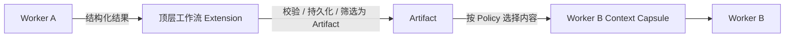
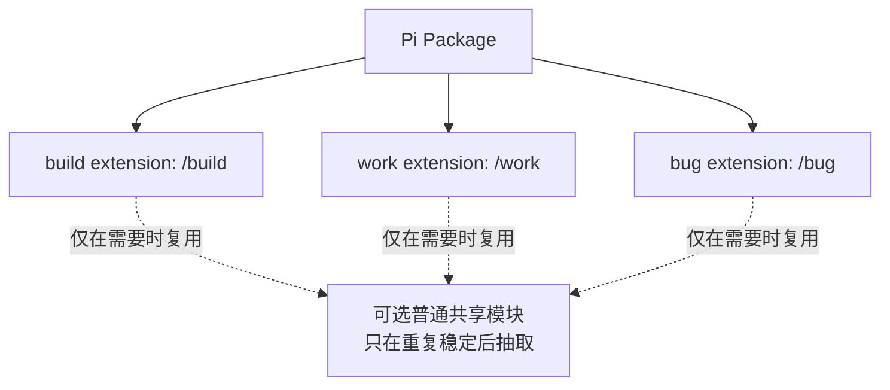

# 00：Extension 颗粒度技术方案

- 状态：`ALIGNING`
- 对应问题：[仓库组织形式](README.md)
- 上游：无
- 下游：[Extension 集合目录](../01-extension-catalog/README.md)

## 1. 要决定的问题

一个 Pi extension 的边界应该是：

- 一个完整工作入口，例如 `/build`、`/work` 或 `/bug`；
- 一个工作流节点，例如需求对齐、代码 review 或验证；
- 或一个工作入口 extension 加内部普通模块。

这个问题必须先于 package、core 和 extension 集合成员的最终设计。流程节点之间有先后关系，不等于节点必须是独立 Pi extension。

## 2. 当前已确认的 Pi 事实

| Pi 能力 | 作用范围 | 能否用于子 Pi CLI worker 间直接通信 | 对本方案的含义 |
|---|---|---:|---|
| `pi.registerCommand()` | 当前 Pi runtime | 否 | 顶层 extension 可以独立注册 `/build`、`/work`、`/bug` |
| `pi.events` | 同一个 Pi runtime 中加载的 extension | 否 | 只适合同进程 extension 协作，不是 child worker IPC |
| `pi.appendEntry()` | 当前 session，可跨 reload/重启恢复 | 否 | 可保存顶层工作流状态或 Artifact；默认不进 LLM context |
| `pi.sendMessage()` | 当前主 session 的 LLM context | 否 | 可向主 session 注入消息；不自动传给 child worker |
| `pi.sendUserMessage()` | 当前主 session 的 agent loop | 否 | 可驱动主 session 后续处理；不自动传给 child worker |
| `pi -p --no-session` worker | 独立 Pi 进程和独立 session | 不适用 | 不共享主 session、内存、`pi.events` 或完整上下文 |
| Pi SDK `AgentSession` | 由宿主显式创建的 session | 不天然 | 可以由顶层 extension/宿主订阅事件和管理 session；通信仍需显式编排 |

结论：Pi 没有一个“Worker A 直接向 Worker B 发送消息并天然共享记忆”的子 agent 通信机制。无论 CLI worker 还是 SDK worker，都需要顶层 extension / 宿主运行时负责交接。SDK 的 `AgentSession.subscribe()` 可以让宿主观察某个 worker 的事件，但不会让两个 worker 自动共享消息；宿主仍需显式读取结果、生成下一个 worker 的 prompt，并决定哪些 Artifact 可以交接。

## 3. 子 agent 上下文与通信模型

“主 Pi Session”不是 Worker A/B 的共享记忆容器，也不是它们的父 session；它只是用户当前交互的主会话。真正负责 worker 调度和交接的是加载在主 Pi runtime 内的顶层工作流 extension。


| 对象 | 责任 | 是否天然共享其他对象的上下文 |
|---|---|---:|
| 主 Pi Session | 保存用户消息、主 agent 上下文、用户可见摘要和顶层 extension 的 session 级持久状态 | 否 |
| 顶层工作流 extension | 创建 run、选择下一阶段、启动 worker、校验结果、构造 Context Capsule、决定哪些信息可交接 | 可访问主 Pi Session；不自动拥有 worker session |
| Worker A / B Session | 保存该 worker 的任务、工具调用和内部工作过程 | 否；A 和 B 互不共享，也不继承主 session |
| Artifact | 跨 worker 的正式交接材料；必须可校验、可追溯、可按 Policy 筛选 | 只有顶层 extension 显式交给后续 worker 时才可见 |
| Context Capsule | 顶层 extension 为单个 worker 构造的最小输入 | 不是完整历史复制 |

Worker A 和 Worker B 不直接通信：



这个模型同时满足：主 agent 派子 agent、worker 有各自私有的过程记忆、后续 worker 只获得被允许交接的记忆、子 agent 之间不直接耦合。

## 4. 颗粒度候选方案

| 方案 | Pi extension 的颗粒度 | `/build`、`/work`、`/bug` 的位置 | 工作流节点的实现 | 优点 | 风险 |
|---|---|---|---|---|---|
| A：工作入口就是 extension | 一个完整入口一个 extension | 三个独立 extension 各自注册 command | 各自内部模块 | 入口独立；安装/启用/故障隔离清晰；不需要 extension 间节点协议 | 三条工作流可能重复实现 worker、review、artifact 等规则 |
| B：节点就是 extension，外层再编排 | 一个流程节点一个 extension，另有外层 workflow extension | 外层 extension 注册 command | 需求对齐、review、验证等均为子 extension | 节点可跨 build/work/bug 复用；能力边界显式 | runtime 依赖网、加载顺序、事件/Artifact 协议和故障恢复复杂；容易出现“复用后补丁” |
| C：工作入口 extension + 普通共享模块 | 一个完整入口一个 extension | 三个独立 extension 各自注册 command | 只在明确重复后抽普通 TypeScript module，不注册 Pi API | 保持入口独立；复用稳定实现；不制造子 extension 依赖网 | 共享模块边界需要克制，否则会形成过大的 core |

## 5. 当前倾向：方案 C

当前倾向不是把 `build`、`work`、`bug` 塞进一个总 workflow extension，也不是把每个节点拆成子 extension；而是：

```text
Pi package
├── build extension
│   └── /build + 自己的 worker 编排和内部节点
├── work extension
│   └── /work + 自己的 worker 编排和内部节点
└── bug extension
    └── /bug + 自己的 worker 编排和内部节点
```



当前边界规则：

| 内容 | 初步归属 |
|---|---|
| `/build`、`/work`、`/bug` command | 各自顶层 extension |
| 主 agent -> worker 编排 | 各自顶层 extension |
| 子 agent 记忆和通信 | 各自顶层 extension 通过 session + Artifact + Context Capsule 管理 |
| 需求对齐、实现、review、验证 | 首先是该顶层 extension 的内部节点，不是 Pi 子 extension |
| Pi runtime 内 extension 间通知 | 只有确实存在顶层 extension 协作时才用 `pi.events` |
| 普通共享模块 | 仅当至少两个顶层 extension 出现稳定、必须一致的重复规则后抽取 |

## 6. “共享模块”不等于预先建立 Core

共享模块只是普通 TypeScript 文件，不是 Pi extension，也不自动拥有全局状态。

| 触发条件 | 处理 |
|---|---|
| 只有一个顶层 extension 使用 | 留在该 extension 内部 |
| 两个顶层 extension 有相同 helper，但规则还在变化 | 可以暂时复制或小范围提取；不建立大 core |
| 两个以上顶层 extension 需要同一份、必须一致的 schema/校验 | 提取最小共享模块，例如 `shared/artifact-schema.ts` |
| 共享模块开始注册 Pi API 或保存跨 extension 内存状态 | 不允许；重新评审 extension 边界 |

因此当前不预设 `core` 或 `src/core` 一定存在。共享模块只能从真实的重复和一致性需求中长出来；如果重复规则尚未稳定，优先留在顶层 extension 内部。

## 7. 需要评审的问题

| 问题 | 需要的决定 |
|---|---|
| 独立性 | `/build`、`/work`、`/bug` 是否各自独立安装、启用和禁用？ |
| 编排 | 顶层 extension 是否都自己拥有 worker 调度，还是只共享无状态 helper？ |
| 交接 | Artifact 和 Context Capsule 的最小公共格式是什么？ |
| session | 哪些状态放 Pi session entry，哪些状态放 extension 控制平面？ |
| 复用 | 什么重复程度才允许抽共享模块？ |
| package | 三个顶层 extension 是同一 Pi package 还是独立 package？ |
| 失败 | 一个顶层 extension 出错时，哪些状态和资源必须隔离？ |

## 8. 暂定结论

当前暂定采用 **方案 C：独立的工作入口 extension + 内部节点 + 最小普通共享模块**。

在这个结论完成多 agent 技术方案评审和用户确认前：

- `workflow-router`、`task-delegation`、`solution-review`、`code-review`、`verification` 不应被视为当前的顶层 extension；它们只是内部节点候选；
- `core` / `src/core` 不应被视为既定目录；
- Extension 集合目录只能保留为候选，不能进入实现。
