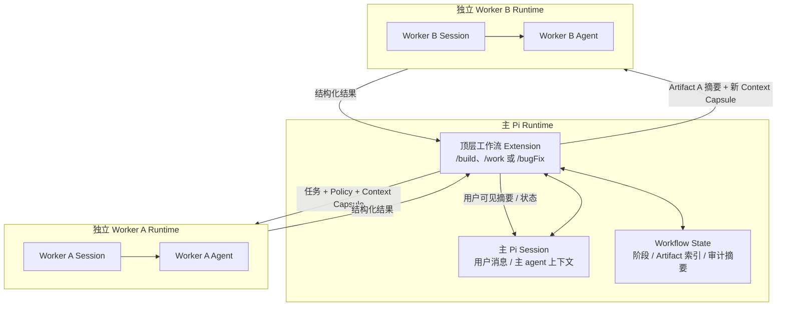
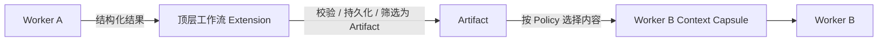
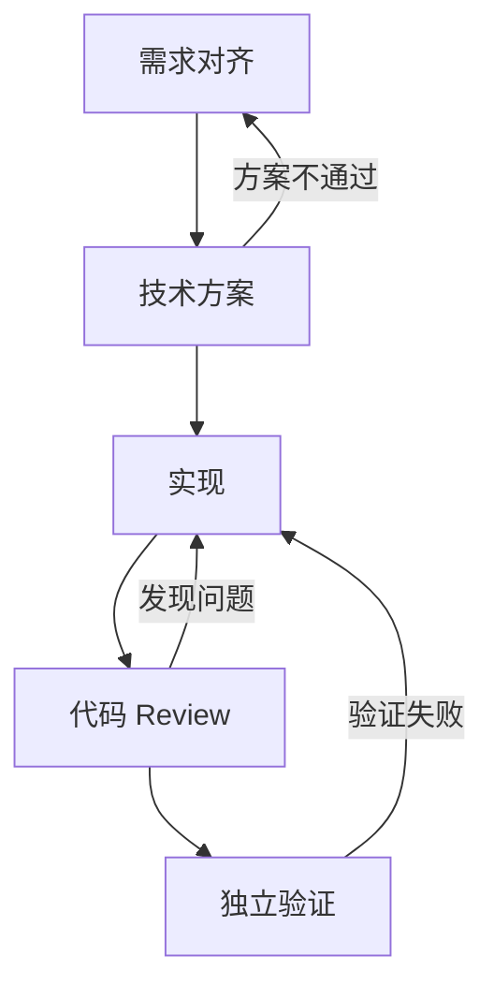
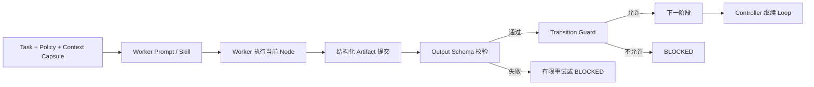
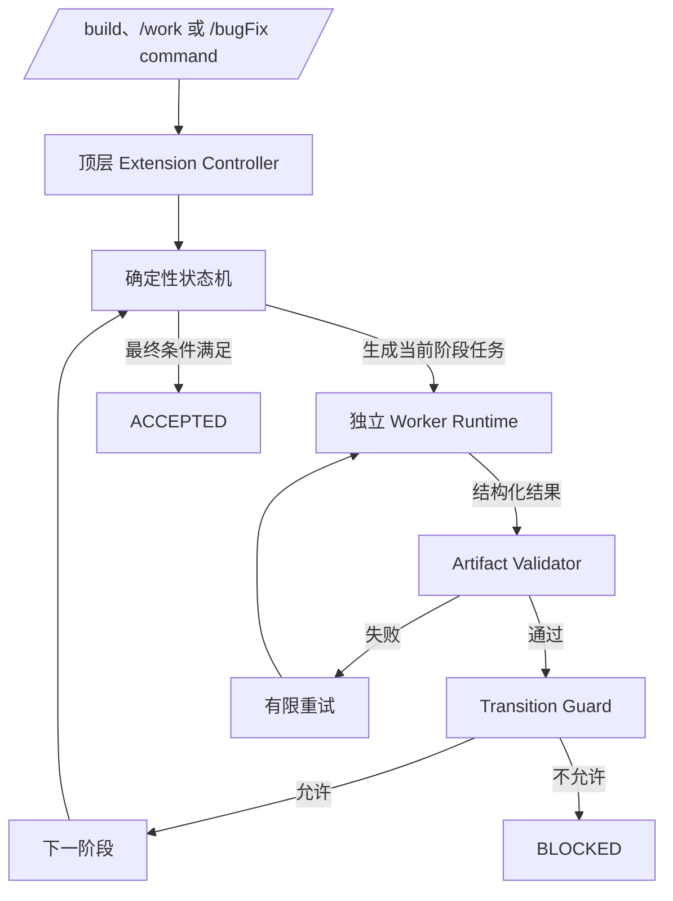
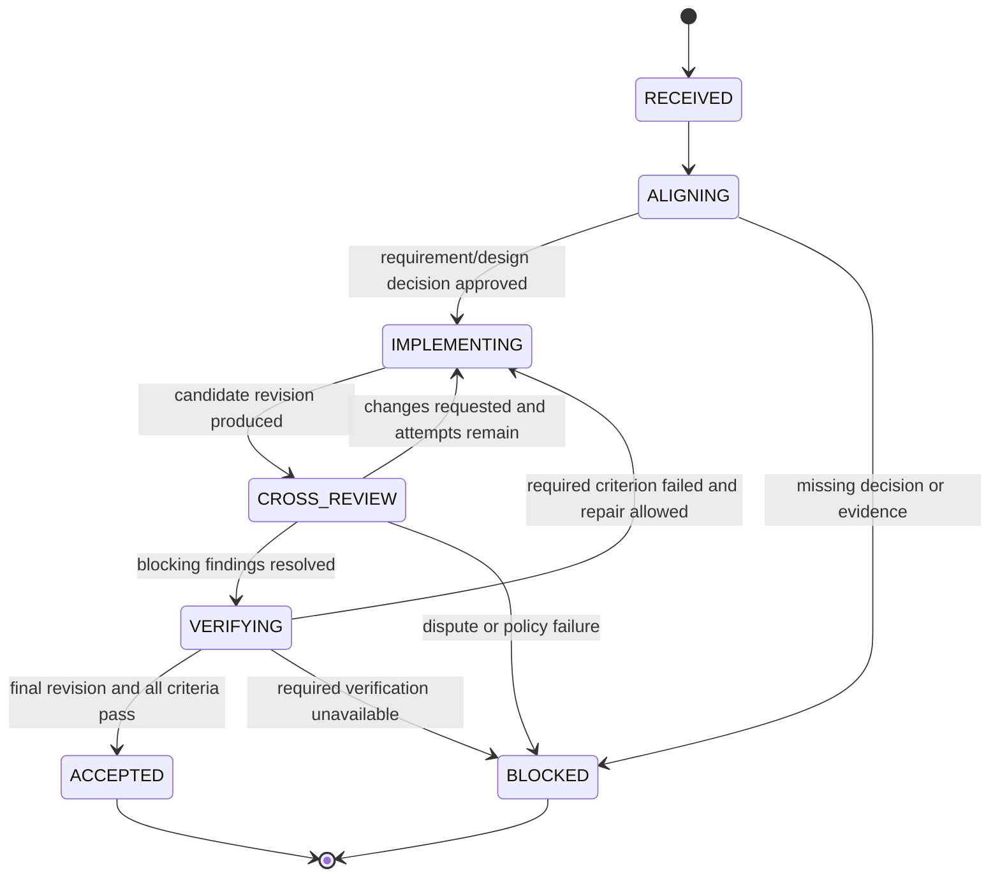
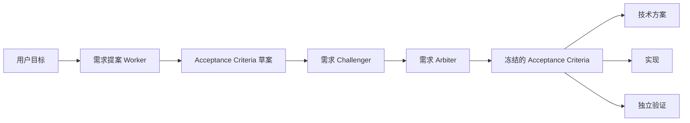
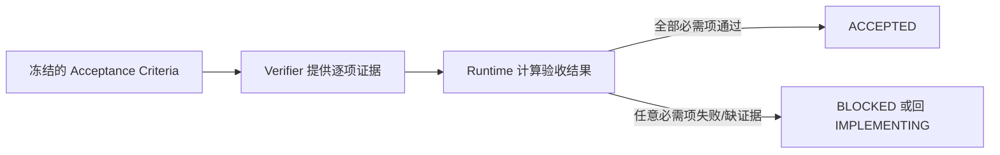
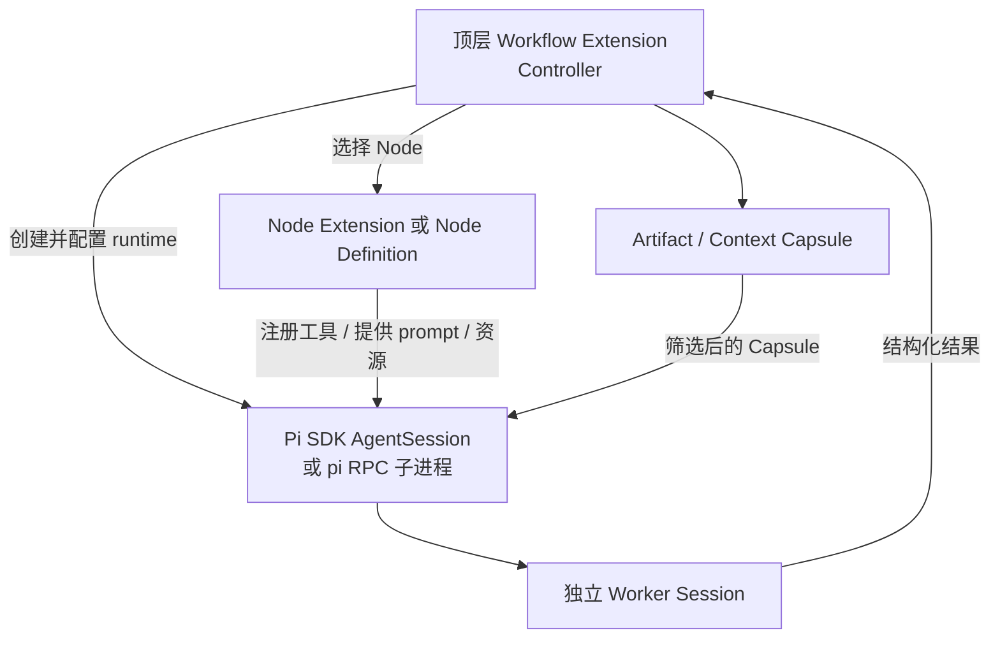

# 00：Extension 颗粒度技术方案

- 状态：`ALIGNING`
- 对应问题：[仓库组织形式](README.md)
- 上游：无
- 下游：[Extension 集合目录](../01-extension-catalog/README.md)

## 1. 要决定的问题

一个 Pi extension 的边界应该是：

- 一个完整工作入口，例如 `/build`、`/work` 或 `/bugFix`；
- 一个工作流节点，例如需求对齐、代码 review 或验证；
- 或一个工作入口 extension 加内部普通模块。

这个问题必须先于 package、core 和 extension 集合成员的最终设计。流程节点之间有先后关系，不等于节点必须是独立 Pi extension。

## 2. 当前已确认的 Pi 事实

| Pi 能力 | 作用范围 | 能否用于子 Pi CLI worker 间直接通信 | 对本方案的含义 |
|---|---|---:|---|
| `pi.registerCommand()` | 当前 Pi runtime | 否 | 顶层 extension 可以独立注册 `/build`、`/work`、`/bugFix` |
| `pi.events` | 同一个 Pi runtime 中加载的 extension | 否 | 只适合同进程 extension 协作，不是 child worker IPC |
| `pi.appendEntry()` | 当前 session，可跨 reload/重启恢复 | 否 | 可保存顶层工作流状态或 Artifact；默认不进 LLM context |
| `pi.sendMessage()` | 当前主 session 的 LLM context | 否 | 可向主 session 注入消息；不自动传给 child worker |
| `pi.sendUserMessage()` | 当前主 session 的 agent loop | 否 | 可驱动主 session 后续处理；不自动传给 child worker |
| `pi -p --no-session` worker | 独立 Pi 进程和独立 session | 不适用 | 不共享主 session、内存、`pi.events` 或完整上下文 |
| Pi SDK `AgentSession` | 由宿主显式创建的 session | 不天然 | 可以由顶层 extension/宿主订阅事件和管理 session；通信仍需显式编排 |

结论：Pi 没有一个“Worker A 直接向 Worker B 发送消息并天然共享记忆”的子 agent 通信机制。无论 CLI worker 还是 SDK worker，都需要顶层 extension / 宿主运行时负责交接。SDK 的 `AgentSession.subscribe()` 可以让宿主观察某个 worker 的事件，但不会让两个 worker 自动共享消息；宿主仍需显式读取结果、生成下一个 worker 的 prompt，并决定哪些 Artifact 可以交接。

## 3. 子 agent 上下文与通信模型

“主 Pi Session”不是 Worker A/B 的共享记忆容器，也不是它们的父 session；它只是用户当前交互的主会话。真正负责 worker 调度和交接的是加载在主 Pi runtime 内的顶层工作流 extension。



| 对象 | 责任 | 是否天然共享其他对象的上下文 |
|---|---|---:|
| 主 Pi Session | 保存用户消息、主 agent 上下文、用户可见摘要和顶层 extension 的 session 级持久状态 | 否 |
| 顶层工作流 extension | 创建 run、选择下一阶段、启动 worker、校验结果、构造 Context Capsule、决定哪些信息可交接 | 可访问主 Pi Session；不自动拥有 worker session |
| Worker A / B Session | 保存该 worker 的任务、工具调用和内部工作过程 | 否；A 和 B 互不共享，也不继承主 session |
| Artifact | 跨 worker 的正式交接材料；必须可校验、可追溯、可按 Policy 筛选 | 只有顶层 extension 显式交给后续 worker 时才可见 |
| Context Capsule | 顶层 extension 为单个 worker 构造的最小输入 | 不是完整历史复制 |

Worker A 和 Worker B 不直接通信：



这个模型同时满足：主 agent 派子 agent、worker 有各自私有的过程记忆、后续 worker 只获得被允许交接的记忆、子 agent 之间不直接耦合。

## 4. Workflow Loop 与状态控制

### 4.1 `subgraph` 不是 loop

Mermaid 中的 `subgraph` 只是把节点分组，不代表自动循环。真正的 loop 是状态机中的回边：



### 4.2 Loop 不由 prompt 单独控制

这几层职责需要分开：



| 控制层 | 它负责什么 | 它不负责什么 |
|---|---|---|
| Prompt / Skill | 告诉 Worker“你是谁、当前要做什么、应该如何工作、需要提交什么结果” | 不能单独阻止跳阶段、伪造完成或自行宣布通过 |
| Policy / Worker Profile | 定义 Worker 允许和禁止做什么，例如 role、tools、skills、context、预算和是否可写入 | 不能把自然语言要求自动变成 OS 级权限 |
| Worker Output Schema | 定义 Worker 完成当前 Node 后必须提交的结构化结果，也就是该子 agent 的正式工作产物入口 | 不能单独决定流程是否推进 |
| 顶层 Extension Controller | 指挥和编排整个 Workflow Run：创建任务、选择 Node、启动 Worker、收集结果、持久化状态、安排重试和请求下一阶段 | 不替代 Worker 完成具体分析、实现或验证工作 |
| Transition Guard | 作为当前阶段到下一阶段之间的卡扣，判断 Artifact、依赖、Role、Revision、预算和阻断问题是否满足迁移条件 | 不替代 Artifact 生成和实际验证执行 |
| Acceptance Gate | 作为进入 `ACCEPTED` 的最终总关卡，检查所有必需 Acceptance Criteria、证据、最终 revision 和 blocking finding | 不由 Worker 或主 agent 自行宣布通过 |
| Pi 工具白名单 / `tool_call` hook | 限制或阻止 Worker 在当前阶段调用越权工具 | 不是 OS 级 sandbox；高风险场景仍需进程或环境隔离 |

可以简化记忆为：

```text
Prompt / Skill = 告诉 Worker 他是谁、现在做什么
Policy = 定义他允许怎么做
Output Schema = 定义他做完必须交什么
Controller = 指挥整个 Loop
Transition Guard = 每一阶段之间的卡扣
Acceptance Gate = 最终完成的总卡扣
```

核心规则：

> Prompt 负责指导 Worker 做好当前子任务；Output Schema 负责把结果变成可校验的 Artifact；Controller 和 Guard 负责决定 Workflow Run 能不能继续；Acceptance Gate 负责决定能不能最终 `ACCEPTED`。

### 4.3 顶层 Extension Controller

每个顶层 extension 自己拥有一套 controller：



Worker 只能返回当前任务的结构化结果，不应拥有 `nextStage` 或直接修改 Workflow Run 状态。即使 Worker 返回了 `nextStage`，Controller 也必须忽略它。

### 4.3.1 Node 不是 Pi 原生对象

Pi 没有 `WorkflowNode`、`WorkflowRun`、状态机、Transition Guard 或跨 worker Artifact 这些一等概念。它们需要由本集合自建；但不需要自建 agent loop、模型调用、会话、工具执行或扩展生命周期。

| 概念 | 是否由 Pi 原生提供 | 本方案中的实现归属 |
|---|---:|---|
| 顶层 `/build`、`/work`、`/bugFix` command | 是：`pi.registerCommand()` | 各顶层 extension 的入口 |
| Pi extension 生命周期 | 是：factory、`session_start`、`session_shutdown` 等事件 | Pi runtime 管理；extension 负责初始化和清理 Controller |
| Worker agent loop / 模型调用 / tool execution | 是：SDK `createAgentSession()` / `AgentSession`，或隔离更强的 `pi -p` / RPC 子进程 | Worker Executor 调用 Pi SDK 或 CLI；不自建 LLM runtime |
| Worker 的独立 session | 是：`SessionManager.inMemory()` 或持久化 `SessionManager` | 每个 Worker Runtime 创建自己的 session |
| Worker 过程事件 | 是：`AgentSession.subscribe()` | Controller 订阅，用于进度展示、取消和 trace 收集 |
| Worker 可用工具 | 是：SDK `tools` / `excludeTools` / `customTools`；主 runtime 的 `pi.setActiveTools()` 和 `tool_call` | Node 定义 worker 的最小工具白名单；Policy 再做拦截 |
| Worker 可见 skill / context | 是：SDK `ResourceLoader` 可定制资源；主 runtime 有资源发现和 context hook | Node 指定允许的 skill/context，Worker Executor 构造最小 ResourceLoader |
| 用户确认、进度和状态展示 | 是：`ctx.ui.confirm()`、`notify()`、`setStatus()`、`setWidget()`、自定义 UI | Controller 在需要用户决策或展示 Run 状态时调用 |
| 主 Pi session 的持久化 entry | 是：`pi.appendEntry()` 和 `ctx.sessionManager` | Controller 保存 Run checkpoint、Artifact 索引和审计摘要；reload 后重建状态 |
| Node、Workflow Run、状态机、Guard、Artifact contract、retry/预算 | 否 | 顶层 extension 内的普通 TypeScript 领域代码 |

因此，Node 不是 Pi 子 extension，也不应该用 `pi.events` 冒充 Node 调用。`pi.events` 仅适合同一 runtime 内、已加载 extension 的通知；它不提供跨 Worker Runtime 的可靠交接、持久化、重试或状态迁移语义。

### 4.3.2 初版实现结构

初版应把 Controller 和 Node 放在各自顶层 extension 内，先不抽大型 runtime：

```text
extensions/
├── build.ts                            # Pi factory：注册 /build
└── build/
    ├── controller.ts                   # 创建/恢复 Run，主循环，唯一 transition() 入口
    ├── workflow-definition.ts          # Build 的 Node、边和 Guard 声明
    ├── nodes/
    │   ├── requirement-alignment.ts    # Node：构造任务、选择 worker、声明输出 schema
    │   ├── design.ts
    │   ├── implementation.ts
    │   ├── review.ts
    │   └── verification.ts
    ├── worker-executor.ts              # 用 Pi SDK 创建/订阅/释放独立 Worker Session
    ├── artifacts.ts                    # Artifact schema、校验、持久化和 Context Capsule
    └── run-store.ts                    # session entry checkpoint 的读取和恢复
```

`/work` 和 `/bugFix` 也采用同一形状，但各自拥有不同的 Node、Artifact 和转移图。只有当三套实现出现稳定、经过验证的重复后，才提取最小普通模块，例如 `shared/workflow-runtime/transition.ts`；它仍不是 Pi extension。

### 4.3.3 一个 Node 在代码中是什么

Node 是普通 TypeScript 定义，不注册 Pi command、tool、event 或生命周期。它描述“当前阶段做什么、由谁做、产出什么、成功后可走向哪里”：

```ts
type WorkflowNode = {
  id: WorkflowStage;
  workerProfile: {
    role: "proposer" | "implementer" | "reviewer" | "verifier";
    tools: string[];
    skills: string[];
  };
  buildCapsule(run: WorkflowRun): ContextCapsule;
  outputSchema: TSchema;
  runWorker(capsule: ContextCapsule): Promise<WorkerResult>;
  validate(result: WorkerResult, run: WorkflowRun): ValidationResult;
  allowedTransitions: WorkflowStage[];
};
```

Node 可以复用统一接口，但**不能自行调用 `transition()`**。Controller 是唯一的状态所有者：

```ts
const node = definition.nodes[run.stage];
const result = await workerExecutor.run(node, node.buildCapsule(run));
const artifact = node.validate(result, run);
run = runStore.appendArtifact(run, artifact);
run = controller.transition(run, chooseCandidateTarget(run, artifact));
```

`chooseCandidateTarget()` 只能提出候选目标；`controller.transition()` 必须执行该边对应的 Guard。Node 或 Worker 的意见都不是状态迁移授权。

### 4.3.4 Worker Executor：优先复用 Pi SDK

默认优先使用 Pi SDK 在同一 Node.js 进程中创建隔离 session：

```ts
const { session } = await createAgentSession({
  cwd: run.cwd,
  sessionManager: SessionManager.inMemory(run.cwd),
  tools: node.workerProfile.tools,
  resourceLoader: createWorkerResourceLoader(node.workerProfile),
  customTools: [submitArtifactTool],
});

const unsubscribe = session.subscribe((event) => trace.record(event));
await session.prompt(capsule.prompt);
const artifact = submittedArtifact.getRequired();
unsubscribe();
session.dispose();
```

| 方案 | 复用 Pi 的能力 | 隔离程度 | 初版建议 |
|---|---|---:|---|
| Pi SDK `createAgentSession()` | Agent loop、session、工具、资源加载、事件订阅、取消和 dispose | 独立 agent session；与主 extension 同一 Node 进程 | **默认采用**：类型安全、可观察、Controller 容易收集结果 |
| `pi -p --no-session` / RPC 子进程 | Pi CLI agent runtime | 独立进程和 session | 仅在需要进程级故障隔离、独立环境或强制 CLI 兼容时采用 |

无论使用 SDK 还是子进程，Worker A/B 都不共享主 Pi Session 或彼此的 session。Controller 把经过校验的 Artifact 筛选成下一个 Node 的 Context Capsule，作为新 Worker 的初始 prompt / 输入。

初版不要依赖“从 Worker 最后一段自然语言回复中解析 JSON”。优先给 Worker 提供一个仅用于提交当前阶段产物的 `submit_artifact` custom tool：该工具由 Controller 创建，参数按 Node 的 `outputSchema` 校验，成功后捕获为正式 Artifact。Worker 未调用该工具、schema 不合法或证据缺失时，Node 失败并按 Policy 重试或进入 `BLOCKED`。

### 4.3.5 Controller 的持久化和恢复

| 数据 | 推荐位置 | 原因 |
|---|---|---|
| 用户对话和主 agent 上下文 | 主 Pi Session | Pi 原生管理 |
| Run checkpoint：`runId`、当前阶段、版本、预算、Artifact 引用、状态迁移记录 | `pi.appendEntry("workflow-run", data)` | 可随 Pi session 持久化；默认不进入 LLM context；可在 `session_start` 重建 |
| Artifact 正文、证据、diff digest、worker trace 摘要 | 初版：custom session entry 或受控 Artifact Store；最终位置待各 extension 设计决定 | 必须可校验和追溯，不能只存在于模型文本 |
| Worker 私有过程消息 | Worker Session | 不自动带入主 Session 或其他 Worker |

`pi.appendEntry()` 是 session 持久化能力，不是事务型数据库。Controller 必须用 append-only checkpoint 加 `runVersion` / `transitionId` 检测重复恢复；对需要跨 session、跨机器或更强并发/事务语义的 Run Store，后续再为具体 extension 设计受控的外部存储。

### 4.4 Transition Guard：状态迁移卡扣

只有 Guard 通过，状态机才允许迁移：

```ts
type GuardResult =
  | { allowed: true }
  | { allowed: false; reason: string };

function transition(run: WorkflowRun, target: WorkflowStage): WorkflowRun {
  const guard = getTransitionGuard(run.stage, target);
  const result = guard(run);
  if (!result.allowed) {
    throw new WorkflowTransitionError(result.reason);
  }
  return { ...run, stage: target };
}
```

| 卡扣 | 进入下一阶段前必须检查 |
|---|---|
| 输入 | 当前任务和入口类型合法 |
| Role | 当前 Worker 的 Role 允许执行该 Stage |
| Artifact | 必需的结构化产物存在且 schema 校验通过 |
| Challenge | 阻断性 challenge 已正式关闭 |
| 独立性 | proposer、implementer、reviewer、verifier、arbiter 的 `workerId` 符合独立性要求 |
| Revision | review 和 verification 针对同一个 `candidateRevision` / `diffDigest` |
| 工具 | Worker 没有超出当前 Policy 的工具白名单 |
| 轮次 | proposal、rebuttal、retry、revision 没有超过上限 |
| 预算 | worker 数、耗时、token/cost 没有超限 |
| 用户决策 | 高风险或无法收敛的问题已经获得用户决策 Artifact |
| 最终验收 | 所有必需 Acceptance Criteria 都有通过证据 |

任何 Guard 无法确认时默认 `BLOCKED`，不能降级为“继续执行”。

### 4.5 示例状态机



### 4.6 Acceptance Criteria 的来源与冻结

Acceptance Criteria 不是最后由 verifier 临时决定，而是在需求对齐阶段形成并冻结：



```ts
type AcceptanceCriterion = {
  id: string;
  statement: string;
  type: "behavior" | "api" | "test" | "security" | "manual";
  required: boolean;
  evidenceRule: {
    commands?: string[];
    expectedExitCode?: number;
    manualCheck?: string;
  };
};
```

每条验收标准必须有唯一 ID、明确描述、是否必需和证据规则。需求或方案变化后，旧版本验收标准失效，必须重新对齐。

最终验收不是 Worker 自报，也不是主 agent 自由判断：



### 4.7 如何保证不绕过 Loop

| 控制点 | 规则 |
|---|---|
| Command 接管 | `/build`、`/work`、`/bugFix` 由顶层 extension command 接管，不只是 prompt template |
| 状态写入 | 只有 Controller 的 `transition()` 可以改变阶段 |
| Worker 权限 | Worker 只能产生当前阶段 Artifact，不能直接写 `nextStage` 或 `ACCEPTED` |
| 主 agent 工具 | 通过 active tool allowlist 和 `tool_call` hook 阻止 Policy 外工具 |
| 失败策略 | schema 错误、证据缺失、revision 不一致、Policy 篡改和验证阻塞默认进入 `BLOCKED` |
| 接受策略 | Runtime 根据冻结的 Acceptance Criteria、正式关闭的 finding 和最终 revision 验证结果计算 `ACCEPTED` |

因此系统不能保证模型“思想上永远遵守”，但可以保证：

> **模型即使偏离，缺少必要产物和证据时也无法推动状态机进入下一阶段或宣布 `ACCEPTED`。**

### 4.8 Node、Extension、Command 和 Session 不是同一层

需要先区分四个概念：

| 概念 | 含义 | 当前方案 |
|---|---|---|
| Command | 用户进入 Pi 工作流的命令，例如 `/build` | 由顶层 extension 注册；一个 extension 可以注册一个或多个 command |
| Extension | 被 Pi 加载、拥有 Pi API 生命周期的运行时插件 | `/build`、`/work`、`/bugFix` 各自对应一个顶层工作流 extension |
| Node / Stage | 工作流中的业务阶段，例如需求对齐、实现、Review、验证 | 由顶层 extension 内的普通 TypeScript 模块实现 |
| Session / AgentSession | 一次 agent 的上下文、消息、工具和事件生命周期 | Controller 为每个 Worker 按需创建独立 session |

因此“每个 command 是一个 extension”是当前项目的**组织选择**，不是 Pi 的硬性规则；“每个 node 是一个 session”也不是“每个 node 必须是 extension”。

### 4.9 Node 作为 Extension 的替代方案

除了“顶层工作流 extension + 内部 Node + Worker AgentSession”之外，至少还有三种方案：

| 方案 | 运行关系 | 通信方式 | 优点 | 主要代价 | 适用条件 |
|---|---|---|---|---|---|
| A：顶层 extension + 普通 Node + SDK Worker | 一个工作入口 extension；Node 是普通模块；Node 内创建独立 `AgentSession` | Controller 直接调用 SDK，Artifact / Context Capsule 交接 | 状态、Guard、重试集中；复用 Pi agent runtime；依赖和故障面较小 | Controller、Node、Artifact contract 需要自建 | **当前默认方案** |
| B：同一 Pi Runtime 中，每个 Node 是 Extension | 多个 Node extension 和顶层 extension 同时加载在同一个 runtime | `pi.events`、注册工具或顶层 dispatcher | 节点可独立加载；可复用 Pi extension 生命周期和 API | Extension 仍不是 session；工具/事件/命令是全局作用域；加载顺序、命令冲突、事件耦合和启停复杂 | 节点需要被多个宿主复用，且共享同一 runtime |
| C：每个 Node Extension 一个独立 Pi Runtime / Session | Controller 为每个节点启动一个 Pi SDK session 或 `pi --mode rpc` 子进程，并加载该 Node extension | SDK API 或 RPC；仍需 Artifact / Context Capsule | 进程/资源/工具/skill 隔离更强；节点可独立发布 | 启动开销、协议、超时、取消、版本兼容、观测和故障恢复成本显著增加 | 节点需要进程级隔离、独立环境或独立团队发布 |
| D：单一 Extension + 单一主 Session + Prompt Loop | 一个 extension 或主 agent 通过 prompt 约定阶段 | Prompt / 主 session 消息 | 实现最简单 | 不能可靠阻止跳阶段；状态、权限和结果容易被模型记忆替代 | 仅适合原型或低风险一次性流程 |

### 4.10 “每个节点是 Extension 并新开 Session”到底意味着什么

Extension 本身不是 Session 工厂。要实现“一个节点一个独立会话”，实际需要由顶层 Controller 调用 Pi 的 session/runtime 能力：



这里有一个容易忽略的事实：

> **加载一个 Node Extension 不会自动创建一个独立 Session；创建独立 Session 也不会自动产生工作流 Node、状态迁移或 Artifact 交接。**

如果采用方案 C，父 Controller 仍然必须自建并负责：

```text
Node Extension 加载
  -> Worker Session 创建
  -> 当前 Node 输入注入
  -> Worker 执行
  -> 结构化 Artifact 提交
  -> 父 Controller 校验
  -> Guard 判断下一阶段
  -> Session 释放 / 重试 / BLOCKED
```

### 4.11 为什么“每个 Node 都是 Pi Extension”会变复杂

#### 1. Extension 生命周期不是 Node 调用生命周期

Pi extension 的 factory、`session_start`、`session_shutdown` 等生命周期面向一个 runtime/session。它们不是“进入 Node 时创建、离开 Node 时销毁”的天然 hook。若需要这种语义，Controller 仍需自己封装启动、初始化、清理和超时。

#### 2. 同一 Runtime 中的 Extension 作用域过大

如果多个 Node Extension 都加载在主 Pi Runtime 中：

- 它们注册的工具、事件和命令可能对整个主 session 可见；
- `pi.events` 只能提供通知，不提供 Node 输入输出、可靠投递、重试或状态迁移；
- 动态启用工具可以缩小当前工具面，但不能把 extension 本身变成严格的 Node sandbox；
- 多个 Node 之间容易出现 command 名称、tool 名称、事件名和状态所有权冲突。

#### 3. 独立 Session 不会消除交接协议

Worker A 和 Worker B 即使各自运行 Node Extension，也仍然需要：

```text
Worker A Session
  -> Artifact A
  -> Parent Controller 校验和筛选
  -> Worker B Context Capsule
  -> Worker B Session
```

因此 Node Extension 方案并不能省掉 Artifact、Context Capsule、Guard 和 Controller；它只是把 Node 的代码加载方式变成 Extension。

#### 4. 每个节点都重复加载 Pi 资源和权限面

每次创建 Node Extension / Worker Runtime，可能都要重新配置：

- model/provider/auth；
- built-in tools 和 custom tools；
- skills、context files、prompt；
- project cwd 和 trust；
- extension 依赖和 package 版本；
- trace、取消和资源清理。

这会使“节点复用”变成“多个小 runtime 的集成”，而不是简单复用一个函数。

#### 5. 故障和版本问题从函数调用升级为协议问题

普通 Node 失败通常是一个 `Promise` rejection；独立 Node Extension / Runtime 失败还要处理：

| 问题 | 需要额外设计 |
|---|---|
| 启动失败 | 子 runtime 是否重试、如何回报原因 |
| 超时 | 如何取消模型调用、工具调用和子进程 |
| 崩溃 | 如何恢复当前 Node、是否重复提交 Artifact |
| 重复执行 | `runVersion`、`attemptId`、幂等 Artifact 写入 |
| 协议变化 | Node Extension 与 Controller 的 schema/version 兼容 |
| 用户取消 | 父 session、子 session、子进程的取消传播 |
| 观测 | 子 session 的日志、token、tool trace 如何关联到 runId |

#### 6. Package 拆分会放大依赖管理

如果每个 Node 还独立成为 Pi package，就需要额外处理：

```text
Controller version
  <-> Node Extension version
  <-> Artifact schema version
  <-> Worker resource version
```

这只有在节点确实需要独立安装、独立升级、独立权限或独立发布时才值得。

### 4.12 什么时候 Node 值得升级为 Extension

一个 Node 满足以下条件中的多个时，才应考虑成为独立 Pi Extension：

| 判断标准 | 具体问题 |
|---|---|
| 独立入口 | 用户或其他宿主需要直接调用它，而不经过 `/build`、`/work` 或 `/bugFix` |
| 独立生命周期 | 它需要独立启动、停止、reload 和资源清理 |
| 独立权限 | 它需要与顶层工作流不同的工具、文件、网络或凭证边界 |
| 独立复用 | 多个工作流需要以相同协议调用它，而不是复用几段 helper |
| 独立发布 | 它需要单独版本、升级、回滚或由不同 owner 维护 |
| 进程隔离 | 它的崩溃、依赖或资源消耗不能影响主工作流 runtime |
| 稳定协议 | 输入、输出、错误、取消、超时和版本兼容协议已经稳定 |

如果只是以下情况，则不要升级为 Extension：

```text
只是一个阶段
只是需要一个不同的 prompt
只是需要一个不同的 Worker Role
只是需要不同的工具白名单
只是想保存自己的 Artifact
```

这些都可以由普通 Node 定义、Worker Profile、Context Capsule 和 Artifact schema 表达。

### 4.13 与总体选型文档的关系

本节只保留可用于总体选型的事实，不在本文件单独宣布 W1、W2 或 W3 为最终方案：

```text
工作入口边界
  = /build、/work、/bugFix 是否分别成为顶层 Extension

工作流控制边界
  = Controller、Guard、Artifact、Context Capsule 必须由某个明确的宿主负责

Node 运行时边界
  = 普通 Node、同 runtime Node Extension、独立 runtime Node Extension

Worker session 边界
  = 每个 Worker 是否使用独立 AgentSession，以及是否需要进程级隔离
```

这些边界的候选组合、package 方案和评估过程统一放在：[仓库组织形式技术方案](technical-design.md)。本文件不再重复给出“当前推荐”，避免颗粒度文档和总体组织文档分别形成两个架构真相源。

## 5. 颗粒度选型：本文件只记录运行时事实，不提前定案

Node 是否成为 extension，必须与 package 选型分开判断。完整的运行时候选（W1-W5）、package 候选（P1-P4）和组合候选（C1-C5）统一定义在：[仓库组织形式技术方案](technical-design.md)。

本文件确认的只是以下事实：

| 已确认事实 | 对选型的影响 |
|---|---|
| `/build`、`/work`、`/bugFix` 是相互独立的用户入口 | 可以作为独立顶层 extension，也可以由一个 extension 注册多个 command；需要按独立安装、权限和发布需求判断 |
| Node 不是 Pi 原生对象 | 可以实现为普通 TypeScript Node，也可以实现为 Pi extension；后者不能省掉 Controller |
| 独立 `AgentSession` 不等于独立 extension | W1 已能隔离 Worker 上下文；是否升级 Node Extension 要看生命周期、权限、复用和发布需求 |
| `pi.events` 只在同一 runtime 内工作 | W2 不能仅靠事件代替 Artifact、Guard、Run Store 或可靠交接 |
| Pi package 是安装/发布边界 | “一个顶层 extension 一个 package”是 P2 选项，不会自动产生 runtime/session/进程隔离 |

### 5.1 Node 升级为 Pi Extension 的门槛

一个 Node 只有满足多个独立边界时，才值得从普通 Node 升级为 Node Extension：

| 判断标准 | 需要的证据 |
|---|---|
| 独立入口 | 除顶层 workflow 外，还有明确宿主需要直接调用该 Node |
| 独立生命周期 | Node 需要自己的启动、停止、reload 或长生命周期资源 |
| 独立权限 | Node 必须与父 workflow 使用不同的工具、文件、网络或凭证边界 |
| 独立复用 | 多个 workflow 以稳定输入输出协议调用同一 Node |
| 独立发布 | 需要单独版本、升级、回滚，或由不同 owner 维护 |
| 进程隔离 | Node 的崩溃、依赖或资源消耗不能影响父 runtime |
| 稳定协议 | 输入、输出、错误、超时、取消和兼容版本已经稳定 |

仅仅是不同 prompt、Worker Role、skill、工具白名单或 Artifact 类型时，普通 Node 已能表达，不能单独作为拆分为 extension 的理由。

## 6. 共享模块不等于预先建立 Core

无论最终选择 W1、W2 或 W3，普通共享模块都不是 Pi extension，也不自动拥有全局状态。

| 触发条件 | 处理 |
|---|---|
| 只有一个顶层 extension 使用 | 留在该 extension/package 内部 |
| 两个顶层 extension 有相同 helper，但规则还在变化 | 可以暂时复制或小范围提取；不建立大 core |
| 两个以上顶层 extension 需要同一份、必须一致的 schema/校验 | 在选择 P2/P3 后，提取最小、版本化的普通 TypeScript contract library |
| 共享模块开始注册 Pi API 或保存跨 extension 内存状态 | 不允许；重新评审 extension 边界 |

因此当前不预设 `core`、`src/core` 或 `workflow-runtime` 一定存在。它们只能从真实稳定重复和一致性需求中长出来。

## 7. 与仓库/package 选型的关系

| 问题 | 不能直接得出的结论 | 需要进入的选型 |
|---|---|---|
| `/build`、`/work`、`/bugFix` 是独立入口 | 不等于必须三个 package | P1 vs P2 |
| 每个 Node 可以有独立 Worker Session | 不等于 Node 必须是 extension/package | W1 vs W2 vs W3；必要时 P3 |
| Node 想复用 | 不等于必须拆 package | 先验证普通 contract/module 是否足够 |
| Node 需要强隔离 | 不等于只靠 package 能解决 | W3 的独立 SDK runtime 或 RPC/CLI 子进程 |

## 8. 当前待决问题

| 问题 | 需要的决定 |
|---|---|
| 运行时 | W1、W2、W3、W4 中哪一种作为第一版 workflow runtime？ |
| package | P1、P2、P3、P4 中哪一种作为第一版安装与发布边界？ |
| 组合 | C1-C5 中哪一种能以可接受成本满足入口独立性、流程可控性和 session 隔离？ |
| 交接 | Artifact 和 Context Capsule 的最小公共格式是什么？ |
| session | 哪些状态放 Pi session entry，哪些状态放受控 Run Store？ |
| 共享 | 什么重复程度才允许抽普通 shared contract/runtime？ |
| Node 升级 | 满足哪些证据后允许把普通 Node 升级为 Node Extension / Node package？ |

## 9. 当前状态

总体架构选型已在 [仓库组织形式技术方案](technical-design.md) 中确认：

```text
W1 + P2
  = 顶层 workflow extension
  + 内部普通 Workflow Node
  + Pi SDK 独立 Worker AgentSession
  + 每个顶层 workflow extension 一个 Pi package
```

本文件的颗粒度结论同步为：

- `/build`、`/work`、`/bugFix` 是三个顶层 Pi Extension；
- 需求对齐、方案设计、实现、Review、验证首先是各 package 内的普通 Node；
- Node 通过 Workflow Runtime 的受控 hooks 定义任务、Policy、Context Capsule、Artifact 和 Guard；
- Node 暂不单独成为 Pi Extension 或 Pi package；
- 共享 Workflow Runtime / Contracts 是普通 workspace library，不是 Pi Extension；
- 只有独立入口、生命周期、权限、复用、发布、进程隔离和稳定协议等条件成立时，才重新评审 Node Extension / Node package。
