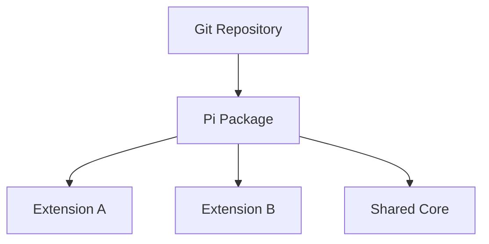
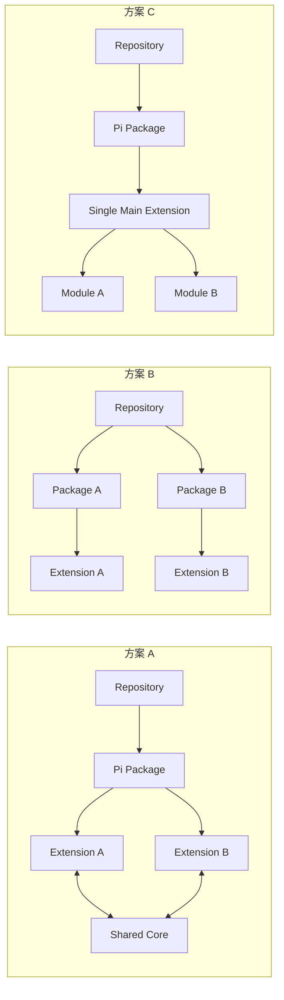
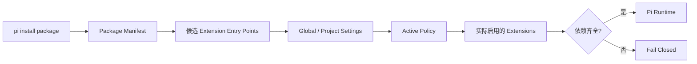
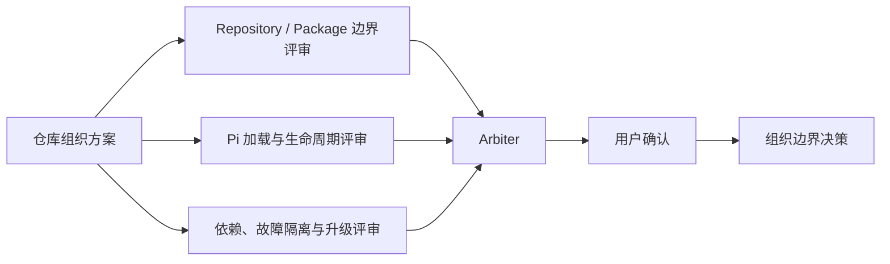

# 00：仓库组织形式技术方案

- 状态：`ALIGNING`
- 对应问题：[仓库组织形式](README.md)
- 上游：无
- 下游：[Extension 集合目录](../01-extension-catalog/README.md)

## 1. 方案目标

确定 `my-pi-extension` 如何组织一组服务于个人工作流的 Pi extension。

| 组织问题 | 本文决定范围 |
|---|---|
| 源码与版本边界 | Git repository 边界 |
| 安装与分发边界 | Pi package 边界 |
| Pi runtime 边界 | extension entry point 边界 |
| 共享实现边界 | shared core 和共享协议边界 |
| 资源归属 | Policy、skill、artifact、trace 和测试的位置 |
| 运行管理 | 安装、加载、启用、禁用、升级和回滚方式 |

本文件不决定具体 extension 的内部技术实现。

## 2. 组织层次



三者职责不同：

| 层次 | 职责 | 主要生命周期 |
|---|---|---|
| Git Repository | 源码、文档、测试、版本协作 | Git branch / commit / PR |
| Pi Package | 安装、分发和依赖管理 | `pi install` / package version |
| Extension | Pi runtime 中注册 command/tool/event/UI | Pi startup / reload / session |

## 3. 候选方案

| 方案 | Repository / Package / Extension 关系 | 主要优点 | 主要风险 | 当前判断 |
|---|---|---|---|---|
| A：单仓库、单 package、多 extension | 一个 Git repository；一个 Pi package；多个独立 extension entry point；可选 shared core | 同一工作流版本边界；共享协议简单；联调、安装和升级成本低 | 可能形成隐式依赖；默认全加载会扩大工具、命令和权限面；需要启用和依赖规则 | **当前推荐** |
| B：单仓库、多 package | 一个 Git repository；多个 Pi package；每个 extension 或 extension 组独立发布；可选 core package | 独立安装、升级和禁用；package 依赖边界更显式 | 版本兼容、发布、workspace/core 管理和联调成本高；工作流被拆成多个发布单位 | 暂不采用 |
| C：单主 extension、内部模块化 | 一个 Git repository；一个 Pi package；一个 extension factory；内部模块 | 初始代码最少；所有状态天然同 runtime | extension 边界消失；权限和状态耦合；难以独立启停/替换；容易演变为超大 extension | 不采用 |

三种方案的 runtime 边界如下：



## 4. 当前推荐

当前推荐采用：

> **一个 Git 仓库、一个 Pi package、多个独立 extension entry point，共享一个普通 TypeScript core。**

```text
my-pi-extension/
├── package.json
├── extensions/                  # Pi extension entry points
│   ├── workflow-router.ts
│   ├── task-delegation.ts
│   ├── solution-review.ts
│   ├── code-review.ts
│   ├── verification.ts
│   └── workflow-ui.ts
├── src/core/                    # 不直接注册 Pi API 的共享模块
├── policies/                    # 版本化 Policy
├── skills/                      # 本集合自带 skill（如需要）
├── tests/                       # core 和 extension 测试
└── docs/                        # 问题、设计、评审和决策文档
```

### 推荐依据

| 判断维度 | 方案 A | 对当前阶段的意义 |
|---|---|---|
| 工作流一致性 | 所有 extension 同属一个版本边界 | 适合个人工作流而非独立工具产品 |
| 协议共享 | Workflow Run、Policy、Artifact、Review、Trace 直接共享 | 避免过早发布和维护 core package |
| 当前主要风险 | 先验证 extension 边界和流程效果 | 不把精力过早投入多 package 发布管理 |
| 未来演进 | 独立 entry point 可按配置启用，也可以将来拆包 | 保留拆分空间，不提前承担拆分成本 |

## 5. Extension 的独立性要求

虽然暂时放在一个 package 中，每个 extension 仍必须有独立边界：

| 约束 | 要求 |
|---|---|
| 入口 | 独立入口文件和 factory |
| Pi API | 只注册自己的 command、tool、event、UI |
| Policy | 独立的 Policy 适配 |
| 数据 | 独立的输入/输出 Artifact |
| 内存状态 | 不直接修改其他 extension 的内存状态 |
| 协作 | 仅通过 `src/core`、typed Artifact 或 `pi.events` |
| 依赖 | 显式列出上游和下游依赖 |
| 启停 | 可被配置禁用，或声明为必需依赖 |

`src/core` 的边界：

| 可以进入 `src/core` | 不可以进入 `src/core` |
|---|---|
| domain types、schema、状态转换校验、Artifact/Trace 协议、worker/runtime 抽象、通用 Policy 校验 | `/build`、`delegate_task` 和其他用户入口的 Pi API 注册 |

## 6. 加载与启用的初步设计

初步加载和启用流程：



| 维度 | 初步设计 | 后续验证点 |
|---|---|---|
| 安装单位 | 整个 repository 对应一个 Pi package | package manifest 的实际资源声明 |
| 代码单位 | 多个独立 extension entry point | 多入口加载顺序和 reload 行为 |
| 候选加载 | package manifest 声明候选 extension | Pi package 过滤能力 |
| 实际启用 | project/global settings 或 Policy 决定 | settings 与 Policy 的职责边界 |
| 依赖 | extension 显式声明依赖；缺失时 fail closed | 依赖校验和错误呈现 |
| 版本 | 初期统一版本；按真实使用情况决定是否拆包 | 升级、兼容和回滚策略 |

## 7. 需要后续决定的问题

| 待决问题 | 需要形成的结论 |
|---|---|
| manifest | 如何列出多个 extension entry point？ |
| 发现方式 | 自动发现还是显式列出每一个入口？ |
| 启用配置 | package settings、Policy 如何分工？ |
| 依赖 | extension 依赖如何声明、解析和校验？ |
| core 工程化 | `src/core` 是否需要独立测试包或 build step？ |
| 故障隔离 | 一个 extension 加载失败时，其他 extension 是否继续加载？ |
| runtime 共享 | 哪些 extension 需要共享同一个 runtime instance？ |
| 拆包门槛 | 何时从单 package 演进为多个 package？ |

## 8. 评审要求



## 9. 暂定结论

当前暂定结论为方案 A，但状态仍是 `ALIGNING`。在 `01-extension-catalog` 完成之前，不创建具体 extension 的实现代码。
