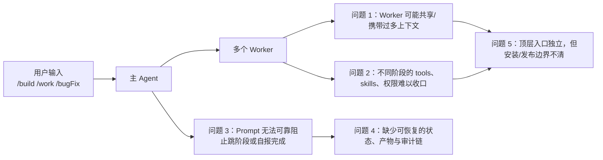
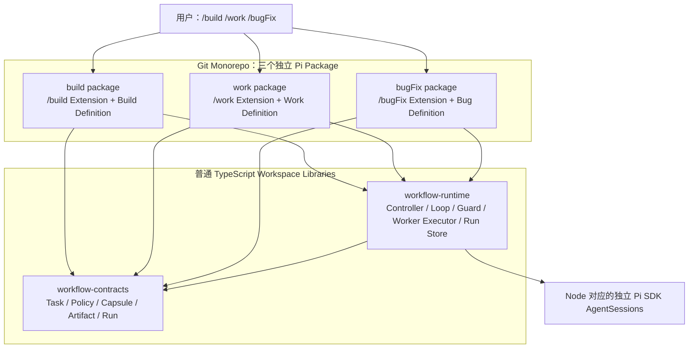
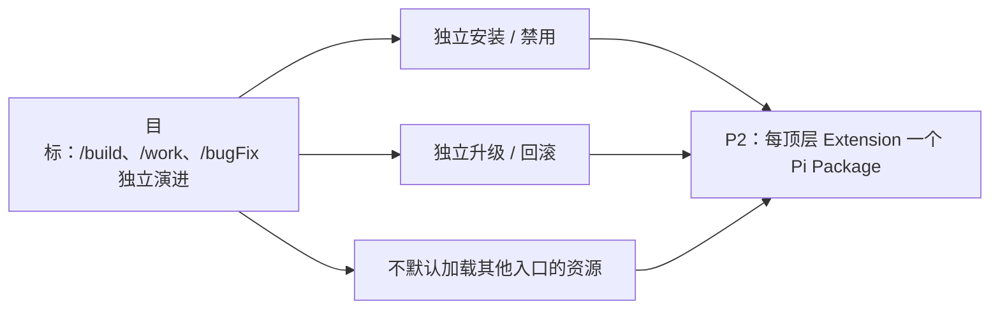
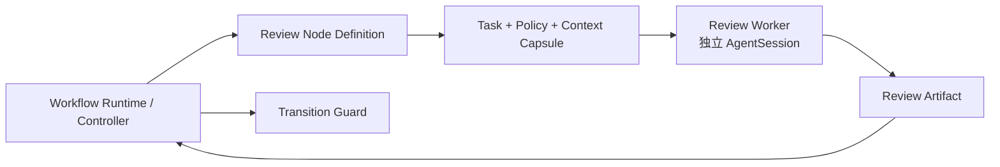
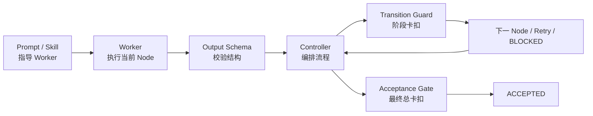
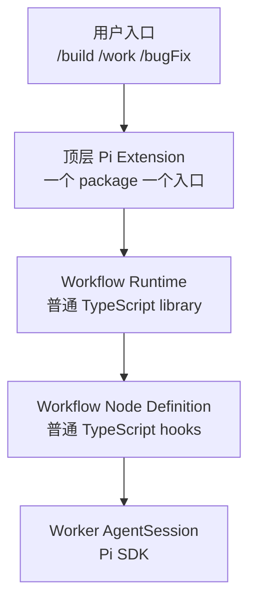
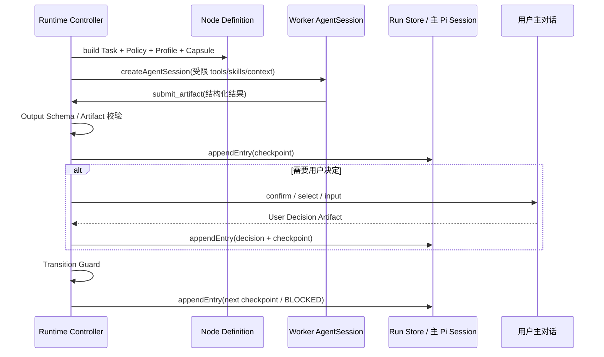
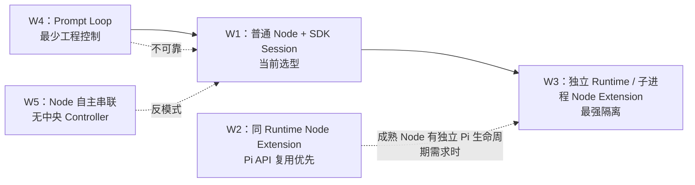
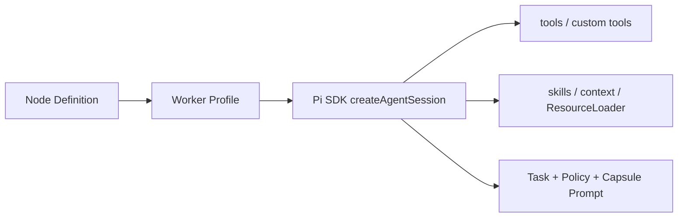
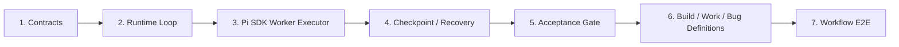

# 00：仓库组织形式技术方案

- 状态：`DECIDED`
- 对应问题：[仓库组织形式](README.md)
- 上游：无
- 下游：[Extension 颗粒度](extension-granularity.md)、[Extension 集合目录](../01-extension-catalog/README.md)

## 1. 背景与要解决的问题

### 1.1 背景

这个仓库要承载的是个人的三类独立工作入口：

```text
/build：从新需求对齐到实现、Review、验证
/work：对已有功能继续工作、分类和变更
/bugFix：对异常行为调查、定位根因和修复
```

它们不是同一条业务流程的前后步骤，但有共同的运行需求：主 agent 需要按阶段派 Worker、限制每个 Worker 的上下文和能力、拿到结构化结果、在必要时向用户确认，并让流程可恢复、可审计、可验证。

Pi 已经提供了 extension、command、SDK `AgentSession`、tools、skills、session persistence 和 UI；但它不原生提供 `WorkflowRun`、Node、状态机、Artifact、Guard 或最终验收机制。因此需要在 Pi 能力之上定义一层受控 Workflow Runtime。

### 1.2 当前问题



| 问题 | 如果不解决会怎样 | 本方案需要提供的能力 |
|---|---|---|
| Worker 上下文混杂 | 调查、实现、Review 互相带入无关历史；后续 Worker 看到不应看到的信息 | 独立 Worker `AgentSession` + 最小 Context Capsule |
| Node 能力边界不清 | Review Worker 可能写代码；只读节点可能通过不受控工具修改工作区 | 每个 Node 的 Policy、Worker Profile、tool allowlist、skill/context 范围 |
| 流程只靠 prompt | 模型可能跳过需求对齐、Review、验证，或自行宣布完成 | Controller、Transition Guard、Acceptance Gate |
| 结果没有正式交接 | 自然语言摘要不可校验、不可追溯，reload/resume 后状态丢失 | Output Schema、Artifact、`pi.appendEntry()` checkpoint、Run Store |
| 用户确认脱离流程 | 高风险选择或需求歧义无法暂停、记录和恢复 | `WAITING_FOR_USER` + 主 Pi Session 的 Human Decision Gate |
| 顶层入口边界不清 | 安装 `/build` 时默认携带不需要的 `/work`、`/bugFix` 资源；发布和回滚耦合 | 每顶层 Extension 一个 Pi package |

### 1.3 方案要达成的结果

| 目标 | 可验证结果 |
|---|---|
| 三个独立入口 | `/build`、`/work`、`/bugFix` 可分别安装、启用、升级和回滚 |
| 受控 Worker 执行 | 每个 Node Worker 只能获得该 Node 授权的 Task、Policy、tools、skills 和 Context Capsule |
| 显式交接 | Worker 通过结构化 Artifact 交接；不复制完整 session |
| 工程化 loop | 只有 Runtime 能执行状态迁移；每条边有 Guard；最终由 Acceptance Gate 决定 `ACCEPTED` |
| 用户可介入 | 需要决策时在主 Pi 对话中暂停、询问、记录并恢复 |
| 可恢复与可审计 | checkpoint、Artifact、用户决策和状态迁移可随主 session 恢复 |
| 可复用且不耦合 | 三条 workflow 复用 Runtime/Contracts，但各自定义 Node、流程和验收 |

## 2. 结论

采用 **C2 = W1 + P2**：

```text
一个 Git monorepo
  ├── build Pi package  -> /build 顶层 Extension
  ├── work Pi package   -> /work 顶层 Extension
  └── bugFix Pi package    -> /bugFix 顶层 Extension

三个 package 共同依赖普通 TypeScript workspace library：
  ├── workflow-contracts：Task / Policy / Capsule / Artifact / Run 类型
  └── workflow-runtime：Loop / Controller / Guard / Worker Executor / Run Store

每个顶层 Extension
  └── 通过自己的 Workflow Definition 定义 Node、流程、规则和验收
      └── Runtime 为每个 Node 按需创建独立 Pi SDK AgentSession Worker
```



### 2.1 三个核心判断

| 判断 | 决定 | 原因 |
|---|---|---|
| 顶层工作入口是独立产品边界 | `/build`、`/work`、`/bugFix` 各自一个 Pi package + 一个顶层 Extension | 可以独立安装、启用、升级、回滚；不让不相关 command、skill、依赖默认一起安装 |
| Node 需要隔离，但不需要先成为 Pi Extension | Node 先是普通 TypeScript Definition；每个 Node 使用独立 SDK `AgentSession` Worker | 当前需要隔离的是 worker history、tools、skills、context、Artifact 和状态权限；W1 已能满足，不必引入 Node Extension 生命周期与跨 runtime 协议 |
| Loop 需要工程化控制，不能依赖 prompt | 建设共享 Workflow Runtime；只有 Runtime 能迁移状态、重试、阻塞和验收 | 模型可做具体工作，但不能自行决定跳阶段、接受结果或绕过用户确认 |

---

## 3. 为什么这样选

### 3.1 为什么选择「每顶层 Extension 一个 Package」：P2



| 方案 | 可以得到什么 | 放弃什么 | 结论 |
|---|---|---|---|
| P1：一个 package 装全部顶层 Extension | 安装、联调、内部版本最简单 | `/build` 无法天然独立安装/发布；默认资源面较大 | 不选 |
| **P2：每顶层 Extension 一个 package** | 顶层入口可独立安装、启用、升级、回滚；边界与用户入口一致 | 需要 monorepo workspace、显式 contracts 依赖和兼容测试 | **已选** |
| P3：每个 Node 也做 package | Node 可独立发布/维护 | package、协议、版本矩阵迅速膨胀 | 暂不选 |
| P4：多仓库 | 最强的组织/CI/权限独立性 | 跨仓库 contract 和协作成本最高 | 当前无需求 |

> P2 是**安装和发布隔离**；它不自动提供独立 Pi Session、独立 Node.js 进程或 OS sandbox。

### 3.2 为什么 Node 先不是 Pi Extension：W1

当前 Node 的核心差异是：

```text
不同角色
+ 不同 Task
+ 不同 Policy
+ 不同 tools / skills / context
+ 不同 Artifact schema
+ 不同 Transition Guard
```

这些都可以由普通 Node Definition + 独立 Worker AgentSession 表达：



| Node 隔离目标 | W1 是否满足 | 机制 |
|---|---:|---|
| Worker 对话历史隔离 | ✅ | 每个 Node 新建独立 `AgentSession` |
| Node 可见上下文隔离 | ✅ | Controller 为 Node 构造最小 Context Capsule |
| tools / skills 隔离 | ✅ | Node Worker Profile -> SDK `tools` / `ResourceLoader` / custom tools |
| 输出交接隔离 | ✅ | Worker 只提交 Output Schema 校验后的 Artifact |
| 状态迁移权限隔离 | ✅ | Node / Worker 没有 `transition()` 权限 |
| 进程崩溃隔离 | ❌ | 默认同一 Node.js 进程；有需求时升级 W3 |
| OS 文件 / 网络 sandbox | ❌ | 需要额外 sandbox / 容器 / 环境策略 |

> 当前需要的是前五项，不是进程级隔离。因此选择 W1，而不是因“Node 需要隔离”过早进入 W3。

### 3.3 为什么需要共享 Workflow Runtime



| 层 | 回答的问题 | 谁拥有它 |
|---|---|---|
| Prompt / Skill | Worker 是谁、当前做什么、怎样提交结果？ | 当前 Node Definition |
| Policy / Worker Profile | Worker 允许做什么、能用哪些 tool/skill/context？ | 当前 Node Definition + Runtime 全局限制 |
| Output Schema | Worker 做完必须交什么结构化内容？ | Artifact Contract |
| Controller | 当前该启动谁、收集什么、重试还是暂停？ | Workflow Runtime |
| Transition Guard | 当前 Artifact 是否允许进入下一阶段？ | Workflow Runtime 调用 workflow 定义的 Guard |
| Acceptance Gate | 是否满足最终全部必需验收标准？ | Workflow Runtime |
| User Decision Gate | 什么情况必须在主对话中等待用户决定？ | Workflow Runtime + 顶层 Extension |

> Prompt 指导 Worker；Schema 校验 Worker 的产物；Controller 指挥 loop；Guard 卡住每一次迁移；Acceptance Gate 决定能否最终完成。

---

## 4. 已确定的最终架构

### 4.1 四层边界



| 层 | 是什么 | 责任 | 不是什么 |
|---|---|---|---|
| Pi Package | 安装、分发、版本边界 | 单独安装/升级/回滚一个顶层 workflow | 不是 session 或进程隔离边界 |
| 顶层 Pi Extension | Pi runtime 插件 / 用户入口 | 注册 `/build`、`/work` 或 `/bugFix`；接入主 Pi Session/UI | 不等于每个流程 Node |
| Workflow Runtime | 共享普通 TS library | Run、Loop、Guard、Worker、checkpoint、验收、用户确认 | 不注册 Pi command/tool/event |
| Node Definition | 当前业务阶段的 hooks | 定义 Task、Policy、Context、Artifact、Guard | 不拥有 Run 状态，不直接调用 Pi API |
| Worker AgentSession | 当前 Node 的独立 agent 会话 | 在受控 tools/skills/context 下完成工作并提交 Artifact | 不直接与其他 Worker 通信 |

### 4.2 Node 的「自定义扣子」

每条 workflow 只配置业务差异，不修改 Runtime 主循环：

```ts
type WorkflowDefinition = {
  id: "build" | "work" | "bugFix";
  initialStage: string;
  nodes: Record<string, WorkflowNodeDefinition>;
  transitions: TransitionDefinition[];
  acceptance: AcceptanceDefinition;
};

type WorkflowNodeDefinition = {
  id: string;
  buildTask(input: NodeInput): Task;
  buildPolicy(input: NodeInput): Policy;
  buildWorkerProfile(input: NodeInput): WorkerProfile;
  buildContextCapsule(input: NodeInput): ContextCapsule;
  artifactContract: ArtifactContract;
  validateArtifact(artifact: unknown, input: NodeInput): ValidationResult;
};
```

| Hook / 扣子 | workflow 可以自定义 | Runtime 强制保留 |
|---|---|---|
| `buildTask` | 当前 Node 的目标、问题和交付物 | Node 不能直接修改 `run.stage` |
| `buildPolicy` | role、允许/禁止动作、预算 | 不能放宽 Runtime 全局限制 |
| `buildWorkerProfile` | model、tools、skills、context 来源、custom tools | “只读”必须由实际 tool 配置实现，不能只靠标签 |
| `buildContextCapsule` | 当前 Worker 可见的 Artifact、事实和验收标准 | 不可复制未授权 session |
| `artifactContract` | Output Schema、证据、digest 规则 | 非法 Artifact 不能进入 Run Store |
| `guard` | 当前边的业务迁移条件 | 不能绕过全局预算、terminal state、用户确认 |
| `acceptance` | 最终验收项及其证据规则 | Worker 或主 agent 不能自报 `ACCEPTED` |

### 4.3 一次 Node 执行的固定流程



### 4.4 状态、checkpoint 与用户确认

```text
Guard 允许
  -> Runtime transition(run, targetStage)
  -> pi.appendEntry("workflow-run", checkpoint)
  -> reload / resume 后从最后一个合法 checkpoint 恢复
```

| 概念 | 责任 |
|---|---|
| `transition()` | 真正改变内存中的 WorkflowRun stage；必须先通过 Guard |
| `pi.appendEntry()` | 把 checkpoint 追加保存进主 Pi Session；不理解 stage、不会自动迁移状态 |
| `WAITING_FOR_USER` | Runtime 暂停当前 Run，等待主 Pi Session 中的用户确认 |
| User Decision Artifact | 将用户选择/输入变成可追溯、可被 Guard 使用的正式 Artifact |

---

## 5. 备选方案：为什么现在不选

### 5.1 W1-W5：Node / Worker 运行时选型



| 方案 | 实际实现 | 相比 W1 多了什么 / 少了什么 | 为什么当前不选 |
|---|---|---|---|
| **W1：已选** | Runtime 调普通 Node hooks；每 Node 用 SDK 新建独立 Worker Session | 满足 session/context/tool/skill/Artifact 隔离 | 当前成本与控制力最佳 |
| W2：同 Runtime Node Extension | Node 是被主 Pi Runtime 加载的 Pi Extension，可注册 event/tool/UI/lifecycle | 增加 Pi Extension 生命周期和 API；默认仍共享 runtime，且不自动新建 session | 当前 Node 只需不同 profile/schema，不需独立 command/tool/UI/lifecycle；会增加命名、加载、状态所有权复杂度 |
| W3：独立 Runtime Node Extension | Controller 为每 Node 启动独立 SDK runtime 或 RPC/CLI 子进程，仅加载该 Node Extension | 增加进程/环境/依赖隔离 | 需要 RPC、超时、取消、回收、崩溃恢复、trace、幂等、schema 兼容、发布矩阵；当前没有进程级隔离需求 |
| W4：Prompt Loop | 主 agent 用 prompt/skill 记住“先需求再实现再 review” | 几乎没有 Runtime/Artifact/Guard | 模型可跳阶段、自报完成、绕过验收；不符合受控 workflow |
| W5：Node 自主串联 | Node Extension 自己通知下一个 Node | 表面去掉中央 Controller | Run 状态、retry、预算、用户确认、验收和恢复无人统一负责；最终仍要补 Controller |

### 5.2 W1、W2、W3 的隔离差异

| 隔离层 | W1：当前 | W2：同主 Runtime Node Extension | W3：独立 Runtime Node Extension |
|---|---:|---:|---:|
| Worker message history | ✅ 每 Node 独立 `AgentSession` | 需要另建 session 才有 | ✅ |
| tools / skills / Context Capsule | ✅ Node Profile + SDK 配置 | 同 runtime 容易混合，需要额外治理 | ✅ 子 runtime 可独立加载资源 |
| Artifact 正式交接 | ✅ Controller 强制 | 仍需 Controller 自建 | ✅ Controller 强制 |
| Run 状态所有权 | ✅ Runtime 唯一所有 | 容易在 Coordinator / Node 间分散 | ✅ 父 Runtime 唯一所有 |
| Pi Extension 生命周期 | 只有顶层 Extension | 所有 Node 共享主 runtime 生命周期 | 每 Node 可独立 |
| Node.js 进程崩溃隔离 | ❌ | ❌ | RPC / CLI 模式 ✅ |
| OS 文件 / 网络 sandbox | ❌ | ❌ | 仍需额外环境控制 |

### 5.3 P1-P4：Package 选型

| 方案 | Package 边界 | 优点 | 代价 | 结论 |
|---|---|---|---|---|
| P1 | 一个 package 包含 build/work/bugFix | 最简单的安装和内部联调 | 顶层入口不能天然独立安装、升级和回滚 | 不选 |
| **P2** | build/work/bugFix 各一个 package，保持单 monorepo | 与独立工作入口一致；可按入口独立安装/发布 | workspace、显式 contracts、兼容测试 | **已选** |
| P3 | 每个 Node 也独立 package | 成熟 Node 可独立发布/维护 | 版本矩阵和协议成本快速膨胀 | 暂不选 |
| P4 | 多仓库、多 package | 最强组织独立性 | 跨仓库协作/contract 发布成本高 | 当前无需求 |

---

## 6. 工程落地边界

### 6.1 建议的 monorepo 结构

```text
my-pi-extension/
├── package.json                         # workspace root
├── packages/
│   ├── workflow-contracts/              # 普通 TS library：类型 / schema
│   │   ├── src/
│   │   └── test/
│   ├── workflow-runtime/                # 普通 TS library：loop / guard / executor / store
│   │   ├── src/
│   │   └── test/                        # runtime / store / SDK / decision 行为测试
│   └── bugfix/                           # Pi package：注册 /bugFix
│       ├── package.json
│       ├── src/extension.ts
│       └── test/                         # command 行为测试
└── docs/
```

当前仅实现 `bugfix` package；`build`、`work` package 仍是后续 P2 工作。

`workflow-runtime` 和 `workflow-contracts` 是 workspace 内的普通 TypeScript library：

```text
不是 Pi Extension
不注册 /build /work /bugFix
不注册全局 Pi API
不保存跨 workflow 的隐式内存状态
```

### 6.2 Worker Profile 与只读边界



| 配置 | 意义 |
|---|---|
| `read`、`grep`、`find`、`ls` | 工具层只读；适合调查、方案、Review |
| `edit`、`write` | 显式允许修改；适合 implementation Node |
| `bash` | 可能写文件、提交代码、访问网络；不能放入“只读” Profile，需额外拦截/隔离 |
| skill | 指令和资源范围，不是硬权限 |
| Context Capsule | 当前 Worker 唯一被允许的跨 Node 业务上下文；仍需防止通过工具读取未授权数据 |

### 6.3 Runtime 的不可绕过规则

| 规则 | Runtime 行为 |
|---|---|
| Worker 只能提交当前 Node Artifact | 不接受 `nextStage` / `ACCEPTED` 作为 Worker 授权 |
| Schema 无效 / 证据缺失 | 有限 retry 或 `BLOCKED` |
| Guard 未通过 | 不迁移 stage |
| 用户必须确认 | 保存 `WAITING_FOR_USER` checkpoint，并在主对话中停住 |
| reload / resume | 读取相同 `runId` 的最后一个合法 checkpoint 恢复 |
| 最终验收 | Acceptance Gate 检查必需标准、证据、最终 revision、blocking finding；失败不进入 `ACCEPTED` |

---

## 7. 实施顺序与未决边界



| 阶段 | 先完成什么 | 暂不做什么 |
|---|---|---|
| 1 | Task、Policy、Capsule、Artifact、Run、Guard 类型/Schema | 三个 workflow 的完整业务流程 |
| 2 | Loop、`transition()`、retry、timeout、cancel、`BLOCKED` | Node Extension / Node package |
| 3 | SDK Worker Session、tools/skills/context 限制、`submit_artifact` | 进程级隔离 |
| 4 | `pi.appendEntry()` checkpoint、恢复、幂等、trace | 事务型外部 Run Store |
| 5 | Acceptance Gate、User Decision Gate | 完整 Workflow UI |
| 6 | build/work/bugFix 的 Node、Transition、Policy、Artifact、验收定义 | 强行让三条业务流程使用同一状态图 |
| 7 | runtime contract tests + 三条流程 E2E | 发布 Node package |

### 7.1 后续重新评审 W3 / Node Extension 的门槛

只有同时出现以下多项证据时，才考虑普通 Node 升级为 Node Extension 或独立 runtime：

```text
需要独立 command / tool / UI / lifecycle
+ 多个 workflow 或外部宿主稳定复用
+ 输入、输出、错误、超时、取消、版本协议稳定
+ 需要独立 owner / 发布 / 回滚
+ 需要进程级故障隔离，或不同环境 / 凭证 / 依赖
```

## 8. 决策范围

已确定：

- W1：普通 Node Definition + 共享 Workflow Runtime + 独立 Pi SDK Worker Session；
- P2：单 Git monorepo，每个顶层 workflow extension 一个 Pi package；
- Runtime 以受控 hooks 承接各 workflow 的 Node、Policy、Context、Artifact、Guard、验收；
- 用户确认发生在主 Pi Session，由 Controller 记录为 User Decision Artifact；
- Node 暂不单独成为 Pi Extension 或 Pi package。

仍待各 workflow 设计文档确定：

- `/build`、`/work`、`/bugFix` 各自的 Node 列表和状态图；
- 真实 Artifact / Acceptance Criteria 字段；
- workspace 包管理与发布工具；
- `workflow-ui` 是否成为独立 Extension；
- 哪些高风险场景需要从 SDK Worker 升级到 RPC/CLI 进程隔离。
