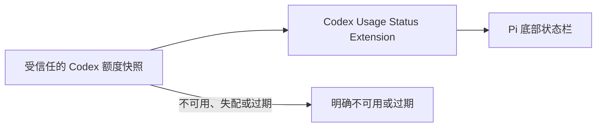

# Codex Usage Status Extension 产品规范

| 项目 | 定义 |
| --- | --- |
| 状态 | `DECIDED` |
| 层级 | 第一层（L1 Extension） |
| 用户目标 | 在 Pi 底部状态栏查看当前 ChatGPT Codex 订阅额度窗口的剩余比例、可用性与重置时间。 |
| 适用范围 | `ctx.mode === "tui"` 且当前模型为 `openai-codex`，并且当前授权可安全读取 ChatGPT Codex 额度的会话。 |
| 当前实现 | `packages/codex-usage-status` 已实现并通过模拟/静态验收；真实 Pi TUI/provider E2E 与全仓测试环境验证尚待完成，当前事实见 [L2 技术设计](../../02-产品实现/codex-usage-status-技术设计.md)。 |

## 1. 产品保证

扩展必须：

1. 只展示默认 Codex 主额度 bucket 的有效窗口；完全忽略 `additional_rate_limits`（例如 `GPT-5.3-Codex-Spark`）。不展示 `default` 标签。采用 C「胶囊额度」样式，正常格式为 `Codex · 98% ██████████ · Sep 16 10:41`；不把窗口名称或时长硬编码为“5 小时”或“每周”。
2. 进度条表达**剩余比例**，由 10 个固定单元组成：填充数为 `round(remainingPercent / 10)`，已填充为 `█`、未填充为 `░`。许可状态和比例必须排在重置详情之前；Pi 宿主可截断过长 footer。
3. 明确区分“窗口剩余比例”与“当前允许使用”：默认 bucket 的 `allowed` 为 false 时显示 `Codex limit reached`；其缺失时显示 `Codex status unknown`，不得仅因 `NN% left` 推断仍能使用。
4. 区分当前快照、过期快照和不可用。刷新失败后，最近成功且账户作用域仍匹配的快照仅在 `now - fetchedAt < 10 分钟` 时显示 `stale`；到达 `now - fetchedAt >= 10 分钟` 时必须清除旧比例并显示 `Codex: unavailable`，即使没有新请求结果。
5. 仅向固定的 `https://chatgpt.com/backend-api/wham/usage` 发起额度请求，且禁止重定向；不得因 provider base URL 覆盖、代理或 Location 跳转向其他 origin 发送授权或账户作用域。
6. 不展示、记录或持久化 bearer token、账户标识、完整响应体、请求头或响应头。
7. 额度查询失败、超时、字段不兼容或扩展被禁用时，不得阻塞、取消、重试或改变 Pi 的模型请求和会话状态。
8. 同 provider 登录、登出或切换账号没有 Pi 认证事件时，扩展按每次输入、模型切换和最多 60 秒的授权校验识别作用域变化。每次成功确认作用域后开始 60 秒 lease；lease 到期即先清除快照并显示 `unavailable`，再后台校验，因此运行中底栏对当前授权的识别最多滞后 60 秒。发现变化时必须立即清除旧快照。

## 2. 数据语义

| 字段 | 定义 | 展示规则 |
| --- | --- | --- |
| `usedPercent` | 服务端报告的已使用窗口比例 | 非有限值或超出 `0..100` 的窗口拒绝；合法值按 `remainingPercent = round(100 - usedPercent)` 展示。 |
| `windowDurationMins` | 服务端报告的窗口时长，可能缺失 | 有值时可格式化为 `5h`、`7d` 等；缺失时不猜测。 |
| `resetsAt` | 服务端报告的 Unix 秒级重置时间，可能缺失 | 有值时按本地时区显示；缺失时不虚构重置时间。 |
| `allowed` | **默认 bucket** 的服务端普通额度许可，可能缺失 | `true` 为允许、`false` 为 `limit reached`、缺失为 `status unknown`。 |
| `fetchedAt` | 本次成功查询的本地时间 | 只用于判断新鲜度，不作为账户用量数据持久化。 |

同一快照只从默认 bucket 的 primary/secondary 窗口按该顺序展示。`additional_rate_limits` 及其标签、许可和窗口均不解析、不展示。若无任何有效主窗口，视为查询失败而非零额度。

## 3. 刷新与失败语义

| 场景 | 用户可见结果 | 不可绕过的规则 |
| --- | --- | --- |
| 非 TUI 或当前模型不是 Codex | 不显示本扩展状态 | 不解析授权、不联网、不启动定时器；不影响其他模式/provider。 |
| 会话开始、切入 Codex 或用户输入 | 后台校验授权；必要时异步获取快照 | 不阻塞会话启动、模型切换或输入处理。 |
| 每次 scope lease 到期（最多 60 秒） | 先清除快照，再后台重校验当前授权作用域 | 授权解析长期 pending 也不得延长旧快照展示；发现授权缺失或作用域变化时立即清除。 |
| 成功查询且默认 `allowed=true` | 显示 `Codex · <比例> <10 单元进度条> · <重置时间>` | 仅采用字段完整、数值合法且账户作用域未失配的窗口。 |
| 成功查询且默认 `allowed=false` | `Codex limit reached` | 不显示会误导许可状态的进度条。 |
| 成功查询但默认 `allowed` 缺失 | `Codex status unknown · <主窗口和进度条>` | 许可状态在前；不从比例或重置时间推断允许。 |
| 定期刷新或 Pi 结束一次 Agent 工作后刷新 | 用较新的成功快照替换旧值 | 请求必须限频；多个触发不得并发放大请求。 |
| 暂时失败且同一作用域的上次成功快照未满 10 分钟 | 保留上次数据并标记 `stale` | 不得将过期数据说成当前值。 |
| 无有效快照、登录缺失、账户失配、作用域变化或快照满 10 分钟 | `Codex: unavailable` | 不根据 token、模型 token 使用量或历史调用估算额度。 |

## 4. 安全与隐私边界

- 扩展只可使用 Pi 已解析的 `openai-codex` 授权，在内存中解析必需的账户作用域并请求固定 ChatGPT origin；不得要求用户复制 token，也不得把 token 写入配置、日志、session、trace 或 UI。
- 授权解析属于 Pi 内部操作，可能最长耗时 15 秒或受认证锁影响而更久；5 秒时限只约束 usage HTTP 请求。任何授权或 HTTP 晚到结果都必须经过当前 generation/作用域检查，不能写入底栏。当前模型还必须被 Pi 确认为 OAuth，并保有原生 `openai-codex-responses` API 与 `https://chatgpt.com/backend-api` base URL；任何改变 endpoint/API 的覆盖或非 OAuth 授权一律 `unavailable` 且不联网。仅改变名称等、运行时不可区分且不改变上述信任边界的模型元数据覆盖不在拒绝范围内。
- 若当前凭证无法安全解析账户作用域、服务端要求当前扩展无法生成的条件路由 header，或响应账户与请求作用域不一致，扩展必须显示 `unavailable`。
- 状态栏仅展示默认主额度的许可状态、剩余比例、固定进度条、可选窗口时长、可选重置时间和新鲜度。
- 接口、授权和服务端字段是外部依赖。其依据和不稳定性见[额度查询调研](../../归档/研究/2026-09-09-codex额度查询调研.md)。

## 5. 验收标准

| 编号 | 场景 | 通过条件 |
| --- | --- | --- |
| A1 | 默认主额度有效窗口与额外 bucket 同时存在 | 格式化后的完整状态文本只包含默认主窗口、由 `usedPercent` 正确换算的剩余比例、10 单元进度条和可用重置时间；不得含额外 bucket 名称或数值。 |
| A2 | 默认 `allowed=false` 或缺失、额外 bucket 许可冲突 | 分别显示 `Codex limit reached` 或 `Codex status unknown · <主窗口和进度条>`；额外 bucket 不影响或进入状态文本。 |
| A3 | 单窗口、缺少时长/重置时间或无有效窗口 | 显示可用比例但不猜测缺失字段；无有效窗口按失败处理。 |
| A4 | 无授权、HTTP 非 200、重定向、解析错误、账户失配或超时 | Pi 正常可用；底栏显示 `unavailable` 或合规的 `stale`，不泄露敏感信息。 |
| A5 | 失败后的旧快照 | 仅同作用域且 `< 10 分钟` 的快照显示 `stale`；`>= 10 分钟` 时无新请求也必须变为 `unavailable`。 |
| A6 | 非 Codex 模型、模型切换、同 provider 登出/换号或授权校验永久 pending | 模型切换立即清除；scope lease 到期（最多 60 秒）即清除旧快照，登录状态变化或 pending 不得延长它。 |
| A7 | 非 TUI 模式 | 不调用授权解析、网络或定时器。 |
| A8 | 审计检查 | Git diff、测试输出、状态栏、session 和日志均不含 token、账户标识、完整响应或原始 headers。 |

## 6. 进入实现的门禁

本规范必须完成独立的产品语义/指标评审和实现/运营评审，且所有 P0/P1 finding 已关闭，才可改动源码。若上游接口不再可用或其授权边界无法满足本规范，状态改为 `BLOCKED`，不以抓取网页或推算 token 使用量替代。
