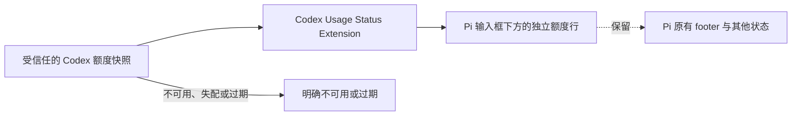

# Codex Usage Status + Fast Extension 产品规范

| 项目 | 定义 |
| --- | --- |
| 状态 | `IMPLEMENTING` |
| 层级 | 第一层（L1 Extension） |
| 用户目标 | 在 Pi 输入框下方、原有 footer 上方的独立额度行查看当前 ChatGPT Codex 订阅额度窗口的剩余比例、可用性与重置时间，并按请求启用 Codex Fast 优先处理。 |
| 适用范围 | 额度状态仍只适用于 TUI 的 `openai-codex` 安全授权会话；Fast 适用于满足严格模型、provider、API、base URL 和 OAuth 条件的当前模型，并支持 TUI/RPC 控制。 |
| 当前实现 | `packages/codex-usage-status` 已实现额度状态、Fast 核心逻辑与 parent-Fast interop；已有模拟测试证据；真实 Pi TUI/provider E2E 未执行，全仓验证证据与当前 drift 见 [L2 技术设计](../../02-产品实现/codex-usage-status-技术设计.md)。 |

## 1. 产品保证

扩展必须：

1. 只展示默认 Codex 主额度 bucket 的有效窗口；完全忽略 `additional_rate_limits`（例如 `GPT-5.3-Codex-Spark`）。不展示 `default` 标签。采用 C「胶囊额度」样式，正常格式为 `Codex · 98% ██████████ · Sep 16 10:41`；不把窗口名称或时长硬编码为“5 小时”或“每周”。
2. 进度条表达**剩余比例**，由 10 个固定单元组成：填充数为 `round(remainingPercent / 10)`，已填充为 `█`、未填充为 `░`。正常状态的比例和已填充条固定为 truecolor `#74d9a5`，未填充网格固定为 faint `#59677c`；每段 ANSI 必须立即 reset。`Codex` 和重置时间保持 Pi `dim`；`stale`/`status unknown` 为 Pi `warning`、`limit reached` 为 Pi `error`。许可状态和比例必须排在重置详情之前；额度行的组件通过 `render(width)` 使用 ANSI-safe `truncateToWidth` 截断，始终至多一行。
3. 明确区分“窗口剩余比例”与“当前允许使用”：默认 bucket 的 `allowed` 为 false 时显示 `Codex limit reached`；其缺失时显示 `Codex status unknown`，不得仅因 `NN% left` 推断仍能使用。
4. 区分当前快照、过期快照和不可用。刷新失败后，最近成功且账户作用域仍匹配的快照仅在 `now - fetchedAt < 10 分钟` 时显示 `stale`；到达 `now - fetchedAt >= 10 分钟` 时必须清除旧比例并显示 `Codex: unavailable`，即使没有新请求结果。
5. 仅向固定的 `https://chatgpt.com/backend-api/wham/usage` 发起额度请求，且禁止重定向；不得因 provider base URL 覆盖、代理或 Location 跳转向其他 origin 发送授权或账户作用域。
6. 不展示、记录或持久化 bearer token、账户标识、完整响应体、请求头或响应头。
7. 额度查询失败、超时、字段不兼容或扩展被禁用时，不得阻塞、取消、重试或改变 Pi 的模型请求和会话状态。
8. 同 provider 登录、登出或切换账号没有 Pi 认证事件时，扩展按每次输入、模型切换和最多 60 秒的授权校验识别作用域变化。每次成功确认作用域后开始 60 秒 lease；lease 到期即先清除快照并显示 `unavailable`，再后台校验，因此运行中额度行对当前授权的识别最多滞后 60 秒。发现变化时必须立即清除旧快照。
9. 额度行使用 Pi `setWidget('codex-usage-status', factory, { placement: 'belowEditor' })`；不调用 `setFooter`，不以换行符模拟布局。Pi 默认 footer、其他扩展状态和独立 `codex-fast` status key 保持共存，额度不与其拼接。
10. 每次额度展示前先以 `setStatus('codex-usage-status', undefined)` 清除历史 status；隐藏、模型切换、非 TUI、关闭和 shutdown 同时以该 key 清除 widget 与 status，不能留下重复文本或空占位。

## 2. Fast 交互、请求与计费保证

Fast 必须：

1. 每个扩展 factory 默认以短暂内存意图从 Off 开始，不写入配置或 session。唯一例外是 §2.1 定义的一次性 trusted-launcher child：仅被选中的 child 可从 `PI_CODEX_FAST=1` 初始化 requested On；parent 的 reload/new/resume/fork，以及 child 后续 factory（包括 reload/new/resume/fork）仍从 Off 开始。
2. 注册 `/fast`。无参数切换 requested intent；`on`、`off`、`toggle`、`status` 分别执行对应动作，其他参数显示用法警告。只有 `ctx.hasUI` 为真时允许 TUI/RPC 命令改变意图；JSON/print 不改变意图并安全通知限制。
3. 区分 requested intent 和 effective state：Off、On 且 eligible 时 Active、On 且不 eligible 时 Inactive。模型切换不清除同一实例的 requested On；切回 eligible 必须更新状态并通知。额度 limited、stale 或 unavailable 不得自动关闭 Fast。
4. 仅当当前模型的 provider 恰为 `openai-codex`、API 恰为 `openai-codex-responses`、base URL 恰为 `https://chatgpt.com/backend-api`、OAuth 校验为真，且模型 id 恰为 `gpt-5.4`、`gpt-5.5`、`gpt-5.6-luna`、`gpt-5.6-sol` 或 `gpt-5.6-terra` 时 eligible；mini、spark、前缀、大小写及其他变体均拒绝。该判定不读取额度授权、不联网、不启动 timer。
5. Active 时，仅对 plain-object provider payload 且 `payload.model` 精确匹配当前模型 id 的 `before_provider_request` 请求返回浅复制并设置 `service_tier: "priority"`；其他情况保持不变。Fast 只作用于实际触发该 hook 的逻辑 Agent 请求；该返回值是本扩展的请求输出，不是“请求实际已按 priority 发送”的证明。
6. 以独立底部状态 key 显示 `⚡ Fast`（受限 truecolor soft-orange `#D98C3F`，RGB `(217, 140, 63)`，固定 ANSI 序列 `\u001b[38;2;217;140;63m⚡ Fast\u001b[0m`，文本后立即 reset）、Fast inactive（muted）或 Fast off（muted）；Off/Active/Inactive 只描述本扩展的 intent/effective state。Active 通知固定为 `⚡ Fast enabled — selected user implementer/code_reviewer agents inherit requested Fast.`；TUI 以同一 orange ANSI 渲染并以 `info` 发送，RPC（`context.mode` 非 `tui`）发送不含 ANSI 的相同纯文本并以 `info` 发送；Inactive/Off 保持现有通知语义。请求被本扩展改写后，在匹配的 assistant message_end 按请求时模型/session 快照修正 Pi session cost：以 public `calculateCost` 重算 base，再应用 `gpt-5.5` 为 2.5、其他 allowlist 模型为 2 的 priority multiplier；只改 `usage.cost`，并对已正确计费结果幂等。支持的组合要求：没有后续 `before_provider_request` handler 改变或移除本扩展输出的 `service_tier`，且没有其他 `message_end` handler 改变模型/session 匹配输入、usage token 字段或已修正的 `usage.cost`，从而影响本次修正或最终持久化。Pi 0.84.4 没有最终 payload 或最终持久化 message 可观测 hook；超出该组合时，本扩展只保证自己的 hook 输出，不保证 provider 最终 tier 或 session 最终 cost。
7. 在上述支持的 handler 组合下，对 valid 的 `error` 或 `aborted` assistant message，只要 usage 字段完整且合法，仍按已产生的 usage 修正 cost；malformed usage fail open。

### 2.1 Parent-Fast 继承例外

Fast 的 factory 默认仍为 Off，但存在一个明确的一次性、受信任 launcher 例外：

- parent 扩展用 Pi 官方 `pi.events` 发布稳定事件名 `@pi/codex-usage-status:fast-requested/v1`，payload 必须是无额外字段的 plain object `{ version: 1, sessionId: string, requested: boolean }`。缺失、版本不符、类型不符或多字段事件一律忽略；parent `session_start` 发布当前 requested，合法 `/fast` 状态改变后刷新，`session_shutdown` 发布该 session 的 `requested: false`。
- launcher 仅把 parent requested intent 在实际 spawn 的瞬间按 session id 读取，并以全新环境副本删除 `PI_CODEX_FAST`；只有 resolved USER-source、名字严格为 `implementer` 或 `code_reviewer`、且其 agent frontmatter 有精确标量 `codexFast: inherit` 时才传 `PI_CODEX_FAST=1`。Parent Off、其他 user agent、所有 project agent（包括同名 project override）均 Off。
- `PI_CODEX_FAST=1` 是 child factory 的一次性 advisory trusted-launcher input，不是认证、安全边界或持久化配置。child 启动立即读取并删除它；缺失及任何非精确值均 Off。child reload/new/resume/fork 重新建 factory 后回到 Off。
- 继承的只是 requested intent；child 自己再次执行 provider、API、base URL、OAuth 和模型 eligibility。Parent requested On 但 Inactive 时，eligible child 仍可 Active。已 spawn child 不受后续 toggle 影响；chain 与排队 parallel item 在各自实际 spawn 时取快照，而不是按整个 tool invocation 取快照。
- role/source/config policy 属于本地 external dispatcher integration，不是本 package 单独可验证的产品权限或认证机制；package 只保证协议和 child bootstrap 语义。Fast 激活通知必须明确说明新 spawn 的 selected user `implementer`/`code_reviewer` 会继承 requested Fast，同时保持紧凑 orange UI。

额度状态仍遵循以下数据语义：

## 3. 数据语义

| 字段 | 定义 | 展示规则 |
| --- | --- | --- |
| `usedPercent` | 服务端报告的已使用窗口比例 | 非有限值或超出 `0..100` 的窗口拒绝；合法值按 `remainingPercent = round(100 - usedPercent)` 展示。 |
| `windowDurationMins` | 服务端报告的窗口时长，可能缺失 | 有值时可格式化为 `5h`、`7d` 等；缺失时不猜测。 |
| `resetsAt` | 服务端报告的 Unix 秒级重置时间，可能缺失 | 有值时按本地时区显示；缺失时不虚构重置时间。 |
| `allowed` | **默认 bucket** 的服务端普通额度许可，可能缺失 | `true` 为允许、`false` 为 `limit reached`、缺失为 `status unknown`。 |
| `fetchedAt` | 本次成功查询的本地时间 | 只用于判断新鲜度，不作为账户用量数据持久化。 |

同一快照只从默认 bucket 的 primary/secondary 窗口按该顺序展示。`additional_rate_limits` 及其标签、许可和窗口均不解析、不展示。若无任何有效主窗口，视为查询失败而非零额度。

## 4. 刷新与失败语义

| 场景 | 用户可见结果 | 不可绕过的规则 |
| --- | --- | --- |
| 非 TUI 或当前模型不是 Codex | 不显示本扩展状态 | 不解析授权、不联网、不启动定时器；不影响其他模式/provider。 |
| 会话开始、切入 Codex 或用户输入 | 后台校验授权；必要时异步获取快照 | 不阻塞会话启动、模型切换或输入处理。 |
| 每次 scope lease 到期（最多 60 秒） | 先清除快照，再后台重校验当前授权作用域 | 授权解析长期 pending 也不得延长旧快照展示；发现授权缺失或作用域变化时立即清除。 |
| 成功查询且默认 `allowed=true` | 显示 `Codex · <比例> <10 单元进度条> · <重置时间>` | 仅采用字段完整、数值合法且账户作用域未失配的窗口。 |
| 成功查询且默认 `allowed=false` | `Codex limit reached` | 不显示会误导许可状态的进度条。 |
| 成功查询但默认 `allowed` 缺失 | `Codex status unknown · <主窗口和进度条>` | 许可状态在前；不从比例或重置时间推断允许。 |
| 定期刷新或 Pi 结束一次 Agent 工作后刷新 | 用较新的成功快照替换旧值 | 请求必须限频；多个触发不得并发放大请求。 |
| 暂时失败且同一作用域的上次成功快照未满 10 分钟 | 保留上次数据并标记 `stale` | 不得将过期数据说成当前值。 |
| 无有效快照、登录缺失、账户失配、作用域变化或快照满 10 分钟 | `Codex: unavailable` | 不根据 token、模型 token 使用量或历史调用估算额度。 |

## 5. 安全与隐私边界

- 扩展只可使用 Pi 已解析的 `openai-codex` 授权，在内存中解析必需的账户作用域并请求固定 ChatGPT origin；不得要求用户复制 token，也不得把 token 写入配置、日志、session、trace 或 UI。
- 授权解析属于 Pi 内部操作，可能最长耗时 15 秒或受认证锁影响而更久；5 秒时限只约束 usage HTTP 请求。任何授权或 HTTP 晚到结果都必须经过当前 generation/作用域检查，不能写入底栏。当前模型还必须被 Pi 确认为 OAuth，并保有原生 `openai-codex-responses` API 与 `https://chatgpt.com/backend-api` base URL；任何改变 endpoint/API 的覆盖或非 OAuth 授权一律 `unavailable` 且不联网。仅改变名称等、运行时不可区分且不改变上述信任边界的模型元数据覆盖不在拒绝范围内。
- 若当前凭证无法安全解析账户作用域、服务端要求当前扩展无法生成的条件路由 header，或响应账户与请求作用域不一致，扩展必须显示 `unavailable`。
- 状态栏仅展示默认主额度的许可状态、剩余比例、固定进度条、可选窗口时长、可选重置时间和新鲜度。
- 接口、授权和服务端字段是外部依赖。其依据和不稳定性见[额度查询调研](../../归档/研究/2026-09-09-codex额度查询调研.md)。

## 6. 验收标准

| 编号 | 场景 | 通过条件 |
| --- | --- | --- |
| A1 | 默认主额度有效窗口与额外 bucket 同时存在 | 格式化后的完整状态文本只包含默认主窗口、由 `usedPercent` 正确换算的剩余比例、10 单元进度条和可用重置时间；不得含额外 bucket 名称或数值。 |
| A2 | 默认 `allowed=false` 或缺失、额外 bucket 许可冲突 | 分别显示 `Codex limit reached` 或 `Codex status unknown · <主窗口和进度条>`；额外 bucket 不影响或进入状态文本。 |
| A3 | 单窗口、缺少时长/重置时间或无有效窗口 | 显示可用比例但不猜测缺失字段；无有效窗口按失败处理。 |
| A4 | 无授权、HTTP 非 200、重定向、解析错误、账户失配或超时 | Pi 正常可用；底栏显示 `unavailable` 或合规的 `stale`，不泄露敏感信息。 |
| A5 | 失败后的旧快照 | 仅同作用域且 `< 10 分钟` 的快照显示 `stale`；`>= 10 分钟` 时无新请求也必须变为 `unavailable`。 |
| A6 | 非 Codex 模型、模型切换、同 provider 登出/换号或授权校验永久 pending | 模型切换立即清除；scope lease 到期（最多 60 秒）即清除旧快照，登录状态变化或 pending 不得延长它。 |
| A7 | 非 TUI 模式 | 不调用授权解析、网络或定时器。 |
| A8 | 审计检查 | Git diff、测试输出、额度行、session 和日志均不含 token、账户标识、完整响应或原始 headers。 |
| A9 | 独立额度行与共存 | 使用 `belowEditor` widget 独占一行；窄终端始终至多一行并安全截断；Pi 默认 footer、其他 status 与 `codex-fast` 共存且不被拼接。 |
| A10 | 隐藏、切换与关闭 | 非 Codex、非 TUI、模型切换和 shutdown 清除 `codex-usage-status` widget 与旧 status；不重复展示、不留空占位，晚到结果不得复活。 |
| F1 | Fast 命令与模式 | `/fast` 的空参数、`on`、`off`、`toggle`、`status` 和非法参数行为符合定义；JSON/print（`hasUI=false`）不改变 intent，RPC（`hasUI=true`）可控制。 |
| F2 | Fast gate 与状态 | 只有精确的 provider/API/base URL/OAuth/model-id allowlist 通过 gate；同一实例覆盖 Off、Active、Inactive、模型切换后保留 requested On 并在切回时恢复。 |
| F3 | payload hook 与组合边界 | Active 仅为匹配的 plain-object payload 返回浅复制 `service_tier=priority`，保留原 payload/嵌套引用；支持组合要求没有后续 `before_provider_request` handler 改变或移除该 tier。Pi 0.84.4 没有最终 payload 或最终持久化 message 可观测 hook，因此验收只证明本扩展 hook 输出，不证明 provider 最终 tier；超出支持组合不作最终 tier/cost 保证。 |
| F4 | request-time ticket | ticket 使用请求时 model/session 快照；中途 Off、session mismatch、shutdown 和超过 32 项 FIFO 上限均 fail open，且不修正无本扩展 hook 的请求。 |
| F5 | Fast cost | allowlist 非 `gpt-5.5` 为 2x、`gpt-5.5` 为 2.5x；long-context model tier 保留，四个 scaled component 相加得到 total，已 native-priority 浮点 cost 幂等不替换。支持组合还要求没有其他 `message_end` handler 改变模型/session 匹配输入、usage token 字段或 corrected `usage.cost`，从而影响本次修正或最终持久化；否则只保证本扩展自己的 hook 输出，不保证最终 session cost。 |
| F6 | malformed/terminal usage | 负数、非整数、缺失必需字段、非法 reasoning/cacheWrite1h、`reasoning > output` 或 `cacheWrite1h > cacheWrite` 不修正；合法且有 accrued usage 的 `error`/`aborted` message 仅在上述支持的 `message_end` 组合下按已决定语义修正。 |
| F7 | extension isolation/reset | Fast 使用独立 status key，不依赖额度查询；新建第二个 extension factory 后 intent 从 Off 开始，usage controller 的授权/网络行为不受 Fast 命令或 gate 影响。 |
| F8 | parent requested Off | 任意新 spawn 均不带 Fast；状态按 session id 隔离，false/`session_shutdown` 清除对应 parent intent。 |
| F9 | selected child inheritance | parent requested On 仅使 resolved USER-source 且 exact name/config 命中的 `implementer`、`code_reviewer` child 获得一次性 `PI_CODEX_FAST=1`；其他 user、project 和同名 project override 不继承。 |
| F10 | bootstrap and timing | child 只读取并删除精确 `"1"`；child eligibility 独立决定 Active；reload/new/resume/fork Off；chain/queued parallel 按实际 spawn 快照；launcher 继承是 advisory、无持久化且不构成 package-only VERIFIED 证据。 |

## 7. 采纳与验证状态

| 项目 | 当前状态 |
| --- | --- |
| 产品语义/指标评审 | 已通过；上轮 P1 `resolved_fixed` 已关闭，本轮无阻塞 finding。 |
| 实现/运营评审 | 已通过；上轮 P1 已关闭，本轮无新阻塞，主题缓存 P2 未重新打开。 |
| 自动化验证 | 已补充独立行、宽度、ANSI、resize、主题 invalidate、生命周期清理、晚到结果和状态共存测试；本轮全仓测试、类型检查、diff 检查和 Markdown 相对链接检查通过，详细结果见 L2。 |
| 真实 Pi TUI/provider E2E | 未执行，仍是 L2 drift；不得以模拟测试替代真实会话验证。 |

若上游接口不再可用或其授权边界无法满足本规范，状态改为 `BLOCKED`，不以抓取网页或推算 token 使用量替代。
