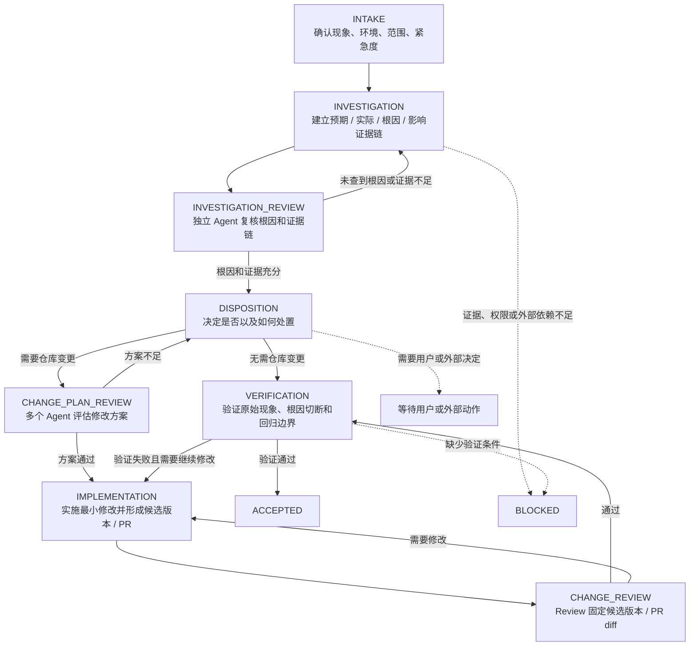
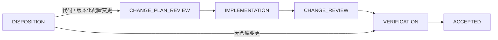
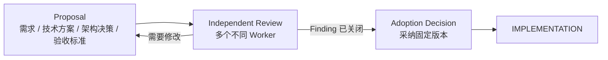
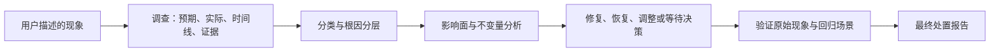
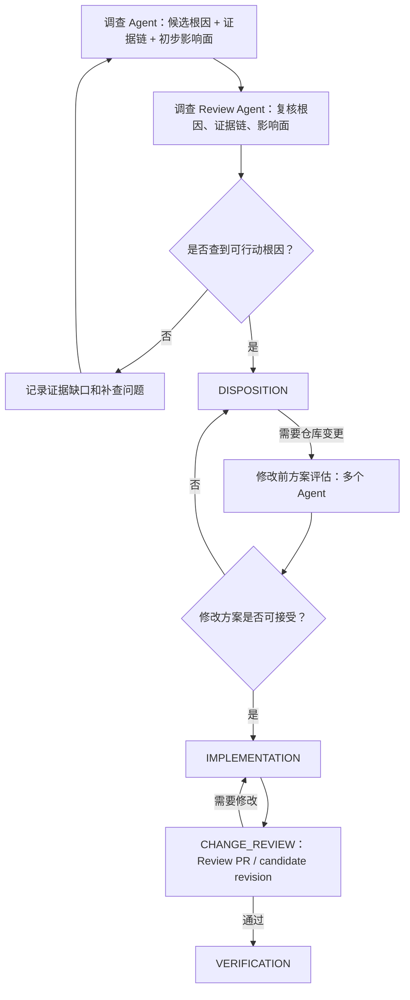

# Fix Extension 产品规范

- 状态：`DECIDED`
- 层级：第一层（L1 Extension）
- 入口：`/fix <现象或问题描述>`
- 上游：[Core 产品定义](../领域术语.md)

## 目标与入口

`fix` 是处理已有系统中观察到的现象、异常或维护问题的统一工作流。用户通过 `/fix <现象或问题描述>` 启动；用户不需要先判断它是否为 Bug、配置问题、数据问题或需求问题。

Fix 的目标是完成可验证的处置，而不是尽快让表面报错消失。一次 Run 必须形成：问题确认、根因分层、按时间闭合的因果证据链、影响面分析、处置结果、原始现象验证、回归/兼容性验证和面向用户的最终处置报告。

Fix 遵循 [Core 产品定义](../领域术语.md)：Fix Extension 拥有 `/fix` 命令和 Fix Workflow Definition；调查方法由 Skill 和 Project Knowledge 提供，Core Runtime 不拥有 Fix 的具体流程与业务验收标准。

## Stage 与允许路径

Fix Workflow Definition 应支持以下产品阶段语义；具体状态 ID、Transition 配置和实现属于 L2。Stage 内的独立 Agent 工作以 Node 表示，不为每个 Review 额外创建 Stage。



`TRIAGE` 不作为独立 Stage。初步紧急度和范围在 `INTAKE` 记录；可复现性、调查方向和影响面在 `INVESTIGATION` 中形成证据。

| Stage | 产品目的 | 典型 Artifact |
| --- | --- | --- |
| `INTAKE` | 记录现象、环境、范围、最小事实和初步紧急度 | intake record |
| `INVESTIGATION` | 建立预期—实际—原因—影响的证据链，并接受独立复核 | investigation artifact、investigation review |
| `DISPOSITION` | 决定修复、缓解、解释、外部处置或等待决策 | disposition decision |
| `IMPLEMENTATION` | 形成绑定基准与候选版本的处置 | implementation artifact |
| `CHANGE_REVIEW` | 对固定候选版本进行 Review | findings、dispositions |
| `VERIFICATION` | 验证原始现象、根因切断和回归边界 | verification artifact |
| `BLOCKED` | 缺少必要证据、权限、外部行动或用户决定 | blocker record |
| `ACCEPTED` | 整体满足 Fix Acceptance Definition | acceptance result |

明确、局部且不改变正式方案的 Fix 可以减少调查、方案评估或 PR Review 的工作量，但不能省略对应 Review 门禁：



`DISPOSITION` 必须形成结构化决定，说明处置类型、最小范围、风险、验证目标，以及是否触发 `CHANGE_PLAN_REVIEW`。

无法复现不自动等于 `BLOCKED` 或“无需修改”：如果代码、日志、数据或运行事实足以形成可验证结论，可以继续调查；证据不足以归因时必须记录缺口并收集证据或进入 `BLOCKED`。

如果 Fix 产生或改变正式需求、技术方案、架构决策或验收标准，`CHANGE_PLAN_REVIEW` 必须升级为 Core 要求的正式方案流程：



该规则来自 Core 的跨入口评审，不因 Fix 入口而豁免。

## 处置模型



调查产生的 `route` 是内部分类，不是用户入口。只有 `INVESTIGATION_REVIEW` 通过后，`route` 才能作为处置决定的输入。每个分类使用相同的 Runtime 控制面（Artifact、Guard、checkpoint、恢复、trace 和审计），但处置和验收标准不同：

| 分类 | 典型处置 | 不能省略的验收 |
| --- | --- | --- |
| `implementation_defect` / `regression` | 修复代码或受版本控制的配置 | 根因链被切断，原始场景与受影响既有场景通过 |
| `configuration_issue` | 修正配置或配置发布流程 | 配置生效证据、原始场景与兼容约束通过 |
| `data_or_environment` / `external_dependency` | 恢复、修正、升级、降级或请求外部处置 | 处置后的实际状态与外部边界证据 |
| `expected_behavior` | 说明依据，不修改 | 预期、实际和用户现象之间的解释证据 |
| `change_request` | 先进入需求/方案决策，再实施 | 已采纳的契约、实现与验收证据 |
| `insufficient_evidence` | 收集证据或 `BLOCKED` | 明确缺少什么、为何无法归因、下一步由谁提供 |

## 根因与因果证据要求

Fix 不得将直接故障点当作最终根因。对每个已发现原因，Worker 必须继续证明“为什么该原因能够发生且未被阻止”。例如空值访问是直接故障点；遗漏状态初始化是代码原因；缺少登录完成状态不变量与全入口测试，可能才是设计/系统原因。

调查在达到**最深的可行动根因**时停止，而非无限追问。停止必须满足至少一项：消除该原因能切断当前因果链；它解释了为何校验、测试或流程未阻止问题；继续追溯只会得到不可验证的历史动机；或已到达当前系统无法控制的外部边界。最后两种情况必须明确记录边界、证据和所需外部行动。

根因 Artifact 至少包含以下分层及时间线：

| 层级 | 必须回答的问题 |
| --- | --- |
| 用户现象 | 用户实际看到了什么，影响是什么？ |
| 直接故障点 | 哪个异常、错误数据或错误状态直接造成现象？ |
| 代码/配置/数据原因 | 为什么系统会到达这个故障点？ |
| 设计/系统原因 | 为什么该原因能存在且没有被不变量、校验、测试或流程阻止？ |
| 外部边界（如有） | 哪个必要条件不受当前系统控制，谁能处理？ |

每一个根因结论标注为 `已确认`、`高可能` 或 `待验证`。只有因果链闭合，且能以复现、代码路径、日志/trace、数据/配置事实或修复后对照证明时，才可标为 `已确认`。

## 影响面与安全修复

任何处置前必须从触发输入到修改点，再到下游消费者、相邻入口和外部依赖分析影响面。修复不得只令当前错误消失；必须识别可能连带改变的既有行为和关键不变量，例如权限边界、旧参数兼容、幂等性、状态恢复、失败降级和相邻登录/调用入口。

处置 Artifact 必须说明最小必要修改范围；如需扩大范围，说明扩大原因。验证 Artifact 必须分别证明：原始现象不再发生；已识别的受影响场景仍符合既有契约；未覆盖的关键边界及其原因。没有影响面分析和回归证据，不能将 Run 标记为 `已解决`。

## 最终处置报告

Controller 根据已校验 Artifact 生成最终报告；不得把 Worker 的自由文本总结直接当作报告事实。报告使用以下固定结构。没有事实的字段写“无”或“尚未确认”，不得省略或以泛化措辞掩盖。

```md
# Fix 处置结果

## 结论

- 状态：已解决 / 已缓解 / 未解决 / 无需修改 / 等待确认 / 已阻塞
- 问题类型：实现缺陷或回归 / 配置问题 / 数据、环境或外部依赖问题 / 需求变更 / 当前行为符合预期 / 证据不足
- 根因状态：已确认 / 高可能 / 待验证
- 一句话结论：<现象、最深可行动根因与最终处置>

## 现象与问题确认

- 用户报告的现象：<简洁重述>
- 预期行为及依据：<需求、契约、历史行为、测试或用户确认>
- 实际行为：<已观察到的结果>
- 确认结果：已复现 / 有间接证据 / 未能确认
- 影响范围：<用户、功能、模块、接口、环境或版本>

## 根因分层与因果证据链

- 最终根因：<最深可行动原因；未确认时明确说明>
- 停止调查的理由：<为什么已到可行动根因或外部边界>
- 时间范围与时区：<最早已知事件> 至 <最后确认事件>；<时区和事件/日志时间说明>

| 时间 | 事件与状态变化 | 原因层级 | 证据与来源 | 对因果链的证明作用 |
| --- | --- | --- | --- | --- |
| <T0> | <前置条件> | 前提 | <日志、请求、快照、代码或测试定位> | <为什么该路径会被触发> |
| <T1> | <触发事件> | 代码/配置/数据原因 | <来源> | <问题从何开始> |
| <T2> | <状态或调用传导> | 直接故障点 | <来源> | <如何到达故障点> |
| <T3> | <用户可见现象> | 用户现象 | <来源> | <为何形成报告现象> |
| <T4> | <修复后的同一路径对照> | 根因验证 | <来源> | <为何证明链路被切断> |

- 因果链摘要：<T0 前提下，T1 导致 T2，最终在 T3 表现为现象；T4 如何改变结果。>
- 已排除的候选原因：<候选及排除证据；没有则写“无”>
- 证据缺口与未验证假设：<没有则写“无”>

## 影响面与已采取的处置

- 修复触及的链路：<上游输入 → 修改点 → 下游消费者/外部依赖>
- 可能连带影响的既有场景：<场景、为什么可能受影响、对应不变量>
- 未覆盖的影响面：<没有则写“无”>
- 处置：<代码、配置、数据、环境或决策动作；未修改时说明原因>
- 相关文件/对象：<路径、配置、服务、数据对象或外部工单>
- 处置范围：<为何为最小必要范围；扩大时说明原因>

## 验证结果

- 原始问题验证：<复现步骤或测试及结果>
- 回归与兼容性验证：<逐项列出受影响场景/不变量、验证方式及结果>
- 已执行命令或检查：<命令、环境和结果>
- 验证结论：<哪些事实已被证明，哪些尚未完成>

## 风险与后续

- 剩余风险：<没有则写“无”>
- 需要你决定或协助：<没有则写“无”>
```

`已解决` 仅在最终根因已确认、处置切断因果链、原始现象已验证消失、关键影响面和不变量已回归验证，或未覆盖范围已明确披露且不影响接受决定时成立。只修补表面故障点可标为 `已缓解`，不得声称完整解决。

## Transition Guard 与 Acceptance Definition



关键 Guard 至少保证：

- `INVESTIGATION_REVIEW` 必须确认根因证据链是否闭合、是否已经到达可行动根因或明确外部边界，以及影响面是否足够支持处置；
- 调查 Reviewer 必须是独立 Worker，不能复核自己产生的调查 Artifact；复核不通过时必须带可执行补查问题并回到 `INVESTIGATION`；
- 进入 `DISPOSITION` 前必须存在通过的调查复核；
- 需要仓库变更时，必须先通过 `CHANGE_PLAN_REVIEW`；方案评估至少覆盖根因对应关系、修改范围、风险、兼容性、验证和回滚；
- 如果修改方案改变正式需求、技术方案、架构决策或验收标准，必须完成 Core 的 Proposal、Independent Review 和 Adoption Decision；
- `CHANGE_REVIEW` 必须绑定同一个最终 candidate revision / PR diff，且 Reviewer 不能是该候选版本的实现者；
- 所有路径都经过 `DISPOSITION`，并明确处置类型、最小范围、风险以及是否触发正式方案评审；
- 只有实际产生仓库候选变更时，Implementation、Change Review 和 Verification 才必须绑定同一个最终候选版本；
- 无仓库变更的解释、数据、环境或外部处置可以从 `DISPOSITION` 进入 Verification，但必须绑定基准版本、处置对象/环境版本和验证证据；
- 必需 Finding 未正式关闭时不得接受；
- 原始现象、已识别影响面和关键不变量没有验证证据时不得标记为 `已解决`；
- 外部依赖、权限或用户决定缺失时进入等待或 `BLOCKED`，不能把阻塞当作通过。

进入 `ACCEPTED` 前，Acceptance Definition 必须综合检查问题确认、调查复核、最深可行动根因或明确外部边界、影响面、最终处置、适用的方案评估、候选/处置对象版本、Review Finding、原始现象验证、回归/兼容性验证、未验证项、剩余风险和必要用户决定。只有实际产生候选变更时才强制 `CHANGE_PLAN_REVIEW` 和 `CHANGE_REVIEW`。Run 处置报告是这些已接受 Artifact 的投影，不是 Worker 自由文本的替代验收。

报告可以在等待或 `BLOCKED` 时生成阶段性版本，但不能称为 Acceptance Result。状态映射如下：

| Run 状态 | 报告可用结论 |
| --- | --- |
| `ACCEPTED` | 已解决、已缓解、无需修改，或经明确接受决定的有限未解决结果 |
| 等待用户/外部动作 | 等待确认 |
| `BLOCKED` | 已阻塞或未解决；报告可交付，但不代表通过 |

## 非目标与 L2 交接

本规范不定义模型名称、Policy 合并优先级、具体工具/Skill 列表、状态枚举代码、Guard 表达式、Artifact JSON Schema、Worker 创建方式、存储接口或测试实现。这些属于 L2 的可执行 Fix Workflow Definition 和源码。

Fix 复用 Core 的 Artifact、隔离、正式方案评审、Finding/Disposition、Arbiter 与 Audit 规则；本文件只补充问题处置特有的产品要求。
