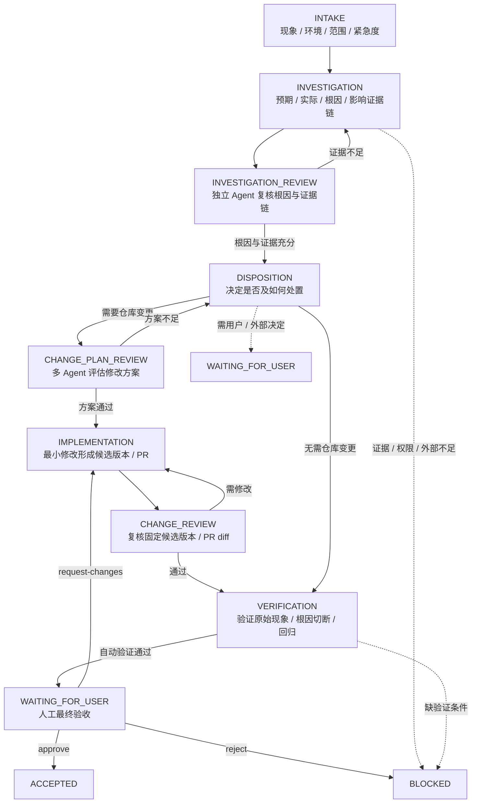

# Fix Extension 产品规范

- 状态：`DECIDED`
- 层级：第一层（L1 Extension）
- 入口：`/fix <现象或问题描述>`
- 上游：[Core 产品定义](../领域术语.md)

## 结论先行

| 问题 | 回答 |
| --- | --- |
| Fix 是什么 | 处理已有系统现象、异常或维护问题的统一工作流 |
| 怎么用 | `/fix <现象描述>`；用户不必先判断是 Bug / 配置 / 数据 / 需求问题 |
| 目标 | 完成**可验证的处置**，不是让表面报错消失 |
| 三项保证 | ① 根因有因果证据（不修表面）② 处置有影响面与回归验证（不引入回归）③ 人工最终验收（不自动接受） |

一次 Run 必须形成：问题确认 → 根因分层 → 按时间闭合的因果证据链 → 影响面分析 → 处置结果 → 原始现象验证 → 回归/兼容验证 → 面向用户的最终处置报告。

Fix 拥有 `/fix` 命令和 Fix Workflow Definition；调查方法由 Skill 与 Project Knowledge 提供，Core Runtime 不拥有 Fix 的具体流程与业务验收标准。

## 流程与门禁

### 流程总览



### Stage 职责

| Stage | 产品目的 | 典型 Artifact |
| --- | --- | --- |
| `INTAKE` | 记录现象、环境、范围、最小事实、初步紧急度 | intake record |
| `INVESTIGATION` | 建立预期—实际—原因—影响证据链并接受独立复核 | investigation artifact、review |
| `DISPOSITION` | 决定修复 / 缓解 / 解释 / 外部处置或等待决策 | disposition decision |
| `IMPLEMENTATION` | 形成绑定基准与候选版本的处置 | implementation artifact |
| `CHANGE_REVIEW` | 对固定候选版本 Review | findings、dispositions |
| `VERIFICATION` | 验证原始现象、根因切断、回归边界 | verification artifact |
| `WAITING_FOR_USER` | 请求用户最终接受 / 退回修改 / 拒绝 | user decision |
| `BLOCKED` | 缺证据、权限、外部行动或用户决定 | blocker record |
| `ACCEPTED` | 整体满足 Acceptance Definition | acceptance result |

`TRIAGE` 不作为独立 Stage；Stage 内的独立 Agent 工作以 Node 表示，不为每个 Review 额外建 Stage。明确、局部且不改变正式方案的 Fix 可以减少工作量，但不能省略对应 Review 门禁。

### 不可绕过的门禁

| 阶段 / 动作 | 不可绕过 |
| --- | --- |
| `INVESTIGATION_REVIEW` | 根因证据链闭合、到达可行动根因或明确外部边界、影响面足够 |
| 调查 Reviewer | 独立 Worker，不复核自己的 Artifact；不通过带可执行补查问题回 `INVESTIGATION` |
| 进入 `DISPOSITION` | 必须先有通过的调查复核；所有路径必经；明确处置类型、最小范围、风险、是否触发方案评审 |
| 需要仓库变更 | 先过 `CHANGE_PLAN_REVIEW`（评估根因对应 / 范围 / 风险 / 兼容 / 验证 / 回滚） |
| 改变正式需求 / 方案 / 架构 / 验收 | 升级为 Core 的 Proposal + Independent Review + Adoption Decision（第一版以保守阻塞兜底，见「第一版范围」） |
| `CHANGE_REVIEW` | 绑定同一 candidate revision / PR diff；Reviewer 不能是该候选版本的实现者 |
| `VERIFICATION` | 自动通过后必须进入 `WAITING_FOR_USER`；无绑定当前版本的 User Decision Artifact 不能进入 `ACCEPTED` |
| 无仓库变更 | 解释 / 数据 / 环境 / 外部处置必须记录验证证据；合并、部署、配置生效、外部处置检查由 Project Knowledge / Skill 提供 |
| 版本绑定 | 仅产生候选变更时，Implementation / Change Review / Verification 绑定同一候选版本；新版本使旧版本的 Review、Verification、人工决定自动失效 |

通用不变量：必需 Finding 未正式关闭不得接受；原始现象、影响面、关键不变量无验证证据不得标记 `已解决`；外部依赖、权限或用户决定缺失时进入等待或 `BLOCKED`，不把阻塞当通过。

## 调查与处置

### 根因与证据

不得把直接故障点当作最终根因；必须继续证明“为什么该原因能发生且未被阻止”。调查在**最深的可行动根因**停止（不是无限追问），停止需满足至少一项：消除该原因能切断当前因果链；它解释了为何校验 / 测试 / 流程未阻止问题；继续追溯只剩不可验证的历史动机；或已到达当前系统无法控制的外部边界（需记录边界、证据与所需外部行动）。

| 层级 | 必须回答的问题 |
| --- | --- |
| 用户现象 | 用户实际看到了什么，影响是什么？ |
| 直接故障点 | 哪个异常、错误数据或错误状态直接造成现象？ |
| 代码 / 配置 / 数据原因 | 系统为什么到达这个故障点？ |
| 设计 / 系统原因 | 为什么该原因能存在且没被不变量、校验、测试、流程阻止？ |
| 外部边界（如有） | 哪个必要条件不受当前系统控制，谁能处理？ |

每个根因结论标注 `已确认` / `高可能` / `待验证`；只有因果链闭合且能以复现、代码路径、日志 / trace、数据 / 配置事实或修复后对照证明，才可标 `已确认`。

无法复现不自动等于 `BLOCKED` 或“无需修改”：若代码、日志、数据或运行事实足以形成可验证结论可继续调查；证据不足必须记录缺口并收集证据或进入 `BLOCKED`。

### 影响面与安全

处置前必须分析触发输入 → 修改点 → 下游消费者 / 相邻入口 / 外部依赖的影响面；不得只让当前错误消失，要识别可能连带改变的既有行为与关键不变量（权限边界、旧参数兼容、幂等性、状态恢复、失败降级、相邻入口）。处置 Artifact 说明最小必要范围；验证 Artifact 分别证明原始现象不再发生、受影响场景仍符合契约、未覆盖边界及其原因。没有影响面分析和回归证据，不能标 `已解决`。

### 问题分类（route）与处置

`route` 是调查产生的**内部分类**，不是用户入口；只有 `INVESTIGATION_REVIEW` 通过后，`route` 才能作为处置决定的输入。所有分类共用同一 Runtime 控制面（Artifact、Guard、checkpoint、恢复、trace、审计），但处置和验收标准不同：

| 分类 | 中文 | 典型处置 | 不能省略的验收 |
| --- | --- | --- | --- |
| `implementation_defect` / `regression` | 实现缺陷 / 回归 | 修复代码或受版本控制的配置 | 根因链被切断，原始场景与受影响既有场景通过 |
| `configuration_issue` | 配置问题 | 修正配置或配置发布流程 | 配置生效证据、原始场景与兼容约束通过 |
| `data_or_environment` | 数据 / 环境问题 | 恢复、修正、升级、降级或请求外部处置 | 处置后的实际状态与外部边界证据 |
| `external_dependency` | 外部依赖 | 恢复、修正、升级、降级或请求外部处置 | 处置后的实际状态与外部边界证据 |
| `expected_behavior` | 当前行为符合预期 | 说明依据，不修改 | 预期、实际和用户现象之间的解释证据 |
| `change_request` | 需求变更 | 先进入需求 / 方案决策，再实施 | 已采纳的契约、实现与验收证据 |
| `insufficient_evidence` | 证据不足 | 收集证据或 `BLOCKED` | 明确缺少什么、为何无法归因、下一步谁提供 |

分类（问题类型）与 `resolutionType`（处置执行方式）不是一一对应，映射见「指标与公开漏斗」。

## 交付与验收

### 最终处置报告

Controller 根据已校验 Artifact 生成最终报告，不把 Worker 自由文本总结直接当报告事实。第一版交付**摘要级报告**：固定结构、全部由已校验 Artifact 投影；没有事实的字段写“无”或“尚未确认”，不得省略或以泛化措辞掩盖。

```md
# Fix 处置结果

## 结论
- 状态：已解决 / 已缓解 / 未解决 / 无需修改 / 等待确认 / 已阻塞
- 处置类型：修复 / 缓解 / 解释 / 外部处置 / 等待或阻塞
- 未验证与剩余风险：<没有写“无”>

## 现象
<用户报告的现象摘要>

## 根因
<最终根因结论>

## 影响面
<影响证据与未覆盖影响面>

## 处置
<处置类型、是否需要仓库变更、最小修改范围、处置风险、验证目标>

## 修改
<修改摘要、相关文件、候选版本 / PR>

## 验证
<原始问题验证证据、回归证据、未验证项、剩余风险>

## 引用
<候选版本、处置结论、各 Review 结论>
```

完整模板为后续优化、第一版不要求：预期—实际—确认结果、T0–T4 因果时间线表、已排除候选原因、证据缺口、触及链路与连带场景、处置范围扩大原因、已执行命令、「需要你决定或协助」。这些字段需先扩展 `investigation` / `verification` / `disposition` 的 Artifact 合同（当前无对应字段），方案与评审见 [Fix 报告重构方案与评审](../../归档/评审/2026-08-29-fix-报告重构-方案与评审.md)。

`已解决` 仅在最终根因已确认、处置切断因果链、原始现象已验证消失、关键影响面和不变量已回归验证，或未覆盖范围已明确披露且不影响接受决定时成立。只修补表面故障点可标 `已缓解`，不得声称完整解决。

报告可在等待或 `BLOCKED` 时生成阶段性版本，但不能称为 Acceptance Result：

| Run 状态 | 报告可用结论 |
| --- | --- |
| `ACCEPTED` | 已解决、已缓解、无需修改，或经明确接受决定的有限未解决结果 |
| `WAITING_FOR_USER` | 等待用户最终验收、继续修改或拒绝；没有明确决定不能通过 |
| `BLOCKED` | 已阻塞或未解决；报告可交付，但不代表通过 |

### 人工验收（第一版）

Fix Extension 初始采用**全量人工 Review 和人工最终验收**：AI 可执行调查、方案、实现、Review、验证，但 AI 产出的 Review / Verification 只作结构化证据，没有人工对当前版本明确 `approve`，Run 不得 `ACCEPTED`。

第一阶段硬门槛：

| 门槛 | 要求 |
| --- | --- |
| 人工验收 | 100% `ACCEPTED` Run 有人工 Review 记录 + 绑定当前版本的 `approve` |
| 版本一致 | 100% 产生候选变更的 Run 满足实现 / Review / Verification / 人工决定的版本一致 |
| 严重错误接受 | provenance、required Finding、Acceptance Guard 的严重错误接受数 = 0 |
| 可追溯 | 每个 Run 能关联原始输入、AI Artifact、人工决定、candidate revision、验证证据、最终结果 |
| 结构化原因 | 人工 `request-changes` / `reject` 有结构化原因（重开 / 回滚 / 后验问题为后续版本） |
| 可重算 | 指标可按分子、分母、去重键、统计窗口、快照时间、数据来源重算 |

人工发现错误后的回流（不记笼统 `reject`）：

| 错误性质 | 回流目标 | 必须记录 |
| --- | --- | --- |
| 根因或影响面判断错误 | `INVESTIGATION` | 错误事实、缺失证据、补查问题 |
| 修复不完整或引入回归 | `IMPLEMENTATION` | 关联 Finding、失败场景、目标版本 |
| 需求 / 分类 / 处置方式错误 | `DISPOSITION` | 决策分歧、影响范围、重新确认依据 |
| 缺权限 / 外部动作 / 环境条件 | `BLOCKED` | 阻塞原因、责任方、解除条件 |

### 第一版范围

第一版以「主流程走通 + 全量人工验收」为范围：AI 错误场景由人工验收兜底，以下机制为后续版本，第一版不实现：

| 机制 | 第一版兜底方式 |
| --- | --- |
| Arbiter 争议裁决 | 争议升级给用户人工裁决 |
| 改变正式方案时的升级流程（Proposal → Independent Review → Adoption） | 保守阻塞：声明需要正式方案评审的处置一律 `BLOCKED`，不静默放行 |
| 验收后重开 / 回滚 / 后验收观察 | 人工发现问题后新建 Run 处理 |
| 最终处置报告完整模板 | 摘要级报告（见「最终处置报告」） |

架构契约不因分期放宽：Core Runtime 不拥有 Fix 业务语义；业务门禁与等待语义的 owner 对齐（归属 `packages/fix`）属于第一版范围，进度以 L2 drift 表为准。

## 指标与公开漏斗（第一版）

第一版运营漏斗只观察跨处置分支可统一比较的 5 个公共节点：

```text
run_started → investigation_review_passed → resolution_completed → verification_passed → run_accepted
```

| 事件 | 含义 |
| --- | --- |
| `run_started` | Run 启动，创建 `runId` |
| `investigation_review_passed` | 调查 Review 通过（根因、证据链、影响面） |
| `resolution_completed` | 处置执行完成，具备进入 `VERIFICATION` 的条件 |
| `verification_passed` | 验证通过（原始现象、根因切断、回归） |
| `run_accepted` | 人工 `approve` + Acceptance Definition 通过 + Runtime 迁移 `ACCEPTED` |

`resolution_completed` 只表示处置完成，不表示整个 Fix 完成。`implementation_created` 只属于代码 / 版本化配置分支，不是公共节点。已进入可执行处置的 `resolutionType` 是封闭枚举，每个 `resolutionCycle` 必须且只能选一个：

| `resolutionType` | 中文 |
| --- | --- |
| `code_change` | 修改代码资产并形成候选版本 |
| `versioned_config_change` | 修改受版本控制的配置、规则或策略并形成可追踪版本 |
| `runtime_or_data_action` | 修改数据、缓存、运行时或环境状态，或执行一次性恢复动作 |
| `external_dependency_action` | 由外部团队、系统、供应商或依赖方执行动作并确认结果 |
| `no_change_expected_behavior` | 确认当前行为符合预期，不修改，对照依据与实际行为 |

`insufficient_evidence`、等待用户决定、需求变更尚未采纳等未完成状态不属于 `resolutionType`，不产生 `resolution_completed`；它们作为处置 / 等待 / 阻塞原因单独记录，可在公开 Dashboard 展示，但不作主漏斗节点。

### route → resolutionType 映射

| route（分类） | 可能的 `resolutionType` |
| --- | --- |
| `implementation_defect` / `regression` | `code_change`（缺陷在版本化配置时也可能 `versioned_config_change`） |
| `configuration_issue` | `versioned_config_change` 或 `runtime_or_data_action` |
| `data_or_environment` | `runtime_or_data_action` |
| `external_dependency` | `external_dependency_action` |
| `expected_behavior` | `no_change_expected_behavior` |
| `change_request` | 先决策，采纳后落到上述五种之一 |
| `insufficient_evidence` | 不属于 `resolutionType` |

### 公开 Dashboard

只提供聚合结果、阶段状态、处置分支、流失 / 阻塞原因、数据新鲜度；不提供问题原文、Artifact 正文、模型输入输出、tool 参数、文件内容、`runId`、单个 Run 明细。公开查询遵守低样本保护：不足公开阈值显示“样本不足”，不通过总数与互补分组差值反推单个 Run。

## Pi Session 恢复

Fix 不注册自己的 `/resume`。Pi 原生 `/resume` 选择并恢复历史 session；用户选到之前处理该问题的 session 后，Fix 在该 session 内发现未完成 checkpoint，经用户确认后从 checkpoint 继续。不新建 `runId`、不从 `INTAKE` 重来、不跨 session 搜索。

## 非目标与 L2 交接

本规范不定义模型名称、Policy 合并优先级、工具 / Skill 列表、状态枚举代码、Guard 表达式、Artifact JSON Schema、Worker 创建方式、存储接口或测试实现（属 L2）。

Fix 复用 Core 的 Artifact、隔离、正式方案评审、Finding / Disposition、Arbiter 与 Audit 规则；本文件只补充问题处置特有的产品要求。

## 后续演进（已归档）

质量指标（流程 10 步 / 质量漏斗 / 自动化准入漏斗）、减少人工的建议门槛、完整结构化事件表已归档，第一版不实现；第一版只做 5 步公开漏斗，先把 `/fix → 事件 → Worker → D1 → 公开 API` 基建打通。最终处置报告完整模板同样暂缓为后续优化（第一版摘要级，见「最终处置报告」）。
