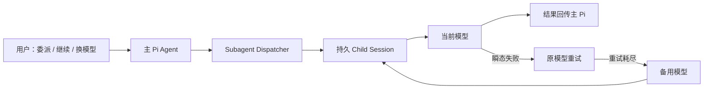
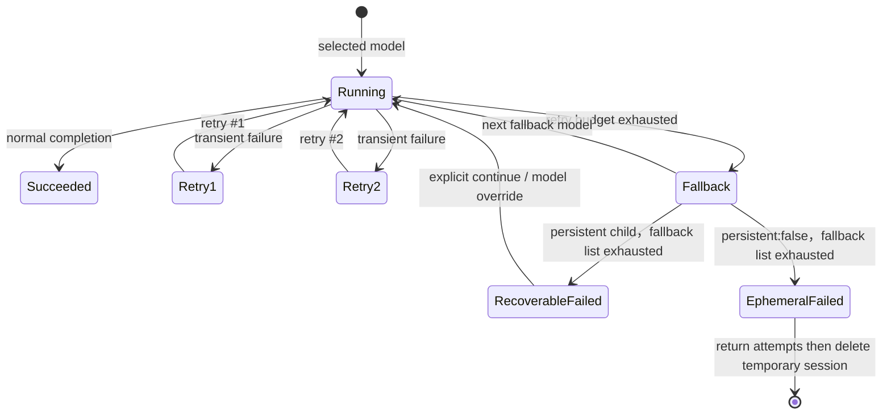

# Subagent Dispatcher Extension 产品规范

| 项目 | 定义 |
| --- | --- |
| 状态 | `IMPLEMENTING` — 方案、独立代码评审与 headless Pi/provider 创建+恢复 smoke 已完成；TUI、瞬态 retry/fallback 与 Fast child E2E 待验证。 |
| 评审记录 | [产品语义/指标 Review Artifact](../../归档/评审/2026-09-13-subagent-dispatcher-产品语义指标Review-Artifact.md)、[实现/运营 Review Artifact](../../归档/评审/2026-09-13-subagent-dispatcher-实现运营Review-Artifact.md) |
| 层级 | 第一层（L1 Extension） |
| 用户目标 | 委派专长子 Agent 时，默认保留其会话；模型瞬态失败后可在同一会话重试并切换备用模型，而非从头开始。 |
| 入口 | 主 Pi Agent 的 `subagent` 工具；用户以自然语言委派、继续或要求换模型，不要求记忆 child session ID。 |
| 上游 | [Core 产品定义](../领域术语.md)；不属于 Feature/Fix Workflow。 |

## 1. 目标与边界

Subagent Dispatcher 为主 Pi 对话提供通用的专长 Agent 委派能力：创建隔离 child session、收集结果、保留可恢复历史，并对模型的瞬态请求失败执行受控重试与备用模型切换。

本 Extension 不拥有 Feature/Fix 的 Stage、Artifact、Guard、Acceptance 或当前活跃 Workflow Worker 语义。受控 Workflow Node 的 Worker Session 仍由 `workflow-runtime` / `@pi/fix` 管理；二者不能因名称都被称作“subagent”而共用恢复、状态推进或权限模型。

## 2. 默认持久化与会话边界

所有 Subagent 调用默认创建持久 child session。持久化只保存 child 的 Pi 对话和运行元数据；不代表新任务会自动接入任意旧任务。

| 情形 | 行为 |
| --- | --- |
| 新委派，未给 session 句柄 | 生成新的持久 logical session handle，保存 child 会话，并在结果详情中返回该句柄。 |
| 同一任务继续或重试 | 主 Agent 使用原 handle 恢复同一 child session。 |
| 明确 `persistent: false` | 本次 tool call 内建立临时 child session 以承载 retry/fallback；结束后删除，不能跨调用恢复。 |
| agent 默认配置为 `persistent: false` | 该 agent 的新调用默认一次性；单次调用仍可显式设为 `persistent: true`。 |
| 不同父 Pi session、cwd 或 agent | 必须隔离为不同 child session，不能按同名 handle 串接。 |

持久化优先级为：单次调用 `persistent` > agent frontmatter `persistent` > Extension 全局 `defaultPersistent: true`。

child session 在 settled、failed 和未完成状态下默认保留 30 天；到期清理由本地受控状态 GC 执行。session、诊断、模型尝试记录均属第五层本地状态，不进入 Git 历史。

## 3. 瞬态失败、重试与模型切换

每个模型最多一次初始请求与两次额外重试。仅瞬态错误进入重试；不会以“重试”为名重复代码测试、工具执行失败或需求决策。

| 分类 | 例子 | 行为 |
| --- | --- | --- |
| 瞬态模型请求失败 | **仅** `fetch failed`、`ECONNRESET`、`ECONNREFUSED`、`ETIMEDOUT`、明确 timeout，或 HTTP 429/502/503/504 | 同模型额外重试最多 2 次；仍失败后按候选顺序切模型。其他和无法判定的错误一律不重试、不切模型。 |
| 非瞬态模型错误 | 模型不存在、认证失败、明确不可用 | 不重试、不切备用模型；持久 child 保留供用户明确继续，临时 child 返回诊断后删除。 |
| 任务/工具/验证失败 | 测试失败、命令 exit non-zero、缺文件、产物无效 | 不自动换模型或重试；持久 child 保留任务事实，临时 child 返回任务事实后删除。 |
| 用户中止 | cancel / abort | 立即停止、不自动重试；仅持久 child 保留供用户明确继续，临时 child 删除。 |

备用模型来自 agent frontmatter 的 `fallback-models`；单次调用可显式指定 `model` 覆盖本轮首选模型。用户要求“换模型”时，主 Agent 必须在恢复同一 handle 的下一次模型调用前明确记录选择的模型；不得静默改写主 Pi 默认模型、其他 child、后续新任务的默认模型或工具权限。

## 4. 可见反馈与恢复

默认视图以任务语言显示进度，避免要求用户理解内部 session ID；展开详情必须能看到可复核事实。

| 时点 | 默认反馈 | 详情必须包含 |
| --- | --- | --- |
| 创建 | “已启动 implementer” | logical handle、实际 agent、安全工作区 scope（分类/短哈希）、首选模型、持久化模式。 |
| 同模型重试 | “连接暂时失败，正在重试（1/2）” | 已分类错误、当前模型、已使用 retry 数。 |
| 切备用模型 | “当前模型持续不可用，正切换备用模型” | 原模型、目标模型、切换原因、候选序号。 |
| 持久 child 候选耗尽 | “任务暂停，可继续或换模型” | handle、尝试过的模型、每个终止原因、可恢复状态。 |
| 临时 child 候选耗尽 | “任务未完成，已返回尝试诊断” | 尝试过的模型与每个终止原因；删除临时 session，不展示 handle 或继续入口。 |
| 继续 | “正在恢复上次 implementer 工作” | 恢复的 handle、实际模型、工作树变更提示。 |

同一持久 child session 同时只允许一个运行调用。锁冲突、stale lock 或工作目录/agent 身份不匹配时必须 fail closed，不得把新 prompt 送入未知的历史任务。

## 5. 兼容与隐私边界

- `persistent: false` 保留现有一次性并行检查、探索和评审的使用方式。
- child 继续不会复制父 Pi 全部对话；新 child 默认仅收到委派 prompt。只有明确指定的首次 parent snapshot 才可复制，且必须在详情中可见。
- Fast 继承继续遵循 [Codex Usage Status + Fast 规范](codex-usage-status-扩展.md#21-parent-fast-继承例外)：只有**新 logical child 的首次 spawn**且既有的精确 user-source / agent / frontmatter 条件命中时，才可传递一次性 advisory Fast intent；同一 child 的 retry、fallback 和 resume 必须清除且不重新注入 Fast。
- Extension 必须对错误文本、Cookie/Set-Cookie、headers、token、原始 provider body、嵌套诊断和本地路径做严格结构化投影；日志、metadata、Tool details 与 UI 只能展示可归类错误、哈希引用、安全工作区 scope 和必要的脱敏 tool result。完整 task/prompt 不得进入这些输出边界。

## 6. Acceptance Definition

本 Extension 在进入 `DECIDED` / 实现前，至少应有以下可验证验收标准：

| 编号 | 场景 | 通过条件 |
| --- | --- | --- |
| S1 | 默认新委派 | 每个新 subagent 获得可恢复 child session；结果可返回稳定 handle。 |
| S2 | 显式临时调用 | `persistent: false` 在调用内仍遵循初始+2 retry/fallback 预算并保留临时上下文；调用结束后不可恢复，且不影响其他持久任务。 |
| S3 | 闭集瞬态错误 | 仅 allowlist 中每一错误可让同一 child session 在首轮外重试最多两次；每个非 allowlist 正反例均不重试、不 fallback。 |
| S4 | 两次重试后仍失败 | 切换到 frontmatter 的下一备用模型；模型尝试顺序完整可见。 |
| S5 | 持久 child 候选耗尽 | `persistent !== false` 时返回 recoverable failed；同一 handle 可继续，历史和文件改动不丢失。`persistent:false` 时返回同等尝试诊断，但临时 session 删除、不可继续。 |
| S6 | 非瞬态任务失败 | 不自动模型切换；将测试/工具/契约错误原样归类为任务失败。 |
| S7 | session 隔离与并发 | parent session、cwd、agent 或 handle 任一不同不串话；同一 session 的并发调用被拒绝。 |
| S8 | Fast / 安全回归 | 仅新 logical child 首次 spawn 可满足 Fast 精确继承条件；retry/fallback/resume 一律 Off，错误与本地 session 中不持久化敏感认证材料。 |
| S9 | 组合门禁 | `persistent:false × retry/fallback` 的结束即删除、持久 child 的候选耗尽与非瞬态/task/cancel 后继续、identity 首次创建竞态、GC/resume 竞态与 Fast 负向路径均有证据；session 串写、超预算 retry/fallback、Fast 越界次数均为 0。 |

## 7. L2 交接

本规范不定义 Pi CLI/RPC 参数、child session 文件路径、锁文件格式、错误正则、退避时长、JSON schema、前端渲染组件、GC 实现或测试代码。这些属于 [Subagent Dispatcher 技术设计](../../02-产品实现/subagent-dispatcher-技术设计.md)。

本 Extension 是通用 child dispatcher，不创建 Workflow Run、Node、Artifact 或 Worker；Core 中用于 Workflow Artifact 独立性的 `workerId` 不适用于此处。方案已由独立 `product_aligner` / `code_reviewer` 两轴评审，代码由 `implementer` 实现后再经独立 `code_reviewer` 复审。评审过程记录见[评审 Artifact](../../归档/评审/2026-09-13-subagent-dispatcher-产品语义指标Review-Artifact.md)与[实现/运营 Review Artifact](../../归档/评审/2026-09-13-subagent-dispatcher-实现运营Review-Artifact.md)。headless Pi/provider 已验证默认持久 child 创建与同 handle 恢复；瞬态 retry/fallback、Fast child、长时 TUI、PTY picker 和进程级崩溃恢复仍由 L2 明确记录为未验证。
