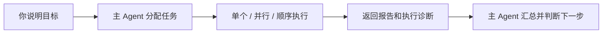

# Subagent：把任务交给专门的 Agent

| 核心问题 | 结论 |
| --- | --- |
| 它是什么 | 主 Agent 的委派工具：把一件事交给另一个 Agent，拿回报告后继续与你协作。 |
| 现在能做什么 | 单个任务、多个任务并行、按顺序接力；保留子会话供明确继续；模型临时故障时有限重试和切换备用模型。 |
| 现在不能依赖什么 | 中断后自动续跑、独立取消/查询/删除入口等增强能力尚未对用户启用。 |
| 最重要的保证 | **“Agent 已返回报告”不等于“任务验收通过”。** 不因为工具报错就把业务结论改成失败或盲目重跑。 |
| 文档边界 | 本文拥有产品规则；[技术设计](../../02-产品实现/subagent-dispatcher-技术设计.md)说明实现、协议和验证缺口。已采纳的目标不等于当前可用。 |

## 1. 怎么使用

你向主 Agent 说明任务和分工，由它调用 `subagent` 工具。它不是 `/fix` 工作流，也不自动执行需求评审、验收或合并。

| 方式 | 可以怎样向主 Agent 表达 | 执行方式 |
| --- | --- | --- |
| 单个任务 | “让 implementer 调查这个问题，返回原因和建议。” | 一个 Agent 完成一个任务并返回报告。 |
| 并行处理 | “让两个 Agent 分别检查前端和后端。” | 独立执行，结果按提交顺序汇总，而不是按完成顺序排列。 |
| 顺序接力 | “先调查，再让另一个 Agent 根据调查报告复核。” | 后一步接收前一步的报告和执行诊断。执行未正常返回时停止接力。 |
| 继续已有任务 | “用上次返回的会话标识，继续这个任务。” | 在同一主会话、工作目录和 Agent 范围内，明确指定已有子会话继续。 |

Agent 名称必须来自已配置的角色；示例中的名称不是内置角色承诺。当前不要依赖角色别名自动纠正。

```mermaid
flowchart LR
  U[你说明目标] --> M[主 Agent 分配任务]
  M --> S[单个 / 并行 / 顺序执行]
  S --> R[返回报告和执行诊断]
  R --> A[主 Agent 汇总并判断下一步]
```

子 Agent 默认拥有自己的会话，不自动复制主 Agent 的完整对话。主 Agent 需要在任务中提供必要背景。

## 2. 当前可用范围

| 能力 | 当前行为与限制 |
| --- | --- |
| 保留会话 | 默认保留子会话；结果提供会话标识，后续可明确指定它继续。新的主会话不会自动接管旧任务。 |
| 临时会话 | 当前 `persistent:false` 在调用结束后清理临时子会话，不提供跨调用继续入口；不能同时指定已有会话标识。 |
| 模型重试 | 仅网络连接错误、明确超时和 HTTP 429/502/503/504 等限定临时故障可重试；每个候选模型首次请求后最多再试 2 次，再按配置顺序尝试备用模型。 |
| 配置错误 | 认证失败、模型不存在或请求配置错误直接停止，不靠重试或切换模型掩盖问题。 |
| 会话冲突 | 同一子会话不能被两个执行者同时写入；遇到占用返回“会话忙”。历史损坏时拒绝继续，不偷偷新建空历史。 |
| 本地保留 | 默认 30 天；具体清理条件、占用保护与损坏会话处理见技术设计。 |
| Fast | 仅符合条件的新子会话首次启动可继承；重试、备用模型和继续已有会话不再次继承。条件见 [Fast 产品规范](codex-usage-status-扩展.md#23-parent-fast-继承例外)。 |

当前只有基础委派路径对外接线。自动恢复等增强能力虽已有部分内部实现和测试，**仍未启用，也不能声称生产就绪**。真实交互、进程崩溃恢复及迁移验证的缺口见 [L2 当前事实与 drift](../../02-产品实现/subagent-dispatcher-技术设计.md#912-当前源码事实与-drift)。

## 3. 怎样理解返回结果

| 看到的结果 | 含义 | 不代表什么 |
| --- | --- | --- |
| 执行中 | 还在工作，只展示进度。 | 不能根据暂存错误显示终局失败。 |
| 已返回 | Agent 正常交回报告。报告可能说“测试失败”或“问题未解决”。 | 不代表任务完成、代码正确或验收通过。 |
| 未完整返回 | 输出被长度限制截断，保留已收到的报告。 | 不自动当作网络故障重试。 |
| 执行异常 | 进程、协议或模型请求没有正常结束。 | 不能用旧报告冒充本次完成。 |
| 工具异常 / 模型异常次数 | 本次执行的诊断信息，帮助定位问题。 | 次数不是业务成败指标；历史缺失显示“未提供”，不是 0。 |

各入口统一附加：`[执行诊断：不代表验收结论；工具异常 N；模型异常 M]`。N/M 是非负安全整数或“未提供”。新执行必须给出两个计数；详情截断不能截掉计数。

单个任务保留报告与诊断；顺序接力把两者一并传给下一步，即使任务模板没有显式插入上一步结果；并行逐项保留报告、执行分类和诊断，汇总为“已返回 N/M”，不写“验收通过 N/M”。工具报错本身不触发模型重试，也不自动中止正常返回报告的接力。

## 4. 已采纳但尚未启用的能力

**以下是产品目标，不是当前使用说明。** 内部模块存在不意味着这些工具、命令、UI 或 RPC 已可用。

| 目标能力 | 用户应获得的体验 |
| --- | --- |
| 自动续跑 | 已受理任务遇到可安全恢复的中断时，继续剩余工作，不要求用户记住子进程或子会话身份。 |
| 角色别名 | 可使用角色定义明确声明的别名；不存在或有歧义时暂停并说明原因，不猜测角色。 |
| 安全取消 | 运行期间可直接请求取消，不必等待模型下一次调用；区分“已收到请求”和“已取消”。 |
| 状态查询 | 按任务、整批调用或通知标识查询结果、暂停原因和通知状态，不因查询而启动、取消、删除任务或发送通知。 |
| 恢复通知 | 原调用中断后，通过新消息通知恢复结果或取消结果；通知不确定时仍能查询结果。 |
| 主动删除 | 有权限且执行、外部动作、结果投递均已安全结算后，删除本地记录；未满足条件时明确拒绝。 |

对应目标接口名为 `subagent_cancel`、`subagent_status`、`subagent_delivery`、`subagent_delete`；当前不应作为可用入口调用。以下第 5–7 节规定这些目标必须满足的产品保证。

## 5. 自动续跑必须守住什么

| 场景 | 必须保证 |
| --- | --- |
| 接受任务 | 输入合法后，先可靠记录任务，再查找角色和启动执行；并行中内容相同的两个任务仍相互独立。 |
| 查找角色 | 先检查所有候选的可信来源和路径，再允许合法项目角色覆盖同名用户角色；不能借覆盖隐藏非法候选。仅精确、唯一匹配可执行。任务工作目录不能扩大角色发现权限。 |
| 角色配置变化 | 保留任务身份；同一名称、来源和文件位置的配置修复须记录并重新校验。不得静默改投另一角色或来源。无新修复事实时不循环重试。 |
| 恢复范围 | 只恢复原主会话的同一对话分支。切换到共享历史的另一分支也不能接管或收到通知。主会话未持久保存时，只承诺当前进程内恢复，并明确提示。 |
| 恢复次数 | 首次执行最多一次；另有最多 3 轮恢复，合计最多 4 次逻辑子执行。继续连接仍存活的执行者不算新一轮；修配置或人工确认不能重置预算。每轮每模型仍只有首次请求加最多 2 次临时故障重试。 |
| 避免重复执行 | 启动时先核对记录；仍存活且身份匹配的执行者只重新连接，不重复启动。旧执行已开始又死亡时，新执行必须消耗下一轮恢复预算；只做剩余工作。 |
| 接管执行者 | 不能仅凭超时、一次进程探测或终止请求回执认为旧执行已结束。启动过的任务须确认旧执行者退出并核对外部动作；从未启动的任务不需要虚构子进程死亡。身份无法证明时暂停，绝不误杀被复用进程号对应的新进程。 |
| 已返回、取消、暂停或删除 | 不进入普通自动恢复；尚待投递的通知与执行分开处理，不能为了发通知重跑任务。 |
| 配置错误 | 暂停等待修复，不消耗恢复轮次，也不要求先耗尽所有备用模型。 |
| 外部动作结果不明 | 发布、生产写入、发消息等可能已发生时暂停，不盲目重做。判断依据必须是可核对的动作记录或明确策略，不能只看任务关键词或 Agent 自述。 |

外部动作不确定时，人工可确认“已成功”“未开始”“失败且可安全重试”，也可保持“仍未知”或请求取消。已成功的动作不能重做；确认本身不增加恢复轮次，但需要新执行者时仍消耗预算。外部系统支持幂等标识时，同一动作必须复用稳定标识；动作无法分类时保守暂停。

## 6. 取消、组合任务和通知

| 场景 | 必须保证 |
| --- | --- |
| 谁能控制 | 只有属于原主会话、当前同一对话分支且通过认证的调用者能取消、放弃通知或删除。知道任务标识不等于有权限。 |
| 请求取消 | 各入口使用同一控制规则，可靠记录后才返回请求回执；重复请求返回同一事实。请求生效后不再开始新解析、执行或外部动作。 |
| 完成取消 | 尚未启动且没有遗留动作时可直接完成；已经启动则必须确认相关执行已结束、外部动作已核对。配置暂停也要检查完整执行历史，不能只看当前状态。未确认时继续暂停，不提前说“已取消”。 |
| 意外中断 | 关闭主会话、重载、超时、进程信号或无法归因的停止，不等于用户明确取消。 |
| 取消并行中的一项 | 只取消该项，其余继续；最终按原顺序展示每项结果和取消状态。 |
| 取消整批并行任务 | 不再接收新项；保留取消前已返回的结果，安全取消已开始的项，将未开始的项记为未执行。全部结算后整批为“已取消”，不能称部分成功。 |
| 取消顺序接力 | 当前步骤安全取消后，不再开始后续步骤；已有报告不能让整条接力被误判为成功。正常情况下只有前一步明确返回才推进。 |
| 暂停 | 只是中间状态，不能生成最终完成结论或完成通知。 |
| 正常结果 | “工具已返回”与“宿主已保存结果”分开判断。删除前必须核对同一分支上唯一匹配的结果；查询仅可记录这个已存在的保存事实，不产生其他控制副作用。 |
| 中断后通知 | 原调用保持“已中断”；恢复或取消结果以带稳定标识的新消息告知，不补写原结果。只有整批任务满足相应结束条件后才可通知。 |
| 通知重复与遗漏 | 同一分支上同一通知可见至多一次；不保证一定送达。发送结果无法确认时不重发，保留结果查询入口。 |
| 放弃通知 | 可明确放弃后续发送，重复请求幂等；不提供重发功能。不抹去既有通知，不改变原调用或任务结果，也不证明之前从未送达。 |

## 7. 数据保留、隐私与删除

| 规则 | 必须保证（增强能力目标） |
| --- | --- |
| 任务记录与子会话分开 | 损坏、替换或删除子会话不等于删除任务。恢复依赖原始任务事实，不能从摘要猜出缺失内容。 |
| 临时会话的目标变化 | 增强模式下 `persistent:false` 仅不保留子会话，任务、恢复所需原文和结果仍会保存。这与当前临时模式不同，启用时必须告知保存对象、期限、恢复范围及取消/查询/删除入口，不称完全向后兼容。 |
| 默认保留期 | 从最后可靠记录的活动起默认 30 天。到期只检查是否可删；仍在执行、未结束、结果不确定、动作未核对、通知未结算或仍被使用的数据不能直接删除。 |
| 删除单项 | 必须等所属整批任务及结果投递结算。先保存不含私有原文的整批结果证明，再解除引用、删除单项；单项删除不能抹去原顺序和结果。检查未通过时不删任何数据。 |
| 删除整批与到期清理 | 使用同一安全清理流程：冻结新执行和发送，复核结束及投递状态，按原顺序解除引用并清理各项，最后删除私有记录和整批结果证明。中断后只继续清理，不能复活任务。无所属整批引用的孤立任务也必须单独证明可安全删除。 |
| 删除后的记录 | 只留防止重复执行所需的最小删除凭据和非敏感权限校验标记，30 天后清理；不留任务原文、角色、路径或结果。重复删除须重新验证权限，并幂等续做或返回已完成。 |
| 敏感数据 | 原始任务、工作目录、恢复上下文和输出只在受控本地存储/子会话边界内使用；公开详情、诊断、查询和通知只显示白名单安全摘要。token、Cookie、headers、原始工具参数/结果、未脱敏错误和绝对路径不得进入这些投影或 Git。 |
| 进程与临时文件 | 目标要求任务、提示词和凭证不出现在进程命令行；临时文件和本地通信仅允许所属用户访问，异常或重启后的残留也须受控清理。**当前基础路径仍有任务进入命令行的隐私缺口，不能声称已满足此保证。** |
| 旧会话迁移 | 不自动接管旧会话。须先部署并验证能够保护旧数据的兼容版本，再由显式调用提供完整事实，复制到独立空间；默认保护 30 天回滚窗口。没有真实迁移/回滚验证就不开放，任一空间不得清理另一空间仍在使用的数据。 |

## 8. 与其他能力的边界

| 能力 | 边界 |
| --- | --- |
| Feature / Fix 工作流 | Subagent 不创建 Workflow Run，不负责 Stage、Guard 或最终 Acceptance；受控工作流仍由各自 Runtime 管理。 |
| 工具与 Skill | 角色和 Skill 不自动扩大工具权限；Pi 工具限制不是操作系统沙箱。 |
| 安全恢复 | 必须能核对工具最终输入、最终结果及动作是否真正记录；无法证明时暂停。具体扩展加载、通信确认和进程证据机制由 L2 定义，不以提示词替代。 |
| 完成判定 | 主 Agent 和调用方负责判断报告是否满足任务目标；Dispatcher 只报告执行事实，不替代产品验收。 |

## 9. 阅读技术文档时会遇到的三个词

| 技术名 | 在产品里指什么 |
| --- | --- |
| Dispatch Call（一次委派调用） | 主 Agent 一次提交的单个、并行或顺序任务集合。 |
| Delegation（一个委派任务） | 集合中的独立任务；顺序接力只在某一步实际开始时建立它。 |
| Child Session（子会话） | 执行任务的 Agent 对话历史。增强模式下可替换它，但任务身份不变。 |

锁、持久日志、恢复状态和通信协议无需作为产品阅读前置；详见 [L2 技术设计](../../02-产品实现/subagent-dispatcher-技术设计.md)。

## 10. Acceptance Definition

验收以本文的产品保证为准；S1–S43 的编号与逐项检查要求保留在 [L2 工程验收矩阵](../../02-产品实现/subagent-dispatcher-技术设计.md#10-工程验收矩阵)，用于实现与回归，不能反过来降低产品规则。

| 产品验收问题 | 工程场景 |
| --- | --- |
| 任务是否先记录、角色是否可信且唯一、任务是否互相隔离？ | S1–S3、S14、S18 |
| 恢复是否不重复、有限次、只发生在原对话分支？ | S4–S8、S10、S28、S32 |
| 取消是否真正停止，组合任务是否正确结算？ | S9、S11–S13、S30、S38 |
| 外部动作不确定时是否暂停，人工处置是否安全？ | S17、S22、S27 |
| 通知是否不重复，查结果是否不触发执行？ | S15–S16、S31、S39 |
| 隐私、迁移、保留与删除是否守住边界？ | S19–S24、S29、S40–S41、S43 |
| 执行诊断是否准确，且没有冒充业务验收？ | S33–S37、S42 |
| Fast 和真实进程/宿主交互是否验证？ | S25–S26 |

当前增强能力尚未完成这些产品级验收。内部测试不能替代真实 provider、TUI、进程故障、宿主通知、平台身份及迁移回滚验证。采纳依据见[评审与采纳记录](../../归档/评审/2026-09-14-subagent-dispatcher-Adoption-Decision.md)；历史过程不是当前可用能力说明。
