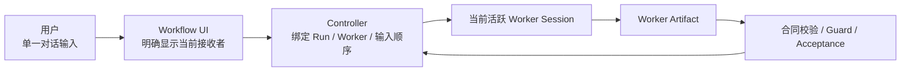

# 架构决策 0002：统一对话中的活跃 Worker 协作

- 状态：`DECIDED`
- 层级：第一层（L1 架构决策）
- 日期：2026-09-10

## 结论先行

| 问题 | 决策 |
| --- | --- |
| 用户怎样开始 | 仍只使用 Workflow Extension 的单一入口，例如 `/fix <问题描述>` |
| 用户怎样看到执行 | 当前活跃 Worker 的可见模型输出、工具活动摘要、角色和实际模型展示在原对话中 |
| 用户怎样补充信息 | 直接使用原输入框；系统将输入绑定到提交时的当前 Workflow Run 和活跃 Worker Session |
| 用户怎样换模型 | 在原对话使用当前 subagent 的模型选择器，不新增常驻命令 |
| 内部控制是否改变 | 不改变；Worker 仍只提交 Artifact，只有 Controller 可以迁移状态或产生 Acceptance Result |
| 是否依赖独立终端 | 不依赖 tmux、独立窗口或可进入的子终端；具体承载方式属于 L2 |

## 背景

Workflow 把每个 Node Execution 交给独立 Worker Session，可以隔离上下文并工程化控制 Artifact、Guard、状态和审计；但如果 Worker 只作为无头执行单元存在，用户只能通过主 Agent 转述补充信息，无法像普通对话一样直接修正当前执行上下文。为每个 Worker 暴露 tmux pane、独立命令或内部标识会把 Runtime 复杂度转移给用户，也与人友好化原则冲突。

## 决策

产品采用“统一对话、单一输入、当前 Worker 自动路由”的协作模式。

- Workflow 执行期间，同一时刻至多有一个当前活跃 Worker 作为交互接收者；原对话持续展示它的用户可见输出和工具活动摘要，不得声称展示模型未公开的隐藏推理。
- 用户在原输入框提交的自然语言是“用户补充信息”：它可以增加事实、约束或纠正方向，但不是 Transition、Artifact 通过结论或最终验收决定。
- 每条补充信息必须先耐久记录，并在提交时原子绑定 Run、活跃 Worker Session 和连续顺序，再投递；只有在 close fence 前完成该提交的内容才成为“已提交补充”。fence 后失败只保留待重试文本且不占补充顺序。
- 补充信息使用严格 close fence：fence 前的已提交补充必须由当前 Worker 获得一次包含该输入的后续模型调用，并由绑定最新补充版本的新 Artifact 替代旧 Artifact后才允许迁移；fence 后提交失败并保留用户输入，由 UI 显示新的接收者，用户再次提交后才能投递。
- 补充信息不得只存在于瞬时对话。同一 Run 的所有后续 Worker 默认按顺序获得全部已提交补充的版本化引用；Runtime 可以压缩展示，但不能丢失来源、顺序或版本。产品生命周期依次区分“已耐久记录、队列已接收、对应模型调用已完成、已绑定新 Artifact”；只有最后一项才能证明当前 Node 在该输入之后重新交付。
- 用户可以在原对话通过当前 subagent 的模型选择器切换当前活跃 Worker 的模型。项目 Node 模型是默认值；第一版可选模型必须同时属于 Pi scoped/available 已认证范围并满足当前 Worker 的模型/工具兼容约束；选择器打开或确认期间 Worker 发生变化时切换失败并要求重新选择。模型变化只影响绑定的 Worker Session，不修改主 Session或后续 Node，不扩大工具、Skill、文件系统、网络或 Workflow 权限；实际模型和变化必须记录；状态统一为 `requested/已请求 → pending/待生效 → applied/已切换`，或终止为 `not_applied/未应用`、`failed/失败`。只有同一 Worker 以新模型开始后续调用才进入 applied，Worker 先结束则进入 not_applied。
- 用户不需要使用 `runId`、`nodeExecutionId`、`steer`、tmux 或专用模型命令。自然语言补充只在消息边界生效，不承诺立即中止当前工具或撤销已经发生的文件/外部副作用；停止/取消不属于本决策新增的第一版交互。技术标识保留在详情和审计中。
- 自然语言中的 `approve`、`reject`、暂停或完成措辞都只是补充信息，不能被 Worker 或 UI 推断成 Workflow 决定；正式决定仍须来自当前待决请求上的明确用户操作。
- 没有活跃 Worker、投递失败或 Worker 已越过 close fence 时，提交失败且内容保留，UI 必须明确显示新的接收者并等待用户再次提交；不得静默丢失、广播、改投或假装已被当前 Worker 使用。唯一例外是同一逻辑 Node Execution 因崩溃恢复出的替代 Worker可以自动接收未完成补充，但必须明确展示并审计；跨 Node 仍须用户重新提交。
- 补充原文只在所属 Run 的受控上下文、审计和恢复范围内使用；默认不得进入 Git、公开 Trace、公开 Telemetry 或指标字段。

## 产品对象边界

| 对象 | 含义 | 不等于 |
| --- | --- | --- |
| 当前活跃 Worker | 内部权威对象为 Workflow UI 当前展示并接收自然语言补充的 Worker Session；用户界面简称“当前 subagent” | 当前 Stage、主 Agent、整个 Run |
| 用户补充信息 | 运行中提供的事实、约束或方向修正，绑定 Run、投递目标和补充版本 | User Decision Artifact、Worker Artifact、状态迁移 |
| Worker 模型切换 | 用户对当前 Worker Session 的执行模型选择 | 修改项目默认 Policy、扩大能力权限、接受工作结果 |

## 影响

### 正面影响

- 用户只需理解 `/fix` 和普通对话，不必学习内部命令或切换终端。
- Worker 的独立上下文仍保留，同时用户补充可以被当前执行和同一 Run 后续 Worker 可靠获得。
- UI 展示、自然语言输入和模型选择成为人机协作入口，但不成为第二套 Workflow 控制面。

### 成本与风险

- L2 必须维护活跃 Worker 的可寻址句柄、事件订阅、输入顺序、投递确认和恢复信息。
- Node 完成与用户提交同时发生时必须实现持久化顺序、严格 close fence 和 Artifact 补充版本绑定。
- 当前 Worker 的模型切换必须与项目默认模型区分，只能从 Pi scoped/available 已认证且与当前 Worker 兼容的模型集合中选择，并准确记录实际执行模型。
- 多 Worker 并行时第一版仍只能发布一个前台接收者；不能把一条输入广播给所有 Worker。

## Adoption Decision

| 评审轴 | 结论 | 采纳依据 |
| --- | --- | --- |
| 产品语义/指标 | `APPROVE` | `/fix` 单一主路径、close fence、补充与正式决定边界、模型状态和恢复例外无未解决 P0/P1/P2 |
| 实现/运营 | `APPROVE` | Pi 0.84.2 接缝、Run Control WAL、writer fencing、legacy 迁移、隐私/导出、保留/GC 与真实 E2E 门禁无未解决 P0/P1/P2 |
| Adoption | `DECIDED` | 用户已确认同窗协作目标并要求写回 L1-L5；两条独立评审轴通过后于 2026-09-10 采纳 |

## L2 交接

L2 可以使用进程内 Pi SDK Session、RPC 子进程或其他承载方式，但必须提供等价的事件投影、自然语言投递、当前 Worker 模型切换、严格 close fence、持久化和审计能力。宿主接线、后台任务、补充 WAL、投递语义、Session 恢复和模型 API 由 [Runtime 实现架构](../../02-产品实现/runtime-实现架构.md) 与 [Fix Runtime 技术设计](../../02-产品实现/fix-runtime-technical-design.md)拥有。

当前实现仍使用同步 command handler 和无头、内存态 Pi SDK Worker Session，只向主窗口投影部分 trace，没有用户输入反向路由、当前 Worker 模型切换或 Worker Session 恢复能力；该差异必须在 L2 drift 中保留，直到源码、测试和真实 Pi UI 验证完成。tmux 可以用于本地调试，但不是产品交互依赖或正式控制协议。

## Product Handoff

| 项目 | 交接内容 |
| --- | --- |
| 产品 owner | Core 拥有活跃 Worker/补充/模型/控制边界；Workflow UI 拥有同窗交互；Fix 拥有 `/fix` 入口旅程 |
| 第一实现切片 | Extension 后台 Run 与 host lifecycle → Run Control WAL/Registry → 同输入 input adapter → Event sidecar renderer → Child picker → 恢复/迁移/GC |
| 不可降级 | 不新增普通用户命令、tmux 或内部 ID；不绕过 Artifact revision、Guard、Acceptance；错误路径 fail-closed |
| 验收入口 | [Workflow UI Acceptance Definition](../扩展/workflow-ui-扩展.md#7-acceptance-definition)与 [GitHub Review / 验证门禁](../../04-仓库治理/GitHub维护流程.md#review-与验证) |
| 当前事实 | L1/L2 设计已采纳，源码未实现；以 [L2 drift 表](../../02-产品实现/README.md#已知-l1--l2-drift)为准，不得把方案通过表述为功能完成 |
