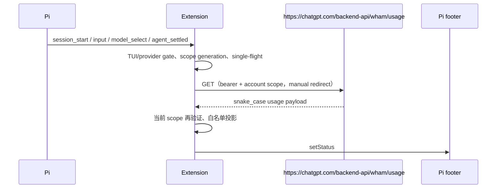
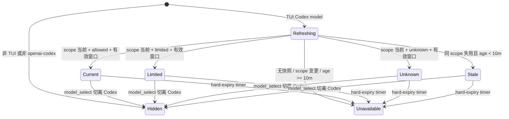

# Codex Usage Status Extension 技术设计

| 项目 | 定义 |
| --- | --- |
| 状态 | `IMPLEMENTING` |
| 层级 | 第二层（L2） |
| L1 owner | [Codex Usage Status Extension 产品规范](../01-产品定义/扩展/codex-usage-status-扩展.md) |
| 目标 package | `packages/codex-usage-status` / `@pi/codex-usage-status` |
| 当前实现 | `packages/codex-usage-status` 已实现；单元测试覆盖 DTO 白名单、scope/JWT、固定 URL/manual redirect、响应上限、TUI/provider gate 与安全投影；真实 Pi TUI/provider E2E 未执行 |

## 1. 结论先行

扩展只在 TUI 的当前模型为 `openai-codex`、`ctx.modelRegistry.isUsingOAuth(ctx.model)` 为真、且模型保有原生 `openai-codex-responses` API 与 `https://chatgpt.com/backend-api` base URL 时，以 `ctx.ui.setStatus()` 写入底栏。它把授权解析、额度读取和 UI 投影拆开：每次成功 scope 确认只授予 60 秒展示 lease，lease 到期先清除旧快照；usage HTTP 单独受 5 秒超时约束；所有异步结果都以 generation 和内存 scope fingerprint 验证后才能提交。



## 2. Package 与公开边界

| 位置 | 责任 |
| --- | --- |
| `packages/codex-usage-status/src/index.ts` | Pi extension factory、事件订阅、生命周期清理。 |
| `packages/codex-usage-status/src/usage.ts` | 授权 scope 提取、请求、wire DTO 解析、快照状态与格式化；不含 Pi UI。 |
| `packages/codex-usage-status/test/*.test.ts` | 解析、授权/异步状态、格式化与安全回归。 |
| `packages/codex-usage-status/package.json` | Pi package manifest、运行依赖与入口；peer 约束为 Pi `>=0.84.4 <0.85.0`。 |

该 package 是独立的 provider-status extension，不依赖 `workflow-runtime` 或 `workflow-contracts`，也不注册 Workflow Run、Artifact、Guard 或用户决策。

## 3. 额度读取合同

### 3.1 请求安全合同

| 项目 | 规则 |
| --- | --- |
| 前置门禁 | `ctx.mode === "tui" && ctx.model?.provider === "openai-codex" && ctx.model.api === "openai-codex-responses" && ctx.model.baseUrl === "https://chatgpt.com/backend-api" && ctx.modelRegistry.isUsingOAuth(ctx.model)`；不满足时显示 `unavailable`（非 Codex 时清除），且不解析授权、不联网、不创建 timer。该完整性检查拒绝 endpoint/API 覆盖；名称等不改变这些运行时字段的元数据覆盖不可区分且可接受。 |
| URL | 常量 `https://chatgpt.com/backend-api/wham/usage`；不得使用或拼接 provider `baseUrl`。 |
| 方法 | `GET`，无请求体。仅 HTTP `200` 可解析；所有非 200 和 3xx 都失败。 |
| 授权 | 通过 `ctx.modelRegistry.getProviderAuth("openai-codex")` 取得内存 bearer token；从其 JWT payload 的 `https://api.openai.com/auth` claim 提取账户作用域。解析失败即 `unavailable`。 |
| 请求 headers | `Authorization: Bearer ...`、`ChatGPT-Account-ID: ...`；不发送 Reserve opt-in 或其他会改变账户状态的 header。 |
| 重定向 | `redirect: "manual"`；不读取或请求 `Location`。 |
| HTTP 超时 | `AbortSignal.timeout(5000)` 仅约束 usage `fetch`。 |
| 授权解析 | `getProviderAuth` 本身不接受 AbortSignal，可能触发 Pi 最长约 15 秒的刷新/持久化；其结果只能通过 generation 判定是否仍可用，不能阻塞 UI 或输入处理。 |
| body | `content-length` 超过 64 KiB 直接失败；否则流式读取解码后的 body，累计超过 64 KiB 立即 cancel reader/abort，再只接受 JSON plain object。 |
| 调度 | `session_start`、`input`、`model_select`、`agent_settled` 只后台排队；每次成功 scope 确认设置 60 秒 lease，到期先清除 snapshot/递增 generation 再校验。usage 最小刷新间隔 60 秒、定期刷新 5 分钟；同一时刻最多一个授权解析和一个 usage 请求。 |

实现不得读取认证文件、请求用户输入 token、复用代理 base URL 或向非固定 URL 发请求。若服务端要求当前扩展无法安全生成的条件路由 header，视为 `unavailable`。

### 3.2 Wire DTO 与白名单投影

直接 HTTP 响应按如下 snake_case 形态读取：

```typescript
interface UsageWireWindow {
  used_percent?: unknown;
  limit_window_seconds?: unknown;
  reset_at?: unknown;
}

interface UsageWireLimit {
  allowed?: unknown;
  primary_window?: UsageWireWindow;
  secondary_window?: UsageWireWindow;
}

interface UsageWireResponse {
  account_id?: unknown;
  rate_limit?: UsageWireLimit;
  // additional_rate_limits is intentionally ignored and never parsed/projected.
}
```

原始响应、账户 scope、token 和 headers 均不跨出请求状态机。UI 只接收：

```typescript
interface UsageWindow {
  remainingPercent: number;
  windowDurationMins?: number;
  resetsAt?: number;
}

type Availability = "allowed" | "limited" | "unknown";

interface UsageDisplaySnapshot {
  availability: Availability;
  windows: readonly UsageWindow[];
  fetchedAt: number;
}

interface InternalScopedSnapshot {
  display: UsageDisplaySnapshot;
  scopeFingerprint: string; // 仅状态机内存比较，不进入 UI DTO、日志或持久化。
}
```

解析规则：

1. 只读取默认 `rate_limit`；忽略且不解析 `additional_rate_limits`，不读取 app-server camelCase 投影、credits、upsell 或未知字段。
2. 默认 bucket 只依次读取 primary、secondary。`used_percent` 必须为有限数值 `0..100`；`remainingPercent = Math.round(100 - usedPercent)`。`limit_window_seconds` 只接受正整数并换算分钟；`reset_at` 只接受在 `2000-01-01..2100-01-01` 的正整数 Unix 秒级时间。
3. 只有默认 `rate_limit.allowed` 决定全局 `availability`。`true` 是 `allowed`、`false` 是 `limited`，其他值是 `unknown`。
4. 无任一合法默认窗口即解析失败。JWT 必须恰有三段、base64url payload 可解析为 plain object，且若 `exp` 存在必须是未过期的有限 Unix 秒；scope claim 不合法即失败。若响应有 `account_id`，它必须是非空字符串且与请求 scope 匹配；类型错误、空值或失配均丢弃整个响应。比较后立即丢弃账户标识。

## 4. 授权、快照与 UI 状态机



| 状态 | 底栏 | 规则 |
| --- | --- | --- |
| `Hidden` | 清除 extension status | 无认证/网络/timer。 |
| `Current` | `Codex · 72% ███████░░░ · Sep 16 10:41` | C「胶囊额度」样式；只展示当前 scope 的默认 bucket 合法窗口。 |
| `Limited` | `Codex limit reached` | 不显示会误导许可状态的进度条。 |
| `Unknown` | `Codex status unknown · 72% ███████░░░` | 只展示默认窗口；不推断许可。 |
| `Stale` | `Codex: stale <previous text>` | 仅 `now - fetchedAt < 10m` 且 scope fingerprint 相同。 |
| `Unavailable` | `Codex: unavailable` | 不展示旧数值。 |

每次成功 scope 确认授予 60 秒 scope lease，并安排 lease timer。lease timer 触发时先递增 generation、清除 snapshot 和 hard-expiry timer、显示 `unavailable`，再后台重校验；因此授权解析长期 pending 也不能使旧账户数据展示超过 lease。每次校验后都比较 fingerprint；缺失、变化或不匹配时同样清除。所有在途授权/HTTP 的晚到结果 generation 不一致时丢弃。成功 usage 快照另在 `fetchedAt + 10m` 安排 hard-expiry timer，触发时重新检查 age 与 scope 后清除旧比例；因此没有新请求结果也不会超过硬期限展示 stale。

`formatProgressBar(remainingPercent)` 返回 10 个字符：`filled = clamp(Math.round(remainingPercent / 10), 0, 10)`，前 `filled` 个为 `█`，其余为 `░`。`setStatus()` 不提供 extension 可用宽度。格式必须把许可状态、比例和进度条放在重置详情前，让宿主截断时保留主要信息；扩展不得声称自行适配全局 footer 宽度。

## 5. 失败、恢复与可运营性

- 所有失败仅转换为 `Unavailable` 或同 scope 的 `Stale`，不向 Agent、provider 请求和 session 流程抛出。
- `model_select` 切离 Codex 时立即清除状态并失效在途请求；切回时后台触发 scope 校验和受限刷新。
- `session_shutdown` 清除全部定时器、递增 generation、清除底栏；reload/new/resume 不复用旧 session 的内存快照。
- 刷新触发在请求进行时合并为一个后续刷新意图；失败不立即重试。内存中可保留无敏感数据的 reason code（如 `unauthenticated`、`timeout`、`schema_invalid`、`scope_mismatch`）及最后尝试时间，供测试和未来安全诊断使用，但不写入 status、日志或 session。
- HTTP 状态、错误文本、headers 和原始 body 不进入 status、日志、session 或测试快照。
- 上游接口改变时解析失败是可预期状态；不引入网页抓取、浏览器自动化或 token 使用量估算。

## 6. 验证计划

| 验证 | 证据 |
| --- | --- |
| 单元测试 | 仅默认 bucket（额外 bucket 永不进入投影/UI）、主窗口、多窗口、10 单元进度条、非法/零窗口、剩余比例舍入、availability、非 200、3xx、超大/伪造 content-length、流式膨胀 body、畸形 DTO、JWT base64url/expiry、账户失配。 |
| 时序测试 | 60 秒 scope lease（含认证永久 pending、换号/登出）、5 分钟 timer、60 秒 usage 限频、single-flight、pending refresh、hard expiry、模型切换/shutdown/reload 和晚到 promise 丢弃。 |
| 安全回归 | 固定 URL、OAuth provider/API/baseUrl integrity gate 与 manual redirect；覆盖 `openai-codex.baseUrl` 或 API 的模型均不触发授权/网络。mock response 含账户或 token-like 字符串、headers 时，状态/UI DTO/持久化数据均不含它们。 |
| 模式测试 | TUI 外不调用授权解析、网络或 timer。 |
| TypeScript / 全仓 | 根 `package.json` 与 lockfile 的 Pi 开发依赖升级至 `0.84.4`；运行 `npm run typecheck`、`npm test`。 |
| Pi TUI 手工验证 | 已登录 Codex 会话可显示额度；启动/输入不等待网络，模型切换立即隐藏，失败不阻塞对话。该项不是单元测试可替代的 E2E。 |

本设计与 L1 规范已作为实现输入；当前源码与测试已落地上述机制，真实 Pi TUI/provider E2E 仍待手工验证。
