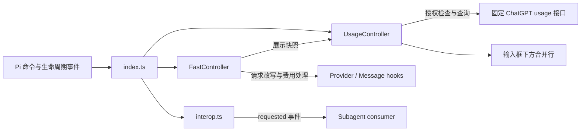
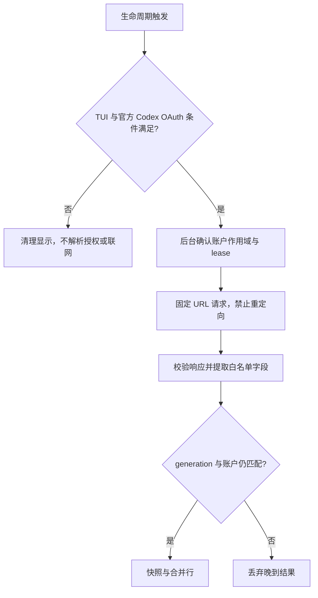
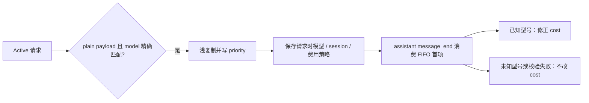

# Codex Usage Status + Fast 技术实现

这个扩展做两件事：后台读取 ChatGPT Codex 额度，在输入框下方展示；通过 `/fast` 控制符合条件的模型请求是否携带 `service_tier: "priority"`。两项能力共享一行 UI，但额度状态不控制 Fast 开关。

| 入口 | 说明 |
| --- | --- |
| 产品契约 | [Codex Usage Status + Fast 产品规范](../01-产品定义/扩展/codex-usage-status-扩展.md) |
| 源码 | [`packages/codex-usage-status/src/`](../../packages/codex-usage-status/src/) |
| 当前状态 | 额度、Fast、费用修正和 Subagent 继承接线已有实现与自动化测试；真实 TUI/provider/child 组合 E2E 未验证 |

## 1. 模块与接线

```mermaid
flowchart LR
    pi[Pi 命令与生命周期事件] --> entry[index.ts]
    entry --> fast[FastController]
    entry --> usage[UsageController]
    fast -->|展示快照| usage
    usage -->|授权检查与查询| api[固定 ChatGPT usage 接口]
    usage --> widget[输入框下方合并行]
    fast -->|请求改写与费用处理| hooks[Provider / Message hooks]
    entry --> interop[interop.ts]
    interop -->|requested 事件| child[Subagent consumer]
```

| 文件 | 责任 |
| --- | --- |
| [`index.ts`](../../packages/codex-usage-status/src/index.ts) | 创建两个 Controller，注册 `/fast`、生命周期与请求/消息 hooks；导出扩展符号 |
| [`usage.ts`](../../packages/codex-usage-status/src/usage.ts) | 授权作用域、额度查询、快照有效性、唯一合并 widget |
| [`fast.ts`](../../packages/codex-usage-status/src/fast.ts) | 请求意图、模型资格判断、payload 改写、响应关联和费用修正；只提供展示快照 |
| [`interop.ts`](../../packages/codex-usage-status/src/interop.ts) | 进程内 requested 事件与 child 一次性启动参数；通过 `@pi/codex-usage-status/interop` 提供公共协议 |

`session_start`、`input`、`model_select`、`agent_settled` 更新状态；`before_provider_request` 交给 Fast 改写请求，`message_end` 交给 Fast 处理费用。`session_shutdown` 发布 requested=false，并清理 Controller 的计时器、状态和队列。

## 2. 额度查询与展示

```mermaid
flowchart TD
    event[生命周期触发] --> gate{TUI 与官方 Codex OAuth 条件满足?}
    gate -->|否| hide[清理显示，不解析授权或联网]
    gate -->|是| scope[后台确认账户作用域与 lease]
    scope --> fetch[固定 URL 请求，禁止重定向]
    fetch --> dto[校验响应并提取白名单字段]
    dto --> current{generation 与账户仍匹配?}
    current -->|是| display[快照与合并行]
    current -->|否| discard[丢弃晚到结果]
```

安全 gate 要求 provider=`openai-codex`、API=`openai-codex-responses`、base URL=`https://chatgpt.com/backend-api`，并由 Pi 确认当前模型使用 OAuth。额度查询还要求 TUI 模式。

授权来自 Pi 的 `getProviderAuth()`。Controller 在内存中解析 token 的账户作用域；无法安全解析时显示不可用。请求只发往 `https://chatgpt.com/backend-api/wham/usage`，使用 manual redirect、5 秒 HTTP timeout 和 64 KiB 响应上限。授权解析属于 Pi 操作，不受这 5 秒 HTTP 时限约束。token、账户标识和原始响应不进入 UI、日志或 session。

| 机制 | 当前行为与理由 |
| --- | --- |
| 账户有效期 | 每次确认作用域后持有 60 秒 lease；到期先清除快照，再后台校验，避免登录变化后继续展示旧账户数据 |
| 刷新与并发 | 授权和 HTTP 查询各自 single-flight，合并重复触发；普通 usage 请求最小间隔 60 秒，刷新 timer 为 5 分钟，lease 重校验可触发立即查询 |
| 晚到结果 | 模型切换、失效或关闭会推进 generation；写入前复核 generation、context 和账户，防止旧请求恢复已清除的显示 |
| 响应合同 | 只取默认 `rate_limit` 的 primary/secondary 窗口及 `allowed`；存在响应账户字段时必须匹配。`additional_rate_limits` 不进入投影 |
| 数值 | `used_percent` 必须是 `0..100` 有限值，展示 `round(100 - used_percent)`；时长和重置时间缺失时不猜测，无有效窗口按失败处理 |
| 失败与过期 | 同账户有效快照在失败后可显示 stale，但必须未满 10 分钟；满 10 分钟定时清除，无新响应也显示 unavailable。lease 到期同样会提前清除 |

`UsageController` 独占 `belowEditor` 的 `codex-usage-status` widget，格式为 `<Fast 状态> · <Codex 额度>`。它清理 `codex-usage-status` 和 `codex-fast` 两个 status key，不替换 Pi footer；隐藏、切换和 shutdown 同时清理 widget 与 status。渲染使用 ANSI-safe `truncateToWidth`，始终至多一行。

`allowed=false` 显示 `limit reached`，缺失时显示 `status unknown`；进度条表示剩余比例，不代表当前获准使用。默认 bucket 也不能证明 Spark 等专属 bucket 的可用性。具体样式和状态文案由 L1 拥有。

## 3. Fast 请求与费用

### 意图与生效条件

`requested` 是内存中的用户意图，模型切换不清除它，也不写配置或 session。factory 默认 Off；唯一启动例外是下节的 child bootstrap。

| 状态 | 条件 |
| --- | --- |
| Off | requested=false |
| Active | requested=true，且模型满足资格条件 |
| Inactive | requested=true，但模型不满足资格条件 |

资格条件包括上述官方 provider/API/base URL/OAuth gate，以及精确小写 `gpt-` 前缀、非空且无空白的 suffix；`gpt-`、`GPT-*` 和非 GPT 型号不符合。`isFastEligible()` 只检查当前模型，不解析额度授权、不联网、不启动 timer。

`/fast` 支持空参数切换及 `on/off/toggle/status`，参数非法时只提示用法；只有 `hasUI=true` 的 TUI/RPC 可改变意图，JSON/print 命令不改变它。命令的纯展示刷新不触发额度查询。额度 limited、stale 或 unavailable 不会自动关闭 Fast。

### 请求与响应关联

```mermaid
flowchart LR
    request[Active 请求] --> match{plain payload 且 model 精确匹配?}
    match -->|是| rewrite[浅复制并写 priority]
    rewrite --> ticket[保存请求时模型 / session / 费用策略]
    ticket --> response[assistant message_end 消费 FIFO 首项]
    response --> known[已知型号：修正 cost]
    response --> unknown[未知型号或校验失败：不改 cost]
```

`rewriteProviderPayload()` 仅处理 plain-object 且 `payload.model === context.model.id` 的请求；返回浅复制，保留原对象和嵌套引用。其他输入返回 `undefined`。

每次成功改写都入队一个 ticket，最多 32 项，溢出丢最老项。ticket 保存请求时的模型（含 pricing）、session 身份和费用策略。响应只消费队首，再核对 provider/API/model/session；不匹配或 usage 非法时丢弃该 ticket、不改消息，也不扫描后续 ticket。shutdown 清空队列。

这样即使请求期间切换模型或关闭 Fast，费用也按请求时状态处理。未知型号同样占队列位置，避免它的响应误用后续已知型号的费用策略。

| 费用策略 | 行为 |
| --- | --- |
| `gpt-5.5` | Pi `calculateCost` 的原生费用乘 2.5 |
| `gpt-5.4`、`gpt-5.6-luna`、`gpt-5.6-sol`、`gpt-5.6-terra` | 原生费用乘 2 |
| 其他 eligible `gpt-*` | 消费 ticket，`usage.cost` 原样保留 |

`FAST_MODEL_IDS` 是上述已知计费集合的公共导出，不是模型资格白名单。费用计算使用原生 pricing tier，将 input/output/cacheRead/cacheWrite 分量分别缩放后求和；费用已相同时不再替换。usage 的 token 计数必须为非负安全整数，reasoning 不超过 output、cacheWrite1h 不超过 cacheWrite，cost 分量必须有限；缺失或非法时不修正。合法的 error/aborted assistant message 也按已发生的 usage 处理。

未知型号激活、查询状态，以及涉及未知型号的模型切换（包括 unknown→unknown）会提示：priority 只是请求意图，费用未校正/不保证。切回已知型号使用对应通知和费用策略。TUI 通知可带颜色，RPC 保持纯文本。

## 4. Subagent 继承

| 边界 | 当前机制 |
| --- | --- |
| Producer | 通过 `pi.events` 发布 `@pi/codex-usage-status:fast-requested/v1`，只接受精确 `{ version: 1, sessionId, requested }`，缺失、多余或非法字段忽略 |
| Consumer | [`packages/subagent/src/fast-inheritance.ts`](../../packages/subagent/src/fast-inheritance.ts) 动态加载公共 parser，按 parent session 保存意图；producer 缺失或协议不可用时安全 Off |
| 传递条件 | 首次逻辑 child spawn 时读取 parent requested；仅 resolved user-source、exact `implementer`/`code_reviewer` 且 `codexFast: inherit` 命中；project agent 和其他 user agent 不继承 |
| 启动环境 | consumer 先复制环境并删除 `PI_CODEX_FAST`，条件满足才设为精确 `"1"`；child factory 读取后立即删除，一次性使用 |
| 时间边界 | chain / 排队 parallel 各自在实际 spawn 时取快照，已启动 child 不随 parent toggle 改变；reload/new/resume/fork 的新 factory 默认 Off |

继承的是 requested 意图，不是 Active 状态。child 独立检查模型资格；parent Inactive 不妨碍符合条件的 child Active。该协议是 advisory，不是认证或安全隔离，角色与来源筛选由 Subagent consumer 拥有。

## 5. 验证入口与当前边界

| 范围 | 证据入口 / 状态 |
| --- | --- |
| Fast、FIFO、费用、通知与 hooks | [`fast-mode.test.ts`](../../packages/codex-usage-status/test/fast-mode.test.ts) |
| 额度 DTO、授权、刷新、过期、UI 与副作用 | [`usage.test.ts`](../../packages/codex-usage-status/test/usage.test.ts) |
| 仓库内 child 继承接线 | [`fast-inheritance.test.ts`](../../packages/subagent/test/fast-inheritance.test.ts) |
| 真实 TUI / provider / child 组合 | 未验证；自动化不等于真实运行时 E2E |
| 安装与宿主依赖 | [项目配置](../03-项目落地/项目配置.md#pi-package-依赖安排)，以 manifest/lockfile 为准 |

扩展只保证自身 hook 的输出。Pi 0.84.4 没有最终 payload 或最终持久化 message 的可观测 hook：后续请求 handler 可能改写 priority，其他消息 handler 可能改写 model/session、usage token 或 cost。因此支持费用关联与持久化结果的组合要求这些输入和结果不被其他 handler 改变；不能从 Active 推断 provider 接受 priority、实际加速或最终费用。

额度失败不阻塞、取消或改变模型请求；本扩展不自动重试/fallback 模型请求，也不持久化 Fast 意图。授权和 usage 接口是外部依赖，不能可靠读取时显示不可用，不估算额度。

自动化入口为根目录 `npm test` 与 `npm run typecheck`。固定 revision 的评审与验证记录见[证据归档](../归档/评审/codex-usage-status-fast-gpt-v1-交付记录.md)，不作为当前测试执行结果。
