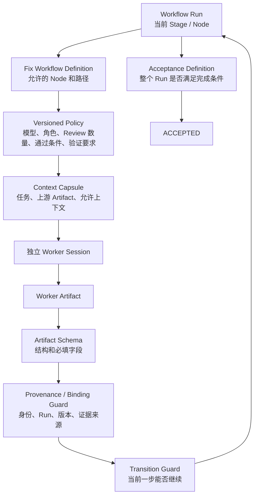
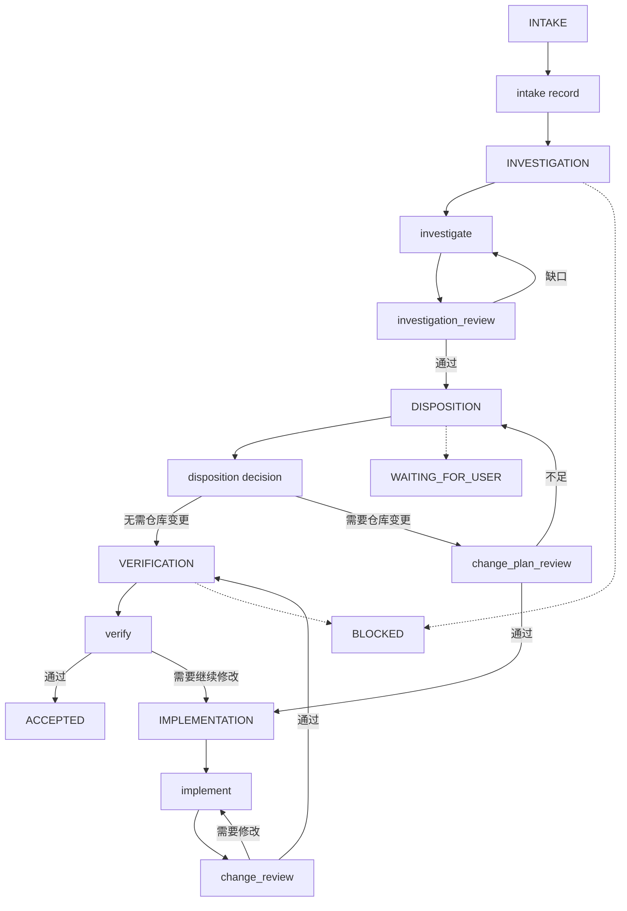
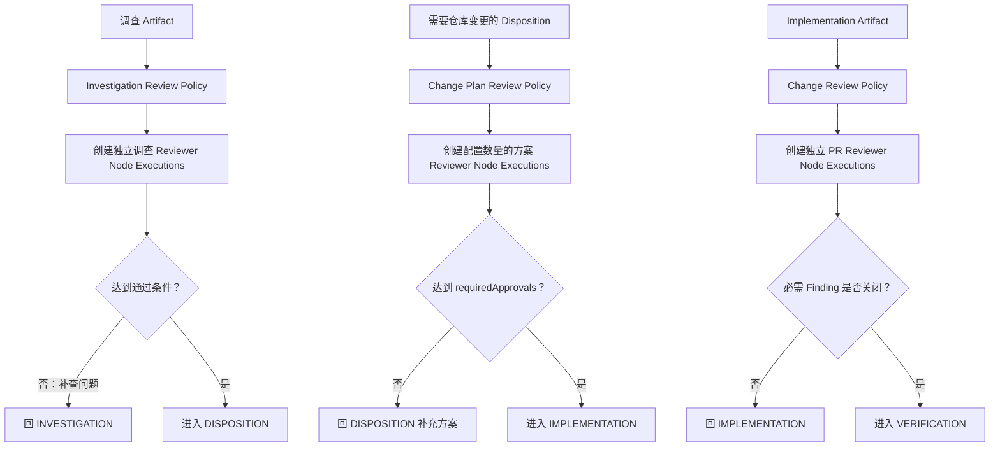
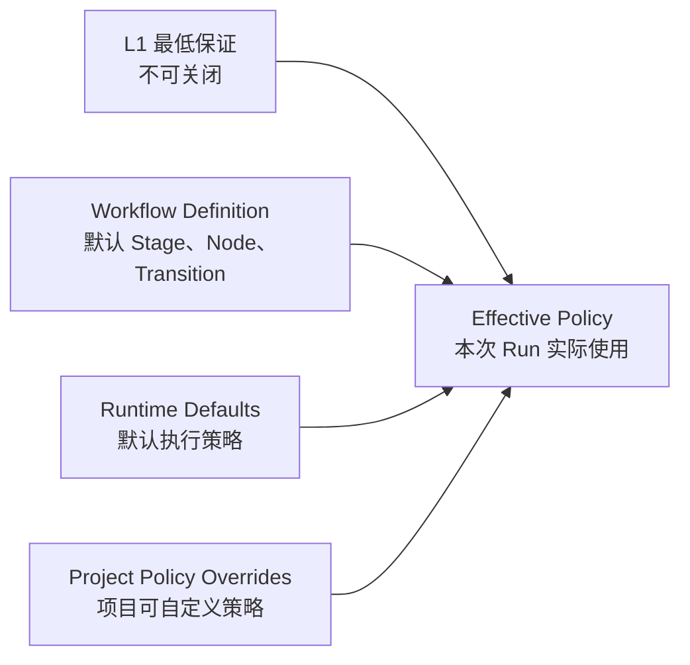
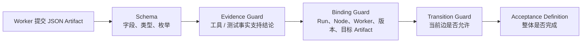
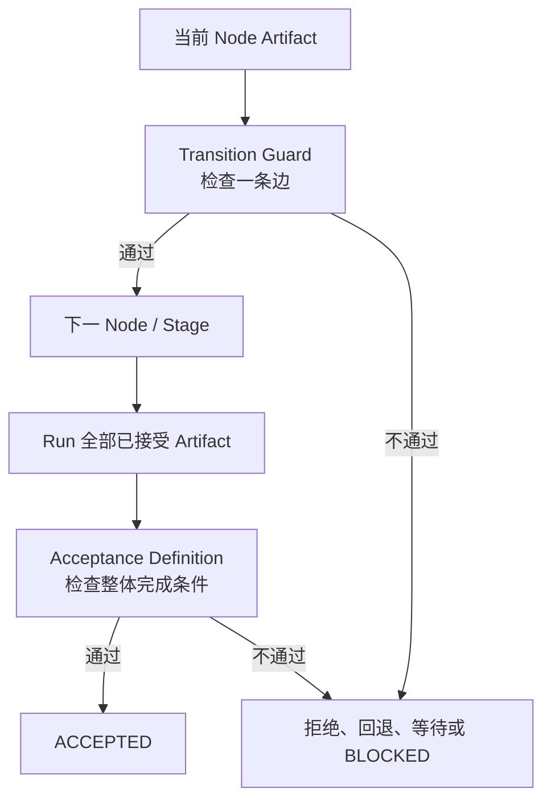
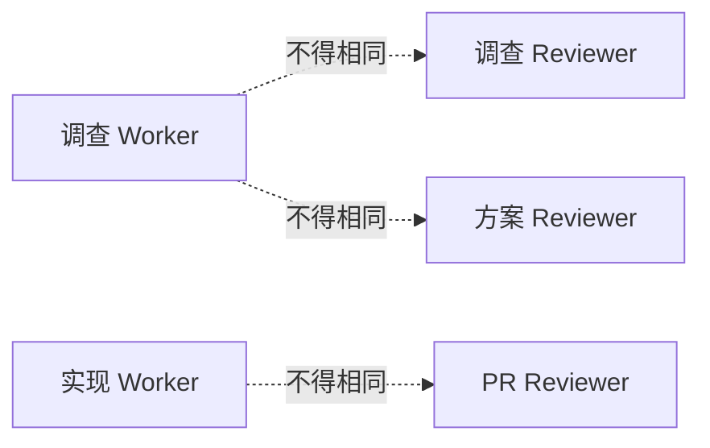
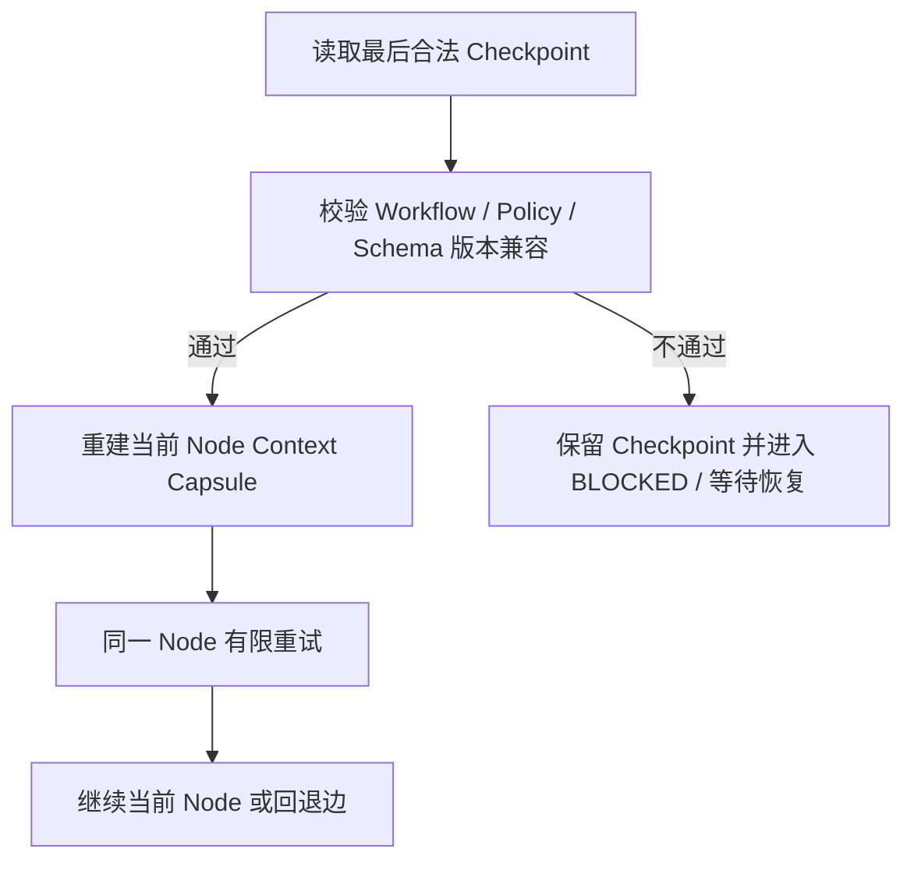
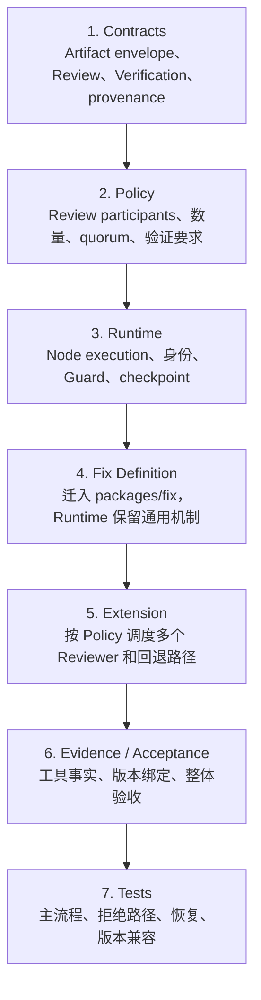

# Fix Runtime 技术设计（L2 目标设计与当前实现）

- 层级：第二层（L2）
- 状态：`REVIEWING`
- 上游：[Fix Extension 产品规范](../01-产品定义/扩展/fix-扩展.md)

> L1 定义 Fix 必须保证什么；本文定义 Runtime 怎样把这些保证落成可执行的 Stage、Node、Policy、Artifact、Guard、验证和恢复机制。源码与测试仍是当前运行事实；尚未实现的目标在文中明确标注。

## 1. L2 执行模型



Runtime 的责任边界：

- `Workflow Definition` 定义允许的 Node、Stage 语义和产品路径；
- `Policy` 配置执行方式，但不能降低 L1 的最低保证；
- `Worker` 只提交当前 Node 的 Artifact，不能修改 Run 状态；
- `Artifact Schema` 校验结构，不把 Worker 的自报结论当成事实；
- `Transition Guard` 判断一条具体流转是否允许；
- `Acceptance Definition` 综合判断整个 Run 是否可以进入 `ACCEPTED`；
- Controller 保存 checkpoint、执行 Guard、生成迁移记录和最终 Acceptance Result。

## 2. Stage 与 Node 的落地边界

Stage 是 Run 级别的粗粒度业务位置；Node 是 Stage 内一次独立、可审计的工作。Review 不自动变成新的 Stage，独立性通过 Node Execution、`workerId` 和 Artifact provenance 保证。



目标内部 Stage ID 可以由 L2 选择；本设计建议使用：

```text
INTAKE
INVESTIGATING
DISPOSITION
IMPLEMENTING
VERIFYING
BLOCKED
WAITING_FOR_USER
ACCEPTED
```

Stage 配置统一声明其包含的 Node；Node 配置不重复声明所属 Stage。这样 `change_plan_review` 和 `change_review` 虽然是独立 Node，但仍由所属 Stage 的 Node 列表表达其位置。

建议的 Node ID 为：

```text
intake
investigate
investigation_review
disposition
change_plan_review
implement
change_review
verify
```

`investigation_review`、`change_plan_review` 和 `change_review` 是独立 Node。一个 Review Policy 可以让同一 Node Definition 创建多个独立 Node Execution；不通过时由 Controller 按固定回退边恢复，不能由 Worker 自行选择下一步。

## 3. Review Policy：多 Agent 怎样配置

多 Agent 评估是 L2 的执行配置，不由 Worker Prompt 临时决定。Policy 至少分为三类 Review：



## 3. Policy 默认值与项目覆盖

Policy 不负责重新定义 Fix 流程，而是配置一次 Workflow Run 怎样执行。Runtime 先加载不可绕过的 Workflow Definition 和 L1 最低保证，再合并 Runtime 默认值与项目覆盖：



四类内容的边界：

| 层 | 责任 | 是否可被项目覆盖 |
| --- | --- | --- |
| L1 最低保证 | 必须经过调查复核、修改前方案评估、修改后 Review 和整体验收 | 不可关闭或降低 |
| Workflow Definition | 默认 Stage、Stage 包含的 Node、允许 Transition 和回退边 | 不可通过普通 Policy 改写 |
| Runtime Policy Defaults | 默认模型、Skill、Review 数量、验证要求、重试和恢复参数 | 可在 L1 允许范围内覆盖 |
| Project Policy Overrides | 当前仓库选择的模型、Skill、Reviewer 数量、验证 Profile、超时等 | 可覆盖默认值，但不能突破 Runtime 上限 |

Node 的职责由 Node ID 表达，Node 配置不重复声明 `stage` 或 `role`。Stage 与 Node 的归属由 Workflow Definition 统一维护；Worker 的实际身份由 Runtime 生成并记录 `workerId`，不由静态 JSON 冒充。

Policy 可以配置：

- Node 的模型、Skill、上下文和工具子集；工具只能在 Runtime 全局能力上限内收窄；
- 三类 Review 的 Reviewer 数量、模型、Skill、并行/串行方式和通过票数；
- Review 检查项、Finding 关闭要求和回退目标；
- Verification 检查类别、证据要求、未验证项和剩余风险规则；
- Worker session 的重试、超时、checkpoint 和恢复兼容策略；
- Policy 自身的版本和 digest。

Policy 不得配置为绕过 L1 最低保证。以下控制由 Runtime 固定强制，不能通过 JSON 关闭：

- Worker 不能直接修改 Run Stage 或生成 `ACCEPTED`；
- 调查 Reviewer、方案 Reviewer、PR Reviewer 必须满足独立身份约束；
- Artifact 必须通过 Schema、来源和目标 Run 校验；
- `candidateRevision` 必须在实现、PR Review 和验证之间一致；
- 必需 Finding 未关闭时不能通过对应 Guard；
- 只有 Controller 能生成 Transition Record 和 Acceptance Result。

配置形态先采用版本化 JSON。`defaults` 是 Runtime 提供的默认策略，实际项目文件通常只写 `overrides`；为了便于评审，下面同时展示内置流程默认值、Runtime 执行默认值和项目覆盖值。`defaults.workflow` 属于固定的 Workflow Definition 默认值，不能由项目覆盖；字段名和默认值仍需在实现阶段通过 contracts、Policy parser 和测试最终确定，不是当前已实现格式：

```json
{
  "version": 1,
  "defaults": {
    "workflow": {
      "id": "fix",
      "definitionVersion": "fix-v2",
      "initialStage": "INTAKE",
      "stages": {
        "INTAKE": { "nodes": ["intake"] },
        "INVESTIGATING": { "nodes": ["investigate", "investigation_review"] },
        "DISPOSITION": { "nodes": ["disposition", "change_plan_review"] },
        "IMPLEMENTING": { "nodes": ["implement", "change_review"] },
        "VERIFYING": { "nodes": ["verify"] },
        "BLOCKED": { "nodes": [] },
        "WAITING_FOR_USER": { "nodes": [] },
        "ACCEPTED": { "nodes": [] }
      },
      "transitions": [
        { "from": "INTAKE", "to": "INVESTIGATING", "after": "intake_accepted" },
        { "from": "INVESTIGATING", "to": "INVESTIGATING", "after": "investigation_review_needs_more_evidence" },
        { "from": "INVESTIGATING", "to": "DISPOSITION", "after": "investigation_review_accepted" },
        { "from": "DISPOSITION", "to": "DISPOSITION", "after": "change_plan_review_rejected" },
        { "from": "DISPOSITION", "to": "IMPLEMENTING", "after": "change_plan_review_accepted" },
        { "from": "DISPOSITION", "to": "VERIFYING", "after": "no_repository_change" },
        { "from": "IMPLEMENTING", "to": "IMPLEMENTING", "after": "change_review_needs_changes" },
        { "from": "IMPLEMENTING", "to": "VERIFYING", "after": "change_review_accepted" },
        { "from": "VERIFYING", "to": "ACCEPTED", "after": "acceptance_passed" },
        { "from": "VERIFYING", "to": "IMPLEMENTING", "after": "verification_requires_change" }
      ]
    },
    "nodes": {
      "defaults": {
        "model": "inherit",
        "skills": [],
        "tools": ["read", "submit_artifact"],
        "execution": { "maxAttempts": 2, "timeoutMs": 600000 }
      },
      "intake": { "artifactKind": "intake" },
      "investigate": {
        "model": "inherit",
        "skills": ["cst-plus"],
        "context": ["problem", "intake", "project_knowledge"],
        "artifactKind": "investigation"
      },
      "investigation_review": {
        "context": ["problem", "intake", "investigation"],
        "artifactKind": "investigation_review"
      },
      "disposition": {
        "context": ["investigation", "investigation_review", "project_knowledge"],
        "artifactKind": "disposition"
      },
      "change_plan_review": { "artifactKind": "change_plan_review" },
      "implement": {
        "model": "inherit",
        "skills": ["tdd"],
        "tools": ["read", "edit", "write", "submit_artifact"],
        "context": ["problem", "investigation", "investigation_review", "disposition", "accepted_plan"],
        "artifactKind": "implementation"
      },
      "change_review": { "artifactKind": "change_review" },
      "verify": {
        "context": ["problem", "investigation", "disposition", "implementation", "change_review"],
        "artifactKind": "verification"
      }
    },
    "review": {
      "investigation": {
        "reviewers": [{ "model": "inherit", "skills": [] }],
        "mode": "parallel",
        "requiredApprovals": 1,
        "requireIndependentWorker": true,
        "excludeNodes": ["investigate"],
        "onRejected": "return_to_investigation"
      },
      "changePlan": {
        "reviewers": [
          { "model": "inherit", "skills": [] },
          { "model": "inherit", "skills": [] }
        ],
        "mode": "parallel",
        "requiredApprovals": 2,
        "requireIndependentWorker": true,
        "excludeNodes": ["investigate", "implement"],
        "requiredChecks": [
          "root_cause_alignment",
          "minimal_scope",
          "risk_and_compatibility",
          "verification_plan",
          "rollback_plan"
        ],
        "onRejected": "return_to_disposition"
      },
      "change": {
        "reviewers": [{ "model": "inherit", "skills": [] }],
        "mode": "parallel",
        "requiredApprovals": 1,
        "requireIndependentWorker": true,
        "excludeNodes": ["implement"],
        "requiredFindingDisposition": "closed",
        "onRejected": "return_to_implementation"
      }
    },
    "artifacts": {
      "schemaVersion": 1,
      "requireEnvelope": true,
      "requireProvenance": true,
      "requireEvidenceReferences": true,
      "requireCandidateRevisionBinding": true,
      "allowedKinds": [
        "intake", "investigation", "investigation_review", "disposition",
        "change_plan_review", "implementation", "change_review", "verification"
      ]
    },
    "verification": {
      "requiredChecks": [
        "original_issue", "root_cause_cut",
        "identified_impact_surface", "regression_and_compatibility"
      ],
      "requireToolOrTestEvidence": true,
      "requireCandidateRevisionMatch": true,
      "allowUnverified": false,
      "requireRemainingRisk": true,
      "onRejected": "return_to_implementation"
    },
    "acceptance": {
      "requires": [
        "intake_accepted", "investigation_review_accepted", "disposition_accepted",
        "verification_accepted", "original_issue_verified", "root_cause_cut_verified",
        "impact_and_regression_verified", "required_findings_closed",
        "candidate_revision_consistent", "unverified_items_allowed", "remaining_risk_recorded"
      ],
      "repositoryChangeRequires": [
        "change_plan_review_accepted", "implementation_accepted", "change_review_accepted"
      ]
    },
    "execution": {
      "maxAttemptsPerNode": 2,
      "retryTransientModelErrors": true,
      "retryContractErrors": true,
      "checkpointAfter": [
        "artifact_accepted", "transition_accepted", "review_decision",
        "acceptance_result", "recoverable_failure"
      ],
      "resume": {
        "requireWorkflowVersionMatch": true,
        "requirePolicyDigestMatch": true,
        "requireSchemaVersionCompatibility": true
      }
    }
  },
  "overrides": {
    "nodes": {
      "investigate": {
        "model": "smartingredients/gpt-5.6-sol",
        "skills": ["cst-plus"]
      },
      "implement": {
        "model": "smartingredients/gpt-5.6-terra",
        "skills": ["tdd"]
      },
      "verify": {
        "model": "smartingredients/gpt-5.6-sol"
      }
    },
    "review": {
      "changePlan": {
        "reviewers": [
          { "model": "smartingredients/gpt-5.6-sol", "skills": [] },
          { "model": "smartingredients/gpt-5.6-sol", "skills": [] }
        ]
      }
    },
    "verification": {
      "profile": "project-default-fix-regression"
    }
  }
}
```

合并顺序固定为：

```text
L1 最低保证 + Workflow Definition
  → Runtime Policy Defaults
  → Project Policy Overrides
  → Effective Policy
```

覆盖规则：

- `overrides` 只能覆盖 Defaults 中标记为可配置的执行字段；`defaults.workflow`、核心 Transition、Stage 与 Node 归属不可覆盖；未知字段、未知 Node、未知 Review 类型直接拒绝；
- 数量、超时、重试等数值必须经过 Runtime 上限和 L1 下限校验；
- `tools` 只能缩小默认 allowlist，不能扩大 Runtime 全局能力上限；
- `requiredApprovals` 不能低于 L1 或 Review Definition 要求；
- 不能覆盖 `workflow.stages`、核心 Transition、Artifact provenance、身份独立性和 Acceptance 必需条件；
- 最终生效配置生成 canonical JSON 和 digest，并写入 Workflow Run checkpoint 与审计记录。

实际项目文件通常只需要写 `overrides`，没有覆盖的字段自动使用 Runtime Defaults。上面的 `defaults` 与 `overrides` 放在同一段只是为了便于评审，不代表每个项目都要复制整份默认配置。

这份配置中，以下内容属于可配置策略：

```text
模型、Skill、工具的 Node Profile
Review 参与者的模型、Skill、数量、并行方式和 requiredApprovals
Review 检查项、Finding 关闭要求和回退目标
Verification 检查类别和证据要求
Acceptance 所需条件
重试、超时、checkpoint 和恢复兼容策略
```

以下内容不属于普通 JSON 配置，而是 Runtime 的不可绕过控制：

```text
工具实际是否可用以及全局能力上限
Worker 是否真的提交了 Artifact
Artifact 是否属于当前 Run / Node Execution
独立 Worker 身份是否满足约束
工具 / 测试事件是否支持 evidence
Controller 是否拥有状态迁移权
Acceptance Result 是否由 Controller 生成
```

项目的具体测试命令、业务不变量和外部系统检查不应硬编码进通用 Fix Policy；它们由 Project Knowledge 或 L3 项目配置提供，Policy 只引用检查类别或验证 Profile。

## 4. Artifact Contract 与来源绑定

Artifact Schema、Runtime Guard 和 Acceptance 的职责不同：



所有目标 Artifact 都应有统一 envelope：

```json
{
  "kind": "<artifact-kind>",
  "schemaVersion": 1,
  "runId": "<run-id>",
  "nodeExecutionId": "<node-execution-id>",
  "workerId": "<worker-id>",
  "producerKind": "worker",
  "sourceVersion": "<baseline-or-candidate>",
  "evidence": [],
  "unverified": [],
  "conclusion": "<structured-conclusion>"
}
```

目标 Node Artifact 的最小业务字段：

| Node | 必须表达的事实 |
| --- | --- |
| `investigate` | 现象、预期、实际、根因分层、时间线、影响面、route、证据和未验证项 |
| `investigation_review` | 目标调查 Artifact、检查范围、根因结论、证据充分性、停止调查理由、缺口和复核结论 |
| `disposition` | 处置类型、最小范围、风险、验证目标、是否需要仓库变更、是否触发正式方案评审 |
| `change_plan_review` | 目标方案版本、根因对应关系、修改范围、风险、兼容性、验证、回滚、Finding 和评估结论 |
| `implement` | 修改摘要、文件/对象、candidate revision、PR 引用和实现限制 |
| `change_review` | 被 Review 的 candidate revision / PR diff、Finding、Finding disposition 和 Review 结论 |
| `verify` | 被验证版本、原始问题结果、根因切断结果、影响面回归、工具/测试证据、未验证项和剩余风险 |

Schema 通过不代表 Artifact 事实成立。Runtime 还必须检查：

- Artifact 的 `runId`、`nodeExecutionId` 和 `workerId` 是否属于当前执行；
- Review 是否引用了正确的上游 Artifact；
- Reviewer 是否与被 Review 的 Worker 身份不同；
- `candidateRevision` 是否在 Implementation、Change Review 和 Verification 之间一致；
- evidence 是否能关联到实际工具事件、测试结果或明确外部来源；
- 必需 Finding 是否已由有权限的独立 Worker 关闭。

## 5. Transition Guard 与 Acceptance 实现

这两个控制面必须分开实现：



Transition Guard 的目标检查：

```text
investigate → investigation_review
  有合法调查 Artifact，且目标属于当前 Run

investigation_review → DISPOSITION
  独立 Reviewer 通过，根因和证据链达到 L1 要求

investigation_review → investigate
  复核不通过，且带有可执行补查缺口

disposition → change_plan_review
  Disposition 明确需要仓库变更，且方案输入完整

change_plan_review → implement
  达到 Policy 的通过条件，且正式方案变化已完成 Adoption Decision

implement → change_review
  产生 candidate revision / PR 输入

change_review → verify
  绑定同一 candidate revision，必需 Finding 已关闭

verify → ACCEPTED
  只在 Acceptance Definition 通过时允许
```

Acceptance Definition 不是单个 `verification.accepted === true`。有仓库变更时，至少综合检查：

```text
问题现象已确认
调查复核已通过
Disposition 已接受
CHANGE_PLAN_REVIEW 已通过
IMPLEMENTATION / CHANGE_REVIEW / VERIFICATION 绑定同一 candidate revision
必需 Finding 已关闭
原始现象验证通过
根因已切断
已识别影响面和关键不变量完成回归
未验证项符合 Policy 和 L1 允许范围
剩余风险和必要用户 / 外部决定已明确
```

无仓库变更时，跳过 Implementation、Change Plan Review 和 Change Review，但仍必须绑定基准版本或处置对象版本，并提供原始现象、影响面和处置结果的验证证据。

## 6. Worker Session、身份与恢复

每次 Node Execution 创建独立 Worker Session，并记录：

```text
runId
nodeExecutionId
workerId
role
attempt
model
skill set
policyVersion / policyDigest
context capsule reference
```

身份约束由 Runtime 强制：



Checkpoint 不能只保存 Stage。目标 checkpoint 还要保存：

```text
activeNodeId
nodeExecutionId
acceptedArtifacts
review decisions / findings
candidate revision
policy version / digest
pending user or external decision
last valid transition
```

恢复流程：



当前实现只有 Stage 和部分 Artifact 恢复，尚未保存上述完整 Node Execution、Review 和版本 provenance。

## 7. 当前实现与实施顺序

当前源码事实：

```text
/fix
  INVESTIGATING: investigate
  IMPLEMENTING: implement
  VERIFYING: verify
  ACCEPTED: verification.accepted === true
```

当前尚未实现：

```text
INTAKE record
investigation_review
DISPOSITION
change_plan_review
change_review
多 Reviewer Policy 和 quorum
workerId / nodeExecutionId 身份约束
candidate revision 的跨 Artifact Guard
基于实际工具 / 测试事实的 Verification Acceptance
完整 Node Execution checkpoint
```

建议实施顺序：



每一步完成后都要更新最近的 L2 测试和 drift；不得先在 README 或报告中宣称目标流程已经完成。

## 8. 验证入口

实现变化后至少运行：

```bash
npm test
npm run typecheck
git diff --check
```

相关行为必须有测试证据，至少覆盖：Review 回退、身份冲突拒绝、Policy quorum、candidate revision 不一致拒绝、Verification 证据不足拒绝、Acceptance 条件不完整拒绝和 checkpoint 恢复。
