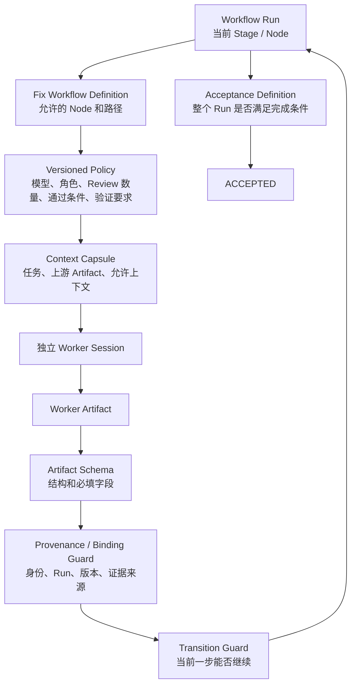
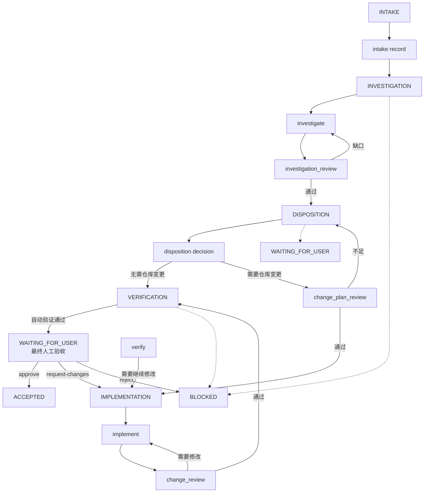
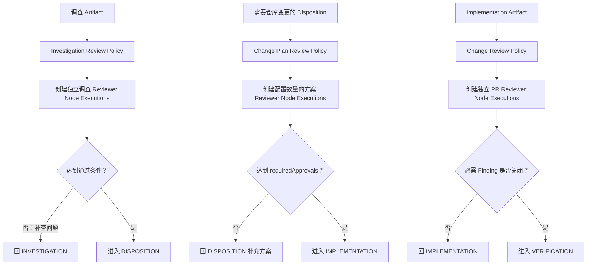
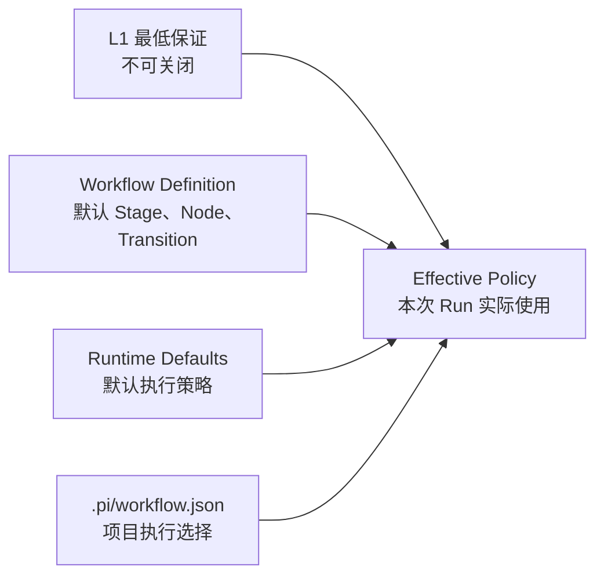
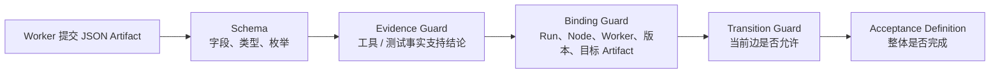
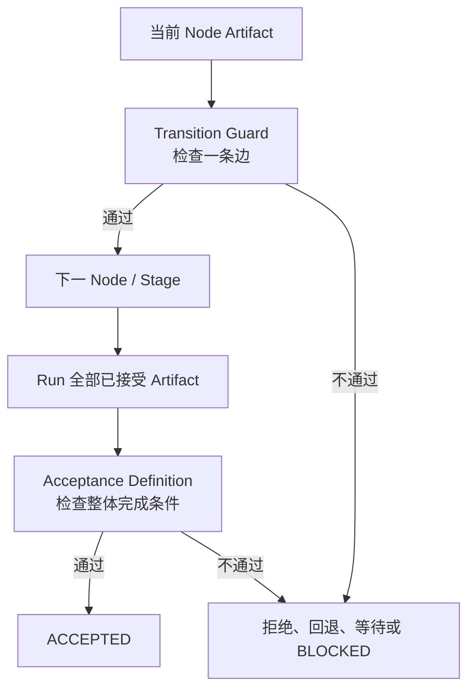
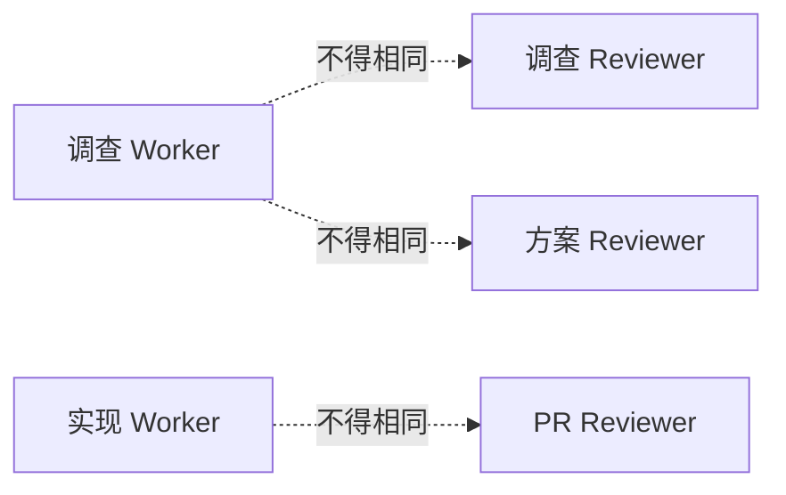
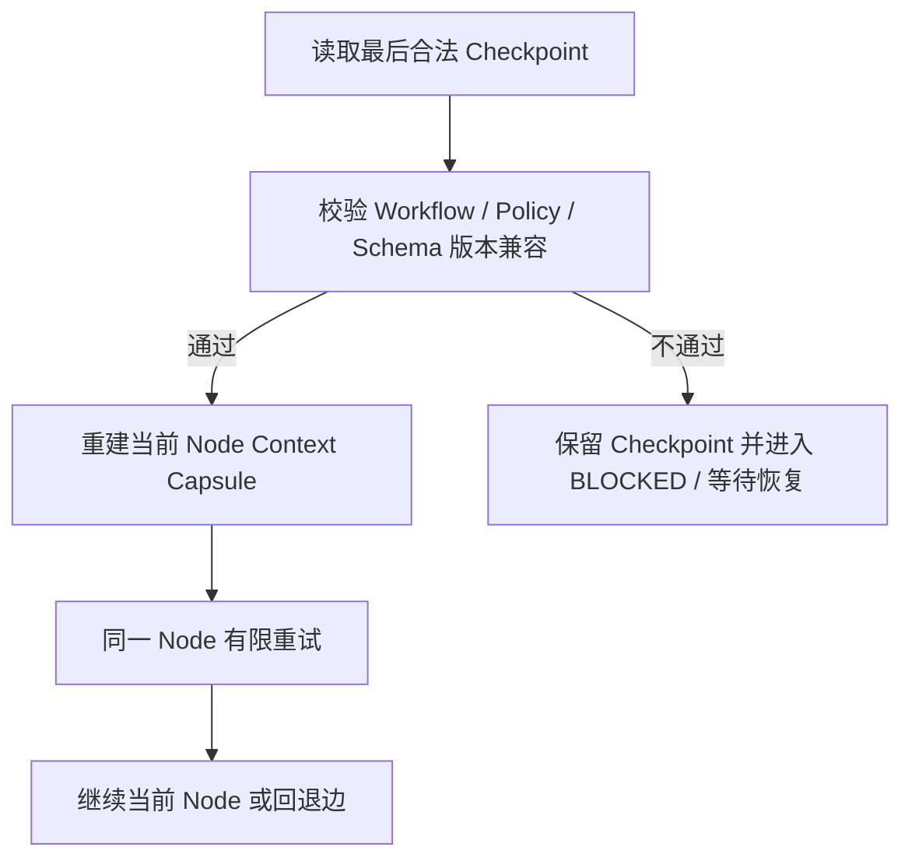
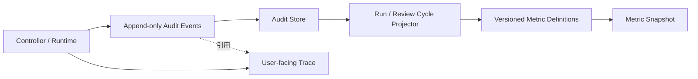
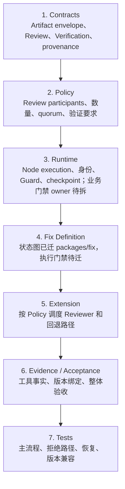

# Fix Runtime 技术设计（L2 目标设计与当前实现）

- 层级：第二层（L2）
- 状态：`REVIEWING`
- 上游：[Fix Extension 产品规范](../01-产品定义/扩展/fix-扩展.md)

> L1 定义 Fix 必须保证什么；本文定义 Runtime 怎样把这些保证落成可执行的 Stage、Node、Policy、Artifact、Guard、验证和恢复机制。源码与测试仍是当前运行事实；尚未实现的目标在文中明确标注。

## 1. L2 执行模型



Runtime 的责任边界：

- `Workflow Definition` 定义允许的 Node、Stage 语义和产品路径；
- `Policy` 配置执行方式，但不能降低 L1 的最低保证；
- `Worker` 只提交当前 Node 的 Artifact，不能修改 Run 状态；
- `Artifact Schema` 校验结构，不把 Worker 的自报结论当成事实；
- `Transition Guard` 判断一条具体流转是否允许；
- `Acceptance Definition` 综合判断整个 Run 是否可以进入 `ACCEPTED`；
- Controller 保存 checkpoint、执行 Guard、生成迁移记录和最终 Acceptance Result。

## 2. Stage 与 Node 的落地边界

Stage 是 Run 级别的粗粒度业务位置；Node 是 Stage 内一次独立、可审计的工作。Review 不自动变成新的 Stage，独立性通过 Node Execution、`workerId` 和 Artifact provenance 保证。最终人工验收复用 `WAITING_FOR_USER`，由 Controller 创建待确认请求，不增加 Agent Node。



目标内部 Stage ID 可以由 L2 选择；本设计建议使用：

```text
INTAKE
INVESTIGATING
DISPOSITION
IMPLEMENTING
VERIFYING
BLOCKED
WAITING_FOR_USER
ACCEPTED
```

Stage 配置统一声明其包含的 Node；Node 配置不重复声明所属 Stage。这样 `change_plan_review` 和 `change_review` 虽然是独立 Node，但仍由所属 Stage 的 Node 列表表达其位置。

建议的 Node ID 为：

```text
intake
investigate
investigation_review
disposition
change_plan_review
implement
change_review
verify
```

`investigation_review`、`change_plan_review` 和 `change_review` 是独立 Node。一个 Review Policy 可以让同一 Node Definition 创建多个独立 Node Execution；不通过时由 Controller 按固定回退边恢复，不能由 Worker 自行选择下一步。最终人工验收不是 Agent Node，而是由 Controller 驱动的 `WAITING_FOR_USER` 用户决定门禁。

## 3. Review Policy：多 Agent 怎样配置

多 Agent 评估是 L2 的执行配置，不由 Worker Prompt 临时决定。Policy 至少分为三类 Review：



## 3. Policy 默认值与项目配置

Policy 不负责重新定义 Fix 流程，而是配置一次 Workflow Run 怎样执行。Runtime 先加载不可绕过的 Workflow Definition 和 L1 最低保证，再合并 Runtime 默认值与项目 `.pi/workflow.json`：



四类内容的边界：

| 层 | 责任 | 是否可被项目覆盖 |
| --- | --- | --- |
| L1 最低保证 | 必须经过调查复核、修改前方案评估、修改后 Review 和整体验收 | 不可关闭或降低 |
| Workflow Definition | 默认 Stage、Stage 包含的 Node、允许 Transition 和回退边 | 不可通过普通 Policy 改写 |
| Runtime Defaults | 默认 Stage、Node、Transition、模型、Skill、工具、Review、验证、重试和恢复参数 | Runtime 内置；项目不能改变流程和控制条件 |
| `.pi/workflow.json` | 每个 Node 使用的模型和 Skill；Skill 可提供项目特有的检查方法与验收证据要求 | 只能改变执行选择，不能改变流程、Guard 或 L1 Acceptance 最低条件 |

Node 的职责由 Node ID 表达，Node 配置不重复声明 `stage` 或 `role`。Stage 与 Node 的归属由 Workflow Definition 统一维护；Worker 的实际身份由 Runtime 生成并记录 `workerId`，不由静态 JSON 冒充。

Runtime Defaults 固定提供：

- Stage、Stage 与 Node 的归属、核心 Transition 和回退边；
- Node 的默认模型、Skill、上下文、工具和 Artifact 类型；
- 三类 Review 的默认参与数量、独立身份要求、通过条件和 Finding 规则；
- Verification 的最低检查类别、证据要求、未验证项和剩余风险规则；
- Worker session 的默认重试、超时、checkpoint 和恢复兼容策略。

`.pi/workflow.json` 只配置：

- 每个 Node 本次使用的模型；
- 每个 Node 本次加载的 Skill；
- Skill 中提供的项目特有调查方法、验证清单和验收证据格式。

项目不能通过 `.pi/workflow.json` 配置 Reviewer 数量、requiredApprovals、Transition、Guard、工具 allowlist、Acceptance 最低条件或回退路径。

Policy 不得配置为绕过 L1 最低保证。以下控制由 Runtime 固定强制，不能通过 JSON 关闭：

- Worker 不能直接修改 Run Stage 或生成 `ACCEPTED`；
- 调查 Reviewer、方案 Reviewer、PR Reviewer 必须满足独立身份约束；
- Artifact 必须通过 Schema、来源和目标 Run 校验；
- `candidateRevision` 必须在实现、PR Review 和验证之间一致；
- 必需 Finding 未关闭时不能通过对应 Guard；
- 只有 Controller 能生成 Transition Record 和 Acceptance Result。

配置形态采用项目级 `.pi/workflow.json`。下面的 `defaults` 只用于展示 Runtime 内置策略；它不是项目文件格式。实际项目文件不包含 `defaults`、Workflow Definition、Stage、Transition、Review 数量或 Acceptance 条件，只写 Node 的模型和 Skill。字段名和默认值仍需在实现阶段通过 contracts、Policy parser 和测试最终确定，不是当前已实现格式：

```json
{
  "version": 1,
  "defaults": {
    "workflow": {
      "id": "fix",
      "definitionVersion": "fix-v2",
      "initialStage": "INTAKE",
      "stages": {
        "INTAKE": { "nodes": ["intake"] },
        "INVESTIGATING": { "nodes": ["investigate", "investigation_review"] },
        "DISPOSITION": { "nodes": ["disposition", "change_plan_review"] },
        "IMPLEMENTING": { "nodes": ["implement", "change_review"] },
        "VERIFYING": { "nodes": ["verify"] },
        "BLOCKED": { "nodes": [] },
        "WAITING_FOR_USER": { "nodes": [] },
        "ACCEPTED": { "nodes": [] }
      },
      "transitions": [
        { "from": "INTAKE", "to": "INVESTIGATING", "after": "intake_accepted" },
        { "from": "INVESTIGATING", "to": "INVESTIGATING", "after": "investigation_review_needs_more_evidence" },
        { "from": "INVESTIGATING", "to": "DISPOSITION", "after": "investigation_review_accepted" },
        { "from": "DISPOSITION", "to": "DISPOSITION", "after": "change_plan_review_rejected" },
        { "from": "DISPOSITION", "to": "IMPLEMENTING", "after": "change_plan_review_accepted" },
        { "from": "DISPOSITION", "to": "VERIFYING", "after": "no_repository_change" },
        { "from": "IMPLEMENTING", "to": "IMPLEMENTING", "after": "change_review_needs_changes" },
        { "from": "IMPLEMENTING", "to": "VERIFYING", "after": "change_review_accepted" },
        { "from": "VERIFYING", "to": "WAITING_FOR_USER", "after": "verification_accepted" },
        { "from": "VERIFYING", "to": "IMPLEMENTING", "after": "verification_requires_change" },
        { "from": "WAITING_FOR_USER", "to": "ACCEPTED", "after": "human_approved" },
        { "from": "WAITING_FOR_USER", "to": "IMPLEMENTING", "after": "human_requested_changes" },
        { "from": "WAITING_FOR_USER", "to": "BLOCKED", "after": "human_rejected" }
      ]
    },
    "nodes": {
      "defaults": {
        "model": "inherit",
        "skills": [],
        "tools": ["read", "submit_artifact"],
        "execution": { "maxAttempts": 2, "timeoutMs": 600000 }
      },
      "intake": { "artifactKind": "intake" },
      "investigate": {
        "model": "inherit",
        "skills": ["cst-plus"],
        "context": ["problem", "intake", "project_knowledge"],
        "artifactKind": "investigation"
      },
      "investigation_review": {
        "context": ["problem", "intake", "investigation"],
        "artifactKind": "investigation_review"
      },
      "disposition": {
        "context": ["investigation", "investigation_review", "project_knowledge"],
        "artifactKind": "disposition"
      },
      "change_plan_review": { "artifactKind": "change_plan_review" },
      "implement": {
        "model": "inherit",
        "skills": ["tdd"],
        "tools": ["read", "edit", "write", "submit_artifact"],
        "context": ["problem", "investigation", "investigation_review", "disposition", "accepted_plan"],
        "artifactKind": "implementation"
      },
      "change_review": { "artifactKind": "change_review" },
      "verify": {
        "context": ["problem", "investigation", "disposition", "implementation", "change_review"],
        "artifactKind": "verification"
      }
    },
    "review": {
      "investigation": {
        "reviewers": [{ "model": "inherit", "skills": [] }],
        "mode": "parallel",
        "requiredApprovals": 1,
        "requireIndependentWorker": true,
        "excludeNodes": ["investigate"],
        "onRejected": "return_to_investigation"
      },
      "changePlan": {
        "reviewers": [
          { "model": "inherit", "skills": [] },
          { "model": "inherit", "skills": [] }
        ],
        "mode": "parallel",
        "requiredApprovals": 2,
        "requireIndependentWorker": true,
        "excludeNodes": ["investigate", "implement"],
        "requiredChecks": [
          "root_cause_alignment",
          "minimal_scope",
          "risk_and_compatibility",
          "verification_plan",
          "rollback_plan"
        ],
        "onRejected": "return_to_disposition"
      },
      "change": {
        "reviewers": [{ "model": "inherit", "skills": [] }],
        "mode": "parallel",
        "requiredApprovals": 1,
        "requireIndependentWorker": true,
        "excludeNodes": ["implement"],
        "onRejected": "return_to_implementation"
      }
    },
    "artifacts": {
      "schemaVersion": 1,
      "requireEnvelope": true,
      "requireProvenance": true,
      "requireEvidenceReferences": true,
      "requireCandidateRevisionBinding": true,
      "allowedKinds": [
        "intake", "investigation", "investigation_review", "disposition",
        "change_plan_review", "implementation", "change_review", "verification", "user_decision"
      ]
    },
    "verification": {
      "requiredChecks": [
        "original_issue", "root_cause_cut",
        "identified_impact_surface", "regression_and_compatibility"
      ],
      "requireToolOrTestEvidence": true,
      "requireCandidateRevisionMatch": true,
      "allowUnverified": false,
      "requireRemainingRisk": true,
      "onRejected": "return_to_implementation"
    },
    "acceptance": {
      "requires": [
        "intake_accepted", "investigation_review_accepted", "disposition_accepted",
        "verification_accepted", "original_issue_verified", "root_cause_cut_verified",
        "impact_and_regression_verified", "required_findings_closed",
        "candidate_revision_consistent", "unverified_items_allowed", "remaining_risk_recorded",
        "human_final_approval"
      ],
      "repositoryChangeRequires": [
        "change_plan_review_accepted", "implementation_accepted", "change_review_accepted"
      ]
    },
    "execution": {
      "maxAttemptsPerNode": 2,
      "retryTransientModelErrors": true,
      "retryContractErrors": true,
      "checkpointAfter": [
        "artifact_accepted", "transition_accepted", "review_decision",
        "acceptance_result", "recoverable_failure"
      ],
      "resume": {
        "requireWorkflowVersionMatch": true,
        "requirePolicyDigestMatch": true,
        "requireSchemaVersionCompatibility": true
      }
    }
  }
}
```

实际项目文件示例：

```json
{
  "version": 1,
  "nodes": {
    "investigate": {
      "model": "smartingredients/gpt-5.6-sol",
      "skills": ["cst-plus", "aliyun-sls-query", "mysql-readonly", "redis-readonly"]
    },
    "implement": {
      "model": "smartingredients/gpt-5.6-terra",
      "skills": ["tdd"]
    },
    "verify": {
      "model": "smartingredients/gpt-5.6-sol",
      "skills": ["backend-service-verification"]
    }
  }
}
```

实际合并顺序固定为：

```text
L1 最低保证 + Workflow Definition
  → Runtime Defaults
  → .pi/workflow.json
  → Effective Policy
```

`.pi/workflow.json` 是项目执行选择，不是第二份 Workflow Definition。覆盖规则：

- `.pi/workflow.json` 只能覆盖 Runtime Defaults 中允许项目选择的 Node 模型和 Skill；未知字段、未知 Node 或非法 Skill 直接拒绝；
- 数量、超时、重试等数值必须经过 Runtime 上限和 L1 下限校验；
- `tools` 只能缩小默认 allowlist，不能扩大 Runtime 全局能力上限；
- `requiredApprovals` 不能低于 L1 或 Review Definition 要求；
- 不能覆盖 `workflow.stages`、核心 Transition、Artifact provenance、身份独立性和 Acceptance 必需条件；
- 最终生效配置生成 canonical JSON 和 digest，并写入 Workflow Run checkpoint 与审计记录。

没有写入 `.pi/workflow.json` 的 Node 自动使用 Runtime Defaults。项目文件不复制 Runtime 默认配置，也不声明完整 Workflow Definition。

`.pi/workflow.json` 中以下内容属于项目可配置项：

```text
每个 Node 使用的模型
每个 Node 加载的 Skill
Skill 提供的项目特有调查方法、验证清单和验收证据格式
```

以下内容继续由 Runtime Defaults 和固定 Guard 管理，项目文件不能覆盖：

```text
Workflow 流程、Stage、Node 归属、Transition 和回退路径
Review 是否存在、Review 最低独立性和最低通过条件
工具 allowlist 和 Runtime 能力边界
Acceptance 最低条件
重试、checkpoint 和恢复兼容的安全下限
```

以下内容不属于普通 JSON 配置，而是 Runtime 的不可绕过控制：

```text
工具实际是否可用以及全局能力上限
Worker 是否真的提交了 Artifact
Artifact 是否属于当前 Run / Node Execution
独立 Worker 身份是否满足约束
工具 / 测试事件是否支持 evidence
Controller 是否拥有状态迁移权
Acceptance Result 是否由 Controller 生成
```

项目的具体测试命令、业务不变量和外部系统检查不应硬编码进通用 Fix Policy；它们由被 `.pi/workflow.json` 选择的 Skill 和 Project Knowledge 提供。Skill 可以补充项目特有的检查方法、验证清单、验收证据格式和命令，但不能关闭或降低 L1 Acceptance 最低条件，也不能改变 Workflow 流程、Stage、Transition、Guard 或工具能力边界。

## 4. Artifact Contract 与来源绑定

Artifact Schema、Runtime Guard 和 Acceptance 的职责不同：



所有目标 Artifact 都应有统一 envelope：

```json
{
  "kind": "<artifact-kind>",
  "schemaVersion": 1,
  "runId": "<run-id>",
  "nodeExecutionId": "<node-execution-id>",
  "workerId": "<worker-id>",
  "producerKind": "worker",
  "sourceVersion": "<baseline-or-candidate>",
  "evidence": [],
  "unverified": [],
  "conclusion": "<structured-conclusion>"
}
```

目标 Node Artifact 的最小业务字段：

| Node | 必须表达的事实 |
| --- | --- |
| `investigate` | 现象、预期、实际、根因分层、时间线、影响面、route、证据和未验证项 |
| `investigation_review` | 目标调查 Artifact、检查范围、根因结论、证据充分性、停止调查理由、缺口和复核结论 |
| `disposition` | 处置类型、最小范围、风险、验证目标、是否需要仓库变更、是否触发正式方案评审 |
| `change_plan_review` | 目标方案版本、根因对应关系、修改范围、风险、兼容性、验证、回滚、Finding 和评估结论 |
| `implement` | 修改摘要、文件/对象、candidate revision、PR 引用和实现限制 |
| `change_review` | 被 Review 的 candidate revision / PR diff、Finding、Finding disposition 和 Review 结论 |
| `verify` | 当前候选版本或处置对象版本的原始问题结果、根因切断结果、影响面回归、工具/测试证据、未验证项和剩余风险 |
| `user_decision`（Controller / User） | 用户针对当前验证版本的最终 `approve`、`request-changes` 或 `reject` 决定 |

Schema 通过不代表 Artifact 事实成立。Runtime 还必须检查：

- Artifact 的 `runId`、`nodeExecutionId` 和 `workerId` 是否属于当前执行；
- Review 是否引用了正确的上游 Artifact；
- Reviewer 是否与被 Review 的 Worker 身份不同；
- `candidateRevision` 是否在 Implementation、Change Review 和 Verification 之间一致；
- evidence 是否能关联到实际工具事件、测试结果或明确外部来源；
- 必需 Finding 是否已由有权限的独立 Worker 关闭；
- `User Decision Artifact` 是否由 CLI / Controller 产生，而不是由 Worker 自报；
- User Decision 是否绑定当前 Verification 的版本、Run 和待确认请求；
- 项目需要的合并、部署、配置生效或外部处置证据是否由 Project Knowledge / Skill 提供，并展示给用户确认。

## 5. Transition Guard 与 Acceptance 实现

这两个控制面必须分开实现：



Transition Guard 的目标检查：

```text
investigate → investigation_review
  有合法调查 Artifact，且目标属于当前 Run

investigation_review → DISPOSITION
  独立 Reviewer 通过，根因和证据链达到 L1 要求

investigation_review → investigate
  复核不通过，且带有可执行补查缺口

disposition → change_plan_review
  Disposition 明确需要仓库变更，且方案输入完整

change_plan_review → implement
  达到 Policy 的通过条件，且正式方案变化已完成 Adoption Decision

implement → change_review
  产生 candidate revision / PR 输入

change_review → verify
  绑定同一 candidate revision，必需 Finding 已关闭

verify → WAITING_FOR_USER
  自动验证通过，Controller 创建绑定当前版本的待确认请求

WAITING_FOR_USER → ACCEPTED
  收到绑定当前版本的 `approve` User Decision Artifact

WAITING_FOR_USER → IMPLEMENTING / BLOCKED
  收到 `request-changes` 或 `reject` 决定
```

Acceptance Definition 不是单个 `verification.accepted === true`。至少综合检查：

```text
问题现象已确认
调查复核已通过
Disposition 已接受
CHANGE_PLAN_REVIEW 已通过（适用时）
IMPLEMENTATION / CHANGE_REVIEW 绑定同一 candidate revision（适用时）
项目特有的合并、部署、配置生效或外部处置证据已作为确认输入（适用时）
当前生效版本 / 处置对象版本与 Verification 绑定一致
当前版本绑定的 User Decision Artifact 为 `approve`
必需 Finding 已关闭
原始现象验证通过
根因已切断
已识别影响面和关键不变量完成回归
未验证项符合 Policy 和 L1 允许范围
剩余风险和必要用户 / 外部决定已明确
```

自动验证完成后，Controller 进入 `WAITING_FOR_USER`，创建绑定当前 Run、pending decision request 和验证版本的待验收记录。Pi TUI 的主要人工验收入口是静态 Review Panel，不要求普通用户记忆 `runId`、Stage、candidate revision 或决定命令。

```text
Fix 结果待确认

问题：<用户报告的现象>
结论：<根因与处置摘要>
修改：<文件 / 配置 / 外部处置>
版本：<当前 candidate revision 或处置对象版本>
验证：<原始问题、根因切断、回归结果>
未验证项：<无或具体项目>
剩余风险：<无或具体风险>

> 接受并完成
  继续修改
  标记未解决
```

TUI 实现使用 Pi 原生 `ctx.ui.custom()`，并优先组合 `Markdown`、`SelectList`、`Container` 和 `DynamicBorder`。界面是静态、宽度自适应的选择面板：不实现动画、不自定义 spinner、不手写 ANSI、不使用自动轮播，也不通过持续定时刷新改变布局。内容过长时由 Markdown 换行，详细报告、Diff 和验证证据按需展开或通过独立查看动作打开，默认视图保持紧凑稳定。

交互映射如下：

| 用户看到的操作 | 内部决定 | Controller 行为 |
| --- | --- | --- |
| 接受并完成 | `approve` | 重新校验当前版本和 Acceptance Definition，通过后进入 `ACCEPTED` |
| 继续修改 | `request-changes` | 再选择结构化原因并填写可选说明，按原因回到调查、处置或实现 |
| 标记未解决 | `reject` | 再选择结构化原因；真正缺少外部条件时进入 `BLOCKED`，可继续处理的问题回到对应阶段 |

“继续修改”和“标记未解决”的原因使用 `SelectList` 收集，说明使用 `ctx.ui.input()` 或 `ctx.ui.editor()` 收集。用户只选择业务语言原因，例如“根因判断不对”“修复不完整”“验证证据不足”或“缺少外部条件”；Controller 将原因码确定性映射到 `INVESTIGATING`、`DISPOSITION`、`IMPLEMENTING` 或 `BLOCKED`，不让模型根据自由文本自行选择 Transition。

触发方式如下：

- 当前交互式 `/fix` 完成自动验证时，直接打开该 Run 的 Review Panel；
- `/fix review` 打开当前唯一待验收 Run；存在多个待验收 Run 时先使用 Pi 原生选择列表选择；
- `/fix review <runId>` 作为调试或精确定位入口，打开指定 Run 的同一 Review Panel；
- TUI 以外的 RPC、JSON、print 或自动化场景通过结构化 pending decision 和决定接口处理，不依赖自定义终端组件。

Review Panel 只负责展示和收集选择。每次提交决定前，Runtime 仍要校验 Run 当前处于 `WAITING_FOR_USER`、pending decision request 未失效、展示版本等于当前版本、Review / Verification 仍有效；合法选择才由 Controller 生成 `User Decision Artifact`。自然语言消息、Worker 自报、UI 显示状态或修改 checkpoint 文件都不能代替用户决定。

用户 `request-changes` 或项目动作使 candidate revision、配置版本、部署版本或处置对象版本变化时，旧版本绑定的 Review、Verification 和 User Decision 自动失效，Controller 必须要求重新评估并重新验证当前版本。

## 6. Worker Session、身份与恢复

每次 Node Execution 创建独立 Worker Session，并记录：

```text
runId
nodeExecutionId
workerId
role
attempt
model
skill set
policyVersion / policyDigest
context capsule reference
```

身份约束由 Runtime 强制：



Checkpoint 不能只保存 Stage。目标 checkpoint 还要保存：

```text
activeNodeId
nodeExecutionId
acceptedArtifacts
review decisions / findings
candidate revision
policy version / digest
pending user or external decision
last valid transition
```

恢复流程：



当前实现恢复阶段覆盖 Stage、Artifact 与候选版本；restore 对 checkpoint 做 fail-closed 的
Provenance 与验收重放（见本节“恢复”段落）：

- worker Artifact 必须以 runId 为前缀且 nodeExecutionId 的 node 段必须能产出对应 kind
  （未知 node 一律拒绝）；受控终局定义下该 kind 绑定在 executeNode 提交时即强制（NODE_KIND_MISMATCH），
  restore 对历史 checkpoint 同样 fail-closed；评审 Artifact 必须由与所评产物不同的 workerId 产出（防“自我评审”）；
- controller/用户不得以 controller producerKind 伪造业务 Artifact 冒充 worker 产出；
- BLOCKED checkpoint 保存产生阻塞所在 returnStage（如外部条件验证失败 → VERIFYING），
  跨 session 恢复时回到阻塞点所在阶段，不默认回滚到 INVESTIGATING；
- v2 ACCEPTED checkpoint 恢复 fail-closed 由三层事实共同构成：
  1) Runtime decide() 盖章的显式决策记录（checkpoint.decisionRecord：producerKind='user_decision' +
     source='runtime:decide' + requestId 绑定 pendingDecisionRequest）；平铺字段
     decisionKind/decisionReference 可手填，不是可验证的 approve 事实；
  2) 来源绑定：受控终局定义必须声明 definition.sourceVersion，且 checkpoint 顶层
     sourceVersion === 定义声明值（unbound 或自洽伪造字符串都不是完整 V2 来源事实）；
  3) 决策记录与 checkpoint 的版本绑定（approve 必须携带与 run 候选版本一致的 candidateRevision）；
  并且 decisionRecord 必须被 checkpoint.artifacts 中 Runtime decide() 盖章归档的 user_decision 审批
  Artifact 背书（producer='user'、producerKind='user_decision'）。该 Artifact 在 applyTransition('ACCEPTED')
  之前写入 Runtime 产物集（checkpoint 序列化读同一产物集），因此真实写出与恢复校验同源；恢复时
  restoreArtifacts 不对 user_decision 强制 worker business conclusion（它是 Runtime 的验收背书，不是
  worker 业务事实）。
  三者全过后再按 decisionReference 合成人工 approve 重新求值完整 Acceptance，任一验收事实缺失
  或伪造（ACCEPTED_ACCEPTANCE_NOT_MET）都 fail-closed 拒绝恢复，不产出“已解决（验收通过）”报告。
- 受控扩展 reviewPolicyFor：runReview 与 DISPOSITION→IMPLEMENTING 的 change_plan_review 门禁都绑定
  “当前有效策略”（逻辑等价摘要 policyDigest）：降级策略 runReview 直接拒绝（REVIEW_POLICY_MISMATCH），
  账本周期被篡改时门禁按当前策略重算 quorum 并按唯一评审者身份计数（同一 worker 重复出票不能凑足
  人数，REVIEWER_WORKER_ID_REPEATED）。
- change_plan_review 周期的身份绑定（S1 影子节点）：周期由 runReview 记账产出时必须绑定到规定义上的
  change_plan_review 节点 id；门禁在 DISPOSITION→IMPLEMENTING 检查
  NODE_KIND_BY_NODE_ID[cycle.reviewNodeId] === 'change_plan_review'，因此用声明之外的节点名
  （如 change_plan_review_shadow）发起 runReview（runReview 对未知 id 保持通用语义）无法产生可放行
  的正式周期（CHANGE_PLAN_REVIEW_NOT_BOUND）。恢复（配置 reviewPolicyFor 时）同样按
  NODE_KIND_BY_NODE_ID[record.reviewNodeId] === record.reviewArtifactKind 校验每个周期节点，
  语义不一致的周期 CHECKPOINT_REVIEW_LEDGER_INCONSISTENT。
- reviewCycleId 唯一性：周期 id 是账本↔Artifact 盖章的绑定键，为 `${runId}.review.<clock>.<seq>`，
  seq 为实例内单调序号（恢复时以已有周期 id 的最大序号后缀为起点，而不是条数——条数可能与最大序号
  不一致）。默认 clock 为毫秒级，同一 run 内同一毫秒发起两次 runReview 若不区分序号会产生相同周期
  id，导致门禁/恢复的账本-产物推导把多轮评审产物串进同一周期（误拒合法流程）。
- 账本形状 fail-closed（S2b/S7）：checkpoint.reviewCycles 只要存在就必须逐条完整合法；非数组或
  含形状非法记录一律 CHECKPOINT_REVIEW_LEDGER_INCONSISTENT，不得静默过滤后继续（过滤会丢失审计
  事实并让受损账本看起来正常）。
- 验收的账本要求（S1/P2-3）：change_plan_review_accepted 现在要求评审不仅内容/顺序/处置绑定成立，
  还必须由 Runtime review cycle 记账产出（同一套绑定规则：cycle 存在 + 节点身份 + 当前策略摘要 +
  推导数字一致 + quorum）——只删掉 reviewCycles 让伪造 ACCEPTED 过关的路径被关闭；无仓库变更路径
  不需要方案评审，同样不需要账本。
- 恢复账本一致性（SP3）：配置 reviewPolicyFor 的受控恢复在 restore 阶段即核对每个账本周期——
  周期必须由当前有效策略产出（policyDigest 一致），且 approvals/passed/唯一评审者数字必须能被
  checkpoint 中实际评审 Artifact 支撑；账本整体伪造（当前摘要 + 手写 cycleId + 虚增 quorum）在
  restore 阶段即 fail-closed（CHECKPOINT_REVIEW_LEDGER_INCONSISTENT）。未配置 resolver 的通用
  restore 保持形状校验。
- 账本形状逐条完整（round-4 Spec P2）：形状校验覆盖全部必填字段——cycleId、reviewNodeId、
  reviewArtifactKind、reviewedNodeId、requiredApprovals/approvals（有限非负整数，NaN/负数/小数
  拒绝）、passed、reviewerWorkerIds（非空字符串数组）、policyDigest、dispositionIndexAtCycle
  （≥ -1）、recordedAtIndex（≥ 0）。缺任一字段即 CHECKPOINT_REVIEW_LEDGER_INCONSISTENT。
- 恢复重建 Node→Worker 身份（round-4 S1/P1）：restore 把 checkpoint 中带 nodeExecutionId 的
  Artifact 按 node 段登记进 nodeWorkerIds，恢复后新发起的 runReview（requireIndependentWorker /
  excludeNodes / reviewedNode 排除）仍把历史作者排除——恢复不是绕过评审独立性的后门。
- run_started 一次性（round-4 S4/P4）：run_started 只在 Runtime 创建新 runId 后发一次；恢复同一
  runId 时恢复已执行的 Artifact 即视为已启动，续跑的第一个 Node 不得再次产生启动事件。
- 验证 Guard 稳定码（round-4 S2/P3）：guardVerification 的失败以 message 前缀码形式抛出，扩展端
  withGuardCode 提升为结构化 code 写入 workflow-node-failure.data.code 与通知；无法解析前缀的
  普通错误用 VERIFICATION_GUARD_FAILED 兜底（都是稳定码，不是自由文本）。
- WAITING_FOR_USER 恢复的等待现场（P2-1 bound）：受控终局定义且 checkpoint 携带
  pendingDecisionRequest 时，恢复的等待态必须由“已接受的验证（或配置类失败的验证）”背书，否则
  CHECKPOINT_STATE_INCONSISTENT——凭空伪造的等待态不得续跑后在同一个调用里直接 approve。
  无决策管线的最小形状校验现场不受影响。
- 决策 Artifact 三处版本同源（P2-2）：run 产生候选版本时，approve 决策有三处必须绑定同一
  candidateRevision——平铺 decisionCandidateRevision、decisionRecord.candidateRevision、以及
  Runtime 盖章归档的 user_decision Artifact 上的 candidateRevision；任一处缺失或不一致 →
  ACCEPTED_ACCEPTANCE_NOT_MET。
- 受控终局能力显式声明（P1-1）：仅当定义显式声明 decision: 'user' 且 acceptance 带
  human_final_approval marker 时，Runtime 才保有 ACCEPTED 终局唯一 owner 权；legacy 定义未
  opt-in 时保留自身 guard/transition 语义（合法不变量保持）。不允许仅凭 marker 推断受控终局。
- live 来源绑定（SP2）：受控终局定义下，applyTransition('ACCEPTED') 时若定义声明了 sourceVersion，
  Runtime 当前来源必须等于声明值（ACCEPTED_SOURCE_VERSION_MISMATCH）。防止“伪造来源的非终局
  checkpoint 续跑后在同一 continueRun 内 approve 直接产出 ACCEPTED 并发报告”（该 ACCEPTED 不再经过
  restore 的顶层来源检查）。Runtime 控制面错误（CheckpointRestoreError / WorkflowRuntimeError /
  ReviewPolicyError 等带稳定 code 的错误）在 extension 统一收敛为 `fix failed/paused: message (CODE)`
  通知与 trace，失败后清理 workflow working 状态（避免 UI 一直显示执行中）。
- 暂停即清理 working（round-4 S3）：workflow 停止主动执行并等待外部输入的所有分支——用户取消/
  无交互收集中断、验收条件不满足、BLOCKED 无 UI、BLOCKED 用户未提供补充信息——都在 return 前
  clearWorkflowWorking，避免 Pi UI 持续显示“执行中”。
- nodeExecutionId 解析单点（round-5 S1/P1）：node 段只有一条严格规则 `${runId}.<node>.<ts>`（node
  非空、不含点；ts 非空，不强制数字以兼容旧数据）。恢复校验与 collectNodeWorkerIds 共用同一
  解析函数：多段/缺段/空段一律 fail-closed（INVALID_CHECKPOINT_PROVENANCE），杜绝“多段 executionId
  通过恢复校验却不登记进排除表 → 同一作者恢复后自评”的绕过。
- started 标记落盘（round-5 S2）：首次执行 Node 时，Runtime 在发出 run_started 的同一时刻补写一条
  最小 checkpoint（仅 {runId, stage, started:true}，无业务字段）；此后每次 checkpoint 顶层带
  started:true。恢复规则：started:true → 已启动；无字段但已有 Artifact → 推断已启动；两者皆无 →
  确未启动，续跑仍允许首次启动事件。首个 Node 即使 Worker 提交前失败（0 Artifact）也不会对同一
  runId 重复发出 run_started。contracts `Checkpoint` 增加 `started?: boolean`。
- 账本身份/位置绑定（round-5 S3）：deriveCycleFacts 除 counts 外还推导评审者身份集合
  （reviewerWorkerIds，去重排序）与周期最后一个 Artifact 的真实位置（lastCycleArtifactIndex）。
  门禁、planReviewCycleBacked 与恢复 reconcile 三处都要求账本 reviewerWorkerIds 与推导集合完全一致
  （sameReviewerSet）且 recordedAtIndex === lastCycleArtifactIndex——“同一个周期换同一人数的另一伙人”
  或“把记账位置改到其他产物上”都只是不算数的伪造。身份集合与记账位置是与策略无关的事实，configured
  与 unconfigured 两条路径都强制；严格性有保障：artifacts 只追加、下标永不重排，真实记账时刻
  （book 时 artifacts.length-1）恢复到现场时仍精确等于该周期最后一条 Artifact 的下标。
- 决策来源诚实（round-5 P5）：decisionRecord（含 source: 'runtime:decide'）只由 decide() 委托路径
  盖章（决策全程置 decisionRecordProducer，失败/异常 finally 复位）；legacy resume()/gate 决策不附加
  v2 决策来源记录，保持 legacy 形状。requestId 缺失时 decisionReference/decisionRecord.requestId 直接
  省略，绝不写出 'undefined' 字面量。
- 验证 Guard 码命名空间（round-5 P4）：withGuardCode 只承认 ^VERIFICATION_[A-Z0-9_]+: 前缀；
  其他大写前缀的普通错误回退 VERIFICATION_GUARD_FAILED（稳定码，不把自由文本当码）。round-6 补齐
  边界测试：VERIFICATION_ 前缀提升为码、其他大写前缀/裸前缀/大小写不符/非 Error 输入一律回退。
- started 标记上下文完整（round-6 P1-1 回归修复）：启动标记从最小 {runId, stage, started:true} 升级为
  携带 workflowVersion/policyDigest/sourceVersion（workflowVersion = definitionVersion ??
  sourceVersion；sourceVersion = 实例来源 ?? definition 声明来源）。原因：首 Worker 在提交前失败后恢复
  该标记，若缺版本/策略会被判定 checkpointIncomplete、缺来源则后续盖章退回 'baseline' 触发
  ACCEPTED_SOURCE_VERSION_MISMATCH——ACCEPTED 在 rescue 路径上永远不可达。恢复时三者在 executeNode
  前已恢复到实例；单元测试覆盖真实“首节点失败 → 恢复标记 → 重试 intake/verify → approve → ACCEPTED”
  （requiresArtifactConclusion 下 checkpoint_complete 与来源绑定均需通过）。
- cycleId 唯一性（round-6 P2-1）：cycleId 是账本↔Artifact 绑定键；checkpoint 中重复 cycleId 使反向
  查找的解释依赖记录顺序，restore 一律 CHECKPOINT_REVIEW_LEDGER_INCONSISTENT fail-closed
  （Set 大小 vs 长度），不再静默接受任一条。
- 定义声明版本的恢复默认绑定（round-7 Spec P2）：restore 在定义声明 `version` 时以它作为默认期望
  workflowVersion（expectedWorkflowVersion ?? definition.version）——调用方未显式传
  expectedWorkflowVersion 也不能接受错误版本，恢复契约包含定义声明版本；
  definition.version 未声明 → unbound，维持向后兼容。restore 重建的 definitionVersion 也使用该默认绑定。

新增 follow-up（round-7 评审，均已记录、暂不扩 scope）：
- 门禁重复校验路径：Transition Guard（assertChangePlanReviewGate）与 planReviewCycleBacked 各自复制了
  账本查找/策略摘要/计数/评审者集合校验，返回形式不同；后续规则修改可能只更新一处（评审判断项，
  非硬违约），重构前先收敛到共享校验路径。
- test 33 证明力：重复 cycleId 的 fail-closed 实现已确认无绕过，但测试仅用最小 cycle record
  （DISPOSITION 阶段、无 Artifact/策略 resolver 语境）；完整 Artifact + 策略 + 门禁回放场景留作后续加固。

Pi 原生 `/resume` 负责选择并恢复历史 session。Fix 不注册自己的 `/resume` 命令；`session_start` 的 `reason=resume` 只允许 Fix 检查当前被恢复 session 内的未完成 Fix checkpoint。用户确认后，Controller 才能从该 checkpoint 继续原 `runId`；不得跨 session 搜索，不得创建新的 `runId`，也不得在没有用户确认时自动推进。投递 outbox 的恢复可以由 session 生命周期触发，但必须与 Fix Run 的恢复分开。

## 7. Audit Event 与漏斗计算

本节把 L1 的流程漏斗、质量漏斗和自动化准入漏斗落实为可重算的数据模型。当前源码尚未实现这些完整事件和聚合器；本节是目标 L2 设计，不能作为当前已有指标的声明。

### 7.1 数据流与责任边界



- Controller 在合同校验、Guard、Transition、人工决定和后验反馈发生时写入结构化事件；Worker 不能自行写成功事件或 Acceptance 结果；
- 当前实现状态（本轮已落地子集）：事件由 Runtime.recordEvent 在真实产生点写入——runReview 评审
  完成（investigation / change_plan_review / change_review 各自事件类型）、executeNode 提交/拒绝、
  decide（人工决定 / run_accepted / run_rework 返工回流）、artifact 合同拒绝；事件携带实例内唯一 eventId
  （idGen + 单调 eventSeq）、真实 sourceVersion 与 policyDigest，不虚构 bugCategory/riskLevel；
  Fix 受控扩展经 auditSink 把全部事件桥到 host.appendEntry('workflow-audit', event)，写失败不阻塞业务。
- 设计范围（S4/P2-4，未实现、目标 TODO）：完整漏斗事件（disposition_completed /
  resolution_completed / verification_completed 等阶段/里程碑事件在流程中途的产生点）、完整
  transition-record 账本（每条 Guard/Transition 的记录）、Projector / Metric 聚合器 / Snapshot。
  这些仍是 7.3–7.7 的目标设计，不得当作已落地能力引用；当前只保证“已产生事件是可信原始事实”。
- round-6 独立评审剩余产品语义/范围项（已记录，特此不静默扩 scope，需产品/L1 对齐后另行立项）：
  P1-2 wait_decision / external_action 的“等待”语义是否应映射到 VERIFYING 而非当前 Stage；
  P1-3 review reflow 对 reviewArtifacts[0] 与 conclusion.rejected 的处理；P1-4 requiresFormalPlanReview
  尚未接线（见 README「已知 L1 / L2 Drift」表）；P1-5 非 approve 人工决定缺少盖章 Artifact（decisionRecord
  目前只覆盖 approve 验收路径）；P1-6 Audit Event 完整性与原子性拓扑；S-1 Runtime 是否应承载 Fix 特定语义
  （当前执行门禁如 review kind 映射、root_cause_alignment 等 check satisfier、change_plan_review gate 仍在
  workflow-runtime，owner 待拆，见 README drift 表）；S-2 审计漏斗的架构
  归属；S-3 正式计划评审的升级路径；P2-2 review-model 配置面；P2-3 报告投影；P2-4 reopened 语义。
  这些 item 仅在 L1 确认后进入实现，或作为已知 drift 持续跟踪。
- Fix 受控扩展在恢复路径（continueRun 与 applyReviewDecision）将 Runtime auditSink 桥接到
  host.appendEntry('workflow-audit', event)：Fix 生产路径的事件走同一 append-only 通道，审计写入失败
  不阻塞执行（recordEvent try/catch 吞掉，审计不得影响业务）；
- Audit Event 是 append-only 原始事实；更正使用新事件和 `supersedesEventId`，不覆盖历史事件；
- Trace 是面向用户的过程摘要，可以引用 Audit Event，但不能作为指标数据源；
- Projector 按固定顺序把事件投影成 Run、candidate revision 和人工 Review cycle 状态；
- Metric Definition 固定分子、分母、去重键、窗口、数据版本和排除规则；
- Metric Snapshot 记录计算时点和定义版本，使相同原始事件可以重算出相同结果。

### 7.2 Audit Event Schema

所有事件使用同一个 envelope，事件特有字段放入 `payload`：

```ts
type FixAuditEventType =
  | "run_started"
  | "artifact_submitted"
  | "artifact_rejected"
  | "investigation_review_completed"
  | "change_plan_review_completed"
  | "disposition_completed"
  | "resolution_completed"
  | "implementation_created"
  | "change_review_completed"
  | "verification_completed"
  | "human_review_decided"
  | "run_accepted"
  | "run_reopened"   // 预留给后验收 reopen 专项（D6）；语义源自归档评审草案，待 L1 回写，无 emit 点
  | "run_rework"     // 验收前返工回流（decide 的 request_changes/reject/continue_* 路径）专用，不占用 reopened 语义
  | "run_rolled_back"
  | "post_acceptance_issue_confirmed";

interface FixAuditEvent<TType extends FixAuditEventType, TPayload> {
  schemaVersion: 1;
  eventId: string;
  eventType: TType;
  occurredAt: string;                 // ISO 8601 UTC
  runId: string;
  workflowId: "fix";
  workflowDefinitionVersion: string;
  policyDigest: string;
  stage: string;
  /** 未分类时不虚构：只有调用方/扩展实际传入分类时才写值（avoid fabricated defaults）。 */
  bugCategory?: string;
  riskLevel?: "low" | "medium" | "high" | "critical";
  nodeId?: string;
  nodeExecutionId?: string;
  workerId?: string;
  role?: string;
  sourceVersion?: string;
  artifactId?: string;
  candidateRevision?: string;
  reviewCycleId?: string;
  decision?: string;
  reasonCode?: string;
  payload: TPayload;
  supersedesEventId?: string;
}
```

约束如下：

- `eventId` 全局唯一：当前实现以 `${runId}-<clock>.<seq>` 保证同一 run 内单调唯一（实例内事件序号
  eventSeq 单调递增，避免同一毫秒内多个事件撞 id）；跨实例仍建议引入更强全局命名（见 7.1 设计范围）；
  `occurredAt` 统一使用 ISO 8601 UTC；同一事件只能追加一次；
- `runId` 是 Run 统计的去重键；`nodeExecutionId`、`workerId` 和 `reviewCycleId` 用于诊断重试、并行 Review 和返工；
- `sourceVersion` / `candidateRevision` 必须引用发生该事件时实际校验的版本；未分类时不虚构
  bugCategory/riskLevel（缺分类事件进入数据质量，不当作已分类事实）；
- runReview 的三类评审事件类型与评审种类严格对应：investigation_review →
  `investigation_review_completed`、change_plan_review → `change_plan_review_completed`、
  change_review → `change_review_completed`，不得把后两类混入 investigation 的默认类型；
- `artifact_submitted` 记录尝试结果，`artifact_rejected` 记录合同、provenance 或业务 Guard 的拒绝原因；两者不能由 Worker 自行伪造；
- `resolution_completed` 只能由 Controller 在当前 `resolutionCycleId` 的处置事实已完成、必要版本/生效/外部结果证据已确认，并且即将进入 `VERIFICATION` 时写入；`resolutionType` 必须是 L1 规定的五值之一；
- `human_review_decided` 的 `decision` 只能由 Controller 接收用户的明确操作后写入，不能把模型输出当成人工决定；
- `run_accepted` 只能在 Acceptance Definition 通过、人工 `approve` 且 Runtime 实际迁移到 `ACCEPTED` 后由 Controller 写入；
- 后验问题、回滚和重新打开通过新事件追加，不能修改原来的 `run_accepted`；
- 事件缺少指标所需字段时，必须进入数据质量统计，不能静默补值或进入成功分子。

一次事件示例：

```json
{
  "schemaVersion": 1,
  "eventId": "evt-018",
  "eventType": "human_review_decided",
  "occurredAt": "2026-07-20T10:40:00Z",
  "runId": "run-001",
  "workflowId": "fix",
  "workflowDefinitionVersion": "fix-v2",
  "policyDigest": "sha256:policy-01",
  "stage": "WAITING_FOR_USER",
  "bugCategory": "implementation_defect",
  "riskLevel": "medium",
  "sourceVersion": "git:abc123",
  "candidateRevision": "git:abc123",
  "reviewCycleId": "run-001:git:abc123:acceptance-01",
  "decision": "approve",
  "payload": {
    "approvedRevision": "git:abc123",
    "requestId": "run-001:decision-01"
  }
}
```

### 7.3 投影、去重与统计窗口

Projector 读取同一 `runId` 的有序事件，生成三个视图：

```text
Run View          一次 Run 的最终状态、阶段结果和返工次数
Revision View     每个 candidate revision 的 Review、Verification 和人工决定
Metric View       按 Metric Definition 计算的分子、分母和数据质量状态
```

规则如下：

- 流程漏斗和 L1 主指标按 `runId` 去重；同一 Run 的重试、回退和多个 Node Execution 不增加 Run 分母；
- 版本一致性、人工返工和 AI 错误放行按最终人工决定所在的 `reviewCycleId` 诊断，同时保留 Run 级结果；`reviewCycleId` 的建议格式为 `runId:sourceVersion:decisionRequestId`；
- 一个 Run 被人工 `request-changes` 后产生新版本，旧 cycle 标记为 `superseded`，新 cycle 重新进入 Review 和 Verification；旧 cycle 的失败仍保留在诊断指标中；
- 阶段通过率使用统计窗口内首次进入该阶段的 Run 作为分母，最终是否通过作为分子；另行计算首次通过率，避免返工掩盖首次质量；
- `post_acceptance_stable` 只统计已经完成规定观察窗口的 Run。观察窗口未结束的 `ACCEPTED` Run 进入 `pending_observation`，不进入稳定分子或逃逸分母；
- 每次报表固定 `windowStart`、`windowEnd`、`observationWindow`、`definitionVersion`、`snapshotAt` 和时区。跨窗口的 Run 按“首次进入阶段”或“终态完成时间”规则固定归属，不能每次查询改变归属。

### 7.4 指标定义与计算规则

L1 指标在 L2 中实现为版本化 Metric Definition。每个定义至少包括：`metricId`、`definitionVersion`、统计窗口、分子事件/条件、分母事件/条件、`runId` 去重规则、排除条件、数据质量条件和快照时间。

核心定义如下：

| metricId | 分子 | 分母 | 去重与排除 |
| --- | --- | --- | --- |
| `artifact_first_pass_rate` | 每个 Artifact 合同首次校验通过的提交尝试数 | Artifact 提交尝试总数 | 按 `artifactId` + attempt；缺少结果的事件进入数据质量，不计成功 |
| `stage_pass_rate` | 在该窗口最终通过目标阶段的 Run 数 | 在该窗口首次进入目标阶段的 Run 数 | 按 `runId`；重试不增加分母 |
| `ai_human_agreement_rate` | AI 结论与人工最终决定一致的 Run 数 | 已完成人工决定的 Run 数 | 按 `runId` 的最终人工决定；无人工决定不计入 |
| `ai_false_acceptance_rate` | AI 判定通过但人工 `request-changes` 或 `reject` 的 Run 数 | AI 判定通过的 Run 数 | 按最终人工决定所在 cycle；缺失人工结果不计成功 |
| `human_change_request_rate` | 至少发生一次 `request-changes` 的 Run 数 | 已完成人工决定的 Run 数 | 按 `runId`；多次返工仍计一个 Run |
| `post_acceptance_escape_rate` | 观察窗口内重新打开、回滚或确认仍有问题的 Run 数 | 已完成观察窗口的 `ACCEPTED` Run 数 | 按 `runId`；未完成观察窗口不进入分母 |
| `first_pass_acceptance_rate` | 首次到达人工验收即 `approve` 且无前置返工的 Run 数 | 已完成 Run 数 | 按 `runId`；用于效率，不替代质量指标 |
| `revision_consistency_rate` | 实现、Change Review、Verification 和人工决定全部绑定最终 candidate revision 的 Run 数 | 产生候选变更且已完成人工决定的 Run 数 | 按 `runId`；任一必需版本缺失或不一致即不计入分子 |

对比例指标统一使用：

```text
rate = numerator / denominator
```

当分母为 0 时，结果为 `insufficient_history`，不能显示为 0%。当事件字段缺失导致无法可靠计算时，结果为 `needs_confirmation` 或 `blocked`，不能把缺失数据当作通过。

### 7.5 完整计算示例

假设统计窗口内有 20 个启动的 Fix Run。流程投影得到：

| 结果节点 | 去重 Run 数 | 说明 |
| --- | ---: | --- |
| `run_started` | 20 | 分母起点 |
| `investigation_completed` | 18 | 2 个阻塞或未完成 |
| `investigation_review_passed` | 16 | 2 个回到调查后仍未通过 |
| `disposition_completed` | 16 | 其中 12 个需要候选变更 |
| `verification_passed` | 14 | 2 个验证失败后仍未完成 |
| `human_review_decided` | 14 | 当前阶段全量人工决定 |
| `human_approved` | 11 | 2 个 `request-changes`，1 个 `reject` |
| `post_acceptance_stable` | 8 | 3 个仍在观察期，不能计入该层 |

因此流程指标为：

```text
调查完成率 = 18 / 20 = 90%
调查 Review 通过率 = 16 / 18 = 88.9%
验证通过率 = 14 / 16 = 87.5%
人工 approve 率 = 11 / 14 = 78.6%
```

假设 11 个人工批准的 Run 中，8 个完成观察窗口且稳定，1 个回滚，1 个重新打开，1 个确认仍有问题；另有 3 个仍在观察窗口：

```text
验收后问题逃逸率 = 3 / 8 = 37.5%
稳定率 = 5 / 8 = 62.5%
```

注意，未完成观察窗口的 3 个 Run 不进入 `8` 的分母。这个例子中的数字只是说明计算方式，不是当前项目的运行数据。

版本一致率再单独从 12 个产生候选变更且已完成人工决定的 Run 计算：

| Run | Implementation | Change Review | Verification | Human Decision | 结果 |
| --- | --- | --- | --- | --- | --- |
| `run-001` | `abc123` | `abc123` | `abc123` | `abc123` | 一致 |
| `run-002` | `def456` | `def456` | `def456` | `def456` | 一致 |
| `run-003` | `ghi789` | `ghi789` | `ghi999` | `ghi999` | 不一致 |
| 其余 9 个 | 各自相同 | 各自相同 | 各自相同 | 各自相同 | 一致 |

```text
版本一致率 = 11 / 12 = 91.7%
```

`run-003` 即使人工最终批准，也不能通过单 Run 的 Acceptance Guard；整体 91.7% 则作为 Runtime 版本绑定缺陷的质量告警。

### 7.6 指标状态与自动化准入

Metric Snapshot 除数值外必须带状态：

```text
calculable          分子、分母和数据质量条件均满足
insufficient_history 样本或观察窗口不足
needs_confirmation  事件存在但业务口径或字段需要确认
blocked             数据源不可用、事件损坏或计算不能安全进行
```

自动化准入只消费 `calculable` 的分层指标，并至少要求：

```text
样本量 / 观察窗口满足 L1 门槛
Audit 完整率满足 L1 门槛
AI—人工一致率、错误放行率和后验逃逸率满足 L1 门槛
版本一致率 = 100%
严重错误放行 = 0
抽样、异常接管和恢复全量人工的控制已启用
```

任何条件不满足，结果是“继续全量人工”或“等待数据”，不是自动化通过。准入决策本身也写入版本化 Audit Event，记录适用的 Bug 类型、风险等级、指标快照和回退条件。

### 7.7 Telemetry 事件与公共漏斗

L1 公共漏斗在 L2 中固定投影为：

```text
run_started -> investigation_review_passed -> resolution_completed -> verification_passed -> run_accepted
```

投影按 `runId` 和公共节点去重；同一 Run 的重试、回退和返工不增加公共漏斗分母。`resolution_completed` 是跨五种 `resolutionType` 的统一中间事实，`implementation_created` 只属于代码或版本化配置分支。`insufficient_evidence`、等待和需求变更未完成采纳时不设置 `resolutionType`，并作为状态/原因事实单独投影。

本地 `FixAuditEvent` 必须先经过显式白名单投影，才可形成离机 `FixTelemetryEvent`；不上传问题原文、Artifact 正文、模型输入输出、tool 参数、文件内容、Evidence 正文或 `workflow-trace`。Audit、outbox、传输失败和服务端投影的详细合同以本方案归档版本为参考，实施时必须补充对应源码和测试，不得从 Trace 或模型文本补推业务事件。

## 8. 当前实现与实施顺序

当前源码事实（v2 已实现，`packages/fix/src/definition.ts` 的 `fixDefinitionV2` 驱动）：

```text
INTAKE → INVESTIGATING → DISPOSITION → IMPLEMENTING → VERIFYING → WAITING_FOR_USER → ACCEPTED（BLOCKED 侧支）
- INTAKE：summary + overview（phenomenon 已移除，旧仅 phenomenon 视为不完整）
- INVESTIGATING：investigation + investigation_review（当前绑定 + 独立 Worker）
- DISPOSITION：disposition + change_plan_review（repo-change 路径强制）
- IMPLEMENTING：implementation + change_review（reviewedRevision 绑定当前 candidate）
- VERIFYING：verification，accepted=false 按 failure.kind 三向分流
- WAITING_FOR_USER：人工 approve/request_changes/reject/continue_verification；D3 等待路由（wait_decision / external_action 处置先停此处，pendingDecisionKind = disposition_decision / external_action_completion）
- ACCEPTED：仅由 decide(approve) 经完整 Acceptance 进入
```

当前尚未实现（已记录的 drift / 后续专项，不在本节之外声称完成；分期依据 L1「第一版范围」）：

```text
第一版待做：
- owner 重构：Fix 业务执行门禁（review kind 映射、check satisfier、change_plan_review gate）与
  PendingDecisionKind 语义迁回 packages/fix，或改为 WorkflowDefinition 显式 hook
- 5 步公开漏斗与公开 API 合入（feat/fix-metrics-cloudflare 分支已实现，见 §7.7）

后续版本（第一版由人工验收兑底）：
- Arbiter 争议裁决
- D5 requiresFormalPlanReview 的正式方案升级（第一版保守 BLOCKED）
- ACCEPTED 后 reopen / rollback / 后验收复盘（D6）
- 完整 Audit Event 漏斗、指标 Projector 与 Metric Snapshot（§7.3–7.6 为已归档目标设计，非第一版）
- Feature workflow（D8）
- parallel Review 执行（当前 runReview 串行）
- UserDecision 完整 Artifact 持久化（当前为 checkpoint 字段级 decisionRecord）

持续验证：
- Context / Capability Isolation 的 OS 级隔离（D9）
```

### TODO 跟踪

- [ ] **owner 重构（第一版，优先）**：Fix 业务执行门禁（`BUSINESS_ARTIFACT_KINDS` / `NODE_KIND_BY_NODE_ID` / `REVIEWED_KIND_BY_REVIEW_KIND` / `REVIEW_CHECK_SATISFIERS` / `assertChangePlanReviewGate` / legacy `fixNodes`）与 `PendingDecisionKind` 语义迁回 `packages/fix`，或改为 WorkflowDefinition 显式 hook；启动 Feature workflow 前必须完成
- [ ] **5 步公开漏斗合入（第一版）**：合入 `feat/fix-metrics-cloudflare` 分支（§7.7 公共漏斗、公开 API 与低样本保护）
- [ ] **L2 §7.1–7.6 文档收敛（第一版）**：标注为已归档目标，或以 L2 内容重写归档件（原件已丢失，见 README drift 表）；仅 §7.7 保持第一版活跃目标设计
- [ ] **最终处置报告完整模板（后续优化）**：扩展 `investigation` / `verification` / `disposition` 合同字段并重写渲染；方案与评审见归档评审件《2026-08-29-fix-报告重构-方案与评审》
- [ ] **后续版本机制（第一版由人工验收兑底）**：Arbiter 争议裁决；D5 正式方案升级流程（当前保守 BLOCKED）；D6 后验收 reopen / rollback

实施顺序（主体已完成；遗留项按上方 drift 跟踪）：



每一步完成后都要更新最近的 L2 测试和 drift；不得先在 README 或报告中宣称目标流程已经完成。

## 9. 验证入口

实现变化后至少运行：

```bash
npm test
npm run typecheck
git diff --check
```

相关行为必须有测试证据，至少覆盖：Review 回退、身份冲突拒绝、Policy quorum、candidate revision 不一致拒绝、Verification 证据不足拒绝、Acceptance 条件不完整拒绝和 checkpoint 恢复。
