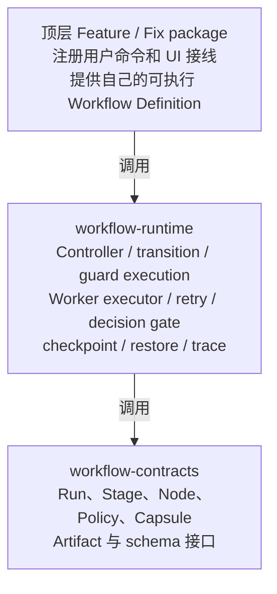
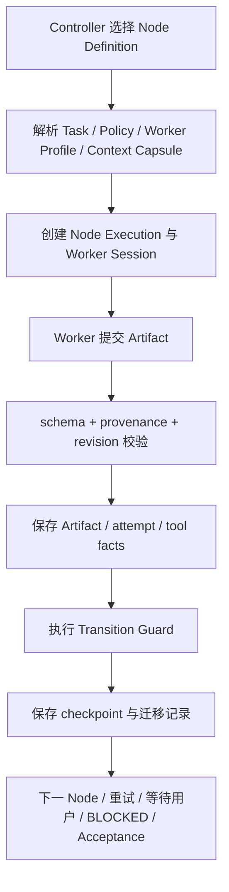
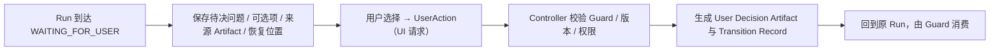
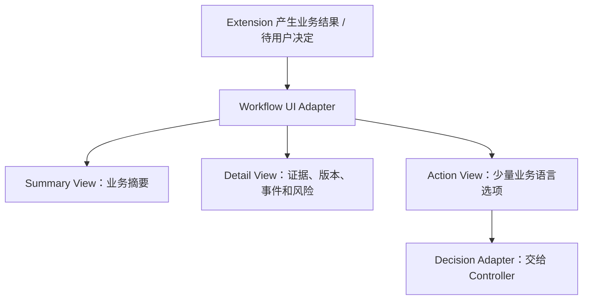
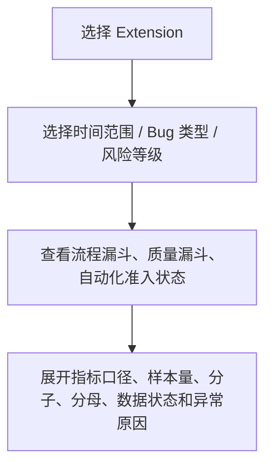

# Runtime 实现架构

- 层级：第二层（L2）
- 状态：`IMPLEMENTING`；本文同时标明目标机制与当前实现差距
- 上游：[L1 Core 产品定义](../01-产品定义/领域术语.md)、[Feature 规范](../01-产品定义/扩展/feature-扩展.md)、[Fix 规范](../01-产品定义/扩展/fix-扩展.md)

## 结论先行

| 问题 | 回答 |
| --- | --- |
| Runtime 是什么 | 通用 Workflow 执行内核：状态机、Worker 执行、Artifact 校验、Guard、恢复与审计 |
| 谁拥有业务流程 | 各 Extension（Feature / Fix）拥有自己的 Workflow Definition 与验收标准；共享 Runtime 不内置业务状态图或验收标准 |
| 不可绕过的控制面 | Worker 不修改 Run 状态；Guard 未通过不迁移；任何一方不得自报 `ACCEPTED`；用户决定必须可记录、可恢复、可被 Guard 引用 |
| Extension 能定义什么 | Task、Role、业务上下文、Artifact 字段、Transition 业务条件、Acceptance 证据规则；不能放宽 Runtime 强制项与全局能力上限 |
| 当前状态 | `IMPLEMENTING`；Fix 业务执行门禁 owner 仍在 `workflow-runtime` 待拆分，缺口以[实现地图 drift 表](README.md#已知-l1--l2-drift)为准 |

## 职责总览

L2 把 L1 的产品保证落实为可执行结构：

| 控制面 | 职责 |
| --- | --- |
| 流程定义 | Workflow Definition 数据结构；Stage 枚举与 Transition 图 |
| 执行 | Policy 解析与 Worker Profile；Context Capsule 构造；Worker Session 生命周期与有限重试 |
| 质量门禁 | Artifact schema 与校验；Transition Guard 与 Acceptance 计算 |
| 持久化与可观测 | Run Store、checkpoint、恢复、Trace 与 Audit |

L2 可以改变实现方式，但不能在未经 L1 评审的情况下改变产品完成语义、角色独立性、状态权限或安全承诺。

## Package 责任



| Package | 责任 | 不承载 |
| --- | --- | --- |
| 顶层 Feature / Fix package | 注册用户命令和 UI 接线；提供自己的可执行 Workflow Definition；调用 workflow-runtime | —— |
| workflow-runtime | Controller / transition / guard execution；Worker executor / retry / decision gate；checkpoint / restore / trace | Feature/Fix 的具体状态图或验收标准 |
| workflow-contracts | Run、Stage、Node、Policy、Capsule、Artifact 与 schema 接口 | 执行逻辑 |

当前 owner drift：Fix 业务执行门禁（review kind 映射、check satisfier、change_plan_review gate）与 legacy `fixNodes` 三节点构造器仍放在 `workflow-runtime`；`fixDefinition` 已移出产品源码（仅存 `test/fixtures/legacy-fix-definition.ts`）。详见[实现地图](README.md#已知-l1--l2-drift)。

## Workflow Definition 边界

以下是 L1 向 L2 交接的目标接口，不代表当前 contracts 已全部实现；当前缺口以[实现地图的 drift 表](README.md#已知-l1--l2-drift)为准。字段名称可以随实现演进：

```ts
type WorkflowDefinition = {
  id: string;
  initialStage: string;
  nodes: Record<string, WorkflowNodeDefinition>;
  transitions: TransitionDefinition[];
  acceptance: AcceptanceDefinition;
};

type WorkflowNodeDefinition = {
  id: string;
  buildTask(input: NodeInput): Task;
  resolvePolicy(input: NodeInput): Policy;
  buildWorkerProfile(input: NodeInput): WorkerProfile;
  buildContextCapsule(input: NodeInput): ContextCapsule;
  artifactContract: ArtifactContract;
};
```

| Extension 可定义 | Runtime 必须强制 |
| --- | --- |
| Task、Role、业务上下文和 Artifact 字段 | Node 不得直接修改 Run Stage |
| Node tools/skills/profile | 不得放宽 Runtime 全局能力上限 |
| Transition 的业务条件 | Guard 未通过不得迁移 |
| Acceptance 证据规则 | Worker 或主 Agent 不得自报 `ACCEPTED` |
| 用户决策条件 | 决策必须记录、恢复并可被 Guard 引用 |

## Node Execution 生命周期

以下生命周期是 L2 要实现的控制机制；当前原型只覆盖其中一部分：



| 场景 | 处理方式 |
| --- | --- |
| 有限重试 | 留在同一个 Node Execution 中并记录 attempt |
| 并行提案、独立 Review 或复核 | 创建独立 Node Execution，以保持身份和 Artifact 来源清晰 |

## 隔离实现

| 控制面 | L2 实现责任 | 不得声称 |
| --- | --- | --- |
| Skill Routing | Resource loader / allowlist / hash / trace | 未发现的 Skill 绝对不可读取 |
| Context Isolation | 最小 Capsule、Artifact 引用、context 清单 | prompt 隔离等于安全隔离 |
| Capability Isolation | 工具白名单、shell wrapper、文件/网络边界、worktree 或容器 | Pi tools 配置本身等于 OS sandbox |

Worker Profile 中的「只读」必须由实际工具和环境能力实现，不能只靠标签或角色 prompt。

## 状态、存储与用户决定

以下为目标机制；当前恢复主要校验已知 Stage，版本兼容性仍在 drift 中：

| 机制 | 规则 |
| --- | --- |
| 状态迁移 | `transition()` 只有在 Guard 通过后才能改变内存 Run 状态 |
| checkpoint | 保存的是已校验状态，不负责自行解释或迁移 Stage |
| 等待用户 | `WAITING_FOR_USER` 必须保存待决问题、可选项、来源 Artifact 和恢复位置 |
| 用户决定 | 用户选择形成 User Decision Artifact，回到原 Run 后由 Guard 消费 |
| 恢复 | reload/resume 必须从最后一个合法 checkpoint 恢复，并校验 Workflow/Policy/schema 版本兼容性 |



## Artifact 与审计

以下为目标机制；完整 provenance、Node Execution 身份和版本绑定尚未实现：

| 校验维度 | 说明 |
| --- | --- |
| 类型 / schema | Artifact 结构与必要字段 |
| 身份绑定 | `runId`、`nodeExecutionId`、`workerId` |
| 版本绑定 | 基准 / 候选版本；Review 与 Verification 必须绑定固定候选版本 |
| 证据引用 | evidence 必须指向真实工具事件或 Artifact 中的检查证据 |

| 审计规则 | 说明 |
| --- | --- |
| 记录实际事件 | Audit 记录实际事件，不推断未发生的工作；Skill 声明的「应检查」不能替代工具事件或 Artifact 中的检查证据 |
| 不可改写 | Worker 不可任意改写 Artifact、Guard Record、Acceptance Result 或历史 Audit |

## 人友好交互实现

以下为所有 Workflow Extension 共用的 L2 交互约束；它们实现 L1 Core 的人友好化原则，不改变 Extension 自己的业务流程或 Acceptance Definition。

### 交互适配层



| 主体 | 职责边界 |
| --- | --- |
| Extension | 只提供结构化 View Model 和业务语言，不直接拼接 Stage、Transition 或内部状态 |
| Workflow UI Adapter | 负责把 Run、Artifact、Finding、Guard、Acceptance 和指标 Snapshot 转换为用户可理解的摘要 |
| Decision Adapter | 只提交结构化意图，Controller 重新校验当前 Run、版本、权限和 Guard 后才改变状态 |
| 技术字段 | `runId`、`nodeExecutionId`、candidate revision、错误码和事件 ID 默认不作为用户输入，作为详情、复制引用或调试信息保留 |
| UI 状态 | UI 不复制 Run 状态、不修改 Artifact/Audit，不在本地形成第二套决定状态 |

### Pi TUI Review Panel

Pi TUI 适配器使用原生 `ctx.ui.custom()` 和现有组件 `Markdown`、`SelectList`、`Container`、`DynamicBorder`。默认 Review Panel 只展示当前决定所需信息：

```text
Fix / Workflow 结果待确认

发生了什么：<现象和影响>
当前结果：<处置和结论>
验证情况：<已验证内容>
需要注意：<未验证项和剩余风险>

> 接受并完成
  继续处理
  暂不接受
```

| 约束 | 要求 |
| --- | --- |
| 视图 | 默认视图静态、紧凑、宽度自适应；详情通过展开或后续查看动作渐进式呈现 |
| 组件 | 使用 Pi TUI 的换行、截断、主题和焦点机制；每行不超过当前终端宽度 |
| 禁止 | 不手写 ANSI，不实现动画、自动轮播、自定义 spinner 或持续定时刷新 |
| 选择 | 选择项使用业务语言，内部 Stage 和 Transition 由 Controller 根据结构化原因映射 |
| 原因收集 | 「继续处理」和「暂不接受」先选择原因，再按需输入补充说明；取消、关闭和超时不产生同意 |
| 控制面 | TUI 只负责展示和收集选择。决定提交后，Controller 重新校验 `WAITING_FOR_USER`、pending request、当前版本、有效 Artifact 和 Acceptance 条件 |

Review Panel 的通用动作模型：

```ts
type UserAction =
  | { kind: "approve" }
  | { kind: "request_changes"; reasonCode: string; note?: string }
  | { kind: "reject"; reasonCode: string; note?: string };
```

`UserAction` 不是 Run 状态，也不是 User Decision Artifact；它是 UI 到 Controller 的一次请求。只有 Controller 接受并持久化后，才生成 User Decision Artifact 和 Transition Record。

### 非交互模式

RPC、JSON、print、CI 和无 TUI 环境必须提供同等语义的结构化输出：

```json
{
  "runId": "run-001",
  "status": "waiting_for_user",
  "summary": "登录白屏修复已完成自动验证，等待人工确认",
  "availableActions": ["approve", "request_changes", "reject"],
  "currentVersion": "git:abc123",
  "detailsRef": "audit://run-001/acceptance"
}
```

非交互接口可以使用技术字段和机器可读决定值，但不能因为没有 TUI 而绕过 Controller、版本绑定或人工验收策略。普通用户路径不要求记忆这些字段。

### 指标 HTML 看板

指标看板是只读展示层，不是新的控制平面。它读取版本化 Metric Snapshot 或由固定 Audit Event 计算出的 Snapshot，按 Extension 展示统一漏斗和质量指标：



| 边界 | 规则 |
| --- | --- |
| 指标归属 | 每个 Extension 提供自己的 Metric Definition 和漏斗节点；通用看板负责筛选、布局、口径解释和状态展示 |
| 默认展示 | HTML 页面默认显示业务名称、通过数、总数、转换率、趋势和异常原因；`runId`、事件 ID 和原始字段只在详情中展示 |
| 数据状态 | 每个指标都显示 `calculable`、`insufficient_history`、`needs_confirmation` 或 `blocked` 状态，不能把缺失数据渲染为 0% |
| 口径透明 | 页面展示「为什么这个数字是这样」的分子、分母、去重规则、统计窗口、观察窗口、快照时间和数据来源 |
| 只读 | 页面只读，不直接 approve、回退、修改 Run 或写 Audit。用户决定仍回到原 Workflow UI / Controller |
| 首版形态 | 首版优先生成可本地打开的静态 HTML，数据通过内嵌版本化 JSON 或同源只读接口提供；不要求动画和实时刷新 |
| 故障隔离 | 看板渲染失败不影响 Runtime、Run 状态、人工决定或审计写入 |

### 交互验证

L2 测试除验证数据和状态正确外，还应验证：

| 验证项 | 要求 |
| --- | --- |
| 决定可达 | 普通用户无需输入内部 Run/Stage/版本字段即可打开并提交 Review Panel 决定 |
| 非同意安全 | UI 取消、关闭、超时不会生成 approve |
| 过期拒绝 | 过期版本、过期 pending request 和重复决定会被 Controller 拒绝 |
| 布局稳定 | 窄终端、宽终端、长中文文本和长证据不会发生截断、重叠或布局跳动 |
| 语义一致 | 非交互结构化输出与 TUI 展示具有相同的决定语义 |
| 可重算 | HTML 看板的指标数值可由同一组 Audit Event 重算，缺失数据能显示正确状态 |
| 不可绕过 | UI 无法绕过 Guard、Acceptance Definition 或版本绑定 |

## 当前实现选择

当前 Worker 由 Pi SDK 独立 `AgentSession` 承载；状态、合同、重试和恢复机制见 [Fix Runtime 技术设计](fix-runtime-technical-design.md)。是否升级为子进程、RPC、容器或独立 Node Extension，应根据进程隔离、独立凭证/依赖、生命周期和发布需求另行评审。
