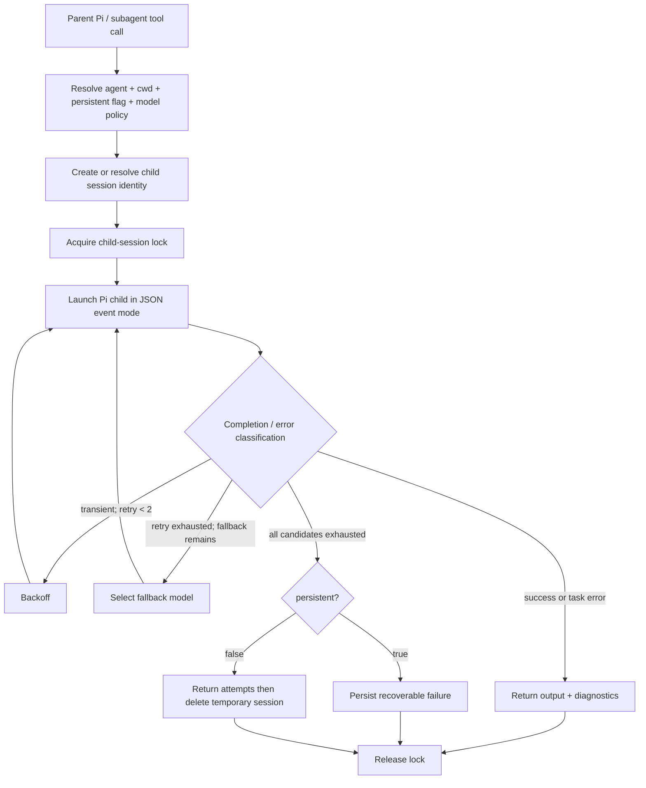
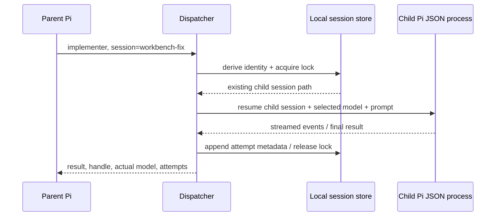

# Subagent Dispatcher 技术设计

| 项目 | 定义 |
| --- | --- |
| 状态 | `IMPLEMENTING` — `@pi/subagent` 源码、自动化测试与独立代码复审已完成；headless provider 创建+恢复 smoke 已验证，真实 TUI/retry/fallback/Fast child E2E 待验证。 |
| 层级 | 第二层（L2） |
| L1 owner | [Subagent Dispatcher Extension 产品规范](../01-产品定义/扩展/subagent-扩展.md) |
| 目标 package | `@pi/subagent`（已新增；本地安装/切换属于第五层操作） |
| 当前事实 | `packages/subagent/` 已提供 `@pi/subagent` package：保留单次/chain/parallel、agent discovery、project trust 和基础 UI；持久 child、临时 session、identity lock、JSON event 校验、瞬态预算/fallback、初始 partial JSONL quarantine、GC 与 Fast consumer 已有源码和 Node tests。Extension 在 `session_start` 以后台 best-effort 方式触发 30 天 GC，不阻塞主任务。 |

## 1. 结论先行

目标是把现有 local dispatcher 迁入本仓库的独立 Pi package，并保留其 child-process 隔离与 agent Markdown 定义方式。新实现默认创建 durable child session；同一运行中的瞬态 provider 请求在原模型额外尝试两次后，才按 agent 配置切换备用模型。所有 child session、锁与运行诊断保持本地状态，不进入 Git。



此 package 不依赖 `@pi/workflow-runtime` 或 `@pi/workflow-contracts`，不创建 Workflow Run/Artifact/Stage，也不复用 `@pi/fix` 的 ActiveWorkerRegistry。它是通用对话委派器；Workflow Worker 的控制语义保持独立。创建、重试、恢复、锁和 Fast 的图示见[执行流程图](subagent-dispatcher-流程图.md)。

## 2. Package 与迁移边界

| 位置 | 责任 | 当前状态 |
| --- | --- | --- |
| `packages/subagent/src/index.ts` | Pi extension factory、tool schema、TUI renderer、parent lifecycle。 | 已实现；Pi entry 为 `src/index.ts` |
| `packages/subagent/src/agents.ts` | user/project agent discovery、frontmatter 和策略解析。 | 已实现并测试 |
| `packages/subagent/src/session-identity.ts` | logical handle、child session 路径/身份派生与 parent/cwd/agent 隔离。 | 已实现并测试 |
| `packages/subagent/src/runner.ts` | JSON-mode child lifecycle、stdout capture、完整 JSONL 校验、重试、fallback、错误分类。 | 已实现并测试；headless child/provider 创建+恢复 smoke 已通过，瞬态失败路径待真实验证。 |
| `packages/subagent/src/session-lock.ts` | 以 identity key 原子 claim，覆盖首次 registry 创建、恢复、运行与 GC 的跨父进程互斥；记录 dispatcher 与 Pi child PID、child session identity 和恢复路径；owner 消失后只有在 starting grace 结束、PID 不存在且可读进程表未找到匹配 `--session-id`/`--session` 的 Pi child 时才接管。 | 已实现并测试；进程表不可读、身份/路径缺失或仍在 grace 窗口时一律 busy |
| `packages/subagent/src/gc.ts` | 30 天本地 child session / metadata 清理。 | 已实现并测试 |
| `packages/subagent/test/*.test.ts` | identity、策略、retry、fallback、lock、GC、Fast compatibility。 | 已实现：agent/dispatcher/runner/lock/GC/Fast/JSON fixtures；有 producer workspace 时通过 `@pi/codex-usage-status/interop` public subpath 验证协议可解析；无 producer 时验证 adapter 安全 Off |
| 本地安装状态 | 不属于 Git 仓库事实。 | 同名旧 extension 必须在本机停用或移出 extension discovery 后，才能加载 `@pi/subagent`。 |

迁移 package 已完成。真实 headless child/provider 创建+恢复 smoke 已通过；TUI、瞬态 retry/fallback 和 Fast child E2E 仍需独立验证。

## 3. Tool 与 agent 配置合同

目标保持一次、chain、parallel 三种调用方式；每个 child call 增加以下语义字段。实际 TypeBox schema 与参数兼容策略以实现和测试为准。

```ts
type RetryPolicy = {
  transientRetries?: 2; // 每个模型的额外请求次数；默认 2
};

type SubagentCall = {
  agent: string;
  prompt: string;
  cwd?: string;
  model?: string;
  session?: string;
  persistent?: boolean;
  retry?: RetryPolicy;
};
```

| 配置点 | 目标语义 |
| --- | --- |
| Extension config | `defaultPersistent: true`；本地默认，不写入项目 Git 配置。 |
| agent frontmatter | `persistent: true|false`；省略时继承 Extension 默认。 |
| agent frontmatter | 现有 `model` 与 `fallback-models` 继续有效，按给定顺序形成候选列表。 |
| 单次调用 | `persistent` 和 `model` 优先于 agent 默认；`session` 用于明确恢复。 |
| 无 `session` 且 `persistent !== false` | 生成一次新的 opaque logical handle；该调用内重试/降级共用它，结果暴露 handle 供后续继续。 |
| `persistent: false` | 为单次 tool call 创建临时 session storage，仍可在调用内 retry/fallback；finally 删除，跨调用不可恢复。与 `session` 同时提供时参数非法并 fail closed。 |

模型候选列表必须去重并保留顺序：单次 `model`（若有）→ agent `model` 或 parent effective model → `fallback-models`。候选模型的有效性由实际首次请求确认；非瞬态的认证、模型不存在或配置错误必须停止当前调用，不得以跳过或切 fallback 掩盖配置问题，也不得默默回写 agent 配置。

## 4. Child session 与恢复

持久 child identity 由以下稳定输入派生，绝不以用户自由文本作为文件路径：

```text
namespace version + parentSessionId + effectiveCwd + agentName + logicalSessionHandle
```

- `session` 为显式 handle 时，identity 可在同一 parent Pi session 中稳定恢复。
- Dispatcher 先以 identity key 原子获取同一把 lock，**再**读/建 registry；首次创建才生成 UUID。两个进程首次使用同一显式 handle 时，只有 lock winner 可以分配 child UUID，另一个返回 `session-busy`。
- 首次持久调用以 `pi --mode json -p --session-dir <dispatcher-managed-dir> --session-id <UUID>` 创建 Pi session；后续恢复在受控 session 目录内发现并校验 JSONL header，再以内部的绝对 `--session` 路径打开；禁止后续使用会静默创建空历史的 `--session-id`。绝对 cwd/session 路径只用于内部进程与校验，不进入 AttemptResult、metadata、Tool details 或 UI。持久化是 session 文件而不是常驻 child 进程。
- 若首次持久 child 已创建 `sessions/<identity>/` 下的 JSONL，但 `findSessionFile`、首 header 身份或任一后续非空 JSONL 记录校验失败，Dispatcher 将 registry 保留为合法的 `quarantined` 状态并立即 fail-closed；该 handle 不得 resume，也不得重新创建空 session。该 registry 仍按 identity key 被 GC 枚举，保留期到期后在同一 identity lock 内以 tombstone 方式删除 partial session 与 metadata。
- 同一 identity 已存在 tombstone 时，Dispatcher 在同一 identity lock 内拒绝 dispatch，返回 `cleanup-pending`，不创建 registry、不 spawn/resume child；GC 必须在该 lock 内先删除 session 与 registry metadata，成功后才删除 tombstone。
- 自动生成 handle 时，首次调用建立 child；其 handle 必须写入 tool result details、parent session 的结构化 metadata 和本地受控 registry。metadata/详情只保存安全 cwd scope（短哈希）、requestedModel/actualModel 和分类后的尝试摘要，不保存 task、完整 prompt、绝对 cwd、session 路径或原始 provider 诊断。
- 新父 Pi top-level session 即使 cwd 相同，也不得自动恢复旧 child；这是防止不同任务串话的边界。
- child 只能恢复自己的历史。新建时默认不复制 parent 完整分支；若将来支持 parent snapshot，必须以独立明确字段实现并限制首次创建使用。



runner 必须解析 JSON stream 的首条 `session` header、`message_end` 和 Pi 0.84.4 的 `tool_execution_end.result`；不得继续监听不存在的 `tool_result_end`。child `close` 的 signal exit、空 stdout、缺 header、任一截断/无效非空 JSONL 记录或缺 terminal JSON 必须为失败，不能把 `code === null` 归零成功。

同一 identity 运行中再次委派应返回 session-busy，不允许两个 child 进程同时写同一历史。进程崩溃导致的 stale lock 只能在确认 child 已不存在后清理；不得自动删除未知存活进程的锁。当前实现的保守窗口是：`starting` 标记后默认 5 秒内不接管；窗口后检查记录 PID，并扫描同主机进程表中带匹配 `--mode json --session-id <childSessionId>` 或恢复用绝对 `--session <sessionPath>` 的 child。进程表失败、旧 lock 缺少可匹配 identity/path、PID 检查返回非 `ESRCH` 或发现匹配命令时均保持 busy；只有完整扫描成功且没有匹配 child 才允许接管。该机制只证明可观察到的同主机 Pi CLI 进程不存在，不等价于 OS sandbox，也不能覆盖进程表权限、平台命令差异或扫描竞态；真实跨进程崩溃回放仍未验证。

## 5. 执行结果分类、重试与 fallback

`FailureKind` 是唯一执行结果分类，表示 child 的协议/进程/模型请求是否正常结束，不表示任务目标或业务验收是否通过。错误分类仅决定 provider request 的重试控制，不替代 child 的任务结论。有效协议、退出码 0 且当前最终助手 `stop` 为 `success`；工具异常只进入有界诊断，不产生 `task_failure`。

当前 attempt 的 `phase` 仅表示生命周期：调用期间为 `running`，完成裁决后为 `finished`。`diagnostics` 为可选兼容字段，包含 `toolErrorCount` 与 `providerErrorCount`；新 runner 始终输出非负安全整数，旧记录缺失时为“未提供”而不是 0。工具详情最多保留 100 条，但计数按全部 `tool_execution_end` 事件计算。

| 类别 | 判定来源 | 处理 |
| --- | --- | --- |
| `transient_provider` | 仅 terminal provider error 的 `fetch failed`、`ECONNRESET`、`ECONNREFUSED`、`ETIMEDOUT`、明确 timeout，或结构化/文本 HTTP 429/502/503/504 | 当前模型额外重试最多两次，采用有上限的退避；随后切下一个候选模型。 |
| `non_transient_provider` | 不存在、无可用渠道、未认证、模型不可用、401/403、请求合同错误 | 不重试、不切换 fallback；持久 child 保留供用户明确继续，临时 child 返回诊断后删除。 |
| `task_failure` | 旧历史或外部注入的兼容结果 | 继续按现有非重试失败映射读取；runner 不再由工具事件产生。child 正常返回的业务失败报告仍为 `success`。 |
| `cancelled` | parent abort / 用户取消 | 立即停止；仅持久 child 保留，临时 child 删除；不得自动恢复。 |
| `unknown_transport` | 无法安全归类的 launcher/process 异常、signal exit、空 stdout、缺失 terminal JSON 或截断 JSONL | 记录诊断且不无限循环；持久 child 可供明确继续，临时 child 返回诊断后删除。 |

当前 attempt 的裁决顺序固定为：本地 abort → spawn/流式 JSON/header/身份校验失败、空输出、畸形记录、signal close(code=null) 或缺当前有效最终助手候选的 `unknown_transport`（非本地 signal close 覆盖 `aborted`）→最终助手 `aborted` →最终助手 `error`（只读该消息自身的类型化 `status`/`errorMessage`，不读旧工具状态、旧错误或 stderr）→stop/length 但进程非零的 `unknown_transport`→最终 `length` 的 `incomplete`→最终 `stop` 的 `success`。最新候选在后续 assistant `message_start`、assistant `toolUse` 或任一 tool execution 事件后失效；普通 `turn_end`/`agent_end` 不清除。每个 retry/fallback 都在同一 child session 内追加新的 prompt turn；不会重新以空上下文启动。重试次数是每个候选模型独立计数，原有闭集 allowlist 与每模型初始+2预算不扩大。所有候选用尽时，`persistent !== false` 返回 `recoverable_failed` 并保留 session、工作树和已捕获输出；`persistent:false` 仅返回尝试诊断，finally 删除临时 storage，不返回 handle 或继续入口。

## 6. 模型切换与 Fast 兼容

模型切换发生在 child 的下一次模型请求前。自动 fallback 和明确 continuation `model` override 都必须记录 `requestedModel`、`actualModel`、attempt number、source（initial/retry/fallback/user override）与终止原因。

现有 `@pi/codex-usage-status` 的 Fast 继承协议是外部兼容约束。`@pi/subagent` 将 producer 声明为 optional peer，并在 workspace 开发依赖中提供它用于互操作测试；packed package 不要求安装尚未发布的 producer。`fast-inheritance.ts` 通过安全 dynamic import 加载 `@pi/codex-usage-status/interop` public subpath 的 producer-only adapter，禁止从 monorepo sibling 源码目录相对导入；producer 缺失或 public export 不匹配时 consumer 保持安全 Off，Subagent 仍可加载运行。producer 可用时，consumer 订阅版本化 channel 并按 parent session id 保存 requested intent；创建**新 logical child 的首次 spawn**时才读取该快照，克隆环境、删除 ambient `PI_CODEX_FAST`，且仅在既有 user-source / exact agent / `codexFast: inherit` 条件下传递一次性 `PI_CODEX_FAST=1`。同一 child 的 retry、fallback、resume 一律只清除环境变量、不得读取快照或注入 Fast；project agent 和其他 user agent 同样永不继承。

当前 L2 文档引用的 local `fast-inheritance.ts` 和测试在实际 local dispatcher 目录中不可见，构成 producer/consumer drift。迁移实现必须以 repo 的 `packages/codex-usage-status/src/interop.ts` 为唯一协议定义，并新增 child process E2E；在此之前不能声称 Fast 互操作已验证。

## 7. 可观测、本地状态与 GC

默认 TUI 只显示用户可行动的进度；展开详情/Tool details 保存可复核记录：agent、`persistent`、logical handle、session identity 的安全引用、cwd scope、候选模型、requested/actual 模型、attempt、`phase`、可选诊断计数、分类错误、child stop reason、`tool_execution_end.result` 的有限 type/length/hash 投影与 capture 截断标记。registry attempt 摘要、parent metadata 与 tool details 通过同一严格白名单保留可选 diagnostics；缺字段的旧记录仍合法。tool result 必须保留该有限摘要和短哈希，不能只保留存在性。

敏感 provider token、Cookie/Set-Cookie、headers、原始 HTML/error body、嵌套诊断、task/完整 prompt 与未脱敏路径不得写入 AttemptResult、retry metadata、Tool details 或渲染输出。assistant 文本中的 `Cookie=`、`Set-Cookie=`、任意 `X-...` header 和 `...Header=`/`...Header:` 形式（包括嵌套/assistant echo）也必须在投影边界严格 redaction，同时保留正常 assistant final result。tool args 只以字段白名单和哈希引用展示；cwd 只以安全 scope 展示。child 原始 Pi session 仍遵循 Pi 自身 session 安全边界；Dispatcher 只新增最小索引和尝试摘要。

GC 只处理 Dispatcher 管理的 child session/lock/metadata。Extension 在每个 `session_start` 触发一次后台 best-effort GC；该维护任务不 await、不阻塞主 session 或 `subagent` dispatch，失败静默保留下一次生命周期重试：

| 对象 | 默认保留 | 删除前提 |
| --- | --- | --- |
| settled / recoverable failed child | 30 天 | GC 先获取同一 identity lock，锁内重读 registry/mtime/到期条件，再原子 rename 为 tombstone 后删除；中断 tombstone 由下次 GC 在同一锁内恢复；tombstone 存在期间同一 identity dispatch 返回 `cleanup-pending`。 |
| 未完成 child | 30 天自最后 durable activity | GC 先获取同一 identity lock，锁内重读 registry/mtime/到期条件，再原子 rename 为 tombstone 后删除；中断 tombstone 由下次 GC 在同一锁内恢复。 |
| 初始 child 的 partial / 无效 JSONL（`quarantined` registry） | 30 天自 quarantine durable activity | Dispatcher 校验首 header 与全部非空记录；任一失败均不 resume 或空建并保留 `quarantined`。GC 按同一 identity key 获取 lock，锁内以 tombstone 完成 session + registry metadata 删除，成功后才删除 tombstone；中断期间 dispatch 返回 `cleanup-pending`，下次 GC 恢复。 |
| stale lock | 不自动按 TTL 直接删除 | 确认无对应 child 进程后才可人工/受控清理。 |

## 8. 验证计划与当前 drift

| 范围 | 最低自动化证据 |
| --- | --- |
| 兼容 | 现有 single/parallel/chain、agent discovery、project trust、工具 allowlist、输出截断不回归。 |
| session | 默认 `persistent: true`、新 handle、显式恢复、registry 创建双进程竞态、文件/header 缺失 fail-closed、有效 header + 截断第二行的完整 JSONL quarantine、不可 resume/空建、tombstone 存在时 `cleanup-pending` dispatch 与 GC 清理顺序、30 天删除与不可 resume、parent/cwd/agent 隔离、`persistent: false` 调用内 retry、session busy、stale lock；focused lock tests 覆盖 starting grace、不可判定扫描保持 busy，以及 session UUID/path 命中保持 busy。 |
| retry | transient 每模型恰好初始+2次；allowlist 全量正反例与优先级；退避可注入时钟；`incomplete`/正常工具错误/cancel 不重试；旧 tool 503 + 最终非瞬态 error 不污染 retry；signal exit、空 stdout、截断 JSONL 均不误报成功。 |
| fallback | 候选顺序、去重、仅 transient 触发切换、每模型独立预算、耗尽后 recoverable failed、用户 override。 |
| observability | Pi 0.84.4 JSON fixture 覆盖 `session`、`message_end`、`tool_execution_end.result`；provider/requestedModel/actualModel/attempt/`phase`/可选诊断计数/分类诊断和脱敏 tool result 可见且无 task/prompt/cwd/path/token/Cookie/header/raw body/嵌套诊断；计数不因详情上限归零；runner probe 覆盖 `Cookie_EQUALS_SECRET`、`Set-Cookie=`、`X-Trace-Header`、suffix `Header` 与嵌套 assistant echo。 |
| local state | 30 天 GC 已接入 Extension `session_start` 后台路径；live child lock 不删、GC/resume 竞态锁内复核+tombstone；初始 partial/后续截断 JSONL 以 `quarantined` registry 保持 GC 可达并由同一 identity lock 清理；tombstone 存在时 dispatch 不建新 registry，GC 先删 session + metadata 后删 tombstone；stale lock 还需通过 starting grace + PID + session UUID/path 进程扫描确认 child 不存在后才接管。 |
| Fast | producer workspace 存在时，新 logical child 的首次 spawn 才可 exact eligibility/one-shot env 继承；retry/fallback/resume 的环境均为 Off；producer 缺失时 dynamic adapter 加载失败并安全 Off；event/config/env contract 有测试。 |
| E2E | 已完成 headless Pi JSON + provider：默认持久 child 创建及同 handle 恢复。仍需真实 Pi TUI + provider 制造一次可观察瞬态失败，验证 retry、模型切换、无 session 串话和 Fast 条件；单元测试和本 smoke 均不能替代。 |

本轮 S9 证据由真实 `dispatchAgent` 路径或等价注入的 child spawn 提供：首次持久 identity 创建的 registry 只有一个 winner；持久 session resume 与 GC 共享 identity lock；`persistent:false` 的候选耗尽、非瞬态、task、cancel 都在 finally 后清理；fallback、override、resume 的 Fast 均为 Off。当前测试进程通过原子 `open(..., "wx")` 的交错验证竞态，但尚未启动两个独立 Node 进程执行首次 registry 创建/真实 Pi provider；这仍是明确的跨进程验证缺口，不把单进程证据表述为双进程 E2E。

当前 `@pi/subagent` package、可恢复 child session、retry/fallback runner、lock/GC/Fast consumer 和自动化测试已经存在；30 天 GC 已由 Extension 生命周期后台触发。`@pi/codex-usage-status` 是 optional peer，Fast 通过 public `./interop` 的安全 dynamic adapter 按 producer 可用性启用；独立 packed subagent 不预装 producer 的安装与 Pi/jiti 加载已验证。Subagent Dispatcher 是通用 child session，不创建 Workflow Run/Artifact，因此 Workflow 的 `workerId` 采纳门禁不适用；方案和代码独立复审均已完成。headless Pi JSON + provider 已验证默认 child 创建和同 handle 恢复。当前 drift 为：真实 TUI、瞬态 retry/fallback、进程崩溃回放、跨进程首次创建和 Fast child-process/provider E2E 仍未验证。
