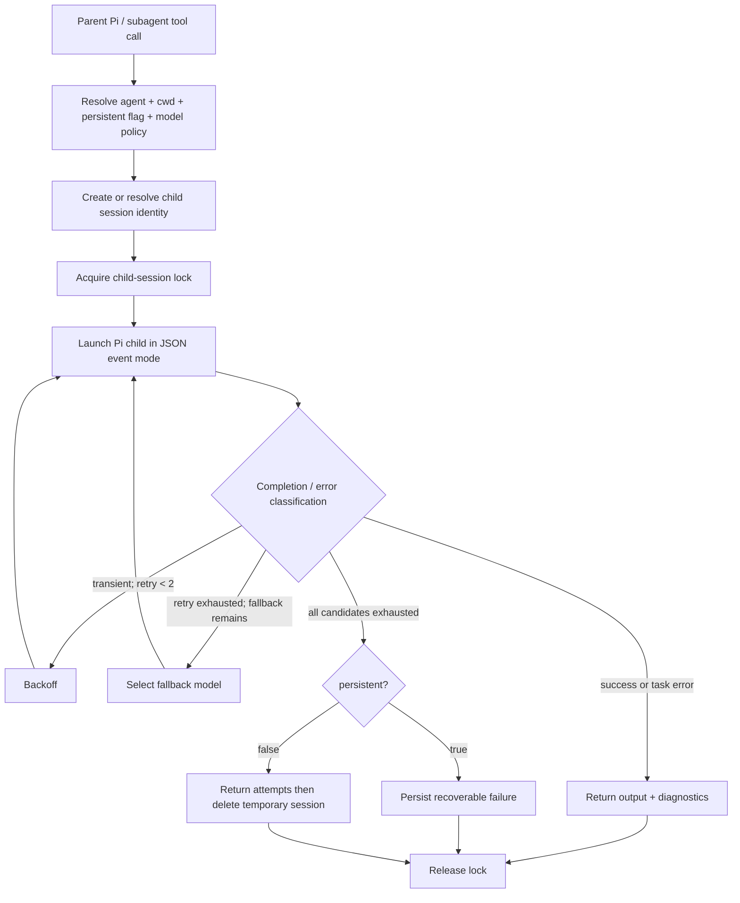
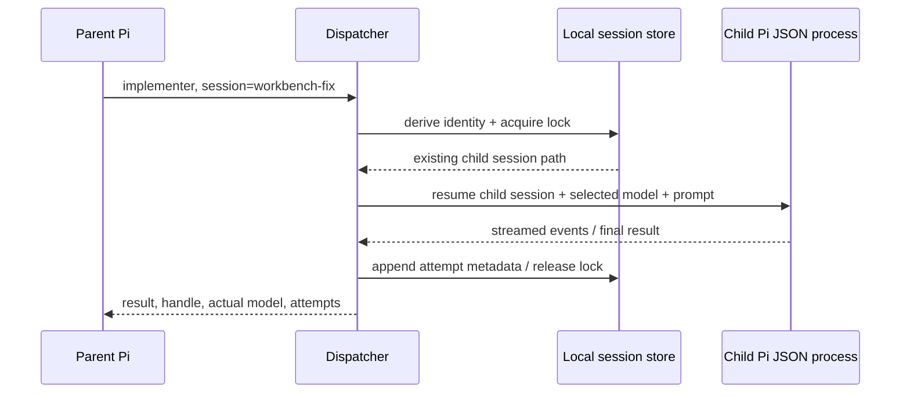
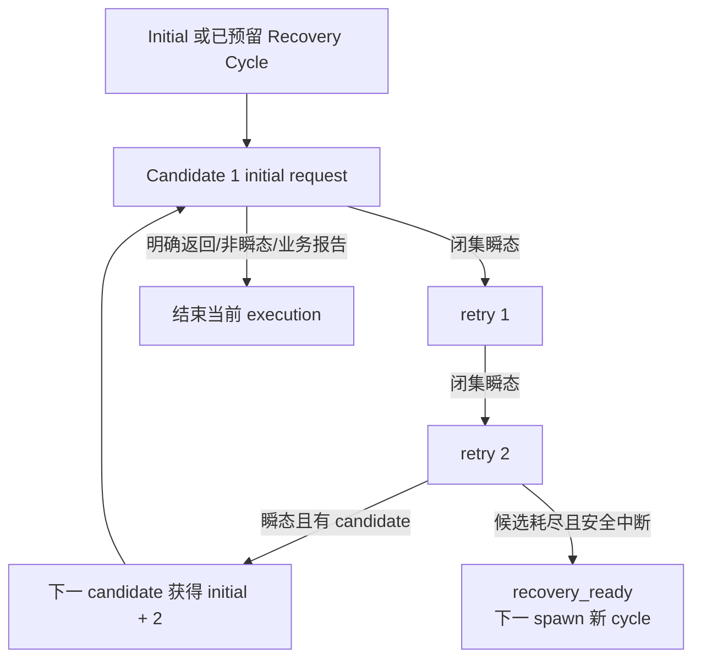

# Subagent Dispatcher 技术设计

| 项目 | 定义 |
| --- | --- |
| 状态 | `DECIDED / sliced implementation` — 2026-09-14 已采纳 v2 目标设计；S1–S43 连续。切片1+2已落地 durable admission/WAL、私有 payload、replay/projection、raw→effective resolver、provenance、lineage adapter 与 startup normalization foundation；slice3 已落地 gated internal execution/recovery seam（bounded retry/fallback、child binding、startup liveness normalization、generation fencing、strict session validation、persistent:false cleanup fail-closed），并已实现 owner-transfer foundation（identity/generation、fencing、双重稳定 death predicate、pre-spawn 规则），仍未接线现行 v1 execute；slice4a 已增加 gated strict-cancel control foundation（item-level durable cancel、actor/lineage fail-closed、共享 transition/replay guard、pre-spawn reservation seal/no-reservation fact、startup cancel reconciliation），capability 全 false；call-wide cancel、运行中 adapter、post-spawn terminate/death/action、cancel delivery、side-effect interceptor、Darwin birth/PID reuse 适配与真实跨进程 E2E 仍未验证，migration/delete 仍未实现。 |
| 层级 | 第二层（L2） |
| L1 owner | [Subagent Dispatcher Extension 产品规范](../01-产品定义/扩展/subagent-扩展.md) |
| 正式评审与采纳 | [2026-09-14 产品语义/指标 Review Artifact](../归档/评审/2026-09-14-subagent-dispatcher-产品语义指标Review-Artifact.md)、[实现/运营 Review Artifact](../归档/评审/2026-09-14-subagent-dispatcher-实现运营Review-Artifact.md)、[Adoption Decision](../归档/评审/2026-09-14-subagent-dispatcher-Adoption-Decision.md) |
| 目标 package | `@pi/subagent`（已新增；本地安装/切换属于第五层操作） |
| 当前事实 | `packages/subagent/` 既有 Child Session 基线与切片0 bridge-v1 安全实现仍保持；切片1+2新增独立 `v2/` namespace 的 Call/Delegation WAL、锁内幂等 admission（含完整 request digest 交叉校验）、0600 private payload、materialized replay/projection、可幂等补齐且记录 finalizedAt 的 CallAggregateProof、raw candidate trust/shadow/alias resolver、完整 invalid provenance、同 FD inode/content binding、持久 branch identity、paused-first config revision（actor/parent/lineage、monotonic epoch、startup publish-before-reserve）、统一 append/replay transition predicate（control transition 与 non-mutating WAL audit metadata 分离；无可证明 call identity 的 torn tail 只 quarantine/paused_integrity）、actor-free configuration observation 的 stable-FD recheck 与 superseded/epoch advancement、revisionId 全生命周期单调不复用、active-lineage adapter 与不启动 child 的 startup normalization；slice4a 新增 `SubagentControlService` gated internal owner 与 pre-spawn cancel reconciliation。v2 尚未接入现有执行路径；真实 power-loss、发布 binary/kill-point、Darwin death-proof、interceptor/IPC、call-wide cancel、运行中 adapter、post-spawn terminate/death/action、delivery/delete、migration 仍未证明或实现。 |

## 1. 结论先行

既有 package 迁移已经完成，当前实现默认创建 durable Child Session，并在单次 dispatch 内执行每模型 initial + 2 次瞬态 provider retry 及 fallback。新的产品目标是在此基线上增加 Dispatch Call Record 与独立 Delegation WAL：合法 task unit 必须先记录、后 discovery/spawn；初始执行与恢复分开记账，每个 Delegation 至多一次 initial spawn/execution，pre-spawn 显式取消时 initial=0，正常受理且未取消时 initial≤1；只允许 initial + recovery cycle 1/2/3（最多 4 次逻辑 child spawn，reattach 不计；第 5 次总逻辑 spawn=0）。Startup reconciler 扫描当前 active lineage 全部非终态 durable records，但必须先 CAS/owner-fenced 归一、不能直接执行；普通 recovery executor 仍只 claim `recovery_ready`。恢复完成或取消以新的 at-most-once custom message 通知，不改写原 `toolResult`；运行中 cancel、delivery abandon与主动删除分别由独立写控制承担；status不产生控制副作用，只允许把已存在的宿主 normal toolResult证据幂等投影为`normal_tool_result_observed`。attempt diagnostics保持可选phase、两个非负安全整数和固定中性段；normal retention不得直接删除，必须与whole-Call delete共用`call_cleanup_requested` fenced cleanup lifecycle。受恢复管理child以`--no-extensions`和固定allowlist启动、fence interceptor最后加载；v1 adoption只有bridge-v1保护pin先部署并验证后才可启用；Darwin owner transfer使用waitpid或稳定birth-identity观察，不使用TTL/单次kill0。本节下图仅描述**当前基线**；目标流程与 drift 见 §9。


```mermaid
flowchart TD
  parent[Parent Pi / subagent tool call] --> resolve[Resolve agent + cwd + persistent flag + model policy]
  resolve --> identity[Create or resolve child session identity]
  identity --> lock[Acquire child-session lock]
  lock --> child[Launch Pi child in JSON event mode]
  child --> classify{Completion / error classification}
  classify -->|success or task error| result[Return output + diagnostics]
  classify -->|transient; retry < 2| delay[Backoff] --> child
  classify -->|retry exhausted; fallback remains| switch[Select fallback model] --> child
  classify -->|all candidates exhausted| exhausted{persistent?}
  exhausted -->|true| paused[Persist recoverable failure]
  exhausted -->|false| ephemeral[Return attempts then delete temporary session]
  result --> unlock[Release lock]
  paused --> unlock
  ephemeral --> unlock
```

此 package 不依赖 `@pi/workflow-runtime` 或 `@pi/workflow-contracts`，不创建 Workflow Run/Artifact/Stage，也不复用 `@pi/fix` 的 ActiveWorkerRegistry。它是通用对话委派器；Workflow Worker 的控制语义保持独立。创建、重试、恢复、锁和 Fast 的图示见[执行流程图](subagent-dispatcher-流程图.md)。

## 2. 当前基线：Package 与既有迁移边界

| 位置 | 责任 | 当前状态 |
| --- | --- | --- |
| `packages/subagent/src/index.ts` | Pi extension factory、tool schema、TUI renderer、parent lifecycle。 | 已实现；Pi entry 为 `src/index.ts` |
| `packages/subagent/src/agents.ts` | v1 user/project discovery；v2 raw candidate collection 额外执行 owner/mode/realpath/symlink 边界校验并解析 aliases。 | 已实现并测试；v1 discovery 兼容保留 |
| `packages/subagent/src/session-identity.ts` | logical handle、child session 路径/身份派生与 parent/cwd/agent 隔离。 | 已实现并测试 |
| `packages/subagent/src/runner.ts` | JSON-mode child lifecycle、stdout capture、重试、fallback、错误分类。 | 已实现；stdout `processLine` 仅 fail-closed 校验本实现明确建模的 Pi 0.84.4 JSON event 子集；`validateSessionFile` 的恢复边界严格仅为 on-disk `SessionEntry` JSONL（header 后不接受 stdout event）。stdout/session wire header 固定 `version=3`，on-disk header 另行兼容 v1/v2/v3（含迁移前缺省 v1 version）。不声称覆盖 Pi 其他未建模扩展、未来/真实跨版本、provider、Darwin 或跨进程 E2E。 |
| `packages/subagent/src/session-lock.ts` | v1 Child identity lock；v2 execution 在 `v2/` 下复用同一 fail-closed lock primitive 做 reserve/spawn/recovery 临界区。 | 已实现并测试；owner-transfer 的 Darwin birth/PID reuse 与真实跨进程验证仍待验证 |
| `packages/subagent/src/gc.ts` | 30 天本地 child session / metadata 清理。 | 已实现并测试；切片0在原 v1 identity lock 内校验 bridge preservation pin |
| `packages/subagent/src/execution-supervisor.ts` | owner identity/generation、fencing、双重稳定 owner/child death predicate、pre-spawn transfer 规则、child reconciliation 与 startup normalization；identity-tuple probe 为注入式且不发 signal。 | foundation 已实现并有 targeted contract/probe tests；Darwin birth/PID reuse 与真实跨进程 E2E 未验证 |
| `packages/subagent/test/*.test.ts` | identity、策略、retry、fallback、lock、GC、Fast compatibility，以及切片1+2 admission/WAL/resolver/lineage/privacy 与 owner-transfer probe。 | 已实现：既有测试与 `delegation.test.ts`；覆盖非法 shape、幂等 request mismatch/并发 admission、torn-tail repair、parallel/chain slot 顺序与 kill convergence、private projection/orphan coordination、trust/shadow/alias conflict、raw invalid provenance、lineage fork/持久 identity、startup no-spawn、child inspection fail-closed 与 identity-tuple birth mismatch |
| 本地安装状态 | 不属于 Git 仓库事实。 | 同名旧 extension 必须在本机停用或移出 extension discovery 后，才能加载 `@pi/subagent`。 |

迁移 package 已完成。切片3当前提供 gated internal execution/recovery seam，不接 `runSubagentModes`；真实 headless child/provider、OS kill、Darwin owner transfer、TUI 与 Fast replacement E2E 仍需独立验证。

## 3. 当前基线：Tool 与 Agent 配置合同

当前 v1 保持 single、chain、parallel 三种调用方式；以下字段、优先级与 `persistent:false` 行为均描述已实现基线，不是 §9 的 v2 目标语义。实际 TypeBox schema 以源码和测试为准。

```ts
type RetryPolicy = {
  transientRetries?: 2; // 每个模型的额外请求次数；默认 2
};

type SubagentCall = {
  agent: string;
  prompt: string;
  cwd?: string;
  model?: string;
  session?: string;
  persistent?: boolean;
  retry?: RetryPolicy;
};
```

| 配置点 | 当前 v1 语义 |
| --- | --- |
| Extension config | `defaultPersistent: true`；本地默认，不写入项目 Git 配置。 |
| agent frontmatter | `persistent: true\|false`；省略时继承 Extension 默认。 |
| agent frontmatter | 现有 `model` 与 `fallback-models` 继续有效，按给定顺序形成候选列表。 |
| 单次调用 | `persistent` 和 `model` 优先于 agent 默认；`session` 用于明确恢复。 |
| 无 `session` 且 `persistent !== false` | 生成一次新的 opaque logical handle；该调用内重试/降级共用它，结果暴露 handle 供后续继续。 |
| `persistent: false` | 为单次 tool call 创建临时 session storage，仍可在调用内 retry/fallback；finally 删除，跨调用不可恢复。与 `session` 同时提供时参数非法并 fail closed。 |

模型候选列表必须去重并保留顺序：单次 `model`（若有）→ agent `model` 或 parent effective model → `fallback-models`。候选模型的有效性由实际首次请求确认；非瞬态的认证、模型不存在或配置错误必须停止当前调用，不得以跳过或切 fallback 掩盖配置问题，也不得默默回写 agent 配置。

## 4. 当前基线：Child Session 与显式恢复

持久 child identity 由以下稳定输入派生，绝不以用户自由文本作为文件路径：

```text
namespace version + parentSessionId + effectiveCwd + agentName + logicalSessionHandle
```

- `session` 为显式 handle 时，identity 可在同一 parent Pi session 中稳定恢复。
- Dispatcher 先以 identity key 原子获取同一把 lock，**再**读/建 registry；首次创建才生成 UUID。两个进程首次使用同一显式 handle 时，只有 lock winner 可以分配 child UUID，另一个返回 `session-busy`。
- 首次持久调用以 `pi --mode json -p --session-dir <dispatcher-managed-dir> --session-id <UUID>` 创建 Pi session；后续恢复在受控 session 目录内发现并校验 JSONL header，再以内部的绝对 `--session` 路径打开；禁止后续使用会静默创建空历史的 `--session-id`。绝对 cwd/session 路径只用于内部进程与校验，不进入 AttemptResult、metadata、Tool details 或 UI。持久化是 session 文件而不是常驻 child 进程。
- 若首次持久 child 已创建 `sessions/<identity>/` 下的 JSONL，但 `findSessionFile`、首 header 身份或任一后续非空 JSONL 记录校验失败，Dispatcher 将 registry 保留为合法的 `quarantined` 状态并立即 fail-closed；该 handle 不得 resume，也不得重新创建空 session。该 registry 仍按 identity key 被 GC 枚举，保留期到期后在同一 identity lock 内以 tombstone 方式删除 partial session 与 metadata。
- 同一 identity 已存在 tombstone 时，Dispatcher 在同一 identity lock 内拒绝 dispatch，返回 `cleanup-pending`，不创建 registry、不 spawn/resume child；GC 必须在该 lock 内先删除 session 与 registry metadata，成功后才删除 tombstone。
- 自动生成 handle 时，首次调用建立 child；其 handle 必须写入 tool result details、parent session 的结构化 metadata 和本地受控 registry。metadata/详情只保存安全 cwd scope（短哈希）、requestedModel/actualModel 和分类后的尝试摘要，不保存 task、完整 prompt、绝对 cwd、session 路径或原始 provider 诊断。
- 新父 Pi top-level session 即使 cwd 相同，也不得自动恢复旧 child；这是防止不同任务串话的边界。
- child 只能恢复自己的历史。新建时默认不复制 parent 完整分支；若将来支持 parent snapshot，必须以独立明确字段实现并限制首次创建使用。


```mermaid
sequenceDiagram
  participant Main as Parent Pi
  participant D as Dispatcher
  participant Store as Local session store
  participant Child as Child Pi JSON process

  Main->>D: implementer, session=workbench-fix
  D->>Store: derive identity + acquire lock
  Store-->>D: existing child session path
  D->>Child: resume child session + selected model + prompt
  Child-->>D: streamed events / final result
  D->>Store: append attempt metadata / release lock
  D-->>Main: result, handle, actual model, attempts
```

runner 必须解析 JSON stream 的首条 `session` header、`message_end` 和 Pi 0.84.4 的 `tool_execution_end.result`；不得继续监听不存在的 `tool_result_end`。child `close` 的 signal exit、空 stdout、缺 header、任一截断/无效非空 JSONL 记录或缺 terminal JSON 必须为失败，不能把 `code === null` 归零成功。

同一 identity 运行中再次委派应返回 session-busy，不允许两个 child 进程同时写同一历史。进程崩溃导致的 stale lock 只能在确认 child 已不存在后清理；不得自动删除未知存活进程的锁。当前实现的保守窗口是：`starting` 标记后默认 5 秒内不接管；窗口后检查记录 PID，并扫描同主机进程表中带匹配 `--mode json --session-id <childSessionId>` 或恢复用绝对 `--session <sessionPath>` 的 child。进程表失败、旧 lock 缺少可匹配 identity/path、PID 检查返回非 `ESRCH` 或发现匹配命令时均保持 busy；只有完整扫描成功且没有匹配 child 才允许接管。该机制只证明可观察到的同主机 Pi CLI 进程不存在，不等价于 OS sandbox，也不能覆盖进程表权限、平台命令差异或扫描竞态；真实跨进程崩溃回放仍未验证。

## 5. 当前基线：执行结果分类、重试与 fallback

`FailureKind` 是唯一执行结果分类，表示 child 的协议/进程/模型请求是否正常结束，不表示任务目标或业务验收是否通过。错误分类仅决定 provider request 的重试控制，不替代 child 的任务结论。有效协议、退出码 0 且当前最终助手 `stop` 为 `success`；工具异常只进入有界诊断，不产生 `task_failure`。

每个 attempt 的 `phase` 是可选兼容字段，值域仅为 `running | finished`：调用期间新 runner投影`running`，完成裁决后投影`finished`；缺字段的旧记录仍合法。`diagnostics` 也是可选兼容字段，仅含 `toolErrorCount` 与 `providerErrorCount`；新 runner 始终输出两个 `Number.isSafeInteger(value) && value >= 0` 的安全整数。旧记录整体或任一计数缺失时，renderer逐项显示“未提供”且不解释为0。工具详情最多保留100条，但`toolErrorCount`按全部`tool_execution_end.isError`事件计算，不因详情截断而封顶/归零；`providerErrorCount`按该attempt已完成的assistant provider error消息计数。`phase=running`/host `isPartial`只画progress，不画终局失败。

| 类别 | 判定来源 | 处理 |
| --- | --- | --- |
| `success` | 当前有效最终助手 `stop`，协议/进程完整且退出 0。 | 反馈“已返回”；不代表任务或验收通过。正常业务失败报告仍属此类。 |
| `incomplete` | 当前有效最终助手 `length`，协议/进程完整且退出 0。 | 保留已捕获报告并提示长度截断；不自动 provider retry。 |
| `cancelled` | 本地 abort；或更高优先级完整性检查通过后的最终助手 `aborted`。 | 不 provider retry；非本地 signal close先裁为`unknown_transport`。 |
| `transient_provider` | 仅当前 terminal provider error 自身的 `fetch failed`、`ECONNRESET`、`ECONNREFUSED`、`ETIMEDOUT`、明确 timeout，或结构化/文本 HTTP 429/502/503/504。 | 当前模型额外重试最多两次，采用有上限的退避；随后切下一个候选模型。 |
| `non_transient_provider` | 当前 terminal provider error 自身证明不存在、无可用渠道、未认证、模型不可用、401/403、请求合同错误。 | 不重试、不切换 fallback；不得读取过程tool status/旧error/stderr污染分类。 |
| `unknown_transport` | 无法安全归类的 launcher/process 异常、signal exit、空 stdout、缺失当前有效 terminal JSON、截断 JSONL或stop/length非零退出。 | fail closed，不 provider retry；持久 child 可供明确继续。 |
| `task_failure` | 旧历史或外部注入的兼容结果。 | 非重试失败；runner 不再由工具事件产生。 |

当前 attempt 的裁决顺序固定为：本地 abort → spawn/流式 JSON/header/身份校验失败、空输出、畸形记录、signal close(code=null) 或缺当前有效最终助手候选的 `unknown_transport`（非本地 signal close 覆盖 `aborted`）→最终助手 `aborted` →最终助手 `error`（只读该消息自身的类型化 `status`/`errorMessage`，不读旧工具状态、旧错误或 stderr）→stop/length 但进程非零的 `unknown_transport`→最终 `length` 的 `incomplete`→最终 `stop` 的 `success`。最新候选在后续 assistant `message_start`、assistant `toolUse` 或任一 tool execution 事件后失效；普通 `turn_end`/`agent_end` 不清除。每个 retry/fallback 都在同一 child session 内追加新的 prompt turn；不会重新以空上下文启动。重试次数是每个候选模型独立计数，原有闭集 allowlist 与每模型初始+2预算不扩大。所有候选用尽时，`persistent !== false` 返回 `recoverable_failed` 并保留 session、工作树和已捕获输出；`persistent:false` 仅返回尝试诊断，finally 删除临时 storage，不返回 handle 或继续入口。

## 6. 当前基线：模型切换与 Fast 兼容

模型切换发生在 child 的下一次模型请求前。自动 fallback 和明确 continuation `model` override 都必须记录 `requestedModel`、`actualModel`、attempt number、source（initial/retry/fallback/user override）与终止原因。

现有 `@pi/codex-usage-status` 的 Fast 继承协议是外部兼容约束。`@pi/subagent` 将 producer 声明为 optional peer，并在 workspace 开发依赖中提供它用于互操作测试；packed package 不要求安装尚未发布的 producer。`fast-inheritance.ts` 通过安全 dynamic import 加载 `@pi/codex-usage-status/interop` public subpath 的 producer-only adapter，禁止从 monorepo sibling 源码目录相对导入；producer 缺失或 public export 不匹配时 consumer 保持安全 Off，Subagent 仍可加载运行。producer 可用时，consumer 订阅版本化 channel 并按 parent session id 保存 requested intent；创建**新 logical child 的首次 spawn**时才读取该快照，克隆环境、删除 ambient `PI_CODEX_FAST`，且仅在既有 user-source / exact agent / `codexFast: inherit` 条件下传递一次性 `PI_CODEX_FAST=1`。同一 child 的 retry、fallback、resume 一律只清除环境变量、不得读取快照或注入 Fast；project agent 和其他 user agent 同样永不继承。

`packages/subagent/src/fast-inheritance.ts` 已存在并通过 public `@pi/codex-usage-status/interop` adapter 消费协议；当前剩余事实缺口是尚无真实 Fast child-process/provider E2E，不能仅以单元互操作测试声称 Fast 运行链路已验证。

## 7. 当前基线：可观测、本地状态与 GC

默认 TUI 只显示用户可行动的进度；展开详情/Tool details 保存可复核记录：agent、`persistent`、logical handle、session identity 的安全引用、cwd scope、候选模型、requested/actual 模型、attempt、可选`phase`、可选诊断计数、分类错误、child stop reason、`tool_execution_end.result` 的有限 type/length/hash 投影与 capture 截断标记。registry attempt 摘要、parent metadata 与 tool details 通过同一严格白名单保留可选 diagnostics；缺字段的旧记录仍合法并逐项显示“未提供”。tool result 必须保留该有限摘要和短哈希，不能只保留存在性。single/chain/parallel共用唯一格式化器输出`[执行诊断：不代表验收结论；工具异常 N；模型异常 M]`；N/M只取安全整数或“未提供”。

敏感 provider token、Cookie/Set-Cookie、headers、原始 HTML/error body/status、stderr、raw tool args/result/payload、嵌套诊断、task/完整 prompt 与未脱敏路径不得写入 AttemptResult、diagnostics、retry metadata、Tool details、固定中性段或渲染输出。当前 v1 runner 仍把 task 作为 child argv 位置参数，并以临时文件传 system prompt；这不满足 v2 的 process-list/临时文件隐私目标，属于 §9.12 drift。assistant 文本中的 `Cookie=`、`Set-Cookie=`、任意 `X-...` header 和 `...Header=`/`...Header:` 形式（包括嵌套/assistant echo）也必须在投影边界严格 redaction，同时保留正常 assistant final result。tool args 只以字段白名单和哈希引用展示；cwd 只以安全 scope 展示。child 原始 Pi session 仍遵循 Pi 自身 session 安全边界；Dispatcher 只新增最小索引和尝试摘要。

GC 只处理 Dispatcher 管理的 child session/lock/metadata。Extension 在每个 `session_start` 触发一次后台 best-effort GC；该维护任务不 await、不阻塞主 session 或 `subagent` dispatch，失败静默保留下一次生命周期重试：

| 对象 | 默认保留 | 删除前提 |
| --- | --- | --- |
| settled / recoverable failed child | 30 天 | GC 先获取同一 identity lock，锁内重读 registry/mtime/到期条件，再原子 rename 为 tombstone 后删除；中断 tombstone 由下次 GC 在同一锁内恢复；tombstone 存在期间同一 identity dispatch 返回 `cleanup-pending`。 |
| 未完成 child | 30 天自最后 durable activity | GC 先获取同一 identity lock，锁内重读 registry/mtime/到期条件，再原子 rename 为 tombstone 后删除；中断 tombstone 由下次 GC 在同一锁内恢复。 |
| 初始 child 的 partial / 无效 JSONL（`quarantined` registry） | 30 天自 quarantine durable activity | Dispatcher 校验首 header 与全部非空记录；任一失败均不 resume 或空建并保留 `quarantined`。GC 按同一 identity key 获取 lock，锁内以 tombstone 完成 session + registry metadata 删除，成功后才删除 tombstone；中断期间 dispatch 返回 `cleanup-pending`，下次 GC 恢复。 |
| stale lock | 不自动按 TTL 直接删除 | 确认无对应 child 进程后才可人工/受控清理。 |

## 8. 当前基线：验证计划与运营 drift

| 范围 | 最低自动化证据 |
| --- | --- |
| 兼容 | 现有 single/parallel/chain、agent discovery、project trust、工具 allowlist、输出截断不回归。 |
| session | 默认 `persistent: true`、新 handle、显式恢复、registry 创建双进程竞态、文件/header 缺失 fail-closed、有效 header + 截断第二行的完整 JSONL quarantine、不可 resume/空建、tombstone 存在时 `cleanup-pending` dispatch 与 GC 清理顺序、30 天删除与不可 resume、parent/cwd/agent 隔离、`persistent: false` 调用内 retry、session busy、stale lock；focused lock tests 覆盖 starting grace、不可判定扫描保持 busy，以及 session UUID/path 命中保持 busy。 |
| retry | transient 每模型恰好初始+2次；allowlist 全量正反例与优先级；退避可注入时钟；`incomplete`/正常工具错误/cancel 不重试；旧 tool 503 + 最终非瞬态 error 不污染 retry；signal exit、空 stdout、截断 JSONL 均不误报成功。 |
| fallback | 候选顺序、去重、仅 transient 触发切换、每模型独立预算、耗尽后 recoverable failed、用户 override。 |
| observability | Pi 0.84.4 JSON fixture 覆盖 `session`、`message_end`、`tool_execution_end.result`；provider/requestedModel/actualModel/attempt/`phase`/可选诊断计数/分类诊断和脱敏 tool result 可见且无 task/prompt/cwd/path/token/Cookie/header/raw body/嵌套诊断；计数不因详情上限归零；runner probe 覆盖 `Cookie_EQUALS_SECRET`、`Set-Cookie=`、`X-Trace-Header`、suffix `Header` 与嵌套 assistant echo。 |
| local state | 30 天 GC 已接入 Extension `session_start` 后台路径；live child lock 不删、GC/resume 竞态锁内复核+tombstone；初始 partial/后续截断 JSONL 以 `quarantined` registry 保持 GC 可达并由同一 identity lock 清理；tombstone 存在时 dispatch 不建新 registry，GC 先删 session + metadata 后删 tombstone；stale lock 还需通过 starting grace + PID + session UUID/path 进程扫描确认 child 不存在后才接管。 |
| Fast | producer workspace 存在时，新 logical child 的首次 spawn 才可 exact eligibility/one-shot env 继承；retry/fallback/resume 的环境均为 Off；producer 缺失时 dynamic adapter 加载失败并安全 Off；event/config/env contract 有测试。 |
| E2E | 已完成 headless Pi JSON + provider：默认持久 child 创建及同 handle 恢复。仍需真实 Pi TUI + provider 制造一次可观察瞬态失败，验证 retry、模型切换、无 session 串话和 Fast 条件；单元测试和本 smoke 均不能替代。 |

修订前基线的组合证据由真实 `dispatchAgent` 路径或等价注入的 child spawn 提供：首次持久 identity 创建的 registry 只有一个 winner；持久 session resume 与 GC 共享 identity lock；`persistent:false` 的候选耗尽、非瞬态、task、cancel 都在 finally 后清理；fallback、override、resume 的 Fast 均为 Off。当前测试进程通过原子 `open(..., "wx")` 的交错验证竞态，但尚未启动两个独立 Node 进程执行首次 registry 创建/真实 Pi provider；这仍是明确的跨进程验证缺口，不把单进程证据表述为双进程 E2E。

当前 `@pi/subagent` package、可恢复 Child Session、retry/fallback runner、lock/GC/Fast consumer 和自动化测试已经存在；slice3 gated internal execution/recovery seam 也已存在，但不接现行 v1 execute；30 天 GC 已由 Extension 生命周期后台触发。`@pi/codex-usage-status` 是 optional peer，Fast 通过 public `./interop` 的安全 dynamic adapter 按 producer 可用性启用；独立 packed subagent 不预装 producer 的安装与 Pi/jiti 加载已验证。Subagent Dispatcher 不创建 Workflow Run/Artifact，因此 Workflow 的 `workerId` 采纳门禁不适用。修订前基线的方案与代码独立复审已完成，headless Pi JSON + provider 已验证默认 child 创建和同 handle 恢复；其运营缺口仍包括真实 TUI、瞬态 retry/fallback、进程崩溃回放、跨进程首次创建和 Fast child-process/provider E2E。本次 Delegation Recovery 目标设计已由 2026-09-14 两轴评审批准并正式采纳，但尚未实现；新增 drift 见下节。

## 9. 目标设计（尚未实现）

### 9.1 目标控制面

```mermaid
flowchart TD
  TC[合法 tool call] --> CW[Call/Delegation admission<br/>先绑定 pre-binding identity]
  CW --> REF[WAL: call_delegation_reference_added<br/>required slot + stable index]
  REF --> RAW[保留 raw user/project candidates<br/>realpath + trust + symlink 校验]
  RAW --> EFF[project-over-user 合法 shadow<br/>形成 effective set]
  EFF --> AR{effective canonical/alias 唯一?}
  AR -->|是| BIND[原子绑定 canonical provenance]
  AR -->|否| PC[paused_configuration]
  BIND --> IR[durable initial_reserved(reservationId)<br/>不计 cycle]
  IR --> IX[initial_ready(reservationId)]
  IX --> RUN[spawn_started → initial_running<br/>provider inner budget]
  RUN -->|returned| ORCH[Call termination / orchestration]
  RUN -->|安全中断| READY[recovery_ready]
  RUN -->|副作用不确定| PU[paused_uncertainty]
  READY --> CLAIM[recovery executor claim<br/>durable cycle_reserved(+1)]
  CLAIM --> CR[cycle_ready(reservationId)]
  CR --> NEW[spawn_started → recovery_running<br/>retry-new-session]
  NEW --> RUN
  ORCH --> OUT[durable recovery/cancel outbox]
  OUT --> MSG[new custom message<br/>at-most-once / queryable]
  START[session_start / session_tree] --> SCAN[扫描 active lineage 全部非终态 durable records]
  SCAN --> NORM[每次先 durable CAS / owner-fenced claim<br/>只归一，不执行]
  NORM -->|admitted/prebinding/resolving| RREADY[resolution-ready]
  NORM -->|bound/no initial reserve| IBOUND[保持bound<br/>路由reservation executor]
  NORM -->|已有reserved event/no spawn_started| XREADY[initial/cycle-ready(reservationId)<br/>只投影，不append reserve/计数]
  NORM -->|spawned + live| REATT[reattach-only]
  NORM -->|spawned + dead/no return| READY
  NORM -->|cancel_requested| CANCEL[cancel reconciler<br/>pre-spawn completion 或 post-spawn 对账]
  NORM -->|paused/delete/terminal| SPECIAL[专门 reconciler / 终态规则]
  RREADY --> REXEC[resolution executor fenced claim]
  IBOUND --> IEXEC[initial reservation executor fenced claim]
  XREADY --> XEXEC[initial/cycle executor fenced claim]
  REATT --> AEXEC[reattach executor fenced claim]
  REXEC --> RAW
  IEXEC --> IR
  XEXEC --> RUN
  AEXEC --> RUN
  START --> OSCAN[扫描 Call outbox] --> OCLAIM[fenced Call owner] --> OUT
  CTRL[subagent_cancel tool/command/RPC/UI] --> CS[共享 control service<br/>durable cancel_requested + receipt]
  CS --> CANCEL
  DISP[subagent_delivery action=abandon] --> AB[delivery_abandoned<br/>no_future_send]
```

Delegation WAL 是 Dispatch Call/Delegation 状态与控制决策的唯一真理源；现有 v1 Child Session registry 降为 legacy explicit-handle 资源索引，不能驱动自动恢复。一个 Delegation 可以顺序关联多个独立 v2 Child Session；删除、quarantine 或不保留 child 都不得删除 live Delegation/private recovery payload。

### 9.2 记录、幂等键与强身份

#### Dispatch Call Record v2

| 字段组 | 目标内容 | 用途 |
| --- | --- | --- |
| identity | `dispatchCallId`，以及 `parentSessionId + activeLineageId + activeBranchAnchor + toolCallId` 唯一键 | tool execute 重入、进程恢复和 notification 去重 |
| parent | session file 安全引用/是否持久、lineage id、anchor、创建时 leaf、原 tool call `interrupted` fact | 判断跨重启资格；不篡改原 toolResult |
| orchestration | `single/parallel/chain`、required slots、稳定 index/order、chain next/cursor、已admit delegation id或`not_admitted_due_to_call_cancel`终态占位 | 恢复当前 item/step，不重复 admission/spawn；占位不创建Delegation；暂停不误作终态 |
| materialization | 原始 task/cwd 的 private payload ref、chain 已物化 task ref、前驱结果安全引用 | replacement child 从受控事实恢复，不从摘要猜任务 |
| aggregate | 每个required slot的终止状态与有界安全结果、原序聚合状态、独立非private `CallAggregateProof`引用、Call→Delegation reference/release | call-wide cancel区分`returned_before_call_cancel`/admitted-cancelled/not-admitted；单Delegation删除不能抹去slot/order/outcome。 |
| delivery | normal路径保存originalToolCallId与`normal_tool_result_observed`；interrupted路径保存`deliveryId`、outbox `pending/sending/receipted/uncertain/abandoned`、owner fence与custom-message receipt ref | normal由后续active-lineage host scan证明；custom notification只承诺at-most-once。Extension不宣称execute返回前原子控制host persistence。 |

仅 `getSessionFile()` 返回可验证 session file 的 parent 才标记为 restart-durable。没有持久 parent file 时，Call/Delegation 仍可按 retention 写本地记录，但 supervisor 仅承诺当前进程内自动恢复；admission、details 和状态查询都投影 `in_process_only`。

#### Pre-binding identity 与 Delegation Record v2

canonical 解析前必须先耐久：

```text
delegationId
+ parentSessionId
+ activeLineageId
+ activeBranchAnchor
+ effectiveCwd
+ requestedTarget
+ discoveryScope
```

其中 `delegationId` 是强区分项：parallel 中即使 parent/cwd/requestedTarget/discoveryScope 完全相同，也必须建立独立记录、owner 与预算。`discoveryScope` 来自 parent 已验证的 user/project roots 与 trust snapshot，item cwd 不得扩大它。

| 字段组 | 目标内容 | 不变量 |
| --- | --- | --- |
| identity | pre-binding identity、dispatch call id、item/step index | discovery/config 修复前后不换 Delegation |
| target binding | requested target；原子绑定 canonical name、source、`discoveryRootRealpath`、`fileRealpath`、digest | 越界 symlink fail closed；绑定后不静默跨 source/name/root/path |
| revision | accepted digest、`config_revision_accepted` audit ref、单调 `continuationEpoch` | 只允许同 canonical name/source/root/path 更新 digest |
| lifecycle | state、pause reason、initial/cycle scope、`reserved-before-spawn/respawn`、spawn state、`recoveryCyclesUsed`、owner fencing generation、cancel/delete tombstone | startup 先归一；普通 recovery 只有 `recovery_ready` 可 claim；同 scope/epoch/generation 不重复 spawn；cancelled reservation 永不 spawn |
| execution | current/history v2 child refs、provider attempts、captured result ref | provider attempt 不等于 cycle；v1/v2 path 不共享 |
| side effect | action intent/result、IPC peer/generation 与人工 disposition | unknown 或 ACK 不可信时不得 spawn |
| audit | monotonic event sequence、cancel/config/disposition/owner actor 与时间 | 无审计事实不认定 cancel/修复/owner transfer |

唯一解析成功后，canonical binding 与 resolution event 在同一 WAL owner 临界区原子追加。已绑定 digest 变化先暂停；只有 `config_revision_accepted` 引用同 name/source/realpath roots、旧/新 digest 与 actor 时才更新 binding。若 source、canonical name、discovery root 或 file realpath 变化，保持 `paused_configuration`/`paused_integrity` 并要求新 Delegation，不允许回落到被 shadow 的 user Agent。

#### 可判定 active lineage

`activeBranchAnchor ∈ getBranch()` 只是必要条件。目标 L2 维护独立 `activeLineageId`：admission 时把当前 leaf/anchor 绑定到一个 lineage；普通线性 append 继承该 id；`session_tree` 切换到 sibling、`fork`/`clone` 或从共同 ancestor 创建新分支时分配/解析不同 id。每次 claim、owner transfer 与 notification send 前都必须同时验证：parentSessionId 相同、lineage id 相同、anchor 在当前 branch、当前 leaf 属于该 lineage。不能仅凭 ancestor membership 接管。

#### 私有 payload、argv、临时文件与公开投影

原始 task、规范化绝对 cwd、chain materialized prompt 和未脱敏 child output 存在独立 private payload store；WAL 只保存 content hash、opaque ref、长度/类型和保留状态。store root 必须 owner-only（POSIX `0700`），payload/WAL/索引与临时 system-prompt 文件必须 owner-only（POSIX `0600`），拒绝 symlink/非 owner/硬链接替换并采用原子 create/rename；无法提供等价 ACL/owner 证明的平台 fail closed。

child argv/process list 不得出现 task、system prompt 内容、token/header 或可读 secret。目标 child bootstrap 只接收固定 interceptor realpath、opaque delegation/execution id 与不含业务语义的 IPC endpoint/ref；原始 task/recovery payload 在 peer-authenticated IPC 握手后传输，临时 system prompt 只以 owner-only opaque path 使用。临时目录/文件必须在正常结束、spawn/handshake 异常、signal/terminate 后清理，并由 startup GC 扫描崩溃残留；删除失败进入可诊断 quarantine，不得静默长期遗留。

普通 metadata、TUI/Tool details、状态查询、custom recovery message 与 attempt projection 共用白名单 sanitizer：只允许安全 cwd scope/短哈希、canonical provenance 摘要、分类错误、计数、稳定 id 与有界结果。所有本地对象默认从最后 durable activity 起保留 30 天。到期只调度eligibility scan：active/nonterminal、uncertain、pending/sending/uncertain delivery、outstanding action、active claim/live child/外部live reference均`retention_eligible=false`；Call自身待按序释放的Call→Delegation references不属于该外部blocker，private task/cwd/output、Child与proof保持不删。terminal Call只有满足§9.9共享fenced cleanup preflight后，才可写`call_cleanup_requested(trigger=retention)`并按reference顺序清理；不得从timer/GC直接unlink private records或CallAggregateProof。single orphan Delegation同样先走fenced orphan cleanup。必要时可停止自动claim并保持可查询暂停，但到期本身不产生cleanup terminal。

### 9.3 Delegation WAL 与崩溃一致性

#### 唯一控制真理源

目标使用 append-only Delegation WAL，单 writer（当前 fenced supervisor）负责控制事实；Child interceptor 只能通过本地同步 IPC 提交 intent/result 并等待匹配 generation 的 durable ACK，不直接成为第二 writer。

| 事件族 | 关键事实 |
| --- | --- |
| admission/resolution | `call_admitted`、`delegation_admitted`、pre-binding identity、raw/effective resolution、canonical binding、`config_revision_accepted` |
| initial | `initial_reserved(reservationId,scopeId,generation)` 后唯一投影 `initial_ready(reservationId)`，再 `spawn_started`、`child_spawned`、terminal/interruption；每个 Delegation 最多一个 initial spawn intent/execution |
| recovery | `recovery_ready` 后 `cycle_reserved(reservationId,cycleId,generation,cycles+1)`，唯一投影 `cycle_ready(reservationId)`，再 `spawn_started`、spawned/terminal |
| continuation | `continuation_accepted(scopeId, continuationEpoch, reason)`；epoch 单调 |
| ownership | claim/release、revoke requested/ACK、terminate requested、OS waitpid/death evidence、terminal outcome ACK、action reconciliation、fencing generation |
| attempts | provider candidate、initial/retry/fallback source、分类与有界 diagnostics |
| side effect | intent prepared、result known/unknown、IPC ACK generation、watchdog outcome、人工 disposition |
| orchestration/control | NEXT/step admitted/returned/cancel_requested、`reservation_cancelled`或`pre_spawn_no_reservation`、cancel receipt、cursor、required-slot三类终态（含`returned_before_call_cancel`）、Call outcome、独立`CallAggregateProof`、`reference_release_eligible`计算引用、`call_delegation_reference_added/released`、delete requested/completed |
| delivery | original call running/interrupted、originalToolCallId、`normal_tool_result_observed(hostEntryRef)`；或custom delivery pending/sending/receipt/uncertain/abandoned/complete、`no_future_send` 与 message entry ref |
| retention/migration/delete | namespace、child reference added/released、Call→Delegation reference/release、`retention_eligible`判定、`call_cleanup_requested(trigger)`/Delegation orphan cleanup request、reference-order cursor、cascade progress、proof/private deletion、`cleanup_complete`、bridge capability、v1 snapshot/adoption、preservation marker/rollback pin、single Delegation `delete_requested/delete_completed`、actorScopeTag、quarantine/tombstone/GC decision |

每条记录包含 version、单调 sequence、前序校验引用与 checksum。具体 WAL append、flush、目录同步、截断恢复与 storage adapter 策略只属于本 L2；L1 只要求 durability。实现完成条件必须定义 file/directory durability，并以 fault injection 验证。启动回放只接受连续 sequence 与有效 checksum；尾部 torn record 可截到最后完整边界并保留证据，中段 corruption、sequence 分叉或未知不兼容版本一律 `paused_integrity`。

#### Reserve / spawn state machine

`initial_reserved` 与 `cycle_reserved` 是产生唯一 ready 投影的 WAL 事件，不是 ready 前后的平行状态。唯一合法状态边为：

```text
admitted/bound(canonical-bound) --durable initial_reserved(reservationId)--> initial_ready(reservationId)
initial_ready(reservationId) --spawn_started--> initial_running

recovery_ready --durable cycle_reserved(reservationId, recoveryCyclesUsed+1)--> cycle_ready(reservationId)
cycle_ready(reservationId) --spawn_started--> recovery_running

admitted | prebinding | resolving | resolution_ready | bound |
initial_ready(reservationId) | cycle_ready(reservationId)
  --cancel_requested--> reservation_cancelled | pre_spawn_no_reservation --> cancelled
```

规则：

1. Initial reservation executor 从 canonical `admitted/bound` 一次性 append `initial_reserved`，不改 `recoveryCyclesUsed`，materialized view 随即成为 `initial_ready(reservationId)`；Recovery executor 从 `recovery_ready` 一次性 append `cycle_reserved(..., recoveryCyclesUsed+1)`，随即成为 `cycle_ready(reservationId)`。不能先写 ready 再补 reserve，也不能对一个 ready 再 append 第二次 reserve。
2. startup replay 若发现既有 `initial_reserved/cycle_reserved` 且该 reservation 从未 `spawn_started`，只把 projection 修复为携带同一 `reservationId` 的 ready；reserve append 与 cycle count delta 均为 0。若仅 canonical `admitted/bound` 且无 reserve，保持原投影并路由 reservation executor。
3. ready reservation 仅在没有 durable cancel 时可首次使用。若 `cancel_requested` 已耐久，有 reservation 时 append `reservation_cancelled(scopeId,reservationId,reason=pre_spawn)`；无 reservation的 `admitted/prebinding/resolving/resolution_ready/bound` append `pre_spawn_no_reservation(scopeId,state)`。两者之后任何 generation 都不得 spawn。
4. spawn 前必须原子写 `spawn_started(scopeId,reservationId,continuationEpoch,fencingGeneration)`；同一 scope/epoch/generation 已存在时第二次 spawn intent 被拒。
5. 一旦任一 `spawn_started`/`spawned` 存在，该 reservation 永不允许再 spawn。匹配 child 仍活跃时只能 reattach；child 已死且无 returned fact 时，append interruption/`recovery_ready`，下一次 spawn 必须先创建**新 recovery cycle**并 durable +1。initial child dead 因而进入 cycle 1。
6. 配置修复/人工 disposition 只追加单调 `continuationEpoch`，本身不加 cycle。它可以继续 admission/resolution、使用从未 spawn_started 的 ready reservation或 reattach live child；如果前一 child 已开始且死亡，仍按规则 5 新建 cycle。
7. 每个 Delegation 至多出现一个 initial `spawn_started`/spawn intent/execution；pre-spawn cancel 可以使其为 0，正常受理且未取消的执行仍至多为 1。只允许 cycle 1/2/3，不能用 continuationEpoch 绕过上限。initial + cycle 1/2/3 最多 4 次逻辑 child spawn（reattach 不计）；禁止 cycle 4，第 5 次总逻辑 spawn=0。

resolution executor 对 collect raw、realpath/trust、effective-set validate 与 canonical bind 每个行动前都必须在同一 current fence 下重读 WAL cancel/delete state；一旦 `cancel_requested` 可见，余下 resolution/binding/spawn=0并转交 cancel reconciler。

WAL replay 派生 materialized view；registry/JSON metadata/TUI details 都只是可重建投影。禁止先改 registry 再“稍后补 WAL”的伪事务。

### 9.4 Initial Execution 与 Recovery Supervisor

Initial Execution 拥有独立 initial scope；它不是 cycle 0，也不由 ordinary recovery claim 创建。Startup reconciler 在 `session_start`（`startup/reload/new/resume/fork`）和 `session_tree` 后扫描当前 parent **当前 active lineage 的全部非终态 durable records**，而非只查询 `recovery_ready`。它不得直接 resolution、spawn、reattach 或 send；每个状态转移都必须先取得匹配 generation 的 owner-fenced claim，并以 durable CAS 校验原 WAL view：

| Durable/observed state | 确定性归一结果；后续 executor |
| --- | --- |
| `admitted/prebinding/resolving` | `resolution_ready`；resolution executor另行fenced claim，且每个resolution行动前重读cancel/delete。 |
| canonical admitted/bound、无 `initial_reserved` | 保持 `bound`，路由 initial reservation executor；后者另行claim并append唯一`initial_reserved`。 |
| 已有 initial reserve event、无 `spawn_started` | 只投影 `initial_ready(reservationId)`；append reserve=0，计数不变。 |
| 已有 cycle reserve event、无 `spawn_started` | 只投影 `cycle_ready(reservationId)`；append reserve=0，cycle delta=0。 |
| `spawn_started/spawned` 且匹配 child live | `reattach_only`；reattach executor 另行 claim，同 reserve spawn=0。 |
| `spawn_started/spawned`、child dead、无 return | durable interruption→`recovery_ready(needsNewCycle=true)`；ordinary recovery executor下一 spawn先新 cycle +1；initial dead对应 cycle 1。 |
| child 生死/identity 不可证明 | `paused_integrity`；spawn/owner transfer=0。 |
| `cancel_requested` | 交 cancel reconciler：通常当前待执行scope（含`resolution_ready`）从未`spawn_started/spawned`且无child/live ref/action时，封存reservation或写`pre_spawn_no_reservation`后直接`cancelled`；但`paused_configuration`按Delegation完整历史分流，历史曾spawn必须先证明历史child终止并完成action reconciliation。live→terminate/wait，dead→action reconciliation；不进普通 recovery。 |
| Call=`cancel_requested` | 同Call fence按stable index结算：cancel前returned→不可变`returned_before_call_cancel`；已admit非终态→strict cancel；未admit→`not_admitted_due_to_call_cancel`且Delegation/spawn=0。三类全终态后Call cancelled。 |
| `paused_*` / Delegation `delete_requested` / Call `call_cleanup_requested` | 分别交 configuration/uncertainty/delete/cleanup reconciler；cleanup按durable reference-order cursor续做；不进普通 recovery。 |
| `cancelled` / `returned` / `delete_completed` / delivery complete | 终态或 Call outbox对账；不进普通 recovery。 |

归一化完成不等于行动授权。resolution/initial/cycle/reattach/recovery/cancel/delete/outbox executor 在每次实际动作前必须再次 fenced claim并重读 WAL、lineage、cancel/delete、child/action/outbox；resolution executor尤其不得只在入口检查一次。并发 startup 只能有一个 CAS winner，loser 执行/spawn/count=0。`session_shutdown` 与无显式 cancel audit 的 abort/signal 只记录 interruption hint，不能写 `cancel_requested/cancelled`。

```text
claimable = state == recovery_ready
  && durableParentOrSameLiveProcess
  && activeLineageId == recordedLineageId
  && activeBranchContains(anchor)
  && currentLeafBelongsToLineage
  && originalToolCallFact in {running, interrupted}
  && recoveryOutboxNotReceipted
  && noCancelOrDeleteTombstone
  && recoveryCyclesUsed < 3
  && noUncertainSideEffect
  && preBindingAndCanonicalProvenanceValid
  && walAndNamespaceIntegrityValid
  && exclusiveFencedOwnerAcquired
```

#### Owner transfer、Darwin death proof 与 fencing

- owner transfer先按fenced WAL的完整spawn历史分流。**Pre-spawn transfer**仅当同一identity lock内两次稳定观察均证明从未`spawn_started`、无child/live ref、无action intent/outstanding action时成立；它只要求旧supervisor death proof。child absence由连续WAL/no-ref事实证明，必须记录`pre_spawn_child_absence_proved`，不得生成或要求虚构的child death。**Post-spawn transfer**在任何历史`spawn_started`后成立，必须同时取得旧supervisor与历史child death proof，并完成outstanding action reconciliation。
- lease timeout、单次 `kill(pid, 0)`、authenticated revoke/terminate ACK、terminal outcome ACK 都只可作为线索/引用，不能代替相应death/action条件。每个受控进程的durable identity至少记录`host + pid + processBirth/startIdentity`；child还记录session id/path与规范化argv digest。直属进程由创建者以`waitpid`形成death fact。
- supervisor重启后的Darwin adapter以process inspection核对PID与稳定可读的process birth identity；child的同birth session/path/argv也须匹配。PID不存在，或**相同PID但birth identity mismatch**，经identity lock内至少两次稳定观察后即证明原进程死亡。mismatch表示PID已复用，Dispatcher绝不能向该复用PID发送signal；不得把“PID复用”一律改写成paused。
- 同PID同birth但session/path/argv不匹配是integrity事故，不得当成death。只有birth identity缺失/不可读、权限不足、两次观察不稳定或结果矛盾才`paused_integrity(process_identity_unreadable_or_unstable)`。absence/mismatch或pre-spawn WAL/no-ref结论均须在同一identity lock内至少两次稳定观察，期间重读WAL且无新owner/child/action fact，再提交相应proof。TTL和单次观察不可裁决；设计措辞不绑定Darwin不可用的pidfd。
- terminal outcome ACK只有引用已durable的waitpid/process-inspection death proof，且owner在锁内重读确认outstanding action=0时，才能作为对账输入；terminate ACK本身永远无效。ACK→death窗口仍由旧 generation 持有，new generation spawn=0。
- 若 action 对账有 unresolved，写 `paused_uncertainty(owner_transfer_action_unresolved)`；若死亡不可证明，写 `paused_integrity(owner_transfer_unconfirmed)`。两者都不得提高 generation 后盲目 spawn。
- owner 成功转移后增加 fencing generation。旧 owner 的 WAL append、terminal、intent/result ACK、outbox send/receipt 一律因 generation mismatch 拒绝。
- claim 后、每次 spawn/send 前重读 WAL、active lineage、child/process、action 与 outbox state，关闭 check/act 窗口。

live child 且 JSONL/session header/IPC peer 匹配时 action=`reattach`。dead child replacement 必须位于新的 `cycle_reserved` scope；新 child 获得原始 task、canonical identity 和有界恢复事实，并先检查工作树/已有产物，只做剩余工作。`persistent:false` 因不保留 child，若 execution 已 returned 可直接聚合；若中断需要继续则按同样规则使用新 cycle 的 `retry-new-session`。

### 9.5 取消、配置暂停与三层预算

#### 取消

取消写语义只由共享 `SubagentControlService` 持有。`subagent_cancel(delegationId | dispatchCallId, scope=item | call)` 的 tool、command、RPC、UI adapter全部调用该 service；禁止各自直接写WAL。actor必须与目标的`parentSessionId + activeLineageId`匹配。`scope=item`要求delegationId；`scope=call`接受dispatchCallId，或由delegationId唯一解析所属Call；无法唯一解析的组合fail closed。

command/UI/RPC adapter不等待当前LLM结束或再产生tool call；child正在执行tool时也立即竞争owner临界区。共同前缀固定为：锁内重读 target/actor/scope → CAS durable `cancel_requested` → 返回含WAL sequence的稳定receipt → supervisor与 interceptor拒绝所有新resolution/binding/spawn/action intent。重复请求返回同一`already_requested/completed`事实，不重复append。之后由 fenced WAL 分支：

- **pre-spawn completion**：当前待执行 scope 从未出现 `spawn_started/spawned`，且 Delegation 无 current child/live ref、无 outstanding action/action intent 时，cancel reconciler 有reservation时追加 `reservation_cancelled(scopeId,reservationId,reason=pre_spawn)`，无reservation时追加 `pre_spawn_no_reservation(scopeId,state)`，随后可直接 durable `cancelled(reason=pre_spawn_no_execution)`。不得调用 terminate/wait，不得生成 child death 事件。覆盖 `admitted/prebinding/resolving/resolution_ready`、`bound`、`initial_ready(reservationId)` 与 `cycle_ready(reservationId)`；cycle 的历史 scope death/action 必须已在 reserve 前对账，但不对当前未 spawn scope重复证明死亡。
- **`paused_configuration`历史分流**：收到cancel时必须扫描该Delegation完整WAL。历史从未出现任何`spawn_started`才沿pre-spawn completion；只要历史曾spawn，即使当前投影已回到配置暂停或持有never-spawn reserve，也必须先证明相应历史child均终止，并对账outstanding action/intent/result，再写`cancelled`。
- **post-spawn completion**：当前或相关历史 scope 已有 `spawn_started/spawned` 时，以当前 generation terminate并等待 live child或核验已有 death，用 OS `waitpid`/等价证据证明 child death，并对账 outstanding action ledger。只有 death 已证明且无 unresolved intent/result才 durable `cancelled`。

若 ledger 有 unresolved action，写 `paused_uncertainty(cancel_action_unresolved)`；仅 post-spawn 路径在无法证明 child death 时写 `paused_integrity(cancel_child_death_unconfirmed)`。Startup cancel reconciler 专门覆盖 resolution-ready/pre-spawn/live/dead 四类：resolution-ready/pre-spawn满足无执行事实三条件时写reservation seal或no-reservation fact并直接完成，live继续 terminate/wait，dead继续 ledger对账；全部都不进入 ordinary recovery claim。普通 `AbortSignal`、parent shutdown、timeout、signal exit和无法归因的 assistant `aborted` 均归 interruption；没有匹配 cancel fact就不得跨重启抑制恢复。故障注入必须增加“cancel WAL 已耐久、当前 scope 从未 spawn、完成前崩溃”的恢复测试，并保留 cancel WAL后/terminate前、terminate后/outcome前、in-flight action cancel 三个 post-spawn 窗口。

#### `paused_configuration` 与 continuation

Agent/alias conflict、越界 symlink、canonical revision 未接受、模型不存在、认证失败及明确配置错误进入 `paused_configuration`，且不 provider retry/fallback、不增加 cycle、不要求耗尽候选。

修复后必须重新执行 raw candidate realpath/trust 校验与 effective-set resolution。若已绑定配置仅 digest 变化且 canonical name/source/root/file realpath 相同，append `config_revision_accepted(oldDigest,newDigest,actor)`；随后 append 单调 `continuation_accepted(scopeId, continuationEpoch+1, reason=config)`。跨 source/name/root/path 的变化拒绝 continuation。continuation 本身不加 cycle，但实际 spawn 仍服从 §9.3：never-spawned reserve 可用、live child 只 reattach、dead post-spawn child 必须新 cycle。

人工 side-effect disposition 使用同一 `continuationEpoch` 规则并绑定 action/disposition audit ref；不能复用旧 epoch 自旋。

#### Provider inner budget


```mermaid
flowchart TD
  EX[Initial 或已预留 Recovery Cycle] --> M1[Candidate 1 initial request]
  M1 -->|闭集瞬态| R1[retry 1]
  R1 -->|闭集瞬态| R2[retry 2]
  R2 -->|瞬态且有 candidate| MN[下一 candidate 获得 initial + 2]
  MN --> M1
  M1 -->|明确返回/非瞬态/业务报告| END[结束当前 execution]
  R2 -->|候选耗尽且安全中断| READY[recovery_ready<br/>下一 spawn 新 cycle]
```

provider allowlist 与当前基线一致；每个**新** recovery cycle 重新获得完整 candidate budget，continuationEpoch 不刷新 provider budget。Fast 只在 Delegation 第一个 logical child 的首次 spawn 计算一次：provider retry/fallback、reattach、replacement、continuation 与 replay 全部传 `firstLogicalChildSpawn=false` 并清除 `PI_CODEX_FAST`。

### 9.6 Agent alias owner、scope 与 trust

目标扩展现有 canonical Agent Markdown frontmatter：

```yaml
---
name: implementer
aliases: [implement]
---
```

`aliases` 的唯一 owner 是 canonical Agent 定义；`@pi/subagent` 不内置第二份映射。后续实现再在 canonical definitions 声明 aliases；本轮不修改 Agent 文件。

Resolver pipeline 不得把 discovery 与 shadow 压成一步：

1. **Collect raw**：分别收集 user/project candidate，保留 source、declared path、discovery root、frontmatter parsing result；不先按 name 去重。
2. **Canonicalize and trust**：对 root/candidate 执行 `realpath`，得到 `discoveryRootRealpath` 与 `fileRealpath`；要求 project root 已由 parent trust 确认、candidate 为 root 内普通 owner-acceptable 文件。路径越界、悬空 symlink、realpath 不可得、root 替换或 candidate 经 symlink 逃逸均 fail closed。非法 raw candidate 不能因稍后被 shadow 而忽略。
3. **Shadow**：只在通过校验的 candidates 上按明确 `project > user` 规则形成 effective candidates。合法同名 project Agent 只移除跨 source 的同名 user candidates，属于 shadow，不是 duplicate；同一 source 内同名 candidates 全部保留并在下一步报 duplicate。审计同时保留 winner 与 shadowed provenance。
4. **Validate effective set**：仅对 effective candidates 检查重复 canonical、alias↔canonical、alias↔alias、alias owner 与大小写归一冲突。
5. **Resolve exact**：requested target 只能精确命中一个 canonical 或 alias；随后在 WAL owner 临界区原子写 canonical provenance binding。

provenance 固定为 `source + discoveryRootRealpath + fileRealpath + digest`。配置修复只能按 §9.5 接受同 canonical/source/root/path 的新 digest；project winner 消失后不得自动 fallback 到同名 user Agent，必须暂停并新建 Delegation或取得明确的跨身份决策（本 v2 不提供静默 rebind）。item cwd 只决定 execution cwd，不能扩大 discoveryScope。

### 9.7 Side-effect Fence、child interceptor 与 IPC watchdog

#### Interceptor 安装方式（目标 L2）

Dispatcher package 提供版本固定、child-only 的 fence interceptor extension entry。每次受恢复管理的 v2 child 必须以 `--no-extensions` 禁止ambient/settings/user/project/package auto-discovery，再按版本固定allowlist用可重复 `-e` 依序显式加载完成该任务所需的 custom-tool extensions，最后一个 `-e` 才加载 fence interceptor。allowlist 项逐一绑定 canonical realpath、package version、entry digest与预期注册tool集合；实际加载清单/顺序、tool provenance或排他性任一不可证明时，在相关工具执行前终止child并落`paused_integrity(extension_order_unproved)`。禁止依赖“通常按参数顺序”而没有启动握手证据。

Pi 的 `tool_call` handler按extension加载顺序执行且后续handler可继续修改`event.input`，因此所有合法tool name/args改写必须在fence interceptor之前的allowlist handler完成。interceptor作为最后handler观察最终tool name+args，生成canonical hash，提交WAL并取得匹配generation的intent ACK；它返回后不允许存在可继续修改输入的handler。实际execute入口必须核对执行输入hash等于ACK hash。任何后续handler改写、动态新handler、tool override/provenance变化或hash mismatch，都将该工具标为不可自动恢复并进入`paused_integrity(tool_input_exclusivity_lost)`；若动作可能已开始则进入`paused_uncertainty`。

`tool_result`同样按middleware链传播。result ACK只能由最后加载的fence interceptor基于**所有前置 result middleware 已改写后的最终 result**（content/details/isError/usage的安全hash与分类）生成；其后不得再有result handler改写。无法证明final-result排他性时不认定known outcome，进入uncertainty。spawn 后 interceptor 握手回报 package version、entry digest、allowlist/order digest、delegation id、execution scope、continuationEpoch、child identity 与 fencing generation。未安装、版本/digest不符、重复 interceptor或握手超时均fail closed。

原始 task/recovery context 在握手后经 authenticated IPC 传给 child；argv 只携带 opaque refs。临时 system prompt 采用 §9.2 owner-only 文件并完成异常/重启清理。该机制是 L2 接线选择，不提升为L1产品API。

#### IPC 边界

| 边界 | 目标规则 |
| --- | --- |
| endpoint | Unix socket directory/socket 为 owner-only（目标 `0700/0600`）；Windows named pipe 使用当前用户 ACL。拒绝 symlink endpoint、world/group writable parent。 |
| peer identity | handshake 绑定 supervisor PID/process identity、child PID/session identity、delegation/scope/epoch/fencing generation 与一次性 challenge；无法取得 OS peer credential 的平台须使用等价 authenticated channel，否则 fail closed。 |
| frame | versioned schema、sequence、direction、长度上限与 redaction；未知字段/超长/乱序/重放/旧 generation/伪造 ACK 拒绝并审计安全摘要。 |
| ACK | intent/result ACK 必须引用 request id、WAL sequence/checksum ref、scope/epoch/current generation；只看“收到字节”不算 durable ACK。 |
| logs | 不记录 raw task/prompt/tool args/result/token/header/socket secret；只记录 opaque ref、分类、长度/hash 与 redacted error。 |

#### Child-side 同步协议与 watchdog

1. 前置allowlist handlers完成全部参数改写后，最后加载的interceptor读取最终tool name+args、tool provenance与canonical hash，再按版本化Policy分类action。可证明纯读工具只有在同样的加载顺序/输入排他性可证明时直通；需要side-effect fence的外部写/未知custom/不可分类shell action生成稳定`actionIntentId`与可用idempotency ref。
2. 仅 fenced 工具由Child经IPC提交包含最终输入hash的intent；supervisor WAL durable后返回current generation ACK。execute入口再次核对hash；未收到有效ACK或其后输入变化，工具执行=0。
3. 工具结束后，所有允许的result middleware先完成改写，最后的interceptor从最终middleware result形成known-success、known-failure-safe-to-retry或unknown frame及result hash并等待durable ACK；`tool_execution_end`只用于交叉核验。interceptor后结果再改写时不得承认该ACK。
4. **独立 IPC watchdog** 观察 result-frame ACK deadline，不依赖 `tool_result` handler throw 是否能终止 agent loop。ACK 超时、channel 断开、generation mismatch 或伪造 ACK 时，watchdog 立即 terminate child；supervisor 将 action 与 Delegation 落为 `paused_uncertainty(result_ack_failed)`。若 terminate ACK/child death也无法证明，再叠加 `paused_integrity`，但绝不自动恢复。
5. crash 位于 intent ACK 与有效 result ACK 之间时，一律 uncertainty，除非外部 idempotency/status probe 证明结果。

Pi 0.84.4 事实边界：`tool_call` 可在执行前 block；`tool_result` 提供框架 `isError` 并可改写。custom `execute()` 返回 `{isError:true}` 不会自动标错，必须 throw 或由 `tool_result` hook 改写。因此 fence 只读取真实 hook/event outcome；watchdog 负责 ACK failure termination，不把 hook throw 当 kill mechanism。

#### 人工处置

| disposition | WAL/epoch 效果 | 后续 |
| --- | --- | --- |
| `confirmed_succeeded` | result-known-success + actor/evidence；`continuationEpoch + 1` | 不重做 action；live child reattach，dead child 的剩余工作需新 cycle |
| `confirmed_not_started` | not-started-confirmed；`continuationEpoch + 1` | never-spawn reserve 可继续；dead post-spawn child需新 cycle |
| `confirmed_failed_safe_to_retry` | failed-safe + evidence + 同 action identity；`continuationEpoch + 1` | 同上；决定本身不加 cycle |
| `still_unknown` | 保持 unknown | `paused_uncertainty` |
| `cancel` | durable `cancel_requested` + actor/target | pre-spawn满足无执行事实时封存reserve并直接`cancelled`；post-spawn按terminate/wait/death/action reconciliation完成 |

真实 E2E 必须用`--no-extensions`按固定allowlist加载真实custom-tool extension并最后加载interceptor，覆盖built-in/unknown custom/shell、return-isError/throw、前置args rewrite、interceptor后handler改写反例、最终result rewrite、intent/result ACK fail、伪造/旧generation ACK、watchdog terminate和restart replay；纯函数模拟不能关闭该finding。

### 9.8 Dispatch Call 编排、delivery proof 与 recovery notification

#### L1 执行结果合同的 v2 回归门禁

v2 必须原样继承当前基线 §5 已实现、L1 §9重新确立的合同，不得因 Call/Delegation WAL 引入第二套 attempt outcome：

- `FailureKind` 闭集固定为 `success | incomplete | cancelled | transient_provider | non_transient_provider | unknown_transport | task_failure`；每attempt可选`phase=running|finished`且只作生命周期投影。running/isPartial不画终局失败。
- 裁决顺序固定为：local abort → process/protocol/current-terminal完整性 → assistant aborted → 当前assistant error自身的provider分类 → stop/length非零exit → length → stop。
- terminal候选在后续assistant `message_start`、assistant `toolUse`或任一tool execution event后失效；普通`turn_end/agent_end`不清除。
- 新runner每attempt始终产生`toolErrorCount/providerErrorCount`两个非负安全整数；历史缺字段逐项显示“未提供”且不解释为0。tool详情有界截断不改变全量计数。
- 过程tool error只进入脱敏diagnostics，不产生`task_failure`、不触发provider retry。diagnostics/详情不含敏感/raw provider/tool payload、stderr、header、task/prompt或路径。测试失败等正常业务失败报告在协议正常stop时仍是`success/已返回`，不等于验收通过。
- single附报告+固定中性段；chain仅非success停止，并向后传最终报告+同段（无`{previous}`仍追加）；parallel按原序传播每项报告/FailureKind/同段并统计“已返回N/M”。唯一段为`[执行诊断：不代表验收结论；工具异常 N；模型异常 M]`，N/M为安全整数或“未提供”，不得写succeeded/通过。

#### Call 终止、parallel 与 chain

Call materialized view 必须区分 Delegation execution、非终态控制状态、required-slot终态、Call outcome和独立 Call Aggregate Proof：

- `paused_configuration` / `paused_uncertainty` / `paused_integrity` 是非终态控制状态。只可 emit UI/status progress，不得写 final outcome/proof/delivery complete。
- parallel item cancel只将目标item durable `cancel_requested`，其他item继续。item严格取消完成后以`cancelled`参与正常按index aggregate；全部required item为`returned`或item-level `cancelled`后才可正常final aggregate/delivery。
- parallel call-wide cancel在Call owner临界区先冻结新admission，以同一fence线性化return/cancel竞态，并按stable index把每个required slot恰好结算为三类：
  1. cancel fence前Delegation已经`returned`：保留returned不变，append不可变`returned_before_call_cancel(index,resultRef,returnSeq,cancelSeq)`；
  2. 已admit但非终态：append`cancel_requested`，pre-spawn seal/fact或post-spawn death/action对账后终态`cancelled`；
  3. 尚未admit：append`not_admitted_due_to_call_cancel(index)`，Delegation/spawn=0并拒绝late admission。
  startup/replay幂等补齐缺失结算，不得把第一类倒写为cancelled。三类slots全部终态后Call outcome=`cancelled`，创建取消proof/notification资格；**不创建normal/partial-success aggregate**。status/query可按原序投影第一类已经返回的slot，但不能把它提升为Call partial success。
- chain固定`NEXT→admit→execute/recover→returned→cursor_advanced`。已物化step取消后future slots只写not-admitted占位，全部required slots达到取消条件后Call=`cancelled`，success aggregate=0；仅全部steps returned才normal aggregate。
- 独立`CallAggregateProof`只在对应Call outcome确定后生成，按stable index覆盖每个slot终态、Call outcome与有界安全result refs，不含task/cwd/prompt/private output。

#### Normal toolResult delivery 与 interrupted custom message 边界

未中断普通路径中，`subagent` tool `execute()` 返回原 toolResult，但 Extension API 返回点与host session持久化点不在同一事务；实现不得在 `execute()` 返回前写“delivery complete”或声称原子控制宿主持久化。Call normal outcome与`CallAggregateProof`先durable，delivery 初始为`normal_tool_result_unobserved(originalToolCallId)`。

后续 `subagent_delete` preflight 或 `subagent_status` reconciliation 在**同一 activeLineageId/branch**扫描host-persisted entries：仅当恰有一个`role=toolResult` entry的`toolCallId == originalToolCallId`，且parent/branch/Call安全引用一致时，才在Call WAL幂等append`normal_tool_result_observed(toolCallId,hostEntryRef,observedAt)`。该fact等价final delivery complete。0个匹配保持unobserved，delete=0；多个/身份矛盾进入`paused_integrity`。status不cancel/delete/spawn/send，只允许落该既有host事实的派生projection。

若 parent/tool execution/进程在完成前中断，WAL永久保留`original_tool_call=interrupted`；supervisor不查找或补写缺失toolResult，也不把新消息标成toolResult。恢复完成使用`customType=subagent-recovery-completion`；Call cancelled可使用`customType=subagent-cancelled`。消息带稳定deliveryId/dispatchCallId、安全refs与`originalToolCallStatus=interrupted`、`deliverySemantics=at-most-once`。

#### Durable recovery outbox 与 receipt scan

1. 所有 required units 满足对应 Call 终止条件且 normal aggregate 或 `Call=cancelled` durable 后，生成确定性/稳定 `deliveryId`，append `delivery_pending(payloadRef,outcome)`。
2. current fenced call owner 在 send 前重读 outbox、activeLineageId、anchor/current leaf，并扫描当前 active branch 的 `custom_message` entries 是否存在同 `customType + deliveryId`。
3. 已有一个匹配 receipt：不发送，只 append `delivery_receipted/parent-delivery-complete`；多于一个表示既有完整性事故，进入 `paused_integrity`。
4. 没有 receipt且发送资格可证明：append `delivery_sending(generation)` 后调用 parent custom-message append/send；随后扫描 active branch，若唯一命中则 complete。
5. `delivery_sending` 必须在调用 parent append/send 前耐久。replay 看到 `sending` 时不再次调用 send：有唯一 receipt则 complete；没有 receipt但无法证明消息从未对用户可见时转 `delivery_uncertain`。同样地，append API 返回/receipt scan 前崩溃也转 uncertain。保留 outbox、payload/result ref 与查询入口。

WAL 与 parent session JSONL 不可组成原子事务，因此该设计只承诺同一 active branch 可见 recovery/cancel custom message **at most once**，不承诺 exactly-once 或至少一次。单 owner/fencing 防并发 send，active-branch receipt scan 防已证实 receipt 后重发，uncertain 窗口以可能漏通知换取不重复。主 Agent通过control-read-only的`subagent_status` query surface按`dispatchCallId/delegationId/deliveryId`查询aggregate/cancel、execution、outbox、receipt与uncertainty；它不启动child、不发送custom message、不生成custom delivery receipt，唯一允许的写入是§9.8定义的`normal_tool_result_observed`派生事实。任何发送结果不可证明的 `sending` 都转 queryable uncertainty且不重发。

#### Delivery disposition 写控制

`subagent_delivery(deliveryId, action=abandon)` 使用与cancel/delete相同的认证control service和owner临界区。adapter校验当前actor的`parentSessionId + activeLineageId`与delivery所属Call完全一致，锁内重读outbox后CAS append `delivery_abandoned(actorRef,at,no_future_send=true)`。第一版action闭集只有`abandon`，任何`resend/requeue/retry-send`均schema拒绝；pending/sending/uncertain一经abandon，startup/outbox owner后续send=0。重复abandon幂等返回同一receipt；已receipted/complete不倒写abandon，只返回既有终态。

`delivery_abandoned`只处置未来发送，不证明此前从未可见，也不改`original_tool_call=interrupted`、Call outcome、Delegation结果或既有receipt。它把delivery从delete blocker集合移出，但审计投影必须保留原outbox状态、abandon actor/time和`no_future_send`。`subagent_status`仍不产生control/send/delete副作用；仅可按上一节把已存在的host normal toolResult幂等投影为`normal_tool_result_observed`。

parent session in-memory 时，outbox 仍可用于当前进程内协调，但 admission 标记 `in_process_only`；进程退出后不承诺自动恢复或通知。fork/tree sibling 即使包含 anchor，只要 activeLineageId 不同也不得 scan/send。

### 9.9 `persistent:false`、v1/v2 namespace、回滚与 GC

#### `persistent:false` 目标语义

公开 schema 继续接受 `persistent?: boolean`，默认值与优先级不变；内部解析为 `retainChildSession`。这只是**参数表面兼容**：

| `persistent:false` 对象 | v2 行为 |
| --- | --- |
| Dispatch Call / Delegation WAL | 仍持久到 retention/终态 GC |
| private recovery payload / captured result / uncertainty | 仍持久，供 replacement 与查询 |
| execution outcome / projection | 终态 attempt 先与 `cleanupRequired:true`、`sessionRef` 一起写入同一 `execution_outcome_captured`；WAL replay 投影为 `returned + cleanupPending`，cleanup 完成后再写 `cleanup_completed` |
| Child Session | outcome capture 耐久后执行 outcome-fenced cleanup；成功后不保留 |
| recovery | 中断时可在剩余预算内新建 cycle并 `retry-new-session`；总逻辑 spawn上限仍为 initial + cycle 1/2/3 |
| startup cleanup retry | 只对 `returned + cleanupPending` 的记录按 outcome/spawn/fencing/owner/session fence 重验后重试 cleanup；不重新 spawn，也不进行 owner takeover |

这改变了 v1 “整个调用临时、跨 session 不可恢复”的行为与隐私预期，不称完全向后兼容。admission/details 必须反馈：只不保留 Child Session；哪些 recovery records/private payload 会保存 30 天；parent 是 restart-durable 还是 `in_process_only`；用户如何 cancel、只读 query 与主动 delete。不得在 `finally` 先删 child 再补 WAL。

#### 独立 `subagent_delete` 写控制

主动删除由`subagent_delete(delegationId | dispatchCallId)`承担。handler认证actor并验证`parentSessionId + activeLineageId`；opaque id、anchor或本地文件权限不足以授权。status只可触发normal delivery evidence reconciliation，不执行delete。

Delete owner在同一fence重读WAL/child/action/delivery/adoption refs。active child、未完成cancel、unresolved action、custom delivery未receipted/complete且未abandon、normal delivery无`normal_tool_result_observed`、live v1 adoption/rollback ref任一存在都fail closed。

**Single Delegation的reference preflight只计算`reference_release_eligible`，不要求proof/release预先存在。** 该predicate由同一materialized view确定，至少包括：Call terminal、全部required slots已达对应终态、final delivery complete（normal=`normal_tool_result_observed`；interrupted custom=`receipted/parent-delivery-complete`或`delivery_abandoned`）、Call/slot/reference identity完整及通用blocker清零。predicate=false时本次WAL append/delete/prune全部为0。

predicate=true时，单一fenced WAL transaction/batch严格执行：

1. 写入或确认独立非private `CallAggregateProof`；proof按stable slot index覆盖slot terminal state、Call outcome与有界安全result refs，且content hash一致；
2. append/确认`call_delegation_reference_released(dispatchCallId,delegationId,slotIndex,proofRef)`；
3. append/确认Delegation `delete_requested`；
4. 事务事实durable后裁剪private payload、Child/IPC/temp refs，再append`delete_completed`。

proof→release→delete_requested不能跨fence要求外部第二次调用；crash replay可确认已有相同事实后续做，冲突proof、错slot、重复矛盾release或durability不明时fail closed。这样消除“preflight要求release已存在、而release又只能在preflight后写”的循环。

#### Whole-Call delete 与 normal retention 的共享 fenced cleanup

Normal retention timer/GC **只计算 eligibility，不直接 unlink/delete**。显式whole-Call delete先完成actor认证；两种trigger随后共用同一preflight。`retention_eligible`/whole-delete eligible要求：Call terminal、全部required slots terminal、final delivery complete、`CallAggregateProof`存在或可确定性重建，且无active claim/live child/外部live reference、未完成cancel、unresolved/uncertain action、pending/sending/uncertain delivery、live v1 adoption/rollback ref。任一条件为false或不可证明时append cleanup/delete事实=0。

eligible后由Call cleanup owner在固定fence中执行唯一状态机：

```text
retention_eligible 或 explicit whole-Call delete eligible
→ call_cleanup_requested(trigger, generation, referenceOrderDigest)
→ freeze Call / execution claim / admission / control / outbox / references
→ revalidate terminal + final delivery + CallAggregateProof under same fence
→ for each Call→Delegation reference in stable slot/reference order:
     release/confirm reference
     cascade delegation cleanup to terminal cleanup state
→ delete Call/Delegation private records
→ delete independent CallAggregateProof
→ write minimal tombstone
→ cleanup_complete
```

`call_cleanup_requested` durable后，任何spawn/reattach/send/admission/control/new-reference=0。materialized view记录reference-order cursor、每个release/cascade结果、private/proof删除标记、tombstone与completion。startup cleanup reconciler扫描所有`call_cleanup_requested && !cleanup_complete`对象，在同一generation/fence内从最后durable step幂等继续；已有一致步骤只确认，次序/hash冲突、durability不明或重新出现blocker时fail closed。Normal retention不得绕过request/freeze/revalidation/cascade；whole-Call delete也不得使用旧的平行`call_delete_requested→直接删proof`路径。

CallAggregateProof是独立对象，不是private payload或tombstone：

- single Delegation delete后继续保留，供剩余status/query恢复slot/order/outcome；
- 保留到whole-Call delete或terminal Call normal retention中较早满足eligible并成功写`call_cleanup_requested`者；单项delete不刷新/缩短Call retention；
- 仅在共享lifecycle按reference顺序完成release/cascade后删除，proof不得复制进tombstone。

single orphan Delegation retention使用独立但同原则的Delegation fence：只有WAL/replay证明无任何live Call reference，且Delegation terminal、无live claim/child、无未完成cancel、无action intent/outstanding/uncertainty、无pending delivery依赖时，才append`delegation_cleanup_requested(trigger=retention)`，清理private/Child/IPC/temp refs、写最小tombstone并`cleanup_complete`。存在或无法排除任一Call reference时orphan eligibility=false，必须走Call lifecycle。

最小tombstone保留30天，只含五个普通字段`idHash, objectKind, schemaVersion, deletedAt, status`以及非敏感`actorScopeTag`，不含slot/order/outcome/proof、原始parent/lineage/objectId、task/cwd/Agent/provenance/secret。30天后GC tombstone。`actorScopeTag = HMAC-SHA-256(localSecret, length-prefixed(parentSessionId || activeLineageId || objectId || schemaVersion))`。

`call_delegation_reference_added`必须不晚于Delegation admission。replay拒绝缺reference admission、proof不覆盖required slots、先release后proof、错slot/矛盾重复release、release后outcome回退。重复delete由当前认证actor重算tag并恒定时间比较；匹配则续做或返回completed，不匹配/secret不可验证则fail closed。keyring owner-only且旧key保留到相关30天tombstone全部GC。

GC/cleanup固定锁序为：`Call cleanup owner/fence → Call references（stable slot order）→ Delegation owner（同order）→ v2 child identity → v1 adoption source → preservation marker/namespace tombstone → private/proof store → tombstone/keyring`；GC不得逆序取锁，也不得在持有后级锁时回取前级锁。single orphan从`Delegation owner`位置进入。startup delete/cleanup reconciler覆盖single proof后/release前、whole Call request/freeze后、每个reference release/cascade前后、private删除前后、proof删除前后、tombstone前后和completion前等kill points；任何路径只续删不复活。

#### Bridge-v1 先行与独立 v2 child namespace

rollout顺序是强制部署前置，不是建议：

1. 先发布/安装 **bridge-v1**。它保持v1仅显式handle的执行语义，但GC在删除v1 source前识别backward-compatible preservation pin。
2. preservation pin使用独立owner-only marker（不修改旧registry/schema），包含opaque source hash、pin-until与校验；bridge-v1在原v1 identity lock内验证marker并把有效pin纳入GC排除，同时采用受控mtime策略避免仍被bridge管理的source误过期。普通更老v1 binary可忽略marker，但也因此**不承诺保护**；不得用于v2 adoption后的安全rollback。
3. 只有deployment capability probe和真实bridge-v1 binary E2E证明marker创建/崩溃恢复、mtime/GC边界、30天pin与rollback后，v2才开放既有v1 adoption。未安装/未验证bridge时`adoption=0`，原session明确保持legacy explicit-handle-only。
4. adoption在固定锁序内先durable建立bridge可识别pin，再复制/分叉经校验的v1 active branch到新v2 child identity/path，记录source header/digest/high-water entry与adoption key。v2 child始终使用独立namespace。

此后：

- v2 supervisor、WAL、live child refs、quarantine与GC只管理v2 namespace；
- v1原registry/session保持legacy explicit-handle-only，不参与startup claim；
- bridge-v1 GC不得管理v2 path，v2 GC不得删除仍有pin的v1 rollback source；
- 相同adoption key重放只返回既有v2 Delegation/namespace，不再复制或spawn。

Adoption preflight必须同时满足：bridge capability已验证；显式调用提供handle+task+cwd+target；v1 parent/cwd/agent/header/完整JSONL匹配；没有live v1 owner/child/writer；无tombstone/quarantine/GC in-flight；pre-binding resolver唯一且provenance合法；preservation marker已durable并由bridge锁内复核；v2 target namespace可原子创建；复制后header/branch digest可复核。任一失败不adoption。

#### 切片0当前实现边界

`packages/subagent/src/bridge.ts` 提供版本化 `bridge-v1` capability probe，以及独立 owner-only preservation marker。marker 只保存 opaque `sourceHash`、`pinUntil`、受完整性校验保护的版本/时间字段；创建、幂等、冲突、显式刷新和释放均在原 v1 identity lock 内执行。GC 在同一 lock 内先验证 marker：有效 pin 阻止 session/registry 删除，过期 pin 可在删除事务中释放，marker 篡改、权限、realpath 或 symlink 边界不可证明时保留源并 fail closed。受控 mtime 只由 marker 创建/显式刷新写入，mtime 不是到期权威；到期按 `pinUntil` 且在 30 天边界使用严格 `<` 判断。

该 probe 的 `verified=false`、`adoptionAllowed=false` 是有意的安全状态；它不创建 v2 namespace、不实现 adoption/rollback，也不把 bridge API 或单元测试冒充真实发布 binary 的 30 天 rollback E2E。focused tests 已覆盖真实子进程 kill 后 reopen、权限/identity/symlink 边界、temp/target/directory replacement fail-closed、持锁竞争及采用 temp fsync/close/rename 的跨进程完成信号；无法在本切片模拟 power-loss，因此 durability 证据仅覆盖实现的 fd fsync、目录 fsync、atomic rename 与重开验证，不声称 power-loss E2E。未来 v2 gate 没有 deployment verification 时必须保持 adoption=0；当前更老 v1 binary 不识别 marker 的负向 rollback 事实仍保留。

#### 回滚窗口与 preflight

默认rollback window为adoption durable time起**30天**。窗口内v2保留rollback reference，bridge-v1按marker保护v1 source；窗口结束后只有v2 terminal、无live/outbox/action/rollback ref时才释放pin，之后bridge-v1按legacy retention GC。

rollback目标是已验证bridge-v1 binary，而不是任意更老v1。回滚前必须：停止v2 automatic claim；按§9.4取得supervisor/child death proof且outstanding action=0（terminate/terminal ACK本身无效）；没有intent-result uncertainty、sending/uncertain outbox或未落账terminal；冻结/quarantine v2 namespace而不是交给v1；重新验证v1 header/handle/path、preservation marker、未被GC/tombstone、无live writer。通过后bridge-v1仅以原v1 explicit handle继续，绝不读取/GC v2 live child。窗口外、bridge binary/capability不匹配或preflight不可证明时fail closed，不宣传可回滚。

真实rollback E2E必须启动发布候选bridge-v1 binary与v2 binary，覆盖30天窗口起止、mtime推进、bridge GC、adoption、双owner阻断、v2 process kill/death proof、rollback和两边namespace GC。当前更老v1 binary只做负向fixture：它不识别pin，因此deployment gate必须阻止adoption，不能拿它证明安全rollback。

迁移/回滚取得锁时服从上文全局GC/cleanup顺序：`Call cleanup owner/fence → Call references(stable order) → Delegation owner(same order) → v2 child identity → v1 adoption source → preservation marker/namespace tombstone → private/proof store → tombstone/keyring`；GC不反向取锁。各namespace按自己的live ref materialized view删除，tombstone记录namespace/generation/reference set并可重入。

### 9.10 崩溃点矩阵

| Kill point | 回放要求 | 禁止结果 |
| --- | --- | --- |
| call/delegation append 前 | 无合法 record 不自动恢复；tool 重入靠 call unique key | orphan child |
| delegation admitted 后、canonical bind 前 | 以同 pre-binding identity 重跑 raw→effective resolver；配置修复不换 delegation | parallel 同字段串写/静默改投 |
| `initial_reserved/cycle_reserved` 后、ready投影或`spawn_started`前 | replay只投影同reservationId的ready，append reserve/count=0；cancel时有reserve封存、无reserve写durable fact | ready先于reserve、第二reserve、重复计数/cancel后spawn |
| `spawn_started` 后、child ref 前 | live child 只 reattach；dead/no-return → 下一新 cycle +1 | 同 reserve respawn |
| config/disposition accepted 后 | continuationEpoch 已单调；同 scope/epoch/generation spawn intent 至多一次 | continuation 绕过 cycle |
| owner lease timeout / terminate ACK / PID复用 | pre-spawn两次稳定WAL/no-ref只要求旧supervisor death且不写child death；post-spawn要求supervisor+child death/action。Darwin同PID birth mismatch稳定两次即原进程death，复用PID signal=0；不可读/缺失/不稳定才paused | TTL/kill0/ACK/单次ps接管；向复用PID发signal；把可读稳定birth mismatch一律paused；虚构pre-spawn child death；ACK→death窗口spawn |
| fenced intent ACK 后、result ACK 前/失败 | watchdog terminate child；`paused_uncertainty`；ACK generation/peer 不符拒绝；可证明纯读 Policy直通不受该 fence | 继续跑/自动恢复外部写 |
| child terminal 后、WAL terminal 前 | 从完整、匹配 event/IPC fact 重建；不完整保守暂停/新 cycle | 丢失返回/同 reserve respawn |
| cancel WAL 后且当前 scope 从未 spawn（含`resolution_ready`） | startup cancel reconciler验证无spawn/child/action；有reservation封存，无reservation写`pre_spawn_no_reservation`，再durable cancelled；resolution executor行动前重读cancel | 虚构death/terminate；继续resolution/bind；恢复或spawn已取消scope |
| `paused_configuration` cancel | replay扫描Delegation完整spawn历史：never-spawn走pre-spawn；ever-spawn先证明全部历史child终止并完成action reconciliation | 只看当前paused投影而跳过历史child/action；虚构death |
| parallel call-wide cancel与return/admission竞态 | 同Call fence线性化：cancel前returned→不可变`returned_before_call_cancel`，已admit非终态→cancelled，未admit→占位；三类齐全后Call cancelled | 倒写returned、遗漏slot、late admission、partial-success aggregate、notification不收敛 |
| cancel WAL 后/terminate 前（post-spawn） | cancel reconciler阻止新 intent并完成 terminate/wait + ledger对账 | recovery claim/提前 cancelled |
| terminate 后/outcome 前 | 以 waitpid/death fact恢复对账；死亡不可证明→integrity | 仅 terminate ACK 写 cancelled |
| in-flight action cancel | unresolved→paused_uncertainty；确认后才可完成 cancel | 自动恢复或丢 action |
| parallel item paused/cancel | paused仅progress；item cancel不影响其他item；call-wide已admit项严格cancel，未admitrequired slots写`not_admitted_due_to_call_cancel`终态占位，原序收敛 | 为占位创建Delegation/spawn；遗漏slot；partial/fake success aggregate |
| chain step returned/cancelled 前 | cursor不 advance；step cancel后future不 admit，Call最终 cancelled | NEXT抢跑/success aggregate |
| final required unit returned 后、aggregate/proof 前 | 重建同Call outcome与独立CallAggregateProof id | 重跑terminal unit或生成冲突proof |
| normal execute返回后、host toolResult观测前 | 保持`normal_tool_result_unobserved`；delete=0。后续status/delete扫描同lineage唯一toolCallId匹配后写observed | 返回前声称atomic persistence、无host entry仍delete、跨lineage误认 |
| outbox pending/sending、custom append结果不明或abandon并发 | active-lineage receipt scan；无法证明转uncertain；actor可durable abandon，CAS winner后`no_future_send` | duplicate/resend；abandon后send；改变original interrupted |
| bridge pin / v1 copy/adoption 任一点 | 未验证bridge则adoption=0；marker先durable，adoption key+digest重放，v2 namespace独立 | 假设更老v1保护pin；v2 child指向v1 path |
| Call reference/proof/release/delete/retention任一点 | single preflight只算`reference_release_eligible`并在同fenced WAL txn proof→release→delete_requested→prune。whole Call delete/normal retention先算eligible，再共用`call_cleanup_requested`冻结、复核、按reference order release/cascade、删private/proof、tombstone、`cleanup_complete`；startup从每个durable cursor续做 | retention直接unlink、循环要求预先release、越序/错slot、漏cascade、单项删proof、执行/发送复活 |
| single orphan Delegation retention任一点 | 先证明terminal、无live Call ref/claim/child/action/delivery依赖，再写fenced`delegation_cleanup_requested`并幂等清理到`cleanup_complete` | 把仍被Call引用的Delegation当orphan、无fence直接删、kill后复活 |
| rollback/GC/tombstone 任一点 | 按 namespace refs、窗口和固定锁序重入 | 跨 namespace 删除/live ref 被删 |

### 9.11 验证矩阵（目标）

| 轴 | 最低证据 |
| --- | --- |
| WAL / startup / reserve | torn tail/中段corruption/sequence/checksum/durability；唯一边`admitted/bound→initial_reserved→initial_ready(id)→running`与`recovery_ready→cycle_reserved(+1)→cycle_ready(id)→running`；startup已有reserve只投影且append/count=0。cancel矩阵含`resolution_ready`，有reserve seal/无reserve durable fact，resolution每行动前重读cancel；并发startup重复执行/spawn/count=0；initial≤1，总spawn≤4且第5次=0。 |
| 双进程 owner / Darwin death | 两个真实Node supervisor竞争并kill；pre-spawn WAL/no-ref两次稳定观察只证明child absence且不生成child death，post-spawn要求双death/action。记录host/PID/birth/session/path/argv digest；Darwin同PID birth mismatch稳定两次→原进程death且signal=0，birth不可读/缺失/观察不稳定→paused，同PID同birth但session/path/argv mismatch→integrity；直属waitpid、旧generation写拒绝。 |
| Parent lifecycle/lineage | Pi 0.84.4 session lifecycle；相同 anchor 的 sibling tree/fork 不 claim/send；linear continuation 可恢复；persistent 与 in-memory parent admission/降级反馈。 |
| Resolver/identity | raw invalid candidate 即使被 shadow也拒绝；合法 project-over-user shadow；effective canonical/alias 冲突；越界 symlink；parallel 同 requestedTarget/cwd/scope；prebind 修复；同 canonical digest revision accepted；跨 source/name/root/path 拒绝。 |
| Orchestration/control | 运行中即时durable cancel。parallel item cancel不变；call-wide cancel与return/admission竞态覆盖三类slot：`returned_before_call_cancel`不可改写、admitted非终态最终cancelled、未admit占位。startup/并发kill补齐，三类齐全后Call cancelled，无partial-success aggregate；status按序可见取消前返回项。 |
| Delivery proof / notification + disposition | normal execute返回后先unobserved；status/delete同lineage host scan唯一toolCallId匹配才写`normal_tool_result_observed`，缺失/重复/跨lineage时delete=0。interrupted路径保持stable deliveryId/receipt scan/unknown不重发；abandon语义不变。 |
| Execution result regression | 闭集FailureKind、1–7裁决顺序、每attempt可选running/finished、running无终局失败图、message_start/toolUse/tool event失效、turn_end/agent_end保留、业务失败仍已返回、tool error不provider retry。新runner两计数均为非负安全整数；历史缺字段逐项“未提供”且不作0；>100工具错误证明详情截断不改计数；敏感/raw payload负向fixture；single/chain/parallel逐项验证唯一固定中性段与传播。 |
| Budgets/continuation/Fast | 每Delegation initial spawn/execution≤1，pre-spawn cancel允许0；每cycle每candidate initial+2；仅cycle1/2/3，含initial总逻辑spawn≤4且第5次=0；reattach不计；continuationEpoch不刷新budget；Fast replacement/continuation/replay全Off。 |
| Child interceptor/side effect | 真实`--no-extensions`启动；固定allowlist custom-tool extensions依序`-e`，fence interceptor最后。前置args rewrite后interceptor hash必须等于execute输入；后续handler改写反例必须暂停。result ACK基于最终middleware result，覆盖result rewrite、return-isError/throw、ACK kill points、加载顺序/排他性失败、独立watchdog；不可证明工具不自动恢复。 |
| IPC/privacy | socket/pipe owner/mode/ACL、OS peer identity、challenge、伪造/重放/乱序/旧 generation ACK、frame size/schema/redaction；argv/process-list 无 task/prompt/secret；临时 system prompt 正常/异常/signal/startup cleanup。 |
| persistent:false / active delete / retention | reference-added先于admission；single preflight仅`reference_release_eligible`，false→0删除，true→同fenced WAL txn proof→release→delete_requested→prune。whole Call delete/normal retention共享`call_cleanup_requested` lifecycle，覆盖eligible负向矩阵、冻结后claim/send=0、reference-order release/cascade、private/proof/tombstone/completion全部kill points与startup幂等reconcile；固定GC锁序无死锁。single orphan Delegation覆盖live-ref/action负例。 |
| Migration/rollback/GC | bridge-v1先发布/安装/capability probe；独立preservation marker与mtime策略；无bridge adoption=0；真实bridge binary覆盖30日窗口、adopt twice、独立v2 namespace、rollback/death/action/outbox preflight与双方GC。当前更老v1不保护pin的负向部署门禁。 |
| E2E | headless + PTY/TUI + real provider；真实 OS kill 覆盖 spawn、owner transfer、side effect、parallel/chain、notification uncertain，以及whole-Call delete/normal retention共享cleanup在request、逐reference cascade、private/proof、tombstone、completion各点的重启续做；不能只用 mock/单进程测试替代。 |

### 9.12 当前源码事实与 drift

#### v2 内部模块职责（非 package exports）

| 模块 | 职责边界 |
| --- | --- |
| `delegation.ts` | 对外 facade 与 orchestration；组装 control、orphan、execution supervisor，并保留受控 read/projection API；revision reconciliation read orchestration 下沉至 `delegation-control.ts`。 |
| `delegation-control.ts` | admission、resolution、canonical binding、config revision 与受控 read/revision reconciliation；通过共享 context 访问 WAL/private store，不反向依赖 facade。 |
| `delegation-orphans.ts` | private payload/WAL orphan reconciliation 与隔离；不参与业务状态迁移。 |
| `execution-supervisor.ts` | owner claim/transfer、initial/recovery execution、child binding、reattach 与 startup normalization；不拥有 admission/revision。 |
| `wal-replay.ts` | WAL schema、校验、append primitive 与 replay/state-transition machine；不拥有业务 orchestration。 |
| `delegation-context.ts` / `delegation-types.ts` | internal storage/WAL/payload context 与共享类型，避免 control/orphan 反向导入 facade。 |
| `delegation-internal.ts` | 测试与现有内部调用的 facade seam；不作为 package root export。 |

以上文件均不通过 `@pi/subagent` 的 package `exports` 暴露；package root 仍只指向 `src/index.ts`。

| 目标 | 当前源码/测试事实 | 状态 |
| --- | --- | --- |
| Call/Delegation + pre-binding identity | `delegation-control.ts` 在 discovery 前写独立 v2 WAL；严格互斥 shape 才建记录；admission primitive 按 `reserved → reference(required identity) → admitted` 顺序写入，重复 Call 会补齐缺失 required slots；缺 ref 的 admitted 不会被 replay 接受。 | foundation 已实现；slice3 gated execution/recovery seam 已实现但未接现行 v1 execute |
| raw→effective resolver | `agents.ts` 保留 raw candidates并 fail closed 校验 owner/mode/realpath/symlink，并计算 parent-confirmed discovery snapshot；`resolver.ts` 做 project-over-user shadow、canonical/alias conflict、exact resolution 与 provenance digest。project root/snapshot 绑定 parent，item cwd 只作为 execution cwd。完整 provenance 进入 private 0600 binding，公开仅 hash；revision 只接受同 name/source/root/file identity。 | foundation 已实现；slice3 execution/recovery 与 continuation seam 已实现但仍 gated |
| active lineage / startup reconciliation | `lineage.ts` 基于 parent session durable file identity、完整 active branch/tree entries 和稳定 fork anchor 派生 lineage；linear append 跨 tracker/restart 保持，fork/tree 分支区分；无法证明时降级 `in_process_only`。`normalizeStartup` 先验证目标 Call 的 parent session、active lineage 与 branch anchor 属于当前 branch，再优先收敛 durable cancel，最后执行 accepted-revision reconcile；sibling lineage 为 0 mutation，且不 spawn/send。 | foundation 已实现；owner/CAS transfer 与 slice4a cancel normalization foundation 已实现，query 未实现 |
| reserve/spawn/continuationEpoch | `delegation-control.ts` 负责 initial/cycle reservation 与 continuation；`execution-supervisor.ts` 负责 owner、spawn intent/start、child-session binding 与 bounded recovery cycle gated seam；initial + cycle 1/2/3 最多4次逻辑 spawn，provider retry留在 cycle内，`runSubagentModes` 不接线。 | slice3 gated execution/recovery seam 的 internal 实现与测试已存在，但未接现行 v1、capability disabled；真实 child/provider/restart/Darwin birth/PID reuse/跨进程 E2E 未验证 |
| owner transfer / Darwin death proof | `execution-supervisor.ts` 已实现 owner identity/generation、spawnId/fencingGeneration fencing、owner/child 两次稳定观察、pre-spawn transfer 限制，以及注入式 identity-tuple probe；birth mismatch 只作为旧PID死亡观察，不向复用PID发 signal。 | foundation 已实现并有 targeted probe/contract tests；真实 Darwin birth/PID reuse 与跨进程 E2E 未验证 |
| cancel semantics/control | slice4a 新增唯一 gated internal `SubagentControlService`：item-level 精确 delegation target、scope/actor parent+active lineage+anchor fail-closed，锁内重读并 CAS append `cancel_requested`，重复/并发共享 winner receipt；共享 transition/replay guard 阻止 resolution/binding/config continuation/reserve/claim/spawn；pre-spawn 有 reservation 写 `reservation_cancelled`、无 reservation 写 `pre_spawn_no_reservation`，随后 `cancelled(reason=pre_spawn_no_execution)`，startup 专门 reconciler 幂等续做。已物化的 single/parallel required slots 全部 terminal 后，item cancel 可以 Call `cancelled` finalize 并生成独立 proof。普通 AbortSignal 仍只产生 interruption。call-wide cancel、chain future-slot settlement、运行中 adapter、post-spawn terminate/death/action、delivery/delete/interceptor 未实现，capability 仍 false。 | slice4a pre-spawn item/single finalization foundation 已实现；其余 drift 保留 |
| paused configuration/revision | unknown name 归 transport fake；v2 execution 对严格 session/child proof失败 fail-closed，非瞬态 provider/configuration 进入 durable pause。v2 `delegation-control.ts` 已实现 paused-first revision：`delegation_paused` 的 config intent WAL durable 携带 `revisionId`、epoch、old/new digest、actor、parent、active lineage 与 anchor，再写 revision private state，随后追加唯一 `config_revision_accepted`；`acceptConfigRevisionInternal` 强制显式传入完整 `RevisionActor`，dependencies 是独立参数，缺 actor 或把 dependencies 当 actor 均拒绝；intent 落账后同 epoch retry 必须匹配同一 actor，直到 accepted/published；revision 按 delegation/epoch 独立幂等，新的 old→new revision 只能在前 epoch 完成后由同一 parent/active lineage/anchor 下另一合法 actor 发起并记录新 actor；accepted replay 不按 `projectTrust` 是否存在分支，而是安全重读当前 agent/provenance：current digest 等于 accepted new digest 时补齐同 epoch publish，binding digest 已等于前 epoch accepted new 且 current digest 已变化时进入下一 epoch；user/project 均适用。Delegation payload digest 包含完整 `projectSnapshot`；读取与 resolver 消费前均 exact-key 校验 snapshot，并从规范化 rows 重算 snapshot digest，rows/FD/inode/digest 任一篡改 fail closed；snapshot schema、规范化 rows 与 digest 由 `agents.ts` 单一 owner 提供给 discovery/resolver/delegation 复用。`reserveInitial` 无论是否存在 accepted revision 都重新校验当前 stable FD 的 canonical name/aliases/source/root/file/digest；变化先写 durable `paused_configuration`，不写 `initial_reserved`；已有 `initial_ready` 重试只返回原 reservationId，不追加 WAL；合法同 identity digest 变化由 reserve durable 写 `delegation_configuration_observed`（epoch/id/old/new，无 actor），后续只由显式 actor claim 为 actor-bound intent。accepted reconcile 每个 delegation 只消费最新 revision；private/schema/checksum/provenance 无法证明时幂等 durable append `delegation_integrity_paused`，当前 effective set 合法但 winner/alias/canonical/config 变化时幂等 durable append `delegation_paused`（configuration reason）；两类 pause 都由 WAL replay、materialize、read 与 startup 持续投影，未显式 accepted/repair 不得 reserve。WAL replay 对每类 event 执行严格前态检查：`delegation_bound` 仅允许首次 resolving pre-state 且全生命周期最多一次，`config_revision_accepted` 独立从 paused configuration 转 bound；`initial_reserved` 全生命周期最多一次，已有 reservationId 后任何第二条均进入 `paused_integrity`，不覆盖原 ID。合法 idempotent read 不追加事件。orphan scan 遇 WAL 非 regular/symlink/owner/mode/realpath/parse 异常立即返回 global `paused_integrity` 隔离报告，并且不删除任何 private payload。`ConfigRevisionPrivate` 及嵌套 actor/canonical/projectTrust/snapshot/binding 读取和写入均执行 exact-key schema、actor、ID、digest、epoch 校验；accepted WAL canonical、当前 binding、稳定 FD provenance、project snapshot rows 的 realpath/inode/device/digest/name/aliases 必须全量交叉一致，invalid/missing/forge 只进入受控 `paused_integrity`/rejected 且不 publish/reserve；startup reconcile 按 delegationId 选取各自最新 accepted revision，parallel sibling 不共享最新事件；只对当前 branch 做 publish，否则保持 0 mutation。prebinding resolution/alias 失败使用独立 `delegation_resolution_paused` reason/schema，修复后可在同 delegation 回到 `resolution_ready`/`resolving`；bound config pause 保持独立。internal control read 只有显式提供同 parent/active lineage/branch anchor 时才先受控 reconcile 并 durable 分类 pause；`projectDispatchCall` 与未来公开 status projection 保持 read-only，不隐式承担 reconcile。 | slice3 gated execution/recovery seam 的 internal 实现与测试已存在，但未接现行 v1、capability disabled；真实 child/provider/restart/Darwin birth/PID reuse/跨进程 E2E 未验证 |
| side-effect interceptor/watchdog | child未以`--no-extensions`隔离，未固定allowlist/interceptor-last；无final-input hash、post-handler rewrite防护、final middleware result ACK、IPC watchdog或uncertainty state。 | 未实现 |
| normal/custom delivery proof、query/disposition | 当前normal execute直接返回，无host active-lineage scan或`normal_tool_result_observed`；也无interrupted fact、custom message、deliveryId/outbox/receipt scan、delivery abandon或稳定query。 | 未实现 |
| chain/parallel durable gating | parallel/chain 已有 v2 Call Record、required slot projection 与独立 proof gate；parallel item cancel 只结算目标 item，其他 item 继续，全部 required slots 为 `returned|cancelled` 才 finalize。call-wide cancel 三类 slot、chain future not-admitted settlement 尚未实现；chain 缺失 required slots 继续拒绝 finalize。 | item-level pre-spawn finalization 已实现；call-wide/chain future settlement drift 保留 |
| `persistent:false` v2 / active delete / retention cleanup | gated execution seam 已支持按 item 的 `persistent:false`：终态 attempt 先 append `execution_outcome_captured`，同事件携 `cleanupRequired:true` 与 `sessionRef`；replay 投影为 `returned + cleanupPending`，cleanup 成功再 append `cleanup_completed`，失败则保留该投影。startup 对 outcome-fenced 的 pending cleanup 重验 spawnId/fencingGeneration/ownerGeneration/sessionRef 后幂等 retry；不先写 returned 的旧描述不适用此路径，也不重新 spawn/接管 owner。active delete/retention contract、reference cascade、tombstone 尚未实现；v1 ephemeral finally 语义保持不变。 | slice3 outcome capture 与 startup cleanup retry 已实现；目标 cleanup lifecycle 未实现 |
| L1 execution result regression | 当前runner/dispatcher与 gated execution seam 均使用闭集 FailureKind、固定 provider retry/fallback 预算、可选 phase 与安全 diagnostics；v2 execution 仍未接现行 `runSubagentModes`。 | 基线与 slice3 internal seam 已实现；真实 provider/E2E 仍待验证 |
| bridge-v1 / v1-v2 namespace/rollback | 切片0已有版本化 bridge-v1 capability probe、独立 owner-only preservation marker、受控 mtime、pin CRUD、目录/文件 identity 校验与原 v1 identity lock 内 GC 保护的本地实现及自动化测试，但发布/部署、真实 binary/kill-point 与同 UID 路径竞态仍未证明；probe 保持 `verified=false/adoptionAllowed=false`，无 adoption、rollback、v2 namespace 或真实 bridge binary 30日 E2E。更老 v1 仍不识别 marker。 | 本地实现与测试已覆盖受支持参与者边界，待发布/部署、真实 binary/kill-point 与平台边界验证；v2 adoption/rollback 与真实 binary E2E 未实现 |
| argv/temp/IPC privacy | v2 admission 将 task/cwd/tool call 放 owner-only private payload，canonical provenance 放 private binding；WAL/projection 不保存 raw task/cwd/full provenance，proof 只在 final outcome 后创建；现有 runner 仍把 task 放 child argv，v2 尚未接 execution/IPC/interceptor。 | foundation privacy 已实现；process/IPC privacy 未接线 |
| Provider inner budget | `dispatcher.ts` 基线与 gated execution seam 均按每 candidate initial + 2 闭集瞬态 retry、有序 fallback；provider retry 不增加 recovery cycle。 | slice3 internal seam 已实现；真实 provider E2E 未验证 |
| Fast | gated execution seam 仅 initial logical child 首次 provider attempt 传递 Fast；retry/fallback/recovery cycle 不传递。 | seam 已实现；真实 Fast child E2E 未完成 |
| Pi 0.84.4 tool semantics | 官方 docs/类型已确认 hook/error边界；当前 package无 child interceptor。 | 设计事实已核对，未接线 |

### 9.13 Implementation Handoff：切片1+2

> 当前切片事实：slice4a 仅通过 `packages/subagent/src/delegation-internal.ts` 暴露 gated internal cancel API；不接 package root/v1 execute，不开启 capability。已实现 pre-spawn strict-cancel foundation 与 startup 收敛；call-wide cancel、运行中 adapter、post-spawn terminate/death/action、delivery/delete、side-effect interceptor 仍未实现。

| 项目 | 当前结论 |
| --- | --- |
| 已落地 | `delegation-control.ts`：合法 shape admission、确定性幂等 key、独立 v2 WAL、fsync file+directory、torn-tail audit repair、materialized replay、private 0600 payload、reference-before-admitted slot/order/cursor、仅 Call final 后生成 CallAggregateProof；`resolver.ts`/`agents.ts`：raw candidate trust、parent-bound project snapshot、project shadow、aliases、冲突暂停、canonical provenance；`lineage.ts`：Pi 0.84.4 branch/tree adapter；startup normalization 只写 `resolution_ready`，不 spawn。 |
| v1 保护 | 现有 v1 registry/schema/settings/auth/models、explicit-handle execution 与 bridge-v1 改动未改；unknown v1 agent 行为未被新 v2 control API 静默接线。 |
| capability gate | `delegationFoundationCapability()` 明确返回 `enabled:false`；没有 execution/recovery/cancel/delivery/interceptor/migration/delete wiring。bridge adoption 继续保持 `verified=false/adoptionAllowed=false`。 |
| aliases | 仓库定义 owner 已声明 `implementer -> implement`、`code_reviewer -> code-review`；仓库没有 product canonical definition，用户级安装文件未改，需由本地 product definition owner 后续同步。 |
| 验证 | focused delegation suite：36 passed，连续重复20轮；覆盖 required reference 顺序、private requestDigest/ref 交叉校验、config revision paused/reservation/WAL kill 收敛、startup publish-before-reserve、actor/parent/lineage 与 epoch 幂等、chain payload ownership 与 returned gate、trust snapshot/cwd越界、FD/inode/digest resolver、private provenance、final proof、torn audit、corruption isolation、权限/硬链接/符号链接与 persistent lineage/sibling stability；完整 `npm test`、typecheck、diff-check、pack 作为交付门禁。 |
| 不可声称 | 未覆盖真实 binary 发布/30 天 rollback、power-loss、真实 OS kill-point、Darwin death-proof 或同 UID 恶意 pathname race；这些仍是后续独立验证门禁。 |

### 9.14 最终复审逐 finding 关闭映射

> 2026-09-14 两条独立评审轴已在固定 proposal revision 上复核下表；全部 required Findings 为 `resolved_fixed`。这里关闭的是目标设计 Finding，不表示 v2 源码、测试或运行验证已经完成。

| ID | 决策 / finding | 唯一规则 owner | Acceptance / 目标证据 | 最终关闭状态 |
| --- | --- | --- | --- | --- |
| D-A | 原 tool call不补写；完成/取消用新custom message；at-most-once + queryable uncertainty | L1 §2/§7；L2 §9.2/§9.8 | S13/S15–S16；outbox/receipt/owner kill points | `resolved_fixed`（2026-09-14 固定 revision） |
| D-B | raw candidates 先 realpath/trust，再 project-over-user shadow；effective set 冲突；provenance 四元组 | L1 §3.2–§3.3；L2 §9.2/§9.6 | S2–S3/S18；resolver矩阵 | `resolved_fixed`（2026-09-14 固定 revision） |
| D-C | `persistent:false`只不留Child；records/private payload durable；独立delete合同与隐私反馈 | L1 §8–§9；L2 §9.9 | S19/S29；admission/query/delete/retry-new-session | `resolved_fixed`（2026-09-14 固定 revision） |
| R2-1 | reserve/spawn边界、startup全状态归一、initial dead→cycle1、continuationEpoch、initial≤1且initial+cycle1/2/3总spawn≤4 | L1 §4.3/§5；L2 §9.3–§9.5 | S1/S4–S7/S28；startup/reserve/spawn fault injection | `resolved_fixed`（2026-09-14 固定 revision） |
| R2-2 | chain step cancel/future not-admitted-cancelled、parallel item/call-wide cancel、pause非终态、required终止后才aggregate/final notify | L1 §7；L2 §9.8 | S11–S13；orchestration/cancel replay | `resolved_fixed`（2026-09-14 固定 revision） |
| R2-3 | pre-binding identity、原子 canonical binding、revision same-identity only | L1 §3.3；L2 §9.2/§9.5 | S18；prebind/config matrix | `resolved_fixed`（2026-09-14 固定 revision） |
| R2-4 | parent 使用可判定 active lineage，不只 ancestor；interrupted/query/notification 边界 | L1 §3.4/§7；L2 §9.2/§9.4/§9.8 | S10/S15–S16；sibling fork/tree E2E | `resolved_fixed`（2026-09-14 固定 revision） |
| R2-5 | owner transfer要求death proof+outstanding action=0；TTL/kill0/terminate或terminal ACK无效；Darwin waitpid/birth tuple/两次稳定观察 | L1 §4.3；L2 §9.4 | S8/S26/S32；PID reuse/inspection unreadable/双进程kill | `resolved_fixed`（2026-09-14 固定 revision） |
| R2-6 | `--no-extensions`+固定allowlist+interceptor-last；最终input hash/ACK与最终middleware result ACK；不可证明不自动恢复 | L1 §10 S17/S22；L2 §9.7 | 后续handler改写反例、result rewrite与watchdog E2E | `resolved_fixed`（2026-09-14 固定 revision） |
| R2-7 | bridge-v1先行并保护独立marker；无bridge不adopt；真实bridge 30日rollback；v2独立namespace | L1 §8；L2 §9.9 | S20–S21；bridge deployment/migration/GC/rollback矩阵 | `resolved_fixed`（2026-09-14 固定 revision） |
| R2-8 | argv/process-list、临时 prompt、IPC owner/mode/peer/伪造ACK/frame redaction | L1 §9；L2 §9.2/§9.7 | S23；privacy negative fixtures + OS peer E2E | `resolved_fixed`（2026-09-14 固定 revision） |
| R2-9 | in-memory parent仅进程内自动恢复并显式降级 | L1 §7/§9；L2 §9.2/§9.8 | S10；persistent/in-memory lifecycle matrix | `resolved_fixed`（2026-09-14 固定 revision） |
| R2-10 | 采纳前docs保持REVIEWING、采纳后登记DECIDED/待实现；Acceptance一致；WAL/fsync/secret/process adapter细节只在L2；逐finding映射 | 五份owning docs；L1 §10；L2 §9.3/本节 | S1–S43 + links/anchors/diff/S连续性 | `resolved_fixed`（2026-09-14 固定 revision） |
| FR-1 | strict cancel状态机与startup cancel reconciler | L1 §4.2–§4.3；L2 §9.4–§9.5 | S9/S11–S13；pre-spawn/live/dead cancel矩阵与kill points | `resolved_fixed`（2026-09-14 固定 revision） |
| FR-P1 | pre-spawn cancel无death完成并补`resolution_ready`；有reserve seal/无reserve fact；resolution executor逐行动重读 | L1 §4–§5/§7/§10；L2 §9.3–§9.5/§9.8/§9.10–§9.11 | S6/S9/S12/S28；resolution/cancel kill point | `resolved_fixed`（2026-09-14 固定 revision） |
| FR-2 | 主动delete权限、fail-closed前置、顺序、HMAC actorScopeTag、幂等/secret轮换/伪造actor | L1 §8.1；L2 §9.9 | S29；delete/adoption/GC矩阵 | `resolved_fixed`（2026-09-14 固定 revision） |
| LR-P1-1 | 唯一reserve事件/投影：reserved event先于带reservationId ready；startup只投影 | L1 §4.3/§5.2；L2 §9.3–§9.4 | S4/S28；WAL/图/测试一致 | `resolved_fixed`（2026-09-14 固定 revision） |
| LR-P1-2 | 运行中cancel共享control service与即时durable receipt | L1 §4.2/§7；L2 §9.5/§9.8 | S12/S30；tool运行中command/UI/RPC E2E | `resolved_fixed`（2026-09-14 固定 revision） |
| LR-P1-3 | interceptor排他加载、最终input/result ACK及不可自动恢复分支 | L1 §10；L2 §9.7 | S17/S22；后续handler/result rewrite E2E | `resolved_fixed`（2026-09-14 固定 revision） |
| LR-P1-4 | bridge-v1先行，未安装不adopt，当前更老v1不承诺安全rollback | L1 §8；L2 §9.9 | S20；真实bridge binary 30日E2E | `resolved_fixed`（2026-09-14 固定 revision） |
| LR-P1-5 | Darwin death proof + outstanding action=0；terminate ACK无效 | L1 §4.3；L2 §9.4 | S8/S26/S32；PID reuse/inspection unreadable/two-process kill | `resolved_fixed`（2026-09-14 固定 revision） |
| LR-P2-1 | delivery abandon写控制，no_future_send且v1不重发 | L1 §7；L2 §9.8 | S31；outbox/delete并发矩阵 | `resolved_fixed`（2026-09-14 固定 revision） |
| LR-P2-2 | delete最小tombstone保留非敏感HMAC actorScopeTag | L1 §8.1；L2 §9.9 | S29；secret权限/轮换/伪造actor | `resolved_fixed`（2026-09-14 固定 revision） |
| NR-P1-1 | Delete required aggregate/reference完整性：Call/delivery终态前single delete fail closed；final proof→release→single cleanup，或Call冻结→级联→Call complete | L1 §2/§8.1；L2 §9.2/§9.3/§9.9 | S26–S27/S29；reference/release WAL、delete kill顺序、parallel/chain负向E2E | `resolved_fixed`（2026-09-14 固定 revision） |
| NR-P1-2 | Parallel call-wide cancel为每个未admit required slot耐久写`not_admitted_due_to_call_cancel`终态占位；Delegation/spawn=0，原序收敛 | L1 §7；L2 §9.3/§9.4/§9.8 | S12/S28；startup+并发cancel/kill与最终notification E2E | `resolved_fixed`（2026-09-14 固定 revision） |
| NR-P1-3 | Pre-spawn owner transfer仅需旧supervisor death + 两次稳定WAL/no-ref；不虚构child death；spawn后才要求双death/action | L1 §4.3；L2 §9.4 | S8/S26/S28；pre/post-spawn双进程kill E2E | `resolved_fixed`（2026-09-14 固定 revision） |
| NR-P2-1 | `paused_configuration` cancel按Delegation完整spawn历史分流 | L1 §4.2；L2 §9.4–§9.5 | S9/S28；never-spawn/ever-spawn cancel矩阵 | `resolved_fixed`（2026-09-14 固定 revision） |
| NR-P2-2 | Darwin相同PID且稳定可读birth mismatch是原进程death proof且复用PID signal=0；仅缺失/不可读/不稳定才paused | L1 §4.3；L2 §9.4 | S8/S26/S32；Darwin expected-outcome负向E2E | `resolved_fixed`（2026-09-14 固定 revision） |
| AR3-1 | Parallel call-wide cancel保留取消前returned，三类slot全终态后Call cancelled；无partial-success aggregate，status可见returned slots | L1 §7/§10；L2 §9.8 | S12–S13/S38；return/cancel/admission竞态与startup kill | `resolved_fixed`（2026-09-14 固定 revision） |
| AR3-2 | 未中断Call以host-persisted matching toolResult和`normal_tool_result_observed`证明delivery；Extension不宣称execute返回前原子持久 | L1 §7.1/§8.1；L2 §9.8–§9.9 | S39；active-lineage host scan正反例 | `resolved_fixed`（2026-09-14 固定 revision） |
| AR3-3 | Single delete preflight仅检查`reference_release_eligible`，同fenced WAL事务proof→release→delete_requested→prune，消除循环 | L1 §8.1；L2 §9.9 | S40；全部kill points/false→0 delete | `resolved_fixed`（2026-09-14 固定 revision） |
| AR3-4 | CallAggregateProof独立非private；normal retention不得直接删除，并与whole-Call delete共用`retention_eligible→call_cleanup_requested→复核→reference-order release/cascade→删private/proof→tombstone→cleanup_complete`；orphan Delegation同样fenced | L1 §2/§8–§8.1/§10；L2 §9.2/§9.3/§9.9–§9.11 | S24/S41/S43；WAL cursor、固定GC锁序、全部kill点startup reconcile与真实OS kill E2E | `resolved_fixed`（2026-09-14 固定 revision） |
| AR3-5 | L1完整owner每attempt可选phase、runner双安全计数、历史缺失“未提供”非0、详情截断不改计数、无敏感/raw payload、running无终局失败图、唯一固定中性段及single/chain/parallel传播；v2原样继承 | L1 §9/§10；L2 §5/§7/§9.8/§9.11 | S33–S37/S42；确定性JSON、>100截断、legacy缺字段、sanitizer负例、renderer/dispatcher传播fixtures | `resolved_fixed`（2026-09-14 固定 revision） |

### 9.14 采纳状态与实现门禁

五份 owning docs 已由同一固定 revision 的[产品语义/指标轴](../归档/评审/2026-09-14-subagent-dispatcher-产品语义指标Review-Artifact.md)与[实现/运营轴](../归档/评审/2026-09-14-subagent-dispatcher-实现运营Review-Artifact.md)批准；[Adoption Decision](../归档/评审/2026-09-14-subagent-dispatcher-Adoption-Decision.md)状态为 `ADOPTED_DESIGN`。AR3-1～AR3-5 及此前 required Findings 已为 `resolved_fixed`，S1–S43 连续，目标设计状态为 `DECIDED / 待实现`。

已采纳，可按 Adoption Decision 的切片进入实现。切片0已有 bridge-v1 marker/capability 的本地实现与 focused tests，但发布/部署、真实 binary/kill-point 与同 UID 路径竞态仍未证明；capability 仍为 `verified=false/adoptionAllowed=false`，故 adoption 仍为 0。采用任何既有 v1 session 前仍必须先发布、安装并验证完整 `bridge-v1` 前置。每个 coding 切片必须经过独立代码评审并更新本节 drift。当前 v1 基线事实保持不变；normal delivery proof、自动恢复、custom notification、shared cleanup/GC、v2 adoption/rollback 等目标尚未实现，缺少源码、测试、TUI、provider 或真实 E2E 证据时不得声称完成或验证通过。
