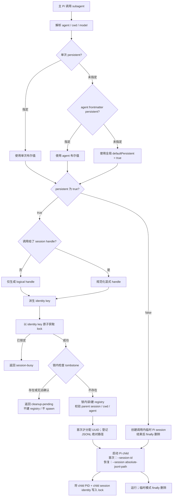
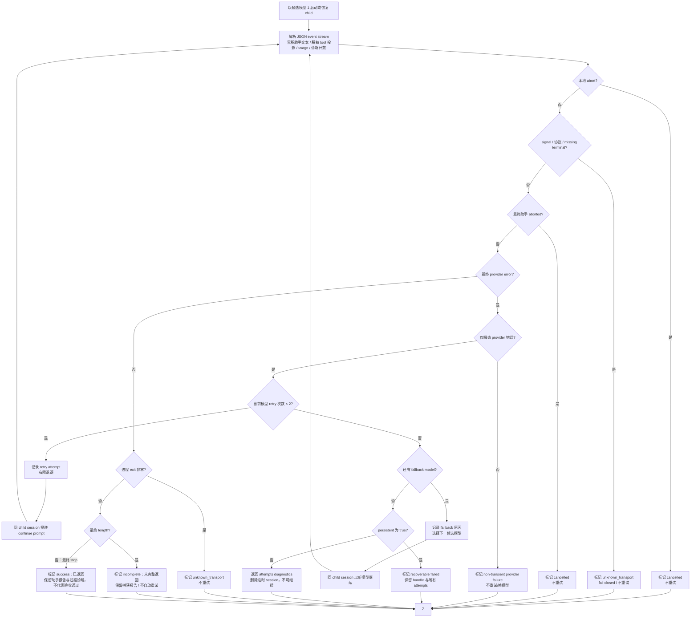
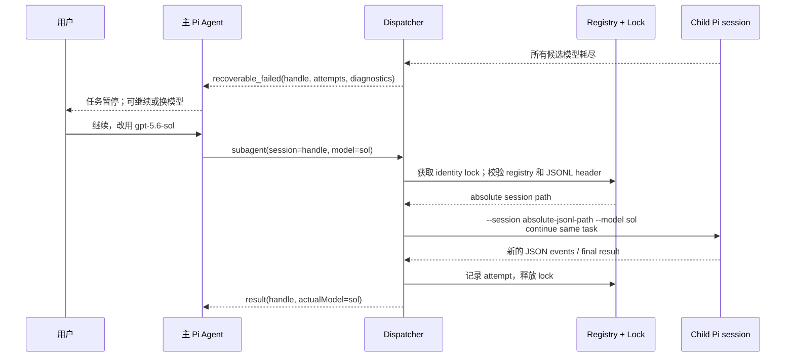
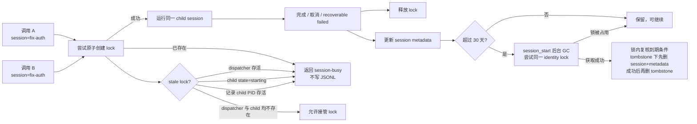
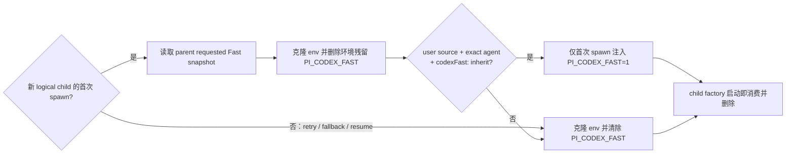

# Subagent Dispatcher 执行流程图

| 项目 | 定义 |
| --- | --- |
| 状态 | `IMPLEMENTING` — 首版源码、focused tests、独立代码复审及 headless provider 创建+恢复 smoke 已完成；真实 TUI/retry/fallback/Fast child E2E 待验证。 |
| 层级 | 第二层（L2）可视化设计页 |
| 上游 | [Subagent Dispatcher 产品规范](../01-产品定义/扩展/subagent-扩展.md)、[Subagent Dispatcher 技术设计](subagent-dispatcher-技术设计.md) |
| 目的 | 只呈现首版实现遵循的执行流程；源码和自动化测试已覆盖关键门禁，真实 provider/TUI E2E 仍未完成。 |

## 1. 创建与持久化决策

`session_start` 同时启动一次后台 best-effort 30 天 GC；GC 不在主任务路径上 await，失败不会阻塞 dispatch。

**关键点**：`persistent: true` 是默认值，但未提供 handle 的新委派仍会生成**新** child session；不会按 agent 名称错误接入旧任务。

## 2. 模型请求、重试与 fallback

最终 `length` 标记 `incomplete`：保留已捕获报告、不自动重试。只有以下闭集错误类别进入 `H`：

> 终态候选在后续 assistant `message_start`、assistant `toolUse` 或任一 tool execution 事件后失效；普通 `turn_end`/`agent_end` 不清除。`phase=running` 的 progress 不画最终失败图标。`fetch failed`、`ECONNRESET`、`ECONNREFUSED`、`ETIMEDOUT`、明确 timeout、HTTP 429、502、503、504。认证、模型配置、401/403、未知 transport、测试或命令失败不会触发 fallback。

## 3. 持久 child 候选耗尽后的继续与手动换模型

手动 `model` 只覆盖这一次恢复/继续请求。它不修改主 Pi 模型、不修改 agent frontmatter，也不改变其他 child session。

## 4. 并发、锁与保留期

- lock 文件记录 dispatcher PID、child PID、child session identity 和恢复 session path；只有确认 dispatcher 与实际记录的 Pi child 都不存在时才可作为 stale lock 清理。`starting` 状态默认先经过 5 秒 grace，之后扫描同主机可读进程表中的 `--mode json --session-id` / `--session` 匹配；PID 存活、匹配 child 存活、身份/路径缺失或进程表不可读都一律 fail closed，不能仅因时间到期释放运行中的 session。只有扫描成功且没有匹配 child 才可接管；这不覆盖 OS 进程表权限、平台命令差异和扫描竞态。
- GC 只处理 dispatcher 自己创建的 child storage，不扫描或删除主 Pi session。

## 5. Fast 继承的 spawn 边界

retry、fallback 与恢复都可能启动新的 child 进程，但它们不是新 logical child：一律不读取 parent Fast snapshot、只以 Off 启动；不会把 Fast 写入持久 child session 或 dispatcher registry。
