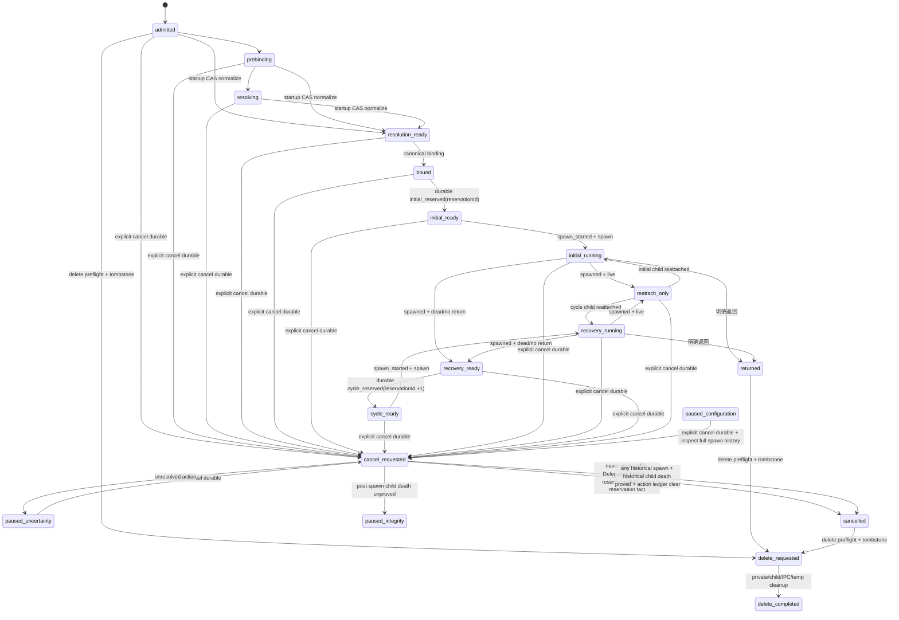
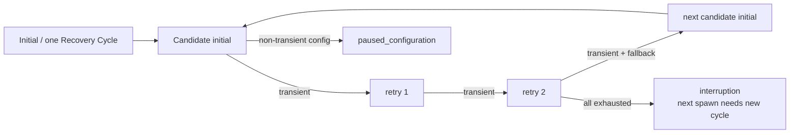
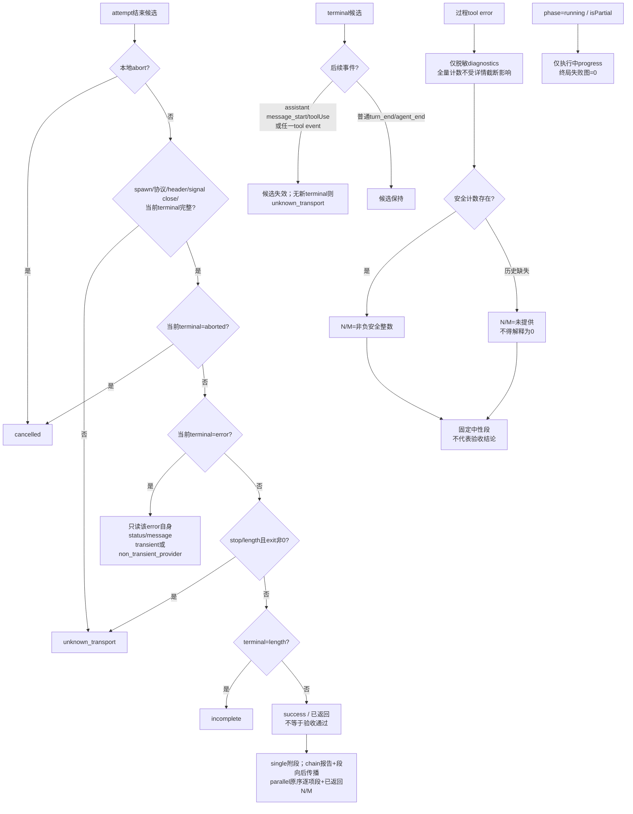
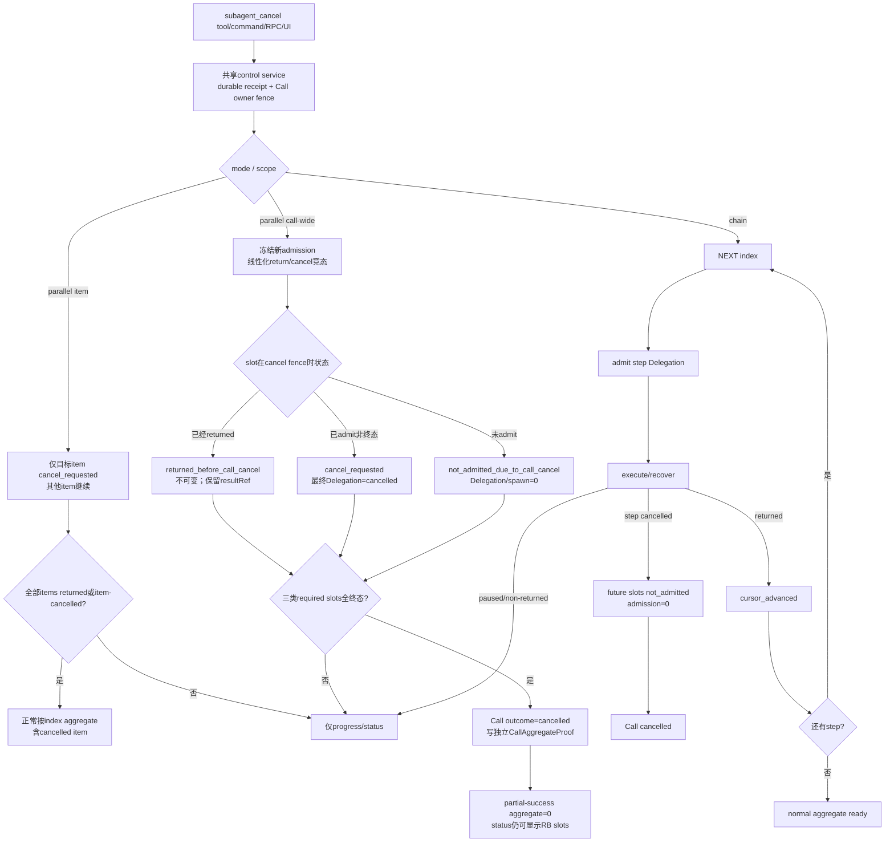
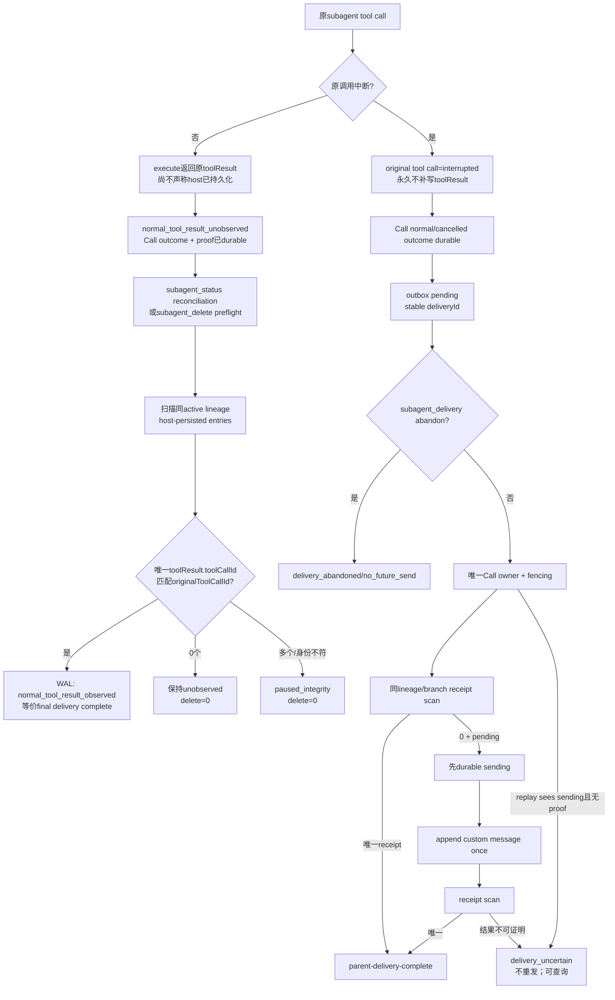
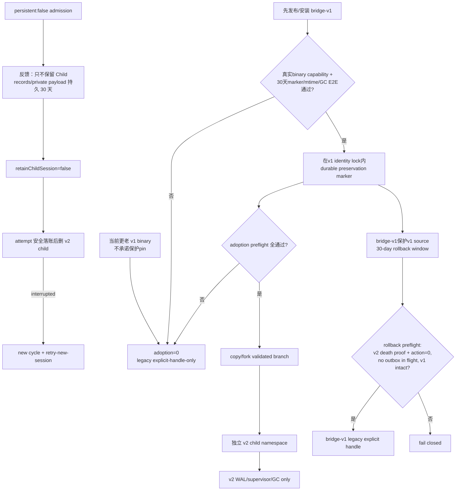
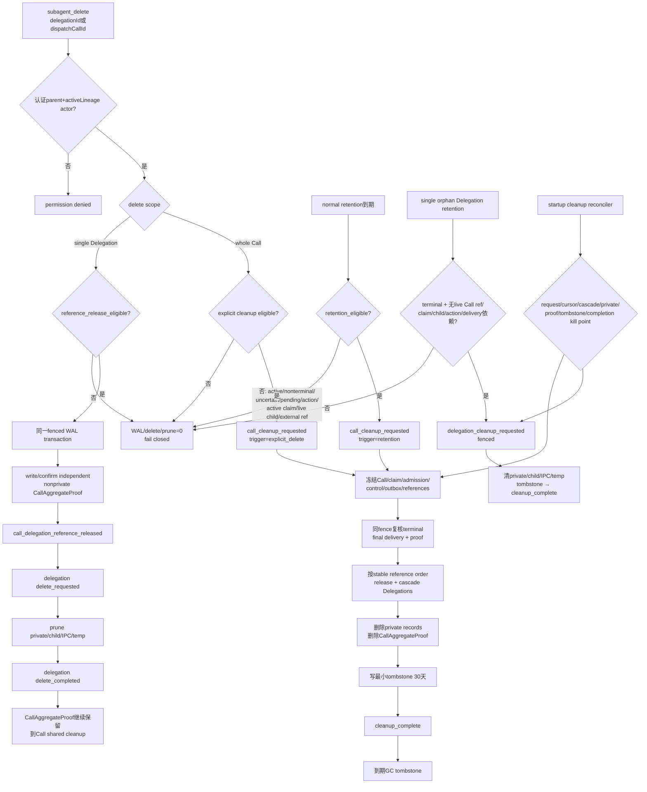
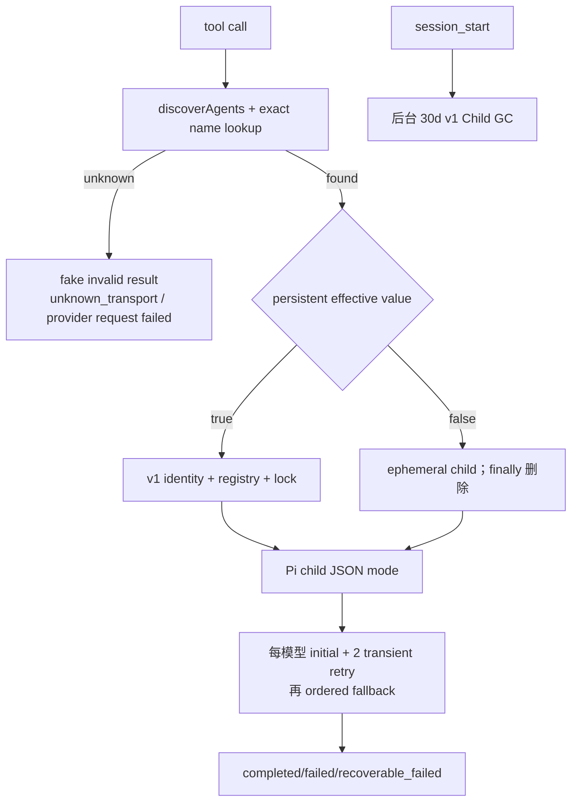

# Subagent Dispatcher 执行流程图

| 项目 | 定义 |
| --- | --- |
| 状态 | `DECIDED / sliced implementation` — 2026-09-14 已采纳本页对应的 v2 目标设计；AR3-4/AR3-5 及此前 required Findings 已为 `resolved_fixed`。当前 v1 执行基线仍保持不变。切片0的 bridge-v1 preservation pin、capability probe 与锁内 GC 保护已有本地实现及自动化测试，但发布/部署、真实 binary/kill-point 与同 UID 路径竞态仍未证明，adoption 继续为 0。切片1+2 foundation 已实现并测试；切片3 当前仅有 gated internal execution/recovery seam（initial/cycle reserve、spawn intent/start、child bind、cycle 1..3 与 bounded provider retry），仍未接入现行 v1 execute。 |
| 层级 | 第二层（L2）可视化设计页 |
| 上游 | [Subagent Dispatcher 产品规范](../01-产品定义/扩展/subagent-扩展.md)、[Subagent Dispatcher 技术设计](subagent-dispatcher-技术设计.md) |
| 正式评审与采纳 | [2026-09-14 产品语义/指标 Review Artifact](../归档/评审/2026-09-14-subagent-dispatcher-产品语义指标Review-Artifact.md)、[实现/运营 Review Artifact](../归档/评审/2026-09-14-subagent-dispatcher-实现运营Review-Artifact.md)、[Adoption Decision](../归档/评审/2026-09-14-subagent-dispatcher-Adoption-Decision.md) |
| 目的 | 对照展示目标控制流、崩溃边界与当前 v1 基线；图中“目标”不得反推为当前能力。 |

## 1. 目标：Admission、resolver 与 canonical binding

```mermaid
flowchart TD
  A[subagent tool call] --> V{shape / mode 合法?}
  V -->|否| IV[invalid；不建记录]
  V -->|是| C[WAL: call_admitted<br/>parent + activeLineage + anchor + toolCall]
  C --> M{mode}
  M -->|single| N[NEXT item 0]
  M -->|parallel| NP[NEXT each stable index]
  M -->|chain| NC[NEXT current step only]
  N --> D[delegation_admitted<br/>pre-binding identity]
  NP --> D
  NC --> D
  D --> RAW[保留 raw user/project candidates]
  RAW --> RT{realpath / trust / symlink<br/>全部合法?}
  RT -->|否| PC[paused_configuration<br/>spawn=0]
  RT -->|是| SH[project-over-user shadow<br/>合法同名覆盖不算 duplicate]
  SH --> EF{effective canonical / aliases<br/>唯一?}
  EF -->|否| PC
  EF -->|是| B[原子 canonical binding<br/>source + rootRealpath + fileRealpath + digest]
  B --> IR[WAL: initial_reserved(reservationId)<br/>cycle 不增加]
  IR --> RDY[initial_ready(reservationId)]
```

Pre-binding identity 固定为 `delegationId + parent + active lineage/anchor + cwd + requestedTarget + discoveryScope`。并行 item 即使其他字段完全相同也不能复用 Delegation。已绑定 digest 变化必须经 `config_revision_accepted`，且只能更新同 canonical name/source/root/path；跨身份变化不静默 rebind。

## 2. 目标：Reserve、spawn、continuation 与 recovery cycle

```mermaid
flowchart TD
  B[admitted/bound<br/>canonical binding complete] --> IR[durable initial_reserved(reservationId)]
  IR --> IREADY[initial_ready(reservationId)]
  IREADY --> IC{durable cancel_requested?}
  IC -->|否| IS[spawn_started] --> IRUN[initial_running]
  IC -->|是| ISEAL[reservation_cancelled<br/>durable cancelled；spawn=0]

  RR[recovery_ready] --> CR[durable cycle_reserved(reservationId,+1)]
  CR --> CREADY[cycle_ready(reservationId)]
  CREADY --> CC{durable cancel_requested?}
  CC -->|否| CS[spawn_started] --> RRUN[recovery_running]
  CC -->|是| CSEAL[reservation_cancelled<br/>durable cancelled；spawn=0]

  PRE[admitted/prebinding/resolving/<br/>resolution_ready/bound] --> PC{cancel_requested?}
  PC -->|是 + 无reservation/spawn/child/action| NF[durable pre_spawn_no_reservation<br/>cancelled；spawn=0]

  IRUN --> LIVE{匹配 child live?}
  RRUN --> LIVE
  LIVE -->|是| RE[reattach only]
  LIVE -->|否/不可证明| DEAD{死亡可证明?}
  DEAD -->|否| PI[paused_integrity]
  DEAD -->|是且无 return| RR
  RR --> BUD{cyclesUsed &lt; 3?}
  BUD -->|否| EX[paused_integrity: exhausted<br/>cycle 4 / total spawn 5 = 0]
  BUD -->|是| CR
  FIX[配置修复/人工确认] --> CE[continuationEpoch + 1<br/>决定本身不加 cycle]
  CE --> PC
```

唯一边固定为`admitted/bound(canonical-bound) --initial_reserved--> initial_ready(reservationId) --spawn_started--> initial_running`和`recovery_ready --cycle_reserved(+1)--> cycle_ready(reservationId) --spawn_started--> recovery_running`。`initial_reserved/cycle_reserved`是WAL事件，不是另一组状态；startup发现已有event只投影同reservationId的ready，append reserve/count=0。

同一`(executionScope, continuationEpoch, fencingGeneration)`第二个spawn intent拒绝。每个Delegation initial≤1，pre-spawn cancel可为0；有reservation时cancel封存，无reservation时写durable fact。initial child死亡后的下一spawn是cycle1；只允许cycle1/2/3，总逻辑spawn≤4，cycle4/第5次spawn=0。resolution executor对每个collect/realpath/resolve/bind行动前重读fenced cancel，cancel后resolution/binding/spawn=0。

## 3. 目标：Active-lineage supervisor 与 owner fencing

```mermaid
flowchart TD
  E[session_start / session_tree] --> RP[扫描当前 active lineage<br/>全部非终态 durable records]
  RP --> CAS[每条先 durable CAS<br/>owner-fenced claim]
  CAS -->|admitted / prebinding / resolving| RZ[prebind resolution-ready]
  CAS -->|canonical admitted/bound + no initial reserve| IZ[保持原投影<br/>路由initial reservation executor]
  CAS -->|已有reserved event + no spawn_started| CZ[initial/cycle-ready(reservationId)<br/>只投影；append/count=0]
  CAS -->|spawned + live| RO[reattach-only]
  CAS -->|spawned + dead/no return| RR[recovery_ready<br/>下一 spawn 新 cycle +1]
  CAS -->|cancel_requested| CR{cancel reconciler}
  CR -->|resolution-ready/pre-spawn无执行事实| CC[有reserve: seal<br/>无reserve: durable fact<br/>cancelled]
  CR -->|spawned-live/dead| CP[terminate/wait或death/action对账]
  CAS -->|paused/delete/cleanup| SR[专门 reconciler]
  CAS -->|returned/cancelled/deleted/delivery complete| TR[终态 / outbox 对账]
  RZ --> EX[对应 executor 再次 fenced claim]
  IZ --> EX
  CZ --> EX
  RO --> EX
  RR --> EX
  EX --> L{parent + activeLineageId + anchor<br/>current leaf 全匹配?}
  L -->|否| AB[等待原 lineage；不 claim/send]
  L -->|是| H{历史出现过<br/>spawn_started?}
  H -->|否| PRE{旧supervisor death +<br/>两次稳定WAL/no child-ref/no action?}
  PRE -->|是；不生成child death| F[new fencing generation]
  H -->|是| POST{supervisor + child death<br/>+ action reconciliation?}
  POST -->|是| F
  PRE -->|否| PI[paused_integrity / uncertainty<br/>spawn=0]
  POST -->|否| PI
  RPID[Darwin同PID birth mismatch<br/>两次稳定可读] --> RD[原进程death proof<br/>复用PID signal=0]
  RMISS[birth缺失/不可读/观察不稳定] --> PI
  F --> CK[重读 branch/WAL/child/action/outbox]
  CK --> ACT[按归一状态行动]
```

Startup reconciler 只归一，不直接 resolution/spawn/reattach/send；`cancel_requested`只路由专门reconciler。每个executor再次fenced claim。Pre-spawn transfer要求旧supervisor death，且identity lock内两次稳定WAL观察证明从未`spawn_started`、无child/live ref、无action intent/outstanding action；child absence由WAL/no-ref证明，不能虚构child death。任何`spawn_started`后才要求supervisor+child death及action reconciliation。Anchor仅是必要条件，sibling lineage不得接管。TTL、单次kill0、terminate/terminal ACK无效。Darwin相同PID但稳定可读birth mismatch经两次观察即证明原进程死亡，且绝不能signal复用PID；同PID同birth但session/path/argv mismatch是integrity事故，只有birth缺失/不可读、权限不足或观察不稳定才暂停。旧generation写与ACK全部拒绝。

## 4. 目标：状态、取消与 provider inner budget

```mermaid
stateDiagram-v2
  [*] --> admitted
  admitted --> prebinding
  prebinding --> resolving
  admitted --> resolution_ready: startup CAS normalize
  prebinding --> resolution_ready: startup CAS normalize
  resolving --> resolution_ready: startup CAS normalize
  resolution_ready --> bound: canonical binding
  bound --> initial_ready: durable initial_reserved(reservationId)
  initial_ready --> initial_running: spawn_started + spawn
  initial_running --> reattach_only: spawned + live
  reattach_only --> initial_running: initial child reattached
  reattach_only --> recovery_running: cycle child reattached
  initial_running --> recovery_ready: spawned + dead/no return
  recovery_ready --> cycle_ready: durable cycle_reserved(reservationId,+1)
  cycle_ready --> recovery_running: spawn_started + spawn
  recovery_running --> reattach_only: spawned + live
  recovery_running --> recovery_ready: spawned + dead/no return
  initial_running --> returned: 明确返回
  recovery_running --> returned: 明确返回
  admitted --> cancel_requested: explicit cancel durable
  prebinding --> cancel_requested: explicit cancel durable
  resolving --> cancel_requested: explicit cancel durable
  resolution_ready --> cancel_requested: explicit cancel durable
  bound --> cancel_requested: explicit cancel durable
  initial_ready --> cancel_requested: explicit cancel durable
  cycle_ready --> cancel_requested: explicit cancel durable
  initial_running --> cancel_requested: explicit cancel durable
  recovery_running --> cancel_requested: explicit cancel durable
  recovery_ready --> cancel_requested: explicit cancel durable
  reattach_only --> cancel_requested: explicit cancel durable
  paused_configuration --> cancel_requested: explicit cancel durable + inspect full spawn history
  paused_uncertainty --> cancel_requested: explicit cancel durable
  cancel_requested --> cancelled: never spawned in Delegation history + reserve sealed or no-reservation fact
  cancel_requested --> cancelled: any historical spawn + historical child death proved + action ledger clear
  cancel_requested --> paused_uncertainty: unresolved action
  cancel_requested --> paused_integrity: post-spawn child death unproved
  admitted --> delete_requested: delete preflight + tombstone
  returned --> delete_requested: delete preflight + tombstone
  cancelled --> delete_requested: delete preflight + tombstone
  delete_requested --> delete_completed: private/child/IPC/temp cleanup
```

```mermaid
flowchart LR
  EX[Initial / one Recovery Cycle] --> M[Candidate initial]
  M -->|transient| R1[retry 1] -->|transient| R2[retry 2]
  R2 -->|transient + fallback| N[next candidate initial]
  N --> M
  M -->|non-transient config| PC[paused_configuration]
  R2 -->|all exhausted| I[interruption<br/>next spawn needs new cycle]
```

Provider attempt从不增加recovery cycle；continuationEpoch不刷新provider budget。shutdown/reload/signal/timeout/不明aborted不是取消。显式cancel先durable `cancel_requested`并禁止新resolution/binding/spawn/intent。通常pre-spawn scope按无spawn/child/action事实封存reserve或写fact后直接`cancelled`，不虚构death；post-spawn才terminate/wait并对账。`paused_configuration`按Delegation完整历史分流：从未`spawn_started`走pre-spawn，曾spawn必须先证明历史child终止且outstanding action=0。startup覆盖两条历史；unresolved→uncertainty，post-spawn死亡未知→integrity。

### 4.1 目标：执行结果固定裁决与传播

```mermaid
flowchart TD
  A[attempt结束候选] --> L{本地abort?}
  L -->|是| C[cancelled]
  L -->|否| I{spawn/协议/header/signal close/<br/>当前terminal完整?}
  I -->|否| U[unknown_transport]
  I -->|是| AB{当前terminal=aborted?}
  AB -->|是| C
  AB -->|否| ER{当前terminal=error?}
  ER -->|是| P[只读该error自身status/message<br/>transient或non_transient_provider]
  ER -->|否| NZ{stop/length且exit非0?}
  NZ -->|是| U
  NZ -->|否| LE{terminal=length?}
  LE -->|是| INC[incomplete]
  LE -->|否| OK[success / 已返回<br/>不等于验收通过]
  TC[terminal候选] --> INV{后续事件?}
  INV -->|assistant message_start/toolUse<br/>或任一tool event| VOID[候选失效；无新terminal则unknown_transport]
  INV -->|普通turn_end/agent_end| KEEP[候选保持]
  TE[过程tool error] --> DIAG[仅脱敏diagnostics<br/>全量计数不受详情截断影响]
  PH[phase=running / isPartial] --> PROG[仅执行中progress<br/>终局失败图=0]
  DIAG --> SAFE{安全计数存在?}
  SAFE -->|是| NUM[N/M=非负安全整数]
  SAFE -->|历史缺失| MISS[N/M=未提供<br/>不得解释为0]
  NUM --> SEG[固定中性段<br/>不代表验收结论]
  MISS --> SEG
  OK --> COMP[single附段；chain报告+段向后传播<br/>parallel原序逐项段+已返回N/M]
```

`FailureKind`闭集固定为`success/incomplete/cancelled/transient_provider/non_transient_provider/unknown_transport/task_failure`。每attempt可选`phase=running|finished`；新runner始终给出`toolErrorCount/providerErrorCount`两个非负安全整数，历史缺失逐项显示“未提供”且不当作0。tool详情有界截断不改变全量计数，diagnostics/详情无敏感或raw payload。唯一段恰为`[执行诊断：不代表验收结论；工具异常 N；模型异常 M]`。正常业务失败报告仍走`success/已返回`；chain只在非success停止且无`{previous}`也必须传播报告+段；parallel逐项保留，不能被聚合计数覆盖。

## 5. 目标：Child interceptor、side-effect IPC 与 watchdog

```mermaid
sequenceDiagram
  participant D as Dispatcher
  participant P as Child pre-fence allowlist handlers
  participant F as Fence interceptor (last)
  participant W as IPC watchdog / WAL writer
  participant T as Tool
  D->>P: --no-extensions; ordered -e custom-tool allowlist
  D->>F: final -e fence realpath + opaque refs
  F->>W: handshake(version,digests,load order,scope,epoch,generation)
  W-->>F: peer/version/order ACK
  P->>P: all allowed tool name/args rewrites
  P->>F: final tool name + args
  F->>W: intent(final-input hash, action identity)
  W->>W: durable intent
  W-->>F: ACK(hash, WAL ref, generation)
  F->>T: execute only if actual input hash matches ACK
  T-->>P: raw result
  P->>P: all allowed result middleware rewrites
  P->>F: final middleware result
  F->>W: result frame(final-result hash/classification)
  alt valid durable result ACK
    W-->>F: result ACK
  else order/exclusivity/hash/ACK failure
    W->>F: independent watchdog terminate child
    W->>W: paused_integrity or paused_uncertainty
  end
```

受恢复管理child必须`--no-extensions`启动，仅按版本固定allowlist显式`-e`加载必要custom-tool extensions，fence interceptor最后加载；ambient/auto-discovered extension=0。Pi handler按加载顺序运行且后续handler可改写输入/结果，所以所有args改写必须在fence前完成，fence持久hash并ACK最终执行输入；其后改写反例必须fail closed。result ACK基于最终middleware result，不是原始execute返回。加载清单、顺序、tool provenance或排他性不可证明时，该工具不可自动恢复并进入`paused_integrity`；若动作可能已开始则`paused_uncertainty`。真实E2E覆盖后续handler改写反例、result rewrite、return-isError/throw、伪造ACK与watchdog termination。

## 6. 目标：Parallel 与 chain 的 Call 终止门禁

```mermaid
flowchart TD
  A[subagent_cancel tool/command/RPC/UI] --> S[共享control service<br/>durable receipt + Call owner fence]
  S --> M{mode / scope}
  M -->|parallel item| IC[仅目标item cancel_requested<br/>其他item继续]
  IC --> IA{全部items returned或item-cancelled?}
  IA -->|是| AG[正常按index aggregate<br/>含cancelled item]
  IA -->|否| PROG[仅progress/status]

  M -->|parallel call-wide| F[冻结新admission<br/>线性化return/cancel竞态]
  F --> K{slot在cancel fence时状态}
  K -->|已经returned| RB[returned_before_call_cancel<br/>不可变；保留resultRef]
  K -->|已admit非终态| AC[cancel_requested<br/>最终Delegation=cancelled]
  K -->|未admit| NA[not_admitted_due_to_call_cancel<br/>Delegation/spawn=0]
  RB --> ALL{三类required slots全终态?}
  AC --> ALL
  NA --> ALL
  ALL -->|否| PROG
  ALL -->|是| CC[Call outcome=cancelled<br/>写独立CallAggregateProof]
  CC --> NO[partial-success aggregate=0<br/>status仍可显示RB slots]

  M -->|chain| NEXT[NEXT index]
  NEXT --> AD[admit step Delegation]
  AD --> EX[execute/recover]
  EX -->|paused/non-returned| PROG
  EX -->|step cancelled| FS[future slots not_admitted<br/>admission=0] --> CC2[Call cancelled]
  EX -->|returned| ADV[cursor_advanced] --> MORE{还有step?}
  MORE -->|是| NEXT
  MORE -->|否| CA[normal aggregate ready]
```

Call-wide cancel与return/admission必须由同一fence裁决；不得把cancel前returned倒写cancelled，也不得从这些slot生成partial-success aggregate。startup/并发owner幂等补齐三类终态。CallAggregateProof独立、非private，按slot/order保存终态与Call outcome。

## 7. 目标：normal toolResult proof 与 interrupted notification

```mermaid
flowchart TD
  T[原subagent tool call] --> X{原调用中断?}
  X -->|否| TR[execute返回原toolResult<br/>尚不声称host已持久化]
  TR --> NU[normal_tool_result_unobserved<br/>Call outcome + proof已durable]
  NU --> Q[subagent_status reconciliation<br/>或subagent_delete preflight]
  Q --> HS[扫描同active lineage<br/>host-persisted entries]
  HS --> HM{唯一toolResult.toolCallId<br/>匹配originalToolCallId?}
  HM -->|是| OBS[WAL: normal_tool_result_observed<br/>等价final delivery complete]
  HM -->|0个| MISS[保持unobserved<br/>delete=0]
  HM -->|多个/身份不符| PI[paused_integrity<br/>delete=0]

  X -->|是| INT[original tool call=interrupted<br/>永久不补写toolResult]
  INT --> DONE[Call normal/cancelled outcome durable]
  DONE --> OP[outbox pending<br/>stable deliveryId]
  OP --> D{subagent_delivery abandon?}
  D -->|是| AB[delivery_abandoned/no_future_send]
  D -->|否| OW[唯一Call owner + fencing]
  OW --> SC[同lineage/branch receipt scan]
  SC -->|唯一receipt| RC[parent-delivery-complete]
  SC -->|0 + pending| DS[先durable sending] --> SEND[append custom message once]
  SEND --> POST[receipt scan]
  POST -->|唯一| RC
  POST -->|结果不可证明| UN[delivery_uncertain<br/>不重发；可查询]
  OW -->|replay sees sending且无proof| UN
```

Extension只控制`execute()`返回，不在返回前原子控制host persistence。`normal_tool_result_observed`只能由后续active-lineage scan写入；status不做cancel/delete/spawn/send。interrupted路径继续保持custom message at-most-once，不保证exactly-once/至少一次。

## 8. 目标：`persistent:false`、bridge-v1、v1/v2 namespace 与 rollback

```mermaid
flowchart TD
  P[persistent:false admission] --> F[反馈：只不保留 Child<br/>records/private payload 持久 30 天]
  F --> R[retainChildSession=false]
  R --> D[attempt 安全落账后删 v2 child]
  D -->|interrupted| N[new cycle + retry-new-session]

  OLD[当前更老 v1 binary<br/>不承诺保护pin] --> NO[adoption=0<br/>legacy explicit-handle-only]
  B1[先发布/安装 bridge-v1] --> CAP{真实binary capability +<br/>30天marker/mtime/GC E2E通过?}
  CAP -->|否| NO
  CAP -->|是| PIN[在v1 identity lock内<br/>durable preservation marker]
  PIN --> PF{adoption preflight 全通过?}
  PF -->|否| NO
  PF -->|是| CP[copy/fork validated branch]
  CP --> V2[独立 v2 child namespace]
  V2 --> OWN[v2 WAL/supervisor/GC only]
  PIN --> KEEP[bridge-v1保护v1 source<br/>30-day rollback window]
  KEEP --> RB{rollback preflight:<br/>v2 death proof + action=0,<br/>no outbox in flight, v1 intact?}
  RB -->|是| LEG[bridge-v1 legacy explicit handle]
  RB -->|否| FAIL[fail closed]
```

公开`persistent`字段保持schema兼容，内部使用`retainChildSession`；行为与隐私语义已变化，不称完全向后兼容。v2 adoption必须bridge-v1先行：独立owner-only preservation marker不修改旧schema，bridge在v1 lock内结合marker/mtime阻止GC。未安装/未验证bridge时既有v1 session绝不adopt。当前更老v1 binary可忽略marker，故不承诺保护v2 adoption或直接安全rollback。v2 child始终独立namespace。真实bridge-v1 binary必须覆盖完整30天窗口边界、GC与rollback E2E。

### 8.1 目标：主动删除、共享 retention cleanup、独立 proof 与防复活 tombstone

```mermaid
flowchart TD
  D[subagent_delete<br/>delegationId或dispatchCallId] --> A{认证parent+activeLineage actor?}
  A -->|否| DENY[permission denied]
  A -->|是| K{delete scope}

  K -->|single Delegation| E{reference_release_eligible?}
  E -->|否| ZERO[WAL/delete/prune=0<br/>fail closed]
  E -->|是| TX[同一fenced WAL transaction]
  TX --> PF[write/confirm independent<br/>nonprivate CallAggregateProof]
  PF --> REL[call_delegation_reference_released]
  REL --> DR[delegation delete_requested]
  DR --> PR[prune private/child/IPC/temp]
  PR --> DC[delegation delete_completed]
  DC --> KEEP[CallAggregateProof继续保留<br/>到Call shared cleanup]

  K -->|whole Call| CE{explicit cleanup eligible?}
  RET[normal retention到期] --> RE{retention_eligible?}
  CE -->|否| ZERO
  RE -->|否: active/nonterminal/<br/>uncertain/pending/action/<br/>active claim/live child/external ref| ZERO
  CE -->|是| CR[call_cleanup_requested<br/>trigger=explicit_delete]
  RE -->|是| CRT[call_cleanup_requested<br/>trigger=retention]
  CR --> FRZ[冻结Call/claim/admission/<br/>control/outbox/references]
  CRT --> FRZ
  FRZ --> RV[同fence复核terminal<br/>final delivery + proof]
  RV --> CAS[按stable reference order<br/>release + cascade Delegations]
  CAS --> RM[删除private records<br/>删除CallAggregateProof]
  RM --> TS[写最小tombstone 30天]
  TS --> CEND[cleanup_complete]
  CEND --> GC[到期GC tombstone]

  OR[single orphan Delegation retention] --> OE{terminal + 无live Call ref/<br/>claim/child/action/delivery依赖?}
  OE -->|否| ZERO
  OE -->|是| OREQ[delegation_cleanup_requested<br/>fenced]
  OREQ --> OPR[清private/child/IPC/temp<br/>tombstone → cleanup_complete]

  START[startup cleanup reconciler] --> KP{request/cursor/cascade/private/<br/>proof/tombstone/completion kill point}
  KP --> FRZ
  KP --> OREQ
```

Normal retention只计算eligibility，绝不直接删除。它与whole-Call delete在`call_cleanup_requested`后共享同一fence、reference-order cursor和startup幂等reconcile；request耐久后新claim/spawn/send/control/reference=0。Single preflight仍不得要求reference已经release；predicate=true后proof→release→delete_requested→prune不能释放fence。proof不是private record或tombstone，single删除后继续支撑query；只有Call shared lifecycle级联完成后才删除。single orphan也必须先证明无live refs/actions再fenced cleanup。最小tombstone仅含`idHash/objectKind/schemaVersion/deletedAt/status`和`actorScopeTag`。

## 9. 目标：隐私与权限边界

| 表面 | 目标控制 |
| --- | --- |
| argv / process list | 无 raw task/system prompt/token/header；只含固定 interceptor path 与 opaque refs。 |
| private payload / temp prompt | owner-only mode/ACL、拒绝 symlink/非 owner、正常/异常/signal清理与 startup GC。 |
| IPC endpoint | owner-only socket/pipe、OS peer identity、challenge、scope/epoch/fence binding。 |
| IPC frames / ACK | schema/size/sequence/redaction；伪造、重放、旧 generation、乱序 fail closed。 |
| WAL/outbox/query/TUI | 仅 whitelist/hash/ref；不泄漏绝对 cwd、task/prompt、raw provider body。 |
| tombstone HMAC secret | owner-only keyring、拒绝symlink/hardlink；轮换保留旧key到30天tag失效，丢失/不可验证fail closed。 |

## 10. 当前 v1 基线（已实现事实）

```mermaid
flowchart TD
  A[tool call] --> D[discoverAgents + exact name lookup]
  D -->|unknown| U[fake invalid result<br/>unknown_transport / provider request failed]
  D -->|found| P{persistent effective value}
  P -->|true| I[v1 identity + registry + lock]
  P -->|false| E[ephemeral child；finally 删除]
  I --> R[Pi child JSON mode]
  E --> R
  R --> T[每模型 initial + 2 transient retry<br/>再 ordered fallback]
  T --> O[completed/failed/recoverable_failed]
  SS[session_start] --> GC[后台 30d v1 Child GC]
```

当前已有：Child Session registry/identity lock、JSONL integrity/quarantine/tombstone、provider retry/fallback、explicit handle resume、旧 `persistent:false` 临时 child、Fast 首 spawn约束与基础 UI/tests。

切片1+2 foundation 当前已有：独立 `v2/` namespace 下的 Call/Delegation/pre-binding WAL、reference-before-admitted admission、private payload/provenance、raw→effective resolver、active lineage、startup no-spawn normalization、revision/WAL replay 与相关 integrity/replay tests；这些能力保持 gated，未接入现行 v1 execute。切片3 当前已有 gated internal execution/recovery seam：initial/cycle reservation、spawn intent/start、child-session binding、provider retry/fallback、recovery cycle 1..3、continuation epoch、running child live/dead/unknown 归一、generation fencing、严格绝对 session JSONL 校验及 `persistent:false` child 清理（cleanup 不可证明时 durable integrity pause）；仍未接入现行 v1 execute，真实 OS/restart/owner transfer 未验证。切片0的 bridge-v1 marker、capability probe 与锁内 GC 保护也已有本地实现及自动化测试，但发布/部署、真实 binary/kill-point 与平台边界仍待验证，adoption 不开启。当前尚未实现或接线的是 cancel、delivery/outbox、side-effect interceptor/IPC、完整 owner transfer、delete/migration、Darwin裁决等；不得把目标图当作现行能力。详见[技术设计 §9.12](subagent-dispatcher-技术设计.md#912-当前源码事实与-drift)。

## 11. 继续前提

本页所示目标已由[产品语义/指标轴](../归档/评审/2026-09-14-subagent-dispatcher-产品语义指标Review-Artifact.md)与[实现/运营轴](../归档/评审/2026-09-14-subagent-dispatcher-实现运营Review-Artifact.md)在同一固定 revision 批准，并由[Adoption Decision](../归档/评审/2026-09-14-subagent-dispatcher-Adoption-Decision.md)正式采纳。AR3-1～AR3-5 及此前 required Findings 已为 `resolved_fixed`；L1 Acceptance 保持 S1–S43 连续，完整映射见[技术设计 §9.14](subagent-dispatcher-技术设计.md#914-最终复审逐-finding-关闭映射)。

状态为`DECIDED / sliced implementation`。切片0已有 bridge-v1 本地实现与 focused tests，但发布/部署、真实 binary/kill-point 与同 UID 路径竞态仍未证明；capability 仍为 `verified=false/adoptionAllowed=false`，因此 adoption 仍为 0。切片1+2 foundation 已实现并有自动化测试；切片3 仅完成 gated internal execution/recovery seam，未接入现行 v1 execute，且真实 child、OS/restart、owner transfer 与 Darwin 证据仍缺失。采用既有 v1 session 前仍必须先完成并验证完整 `bridge-v1` 前置；cancel/delivery/side-effect/delete/migration 等后续切片仍未实现或接线。实现必须保留当前 v1 基线、逐切片代码评审并补齐 S1–S43 证据；目标图不得被表述为当前能力。
