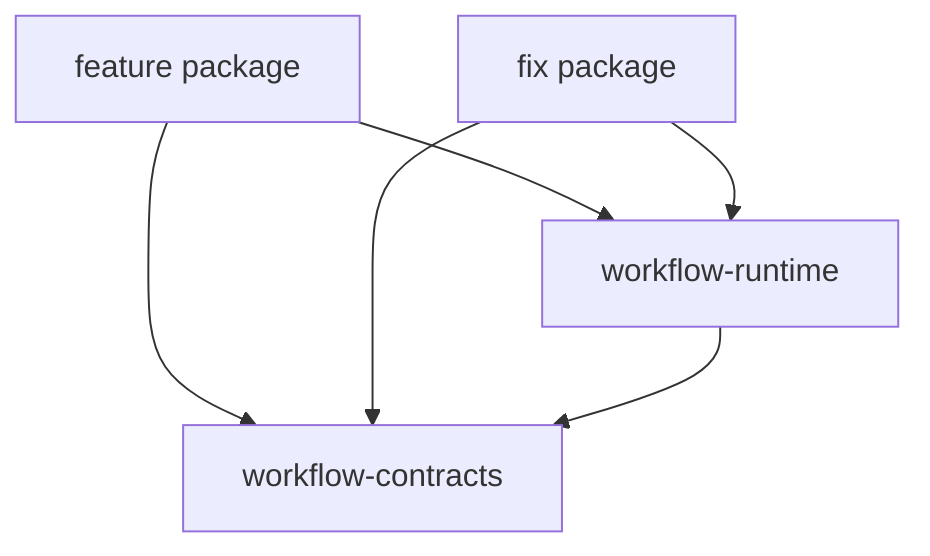

# 仓库组织

- 状态：`DECIDED`
- 层级：第三层（L3）
- 上游：[五层文档总览](../README.md)
- 产品 owner：[第一层产品定义](../01-产品定义/README.md)
- 实现 owner：[第二层实现地图](../02-产品实现/README.md)

## 1. 责任边界

本文件只回答 GitHub monorepo 如何承载、安装和发布产品，不定义 Feature/Fix 的产品流程，也不定义 Runtime 的状态机、Guard、Artifact schema 或 Worker 生命周期。

```text
L1：Feature / Fix 必须保证什么
L2：Workflow Runtime 当前怎样实现
L3：这些实现以哪些 package、目录和项目默认落在仓库中
```

## 2. 已采纳组织

项目使用一个 Git monorepo。每个顶层 Workflow Extension 对应一个可独立安装、启用、升级和回滚的 Pi package；它们共享普通 TypeScript Runtime 与 Contracts libraries。

```text
一个 Git monorepo
├── feature Pi package  → /feature 顶层 Extension
├── fix Pi package      → /fix 顶层 Extension
├── workflow-runtime    → 共享 Runtime library
└── workflow-contracts  → 共享 contracts library
```

顶层入口采用独立 package，因为它们是独立产品边界；Node 当前不独立成 package，因为它是 Workflow Definition 内的工作单元，不需要自己的安装、命令或发布生命周期。

## 3. 依赖方向



约束：

- `workflow-runtime` 和 `workflow-contracts` 是普通 TypeScript libraries，不注册 `/feature` 或 `/fix`。
- Feature/Fix package 各自拥有命令接线和可执行 Workflow Definition。
- 共享 library 不反向依赖具体入口 package。
- 两个入口不能通过隐式内存状态耦合；跨 Run 交互必须使用显式、可追溯接口。

## 4. 目标目录

```text
my-pi-extension/
├── package.json
├── packages/
│   ├── workflow-contracts/
│   │   ├── src/
│   │   └── test/
│   ├── workflow-runtime/
│   │   ├── src/
│   │   └── test/
│   ├── feature/
│   │   ├── package.json
│   │   ├── src/
│   │   └── test/
│   ├── fix/
│   │   ├── package.json
│   │   ├── src/
│   │   └── test/
│   └── codex-usage-status/
│       ├── package.json
│       ├── src/
│       └── test/
└── docs/
```

当前仓库已使用 `packages/fix` / `@pi/fix` / `/fix`，尚无 `packages/feature`。`packages/codex-usage-status` 是独立安装、启用和回滚的 provider-status extension；它不属于 Workflow Runtime，也不依赖 `workflow-runtime` 或 `workflow-contracts`，当前源码已实现。Fix 完整治理流程与当前原型的功能差距见[第二层实现地图](../02-产品实现/README.md#已知-l1--l2-drift)。

## 5. Package 选型

| 方案 | 优点 | 代价 | 结论 |
| --- | --- | --- | --- |
| 一个 package 包含全部入口 | 安装和联调最简单 | 入口不能独立安装、升级、回滚 | 不选 |
| Feature/Fix 各一个 package，保持 monorepo | 产品边界清楚，共享代码和联调仍方便 | 需要显式 contracts 与兼容测试 | 已选 |
| 每个 Node 独立 package | Node 可独立发布 | package 与版本矩阵快速膨胀 | 暂不选 |
| 多仓库 | 组织和权限隔离最强 | 跨仓库协议、发布和协作成本高 | 当前不选 |

只有 Node 出现独立命令/tool/UI/lifecycle、稳定跨 Workflow 复用、独立 owner/发布/回滚或独立环境/凭证/依赖需求时，才重新评审 Node package 或独立 Runtime。

## 6. 项目默认与发布

- workspace、依赖、构建脚本和 Pi manifest 由 package/config 文件及[项目配置](项目配置.md)拥有。
- package 名、命令名或目录迁移必须同步 L2 源码/测试、L3 文档与兼容策略。本次 0.x `bugFix` → Fix 收敛不保留旧命令/package/API；只保留旧 checkpoint 的读取兼容，详见[第二层命名迁移](../02-产品实现/README.md#命名迁移)。
- 共享 contracts 的破坏性变化必须同步所有入口 package 并运行兼容测试。
- 模型、Skill 和运行参数的仓库默认写入第三层配置；实验值留在第五层本地。
- secrets、用户数据、临时 trace 和 session 状态不得进入 package 或 Git 历史。

## 7. 非目标

以下内容不由本文件定义：

- Feature/Fix 的 Stage、Node、Artifact、Guard 和 Acceptance：见 L1 Extension 规范；
- Policy 合并、Worker Session、重试、checkpoint 和审计协议：见 L2 Runtime 架构；
- GitHub Review、验证和交付门禁：见第四层；
- 当前任务草稿与 session 连续性：见第五层。
