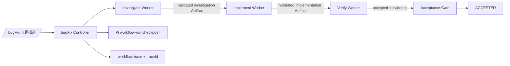

# bugFix Runtime 技术方案

## 1. 目的

为 `/bugFix <问题描述>` 提供可恢复、可审计、由 Runtime 控制的调查—实现—验证流程。模型只负责当前 Node 的工作，不能通过自然语言、自报完成或指定下一状态绕过 Controller。

## 2. 运行边界

bugFix 是通用流程骨架。它不内置具体仓库、前端、后端、数据库或第三方平台的调查规则；这些规则由 Node 使用的 Skill、项目知识和项目策略提供。Runtime 只负责把它们作为当前 Run 的输入，执行通用状态控制、Artifact 交接、Acceptance Gate 和审计。



- Controller/Runtime 拥有状态迁移、Guard、Artifact 校验、checkpoint、恢复、用户确认和最终接受权。
- Skill 定义调查、实现或验证的方法、领域标准、影响面和证据要求；不拥有状态推进权或工具权限。
- 项目知识/策略定义当前仓库的模块关系、调查语境、业务不变量和验证命令；不改变通用 Workflow 状态机。
- 每个 Node 使用独立 Pi SDK `AgentSession`，只拥有该 Node 的 tools 和 skills。
- Worker 不直接访问其他 Worker，也不拥有 `nextStage` 或 `ACCEPTED` 权限。

## 3. Artifact 合同

| Node | 必填字段 | 失败码示例 |
| --- | --- | --- |
| `investigate` | 合法 `route`、非空 `rootCause`、非空 `evidence` | `INVALID_INVESTIGATION_ROUTE`、`MISSING_ROOT_CAUSE`、`MISSING_INVESTIGATION_EVIDENCE` |
| `implement` | `artifact.summary`、非空 `filesChanged`、`candidateRevision` | `MISSING_IMPLEMENTATION_DETAILS`、`MISSING_IMPLEMENTATION_SUMMARY`、`MISSING_FILES_CHANGED`、`MISSING_CANDIDATE_REVISION` |
| `verify` | `accepted`、非空 `evidence`、`candidateRevision` | `MISSING_VERIFICATION_DECISION`、`MISSING_VERIFICATION_EVIDENCE`、`MISSING_VERIFICATION_REVISION` |

`validateSubmitArtifact()` 是唯一 Runtime 合同入口。SDK custom tool、测试 Worker 和其他 Executor 返回的结果在状态迁移前都必须经过该校验。

## 4. Worker 交付与有限重试

Pi SDK 当前没有向 `createAgentSession()` 暴露强制 `tool_choice` 接口，因此不能把模型是否选择 `submit_artifact` 当成可靠控制边界。交付协议采用两条受控路径：

1. 优先调用 `submit_artifact`；
2. 没有工具调用时，仅接受唯一的 `bugfix-artifact` fenced JSON，并使用同一份合同校验。

自然语言、普通 Markdown、多个 JSON block、非法 JSON 或缺字段 JSON 都不能推进状态。

每个 Worker session 最多两次交付尝试：

```text
attempt 1: 执行当前 Node 任务
attempt 2: completion-only 纠正指令
```

对 `Connection error`、超时、连接重置、网络错误、`429`、`502/503/504` 等瞬时模型错误，第二次尝试会标记为 `transient_error`，并携带短错误摘要重新请求；认证、配置和合同错误不走瞬时重试。同一 session 仍无合法交付时，Controller 最多创建一个新的独立 Worker session 重跑同一 Node。不会执行无限 prompt loop。

## 5. 错误分类与恢复

| 分类 | 含义 | 处理 |
| --- | --- | --- |
| `MISSING_*` / `INVALID_*` | 已提交结果但不满足合同 | 当前 Node 有限重试；仍失败则保留 checkpoint |
| `ARTIFACT_NOT_SUBMITTED` | 未获得工具 Artifact 或严格 JSON fallback | 保留当前 checkpoint，提示 `/resume` |
| `MODEL_RESPONSE_ERROR` | Pi assistant response 以 `error` 或 `aborted` 结束 | 记录 stop reason 和错误摘要，保留 checkpoint |
| `MODEL_RESPONSE_TRUNCATED` | assistant response 以 `length` 结束 | 记录模型输出受限，保留 checkpoint |

失败不能直接推进阶段，也不能生成伪造 Artifact。Controller 写入 `workflow-node-failure`，主 UI 显示当前 stage、错误码、traceId 和 `/resume` 恢复动作。恢复使用 Pi 原生 `/resume`，并从最后合法 checkpoint 继续；已持久化的前序 Artifact 会重新注入 Context Capsule。

## 6. Trace 与审计

一个 Workflow Run 使用一个稳定公开 ID，同时作为 `runId` 和 `traceId`。以下 entry 均使用同一 ID 关联：

- `workflow-command`
- `workflow-model-policy`
- `workflow-run`
- `workflow-trace`
- `workflow-node-failure`

主窗口中的 `bugFix-trace` 显示：阶段、模型、skills、工具 start/end、Artifact attempt、模型 stop reason、错误摘要和 Artifact 接受结果。持久化 trace 只保存可审计摘要，不保存隐藏 reasoning，不复制完整问题文本。

审计不把 Skill 的要求等同于已完成事实。对 Skill 声明的调查范围，审计应区分：Worker 实际检查的文件/工具事实、Artifact 提交的证据、明确未验证的范围，以及 Runtime/Guard 的接受或拒绝决定。这样可以复盘“为什么进入下一阶段”，也可以识别“只查到前段、未查后段”的不完整调查。

## 7. Acceptance 边界

实现 Artifact 表示候选修改已交付，不能单独证明修复正确。验证 Node 必须绑定被验证的 `candidateRevision` 并提交验证证据；只有 Verification Artifact 满足 Guard 后才能进入 `ACCEPTED`。不使用文件数量、diff 行数或模型自报结果推断修改质量。

## 8. 验证

```bash
npm test
npm run typecheck
git diff --check
```

当前实现已覆盖 Artifact 缺字段拒绝、错误 Node Artifact 拒绝、跨 Node capsule handoff、checkpoint Artifact 恢复、有限重试、模型响应错误分类、traceId 持久化和 `/resume` 相关行为。
