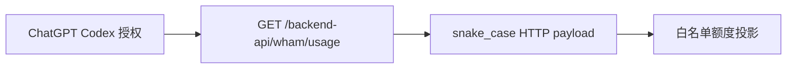

# Codex 订阅额度查询调研

| 项目 | 结论 |
| --- | --- |
| 调研日期 | 2026-09-09 |
| 证据版本 | `openai/codex` `634ebc1865c6ac840ed3ba118f040d527bf4b55d` |
| 结论 | 官方 Codex 客户端对 ChatGPT 登录使用 `GET https://chatgpt.com/backend-api/wham/usage` 读取额度窗口。 |
| 使用边界 | 这是官方客户端实现事实，不是公开稳定 API 承诺；本仓库只能将其作为实验性扩展的外部依赖。 |

## 1. 直接 HTTP 合同

| 项目 | 证据 |
| --- | --- |
| URL 与方法 | `codex-rs/backend-client/src/client/rate_limit_resets.rs`：`PathStyle::ChatGptApi` 使用 `/wham/usage`，方法为 `GET`。 |
| 授权 | `codex-rs/model-provider/src/bearer_auth_provider.rs` 与 `auth.rs`：bearer 授权并附 `ChatGPT-Account-ID`。 |
| 主额度 | `codex-rs/codex-backend-openapi-models/src/models/rate_limit_status_details.rs`：`allowed`、`limit_reached`、`primary_window`、`secondary_window`。 |
| 窗口 | `rate_limit_window_snapshot.rs`：`used_percent`、`limit_window_seconds`、`reset_after_seconds`、`reset_at`。 |
| 额外 bucket | `additional_rate_limit_details.rs`：每项带 `limit_name`、`metered_feature` 和嵌套 `rate_limit`。 |

`app-server` 的 `usedPercent`、`windowDurationMins`、`resetsAt` 是其**二次 camelCase 投影**，不能作为本扩展直接读取 `/wham/usage` 的 wire schema。

上游证据链接：

- https://github.com/openai/codex/blob/634ebc1865c6ac840ed3ba118f040d527bf4b55d/codex-rs/backend-client/src/client/rate_limit_resets.rs
- https://github.com/openai/codex/tree/634ebc1865c6ac840ed3ba118f040d527bf4b55d/codex-rs/codex-backend-openapi-models/src/models

## 2. 已证实的安全约束

| 约束 | 原因 |
| --- | --- |
| 固定 `https://chatgpt.com/backend-api/wham/usage` | Pi provider base URL 可被覆盖；不得向代理或任意 endpoint 携带 ChatGPT 授权。 |
| `redirect: "manual"` | Node 跨 origin 重定向会移除 Authorization，但可能继续转发自定义账户 header。任何 3xx 均视为失败。 |
| 账户 header 只从当前授权 token 的专用 claim 内存解析 | Pi `getProviderAuth("openai-codex")` 在 0.84.4 不会公开该 header；不得读取认证文件、请求用户粘贴 token 或猜测账户。 |
| 响应账户作用域失配即丢弃 | 同一 Pi 进程内可能切换账户；旧账户快照不能发布到底栏。 |
| 不发送 Reserve opt-in header | 被动额度读取不得改变服务端实验或账户状态。 |

## 3. 可用性语义

- `used_percent` 只描述窗口计数。`remainingPercent = clamp(100 - used_percent, 0, 100)` 不能证明当前仍可调用。
- `allowed` 是服务端的权威可用性字段；其缺失为 unknown，不得从百分比、窗口或重置时间推断为允许。
- 官方测试覆盖 `allowed=false` 且 `used_percent=0`、以及 `allowed=true` 且 `used_percent=100` 等反例。

## 4. 非持久化边界

实现只可把 `allowed`、白名单窗口、`fetchedAt` 和必要的新鲜度状态传到 UI。bearer token、账户标识、原始 response、headers、credits、upsell、未知字段和错误 body 都必须在请求函数内丢弃，不进入日志、session、trace、测试快照或 Git。
