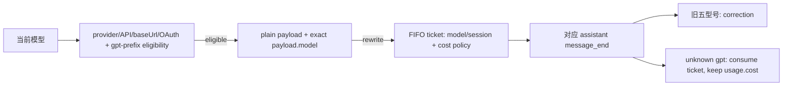

# Codex Usage Status + Fast：fast-gpt-v1 交付记录（归档）

> 本文件保留技术文档中的方案、评审与验证记录，仅供追溯，不是当前规则。文中的“本轮”指该记录所属任务，不约束后续任务。当前实现说明见 [L2 技术设计](../../02-产品实现/codex-usage-status-技术设计.md)。以下内容按归档时原文保留。

| 项目 | 定义 |
| --- | --- |
| 状态 | `IMPLEMENTING`（`fast-gpt-v1` 已采纳并完成源码/测试实现；真实 provider/live E2E pending） |
| 层级 | 第二层（L2） |
| L1 owner | [Codex Usage Status + Fast Extension 产品规范](../../01-产品定义/扩展/codex-usage-status-扩展.md) |
| 目标 package | `packages/codex-usage-status` / `@pi/codex-usage-status` |
| 当前实现事实 | package 已实现 `fast-gpt-v1`：所有合法小写 `gpt-*` eligibility、请求改写、旧五型号 known pricing correction、unknown FIFO ticket/费用原样保留、unknown 通知 caveat、parent-Fast interop、额度读取与 Fast+Codex 合并行；真实 provider/live E2E pending。 |
| 本轮边界 | 源码与测试按已采纳 `fast-gpt-v1` 最小实现；不修改 package/config 或外部 dispatcher，不执行 live 收费 provider 调用，不提交 commit/push。 |

## 1. 结论先行

`fast-gpt-v1` 只改变 Fast 的模型 eligibility 和 cost policy，不改变额度读取、widget owner、授权安全 gate、请求 payload gate、parent-Fast 协议、默认 Off、不自动重试/fallback、不持久化和既有边界。

| 维度 | 基准已实现事实（base `02c087ea`） | `fast-gpt-v1` 当前实现事实 |
| --- | --- | --- |
| Eligibility | 精确 provider/API/base URL/OAuth + 旧五型号 allowlist | 精确 provider/API/base URL/OAuth + model id 精确小写 `gpt-` 前缀、非空且无空白 suffix，已实现 |
| Priority payload | eligible 且 plain-object `payload.model` 精确匹配时浅复制并写 `service_tier: "priority"` | 保持不变，已覆盖所有 eligible GPT；`payload.model` gate 仍精确匹配当前模型 |
| Cost | 旧五型号按现有 2x/2.5x correction | 旧五型号保持；unknown 型号不改 `usage.cost`，但每个被改写请求仍进入 FIFO ticket，已实现 |
| UI/通知 | Fast+Codex 合并行、旧五型号现有文案、parent-Fast interop 已实现 | unknown 激活/status/切换提示 priority 仅为请求意图、费用未校正/不保证；unknown→unknown 也提示，已实现 |
| Quota | 仅默认 bucket；`additional_rate_limits` 忽略 | 保持；Spark 不展示专属 bucket，不代表 Spark 可用性 |
| 验证 | 既有 focused tests 与历史验证事实保留 | 已增加 eligibility、payload、交错 FIFO、unknown fee invariant、通知和旧边界测试；真实 smoke 未执行，保留 pending |



## 2. 当前已实现事实与 drift

以下为基准 `02c087ea` 经本轮 `fast-gpt-v1` 实现后的运行事实：

- `src/fast.ts` 的 `FAST_MODEL_IDS` 保留 `gpt-5.4`、`gpt-5.5`、`gpt-5.6-luna`、`gpt-5.6-sol`、`gpt-5.6-terra`，并经 `src/index.ts` 继续导出；它仅是 known pricing/cost correction 集合，不再是 eligibility allowlist。
- `isFastEligible()` 对精确官方 Codex provider/API/base URL/OAuth gate 之外，接受所有精确小写 `gpt-` 前缀、非空且无空白 suffix 的型号，覆盖 Astra、mini、spark 与未来未知 GPT。
- `FastController.rewriteProviderPayload()` 对所有 eligible、plain-object 且 `payload.model === context.model.id` 的 payload 返回浅复制，并创建最多 32 项 FIFO ticket；ticket 保存 request-time model/session 与 known/unknown cost policy。
- `FastController.rewriteAssistantMessage()` 按 ticket 首项匹配 provider/API/model/session；旧五型号按既有规则修正 cost，unknown ticket 消费后保留原 `usage.cost`，不扫描跳过；mismatch、malformed usage、session 不一致和 shutdown 保持 fail open/清理边界。
- unknown 激活、status、known↔unknown 及 unknown→unknown 模型切换均通知 priority 仅为请求意图、usage cost 未校正/不保证；known 文案保持既有表达。
- `UsageController` 是唯一 merged widget owner，使用 `belowEditor` 的 `codex-usage-status`，并清除旧的 `codex-usage-status`/`codex-fast` status；Fast 不直接写 status。
- `src/interop.ts` 已实现 `@pi/codex-usage-status:fast-requested/v1`、`PI_CODEX_FAST`、严格事件 payload 与一次性 bootstrap 消费；local dispatcher role/source/config policy 不是本 package 的 package-only 证据。
- 额度仍只解析默认 `rate_limit` 的 primary/secondary window；`additional_rate_limits`（包括 Spark 专属 bucket）不解析、不展示。

## 3. Package、符号与影响面

### 3.1 责任边界

| 文件/范围 | 当前责任 | `fast-gpt-v1` 影响 |
| --- | --- | --- |
| `packages/codex-usage-status/src/index.ts` | extension factory、`/fast`、Pi lifecycle/provider/message hooks、Fast→Usage 调度；导出 package public symbols | 保持 hook 注册和生命周期顺序；补齐 unknown notification/model-switch 触发所需的调用参数或状态判断 |
| `src/fast.ts` | Fast intent/effective state、eligibility、payload hook、bounded ticket、cost correction、Fast notification | 已改为全合法 `gpt-*` eligibility；ticket 保存 known/unknown cost policy；只对旧五型号 correction；unknown 通知判定已实现 |
| `src/interop.ts` | parent requested event、bootstrap env、严格 parser | 不改协议；保持一次性、advisory、非持久化 |
| `src/usage.ts` | auth scope、固定 usage URL、DTO 白名单、snapshot、唯一合并 widget、清理 | 不改额度语义；继续只展示默认 bucket，并消费 Fast display snapshot |
| `test/fast-mode.test.ts` | Fast、ticket、通知、interop、factory/hook 回归 | 扩展模型/通知/FIFO/unknown cost 矩阵 |
| `test/usage.test.ts` | quota DTO、刷新状态、widget 与副作用回归 | 保持现有测试，补充 Spark/default bucket 不可用性边界如需要 |
| `package.json`、lock/config | package manifest 与 Pi 兼容约束 | 本轮不改 |

### 3.2 导出符号与已发现调用方

| 导出符号/契约 | 定义位置 | 当前调用方/影响点 |
| --- | --- | --- |
| `FastController`、`FastContextLike`、`FastState`、`FastDisplaySnapshot`、`FastDisplayTheme` | `src/fast.ts`，经 `src/index.ts` 导出 | `src/index.ts` 创建并调用；`test/fast-mode.test.ts` 直接实例化/断言；`src/usage.ts` 消费 `FastDisplaySnapshot`/`formatFastDisplay` |
| `FAST_MODEL_IDS`、`isFastEligible`、`getFastState`、`formatFastDisplay`、`FAST_STATUS_CONSTANTS` | `src/fast.ts`，经 `src/index.ts` 导出 | `FAST_MODEL_IDS` 由 `test/fast-mode.test.ts` 作为 known pricing 兼容导出断言；`isFastEligible` 独立负责全合法 `gpt-*` eligibility；其余调用方保持不变 |
| `FAST_REQUESTED_EVENT`、`parseFastRequestedEvent`、`publishFastRequested`、`consumeFastBootstrap`、`FAST_ENV_NAME` | `src/interop.ts`，部分经 `src/index.ts` 导出 | 本 package 的 `src/index.ts` 发布事件并消费 bootstrap；仓库 consumer `packages/subagent/src/fast-inheritance.ts` 通过 public `@pi/codex-usage-status/interop` 动态 import parser，`packages/subagent/src/index.ts` 接入 consumer；`packages/subagent/test/fast-inheritance.test.ts` 自动化覆盖该仓库集成。真实 child process/provider/TUI 端到端仍未验证 |
| `UsageController`、`fetchUsageSnapshot`、`parseUsagePayload`、`formatUsageSnapshot`、`formatProgressBar`、`USAGE_STATUS_CONSTANTS` | `src/usage.ts`，经 `src/index.ts` 导出 | `src/index.ts` 创建/调用 `UsageController`；`test/usage.test.ts` 直接调用；本轮不改变这些额度导出符号的语义 |
| default export `codexUsageStatusExtension` | `src/index.ts` | Pi package manifest `package.json.pi.extensions` 加载；`test/fast-mode.test.ts` 用 mock ExtensionAPI 注册/触发 hooks |
| hooks `before_provider_request` / `message_end` | `src/index.ts` 注册，分别调用 `rewriteProviderPayload` / `rewriteAssistantMessage` | Pi runtime hook；focused caller 是 `test/fast-mode.test.ts`；本轮必须保持 ticket 与 hook 顺序假设，并明确后续 handler/最终持久化不可观测边界 |
| `codex-usage-status` widget、`codex-fast` legacy status | `src/usage.ts` 内部 key | `test/usage.test.ts`、合并行 UI；本轮不新增 Fast status，也不改唯一 owner |

仓库内存在 `packages/subagent` 对 `@pi/codex-usage-status/interop` public export 的动态 import 与 consumer 接线，因此不能将本协议描述为 package-only，也不能称仓库 consumer 不存在。区分验证范围：本 package 自身测试覆盖 producer/bootstrap；仓库 consumer 集成自动化覆盖 interop parser、事件消费和环境生成；真实 child process、provider 与 TUI 的端到端组合尚未验证（pending）。这类 automated integration 不等于真实运行时 E2E。

## 4. `fast-gpt-v1` 已实现运行合同

### 4.1 Eligibility（已实现）

保持现有 exact gate：

```text
provider === "openai-codex"
api === "openai-codex-responses"
baseUrl === "https://chatgpt.com/backend-api"
isUsingOAuth(model) === true
model.id.startsWith("gpt-")
model.id.slice("gpt-".length) 非空且不含空白字符
```

判定规则：

| 输入 | 目标结果 |
| --- | --- |
| `gpt-5.4`、旧五型号 | eligible |
| `gpt-5.4-mini`、`gpt-5.4-spark`、`gpt-5.4-astra` | eligible |
| 任意未来 `gpt-<非空、无空白 suffix>` | eligible，不需要更新 allowlist |
| `gpt-` | ineligible，suffix 为空 |
| `GPT-5.4`、`gpt -5.4`、suffix 含空白 | ineligible |
| 非 `gpt-` 型号、第三方 provider、API/base URL 变体、OAuth false/throw | ineligible |

该函数必须仍是纯当前模型判断：不解析额度授权、不联网、不启动 timer。requested On 在模型切换时保留，effective state 仍为 Off/Active/Inactive。

### 4.2 Payload hook 与 provider 证明边界（已实现）

Active 时保持现有行为：仅 plain-object payload 且 `payload.model` 精确等于当前模型 id 时返回浅复制 `{ ...payload, service_tier: "priority" }`；无效 payload、model 不匹配、非 Active 返回 `undefined`。保留原 payload 与嵌套引用，不把 `service_tier` 写回原对象。

该 hook 的返回值只证明本扩展产生了 priority 请求输出。Pi 0.84.4 没有最终 payload 或最终持久化 message 的可观测 hook；若后续 `before_provider_request` handler 改写/移除该 tier，或 provider 不接受该字段，本 package 不能证明 provider 最终采用 priority、实际加速或最终费用。对 `message_end` cost 修正及最终持久化 cost，同样要求没有其他 handler 改变模型/session 匹配输入、usage token 字段或本扩展已修正的 `usage.cost`；这些输入/结果被改变时，只能保证本扩展自己的 hook 输出，不能保证最终持久化 session cost。Fast Active 和 Spark/default quota 展示均不得作此证明。

### 4.3 FIFO ticket 与 cost policy（已实现）

每个被本扩展成功改写的请求都入队一个 ticket，即使 model 是 unknown：

```text
PendingFastTicket = {
  model: request-time cloned model,
  sessionIdentity: request-time session id/file,
  costPolicy: known multiplier | unknown-no-correction
}
```

- 旧五型号是 known：`gpt-5.5` multiplier `2.5`，其余四个 multiplier `2`。沿用 public `calculateCost`、native model tier、四个 scaled component 相加为 `total` 和已正确计费幂等判断。
- 其他符合 `gpt-` eligibility 的型号是 unknown：`costPolicy` 为 `unknown-no-correction`，不改变 `usage.cost`，包括合法或 malformed 的 `error`/`aborted` assistant message；它们仍代表一次已改写请求并占用 FIFO 位置。
- `message_end` 必须按队列首项消费并先做既有 provider/API/model/session 匹配。匹配到 unknown ticket 时消费 ticket 后直接不返回 cost replacement；不能扫描队列寻找下一个 known ticket。
- mismatch、session mismatch、shutdown 和 malformed usage 保持现有 fail-open 语义；任何被消费或丢弃的 ticket 都不能让后续 known 响应错位。最多 32 项和“溢出丢最老 ticket”边界保持不变。
- requested intent 在流式请求中途变化不影响已入队 ticket；unknown 也不因后来切换到 known 而补做 correction。

## 5. 通知、合并行与 quota 边界

### 5.1 通知规则

| 场景 | 目标行为 |
| --- | --- |
| known Active 激活/status/切换 | 尽量保持现有 `FAST_ACTIVE_NOTIFICATION` 与现有 known 文案 |
| unknown 型号 `/fast on`、toggle 激活或 status | 显示 Active/priority 请求意图，并明确 `usage cost` 未校正/不保证；不能只显示无条件的“Fast enabled” |
| requested On 切换到 unknown 型号 | 即使 state 仍是 Active，也发送一次带上述 caveat 的通知 |
| unknown→unknown 切换 | 不能仅比较 Active/Inactive 状态而静默；必须让用户看到适当的 priority/cost caveat |
| unknown 切回 known | 恢复 known 文案与 known cost policy 说明，不遗留 unknown caveat |
| Off/Inactive | 保留现有 Off/Inactive 语义；不因额度 limited/stale/unavailable 自动关闭 |

通知至少要让用户理解三个事实：priority 是请求意图；provider 是否接受/加速未知；unknown 型号的 `usage.cost` 不会由本扩展校正。TUI 的 Active Fast label、RPC 纯文本、parent selected user child inheritance 提示继续遵循已有 ANSI/纯文本边界。

### 5.2 Quota 与 widget 不变

`UsageController` 继续是唯一 `codex-usage-status` widget owner：先清理两个 legacy status，再投影 `<Fast 状态> · <Codex 额度>`；`FastController` 只提供纯 display snapshot，不直接写 UI。TUI/provider quota gate、scope lease、generation、single-flight、5 秒 usage HTTP timeout、10 分钟 hard expiry、固定 URL/manual redirect、DTO 白名单和敏感信息边界保持原实现事实。

usage DTO 只读取默认 `rate_limit` primary/secondary；`additional_rate_limits` 永不进入 projection。即使当前模型为 Spark，默认 bucket 也只表示默认额度状态，不表示 Spark 存在专属额度或 Spark 可用性。

## 6. Parent-Fast interop 与运行部署边界

本轮不改变下列已实现协议：

- `src/interop.ts` 产生严格的 `@pi/codex-usage-status:fast-requested/v1` 事件，payload 为无额外字段 `{ version: 1, sessionId, requested }`。
- `PI_CODEX_FAST=1` 只作为 child 一次性 advisory bootstrap，factory 启动即删除；缺失或非精确值 Off；reload/new/resume/fork 重新 Off。
- launcher 在实际 spawn 时按 session id 快照 requested，并只对 resolved USER-source、exact `implementer`/`code_reviewer`、frontmatter `codexFast: inherit` 的 child 传递环境变量；project source、同名 project override 和其他 user agent 不继承。
- `packages/subagent` 的仓库内 consumer 及其 role/source/config policy 已有源码接线和自动化集成覆盖；这不是 package-only 验证，也不证明真实 child process/provider E2E。真实 child process、provider 与 TUI 运行时组合仍未验证（pending），不能声称 live E2E 已通过。

本阶段和后续实现完成后的最终本地启用也不在本轮执行：方案要求在评审 commit 后创建独立 detached deployment worktree（不用于继续开发），仅替换 `~/.pi/agent/settings.json` 中原 `codex-usage-status` package 路径，保留旧路径回滚；用户需 `/reload` 后 `/fast on`。真实 provider smoke 若未执行必须保留 `pending`。

## 7. 验证与未验证边界

### 7.1 Fast eligibility 与 payload

| 覆盖项 | 本轮证据 |
| --- | --- |
| `gpt-5.4-astra` | `fast-mode.test.ts` eligibility/unknown notification + payload FIFO 通过 |
| 任意未来合法 `gpt-*` | `gpt-future-2027` eligibility 测试通过，不依赖 allowlist |
| `mini`、`spark`、`astra`、旧五型号 | eligibility 与 unknown/known cost FIFO 隔离测试通过；quota focused tests 保持默认 bucket |
| `gpt-`、`GPT-*`、suffix 含空白、非 GPT | bad ID 测试通过 |
| provider/API/base URL/OAuth 失配 | security gate 测试通过，OAuth false/throw 与 hook unchanged |
| plain-object + exact `payload.model` | 浅复制、`service_tier=priority`、原对象/嵌套引用不变 |
| 非 plain-object 或 model mismatch | payload hook unchanged/undefined |

### 7.2 FIFO、cost 和边界

- 已知→unknown→已知和 unknown→已知→unknown 交错请求/响应：每个 ticket 严格按 FIFO 消费，known 只修正自己的 `usage.cost`，unknown 保持原值，不能因跳过 unknown correction 让 known 错位。
- unknown 型号的正常、`error`、`aborted` assistant message：`usage.cost` 不变；known 五型号维持既有 2x/2.5x、native long-context tier、component sum 和幂等行为。
- 覆盖 malformed usage：负数/非整数 token、缺失字段、非法 reasoning/cacheWrite1h、交叉范围错误；unknown 不得因 malformed 路径产生 correction。
- 保留并回归 32 项 FIFO 上限、request-time model/session snapshot、中途 Off、provider/API/model mismatch、session mismatch、shutdown 清空 ticket，以及无本扩展 hook 的 message 不进入 correction。

### 7.3 通知与 UI/interop regression

- `/fast` 空参数、`on`、`off`、`toggle`、`status`、非法参数、JSON/print/RPC 行为保持。
- known 文案尽量不变；unknown 激活、status、known→unknown 和 unknown→unknown 都包含 priority 仅为请求意图、usage cost 未校正/不保证；unknown→known 不遗留 caveat；通知 focused test 通过。
- Fast 仍只通过合并 widget 展示；无独立 `codex-fast` status；命令刷新不触发 OAuth/fetch/timer；模型切换、shutdown、late result 和第二 factory Off reset 保持。
- parent event/env exact parser、one-shot delete、session isolation、selected child policy 有 package 测试及仓库 `packages/subagent/test/fast-inheritance.test.ts` consumer 集成自动化覆盖；真实 child process/provider/TUI live E2E 未执行，标为 `pending`。

### 7.4 全量验证入口与未验证项

合并后代码验证记录（上一轮代码验证；不是本次文档修复的重跑结果）：

```text
npm test                         807 passed
fast-mode.test.ts focused tests  21 passed
npm run typecheck                passed
git diff --check                 passed
Markdown 相对链接检查            passed
```

这些自动化结果包含 package tests 和仓库内 consumer 集成测试，不等于真实 Pi TUI/provider 或真实 child process/provider E2E。上述 live E2E 未执行，继续保留 `pending`；未进行真实收费 provider 调用。

## 8. 方案采纳与代码评审状态

- L1 与本 L2 的同一 `fast-gpt-v1` 版本已由 product_aligner 产品语义轴 PASS（0 findings）和 code_reviewer 实现/运营方案轴 PASS（0 findings）采纳；两个 review 均只读，采纳绑定基准 `02c087ea`、本任务及本 owner 文档。
- 本任务已按采纳方案完成源码/测试最小实现并自检；代码实现仍遵循 implementer → 独立 code_reviewer 复审门禁。若发现 required finding，修复后必须再次独立复审。
- 代码评审通过后才建立本轮本地 commit，不 push；最终 deployment 另用独立 detached worktree，不作为开发 worktree。
- 真实 Pi TUI/provider smoke、真实 child process/provider E2E、外部 dispatcher live E2E 仍 pending；本轮禁止 live 收费 provider 调用。
